## TeMoMuKo-AutoStopRace
----
#### Metrics provided by Detekt
* Number of lines of code 401
* Number of Kotlin files: 11
* Cyclomatic complexity: 31
* Cyclomatic complexity by thousands of lines: 147 

----
**4** features analyzed

*	<a href="#type_inference">Type Inference</a> 
*	<a href="#lambda">Lambda</a> 
*	<a href="#safe_call">Safe Call</a> 
*	<a href="#singleton">Singleton</a> 

### <a name="type_inference">Type Inference</a>
----
#### Functions
* **Sudden Rise - Exponential:** 
    * **R_Squared:** 0.95963202
* **Constant Rise - Linear:** 
    * **R_Squared:** 0.94806865
* **Sudden Rise Plateau - Logarithm:** 
    * **R_Squared:** 0.63487241

**Plots** :chart_with_upwards_trend:
-----

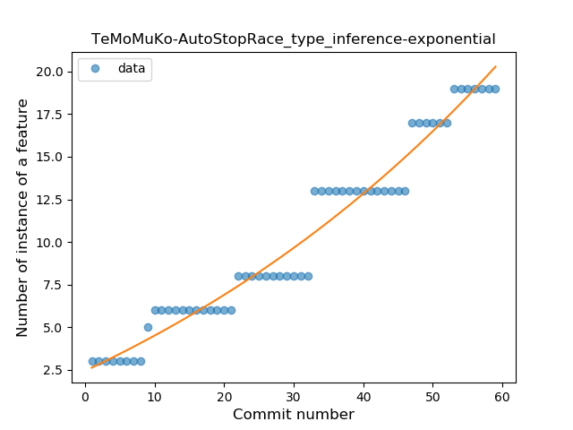
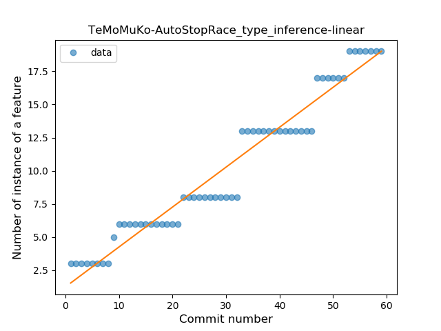
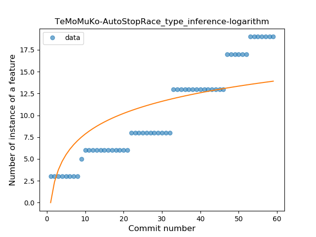
### <a name="lambda">Lambda</a>
----
#### Functions
* **Plateau Gradual Rise - Sigmoid:** 
    * **R_Squared:** 0.96193342
* **Sudden Rise Plateau - Logarithm:** 
    * **R_Squared:** 0.77857785
* **Constant Rise - Linear:** 
    * **R_Squared:** 0.72674148

**Plots** :chart_with_upwards_trend:
-----

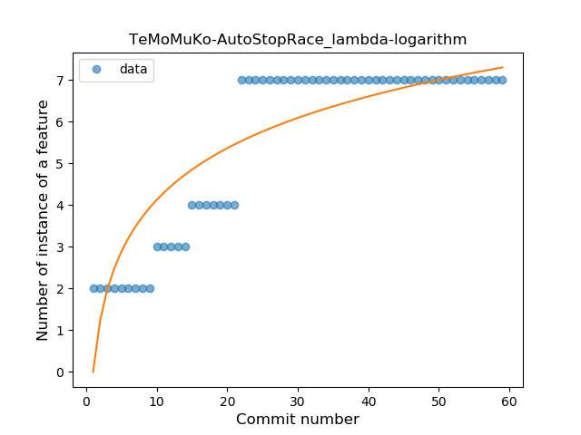
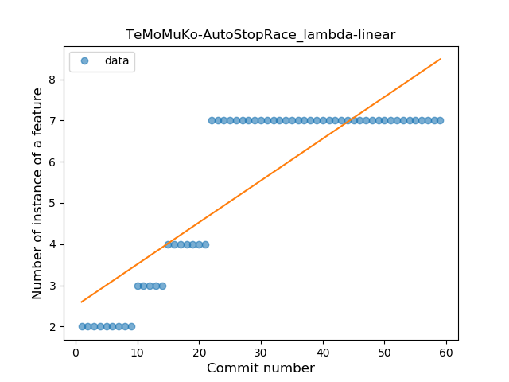
### <a name="safe_call">Safe Call</a>
----
#### Functions
* **Sudden Decline - Exponential:** 
    * **R_Squared:** 0.20505147
* **Constant Decline - Linear:** 
    * **R_Squared:** 0.19070047
* **Sudden Rise Plateau - Logarithm:** 
    * **R_Squared:** -0.0
* **Plateau Gradual Rise - Sigmoid:** 
    * **R_Squared:** -0.0

**Plots** :chart_with_upwards_trend:
-----

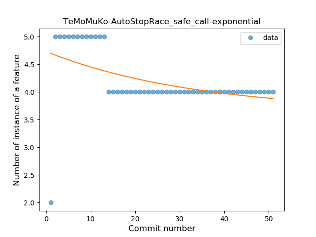
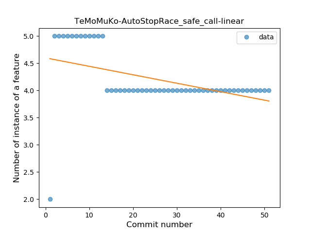
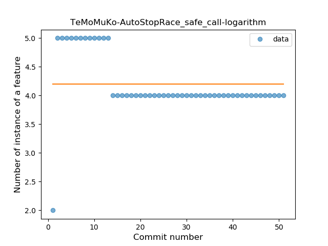
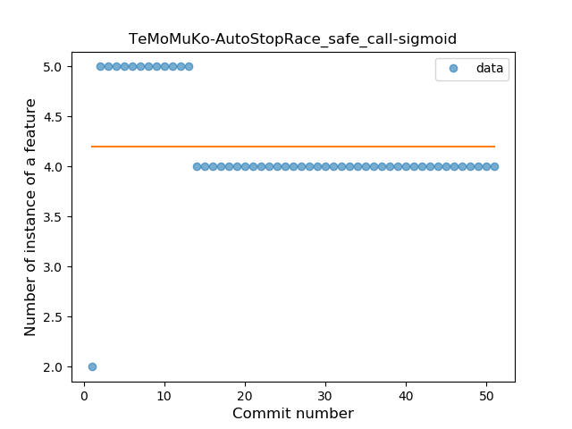
### <a name="singleton">Singleton</a>
----
#### Functions
* **Plateau Sudden Rise - Binary Sigmoid:** 
    * **R_Squared:** 1.0
* **Sudden Rise Plateau - Logarithm:** 
    * **R_Squared:** 0.69243213
* **Constant Rise - Linear:** 
    * **R_Squared:** 0.61746362

**Plots** :chart_with_upwards_trend:
-----

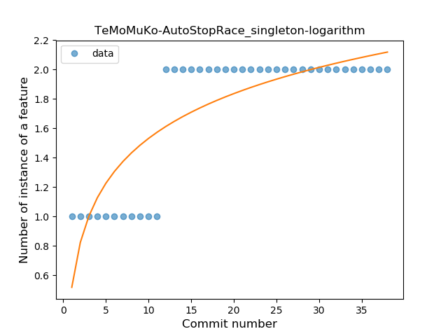
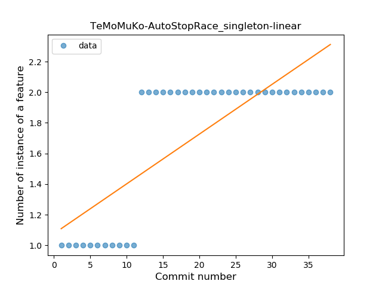
