## TwidereProject-Twidere-Android
----
#### Metrics provided by Detekt
* Number of lines of code 94567
* Number of Kotlin files: 823
* Cyclomatic complexity: 12935
* Cyclomatic complexity by thousands of lines: 275 

----
**18** features analyzed

*	<a href="#type_inference">Type Inference</a> 
*	<a href="#lambda">Lambda</a> 
*	<a href="#safe_call">Safe Call</a> 
*	<a href="#when_expr">When expression</a> 
*	<a href="#companion_object">Companion Object</a> 
*	<a href="#unsafe_call">Unsafe Call</a> 
*	<a href="#string_template">String Template</a> 
*	<a href="#func_with_default_value">Function with Default Value</a> 
*	<a href="#singleton">Singleton</a> 
*	<a href="#smart_cast">Smart Cast</a> 
*	<a href="#range_expr">Range Expression</a> 
*	<a href="#func_call_with_named_arg">Function call with Named Argument</a> 
*	<a href="#data_class">Data Class</a> 
*	<a href="#extension_function">Extension Function</a> 
*	<a href="#property_delegation">Property Delegation</a> 
*	<a href="#destructuring_declaration">Destructuring Declaration</a> 
*	<a href="#inline_func">Inline Function</a> 
*	<a href="#overloaded_op">Overloaded Operator</a> 

### <a name="type_inference">Type Inference</a>
----
#### Functions
* **Constant Rise - Linear:** 
    * **R_Squared:** 0.97506383
* **Sudden Rise Plateau - Logarithm:** 
    * **R_Squared:** 0.74826272

**Plots** :chart_with_upwards_trend:
-----

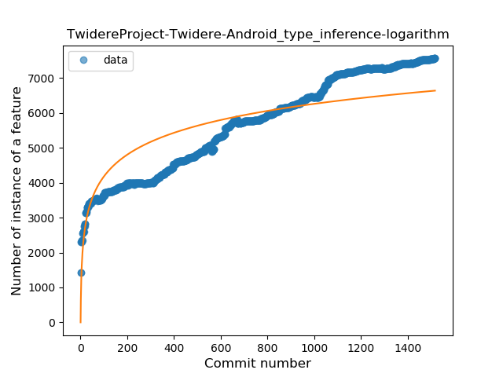
### <a name="lambda">Lambda</a>
----
#### Functions
* **Constant Rise - Linear:** 
    * **R_Squared:** 0.98881804
* **Sudden Rise Plateau - Logarithm:** 
    * **R_Squared:** 0.46190621
* **Plateau Sudden Rise - Binary Sigmoid:** 
    * **R_Squared:** 0.16241153

**Plots** :chart_with_upwards_trend:
-----

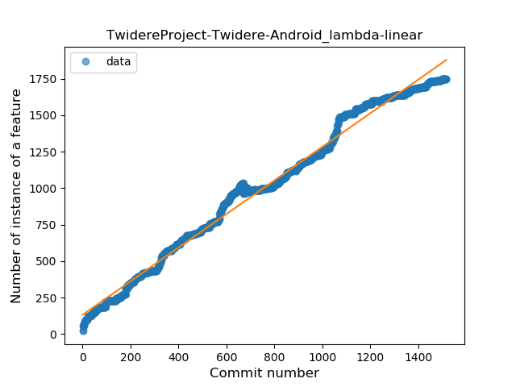
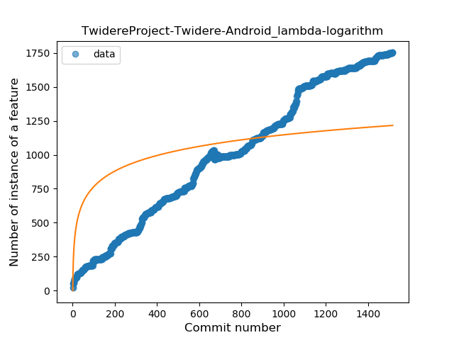
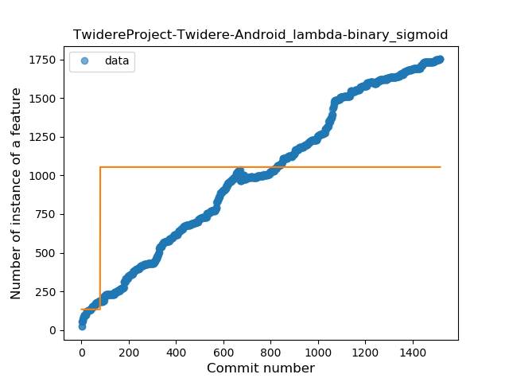
### <a name="safe_call">Safe Call</a>
----
#### Functions
* **Constant Rise - Linear:** 
    * **R_Squared:** 0.98891253
* **Sudden Rise - Exponential:** 
    * **R_Squared:** 0.99005063
* **Sudden Rise Plateau - Logarithm:** 
    * **R_Squared:** 0.41771635
* **Plateau Sudden Rise - Binary Sigmoid:** 
    * **R_Squared:** 0.24883004

**Plots** :chart_with_upwards_trend:
-----

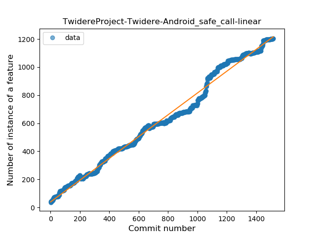
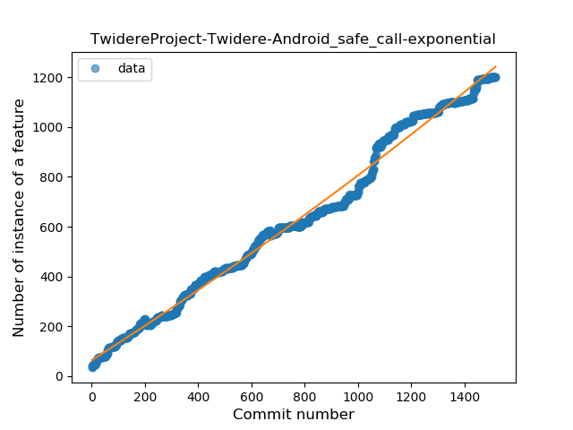
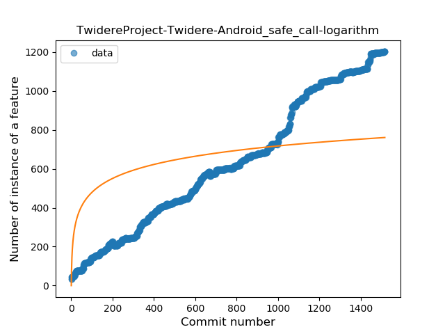
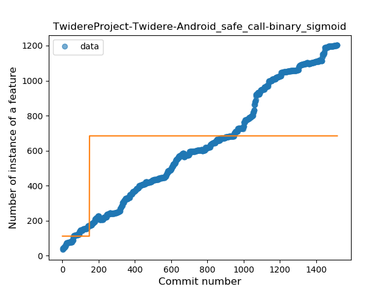
### <a name="when_expr">When expression</a>
----
#### Functions
* **Constant Rise - Linear:** 
    * **R_Squared:** 0.9749337
* **Sudden Rise Plateau - Logarithm:** 
    * **R_Squared:** 0.72690674
* **Plateau Sudden Rise - Binary Sigmoid:** 
    * **R_Squared:** 0.27541365

**Plots** :chart_with_upwards_trend:
-----

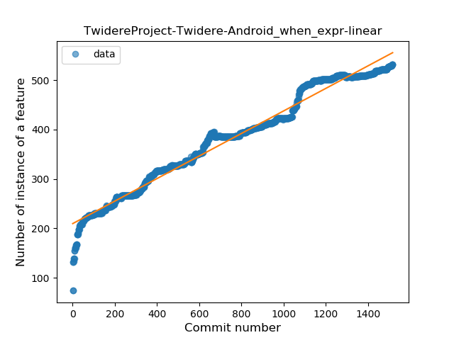
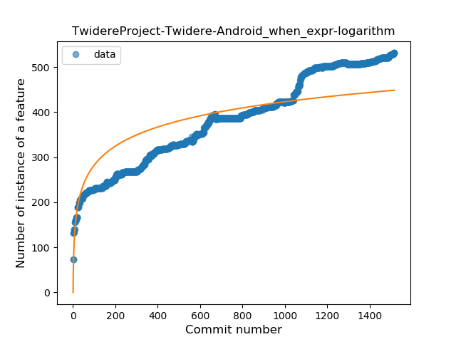
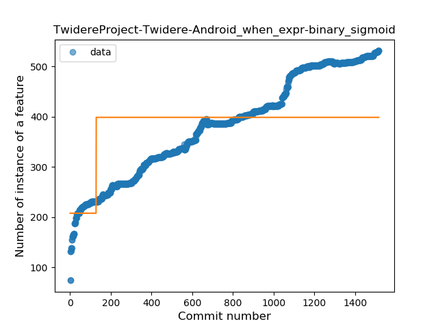
### <a name="companion_object">Companion Object</a>
----
#### Functions
* **Constant Rise - Linear:** 
    * **R_Squared:** 0.97127649
* **Sudden Rise Plateau - Logarithm:** 
    * **R_Squared:** 0.75385941

**Plots** :chart_with_upwards_trend:
-----

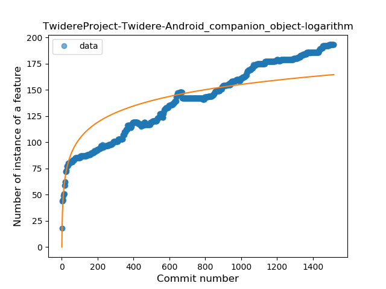
### <a name="unsafe_call">Unsafe Call</a>
----
#### Functions
* **Sudden Decline - Exponential:** 
    * **R_Squared:** 0.89664296
* **Constant Decline - Linear:** 
    * **R_Squared:** 0.67832202
* **Sudden Rise Plateau - Logarithm:** 
    * **R_Squared:** -0.0

**Plots** :chart_with_upwards_trend:
-----

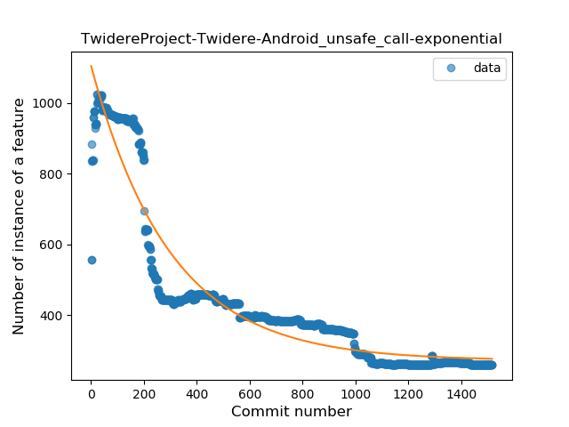
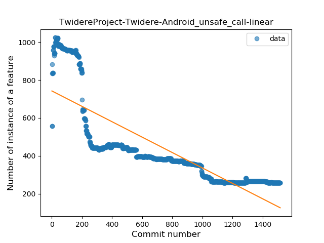
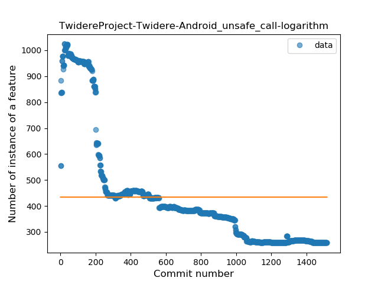
### <a name="string_template">String Template</a>
----
#### Functions
* **Sudden Rise - Exponential:** 
    * **R_Squared:** 0.98691298
* **Constant Rise - Linear:** 
    * **R_Squared:** 0.97644252
* **Sudden Rise Plateau - Logarithm:** 
    * **R_Squared:** 0.39925488
* **Plateau Sudden Rise - Binary Sigmoid:** 
    * **R_Squared:** 0.13115567

**Plots** :chart_with_upwards_trend:
-----

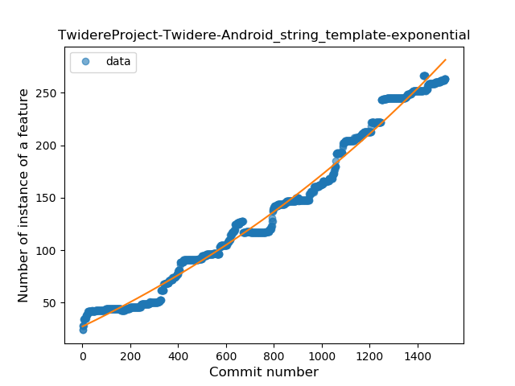
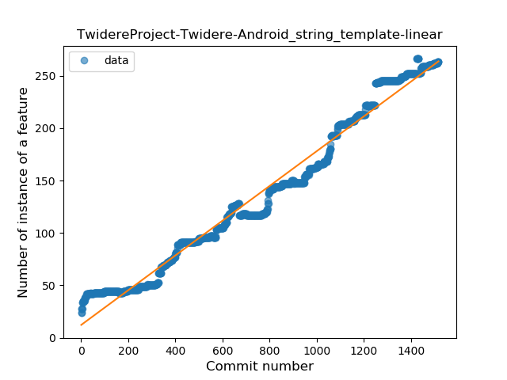
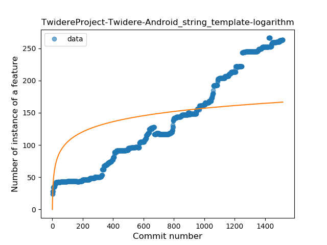
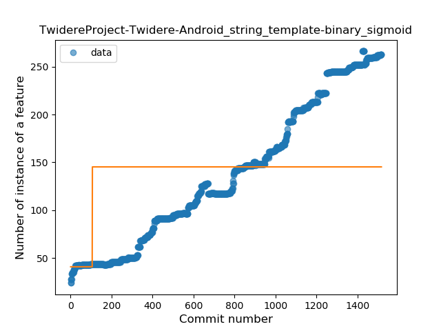
### <a name="func_with_default_value">Function with Default Value</a>
----
#### Functions
* **Constant Rise - Linear:** 
    * **R_Squared:** 0.9950372
* **Sudden Rise Plateau - Logarithm:** 
    * **R_Squared:** 0.4018477
* **Plateau Sudden Rise - Binary Sigmoid:** 
    * **R_Squared:** 0.25066786

**Plots** :chart_with_upwards_trend:
-----

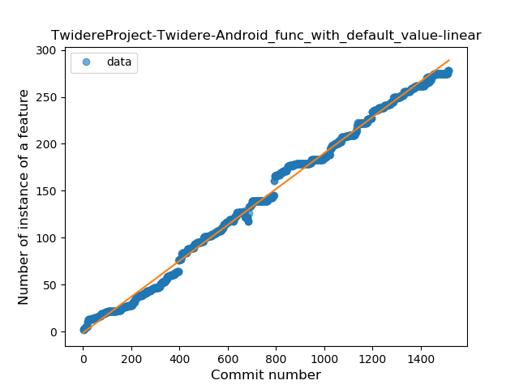
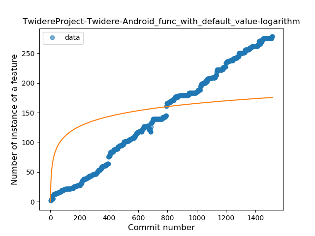
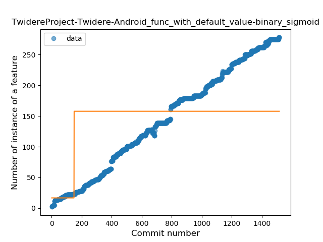
### <a name="singleton">Singleton</a>
----
#### Functions
* **Constant Rise - Linear:** 
    * **R_Squared:** 0.97770757
* **Sudden Rise Plateau - Logarithm:** 
    * **R_Squared:** 0.41425704

**Plots** :chart_with_upwards_trend:
-----

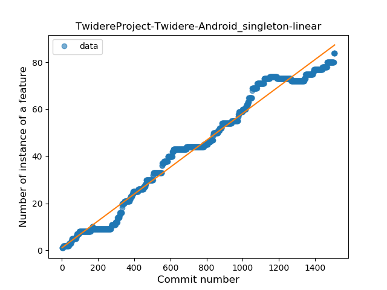
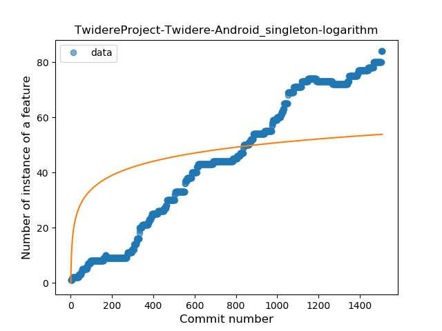
### <a name="smart_cast">Smart Cast</a>
----
#### Functions
* **Constant Rise - Linear:** 
    * **R_Squared:** 0.92701459
* **Sudden Rise - Exponential:** 
    * **R_Squared:** 0.92818844
* **Sudden Rise Plateau - Logarithm:** 
    * **R_Squared:** 0.71503836
* **Plateau Sudden Rise - Binary Sigmoid:** 
    * **R_Squared:** 0.14220996

**Plots** :chart_with_upwards_trend:
-----

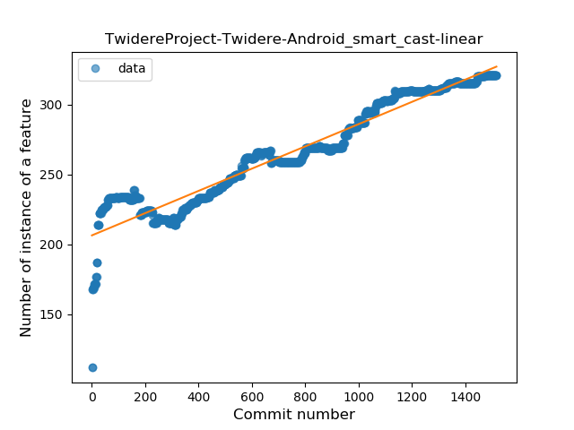
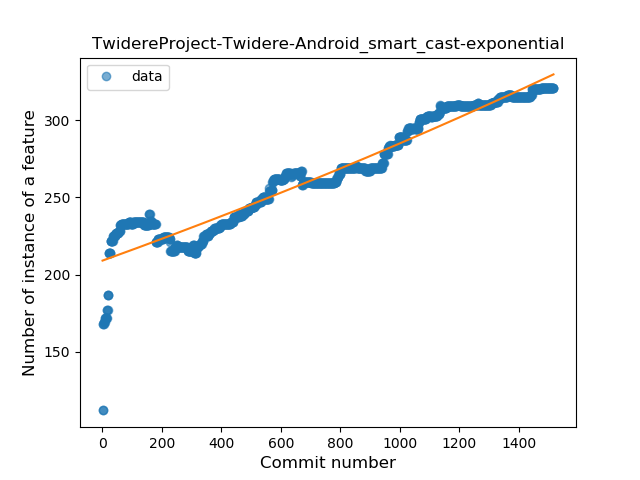
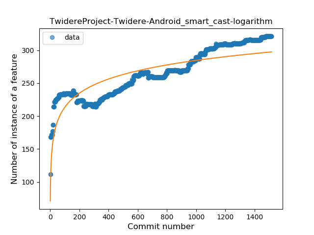
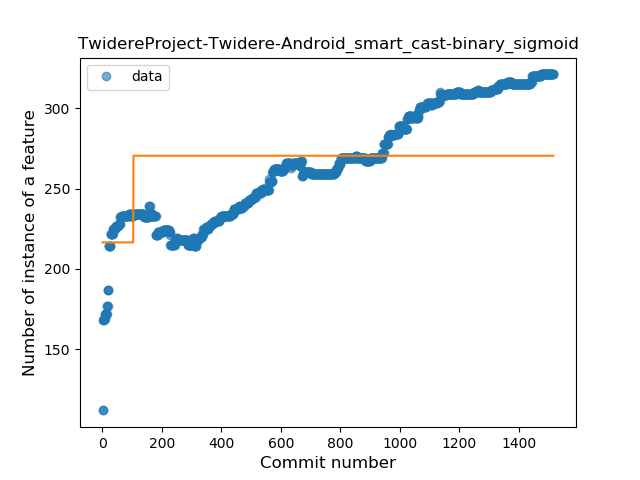
### <a name="range_expr">Range Expression</a>
----
#### Functions
* **Constant Rise - Linear:** 
    * **R_Squared:** 0.89938116
* **Sudden Rise Plateau - Logarithm:** 
    * **R_Squared:** 0.6926829
* **Plateau Sudden Rise - Binary Sigmoid:** 
    * **R_Squared:** 0.37933713

**Plots** :chart_with_upwards_trend:
-----

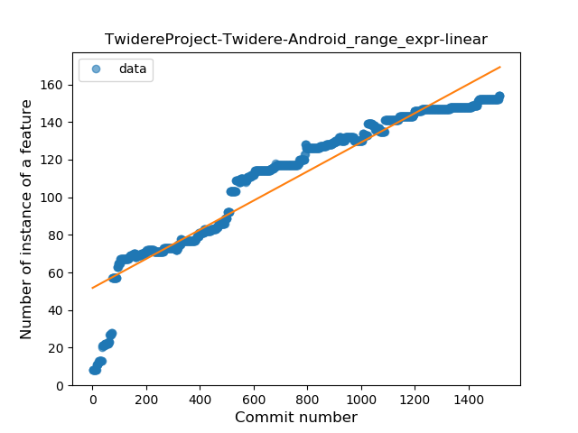
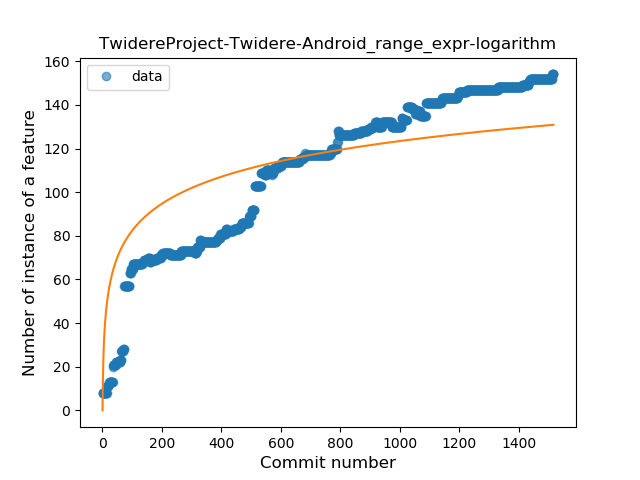
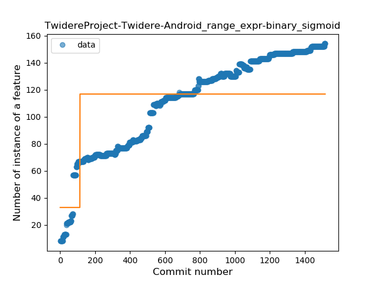
### <a name="func_call_with_named_arg">Function call with Named Argument</a>
----
#### Functions
* **Constant Rise - Linear:** 
    * **R_Squared:** 0.98453892
* **Sudden Rise Plateau - Logarithm:** 
    * **R_Squared:** 0.42424267
* **Plateau Sudden Rise - Binary Sigmoid:** 
    * **R_Squared:** 0.35486706

**Plots** :chart_with_upwards_trend:
-----

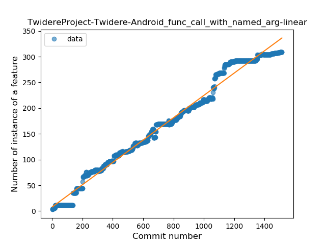
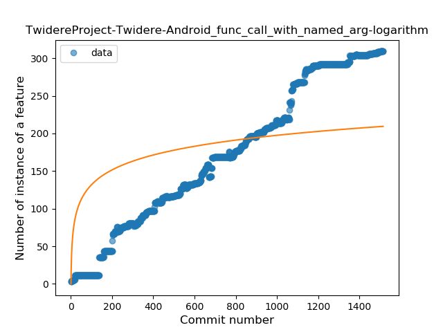
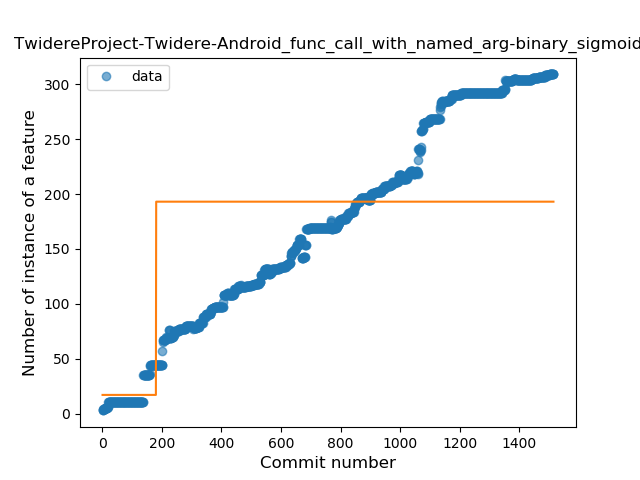
### <a name="data_class">Data Class</a>
----
#### Functions
* **Constant Rise - Linear:** 
    * **R_Squared:** 0.95500645
* **Sudden Rise Plateau - Logarithm:** 
    * **R_Squared:** 0.49406104

**Plots** :chart_with_upwards_trend:
-----

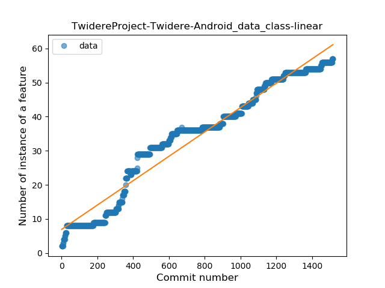
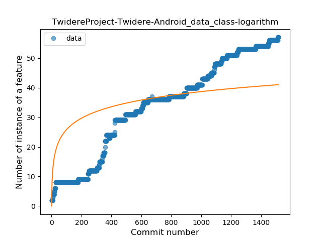
### <a name="extension_function">Extension Function</a>
----
#### Functions
* **Constant Rise - Linear:** 
    * **R_Squared:** 0.97531836
* **Sudden Rise - Exponential:** 
    * **R_Squared:** 0.97741691
* **Plateau Sudden Rise - Binary Sigmoid:** 
    * **R_Squared:** 0.54587817
* **Sudden Rise Plateau - Logarithm:** 
    * **R_Squared:** 0.3810201

**Plots** :chart_with_upwards_trend:
-----

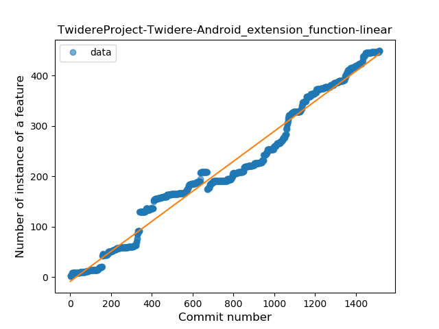
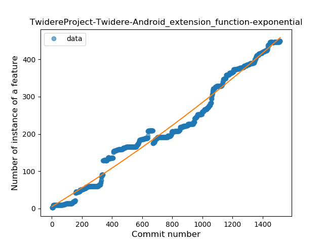
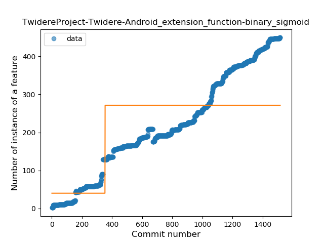
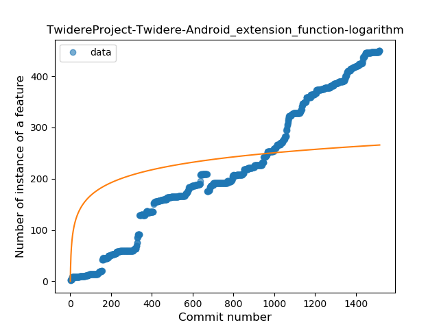
### <a name="property_delegation">Property Delegation</a>
----
#### Functions
* **Constant Rise - Linear:** 
    * **R_Squared:** 0.84908091
* **Sudden Rise Plateau - Logarithm:** 
    * **R_Squared:** 0.63408831
* **Plateau Sudden Rise - Binary Sigmoid:** 
    * **R_Squared:** 0.19884295

**Plots** :chart_with_upwards_trend:
-----

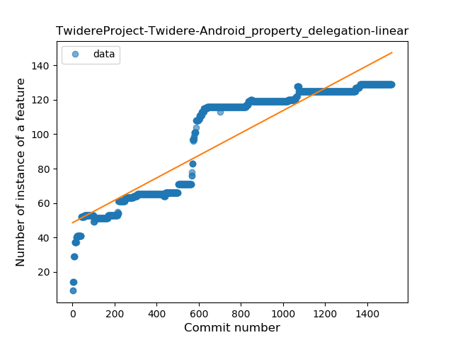
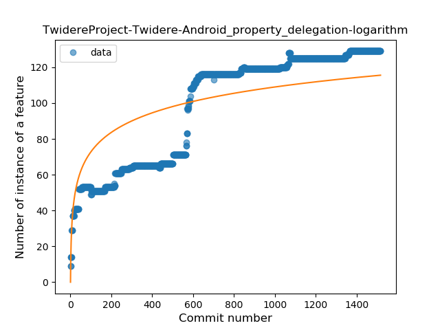
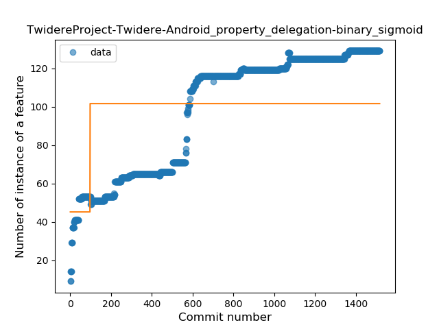
### <a name="destructuring_declaration">Destructuring Declaration</a>
----
#### Functions
* **Sudden Rise - Exponential:** 
    * **R_Squared:** 0.97641722
* **Constant Rise - Linear:** 
    * **R_Squared:** 0.949798
* **Sudden Rise Plateau - Logarithm:** 
    * **R_Squared:** 0.28152603

**Plots** :chart_with_upwards_trend:
-----

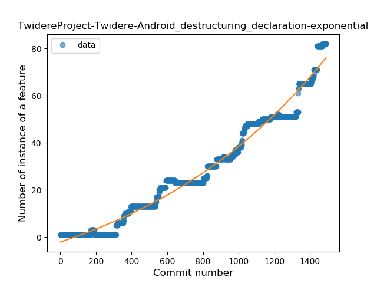
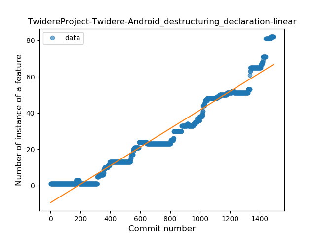
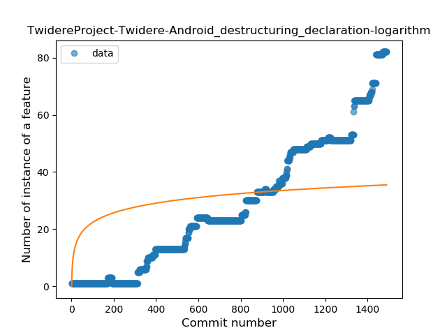
### <a name="inline_func">Inline Function</a>
----
#### Functions
* **Sudden Rise - Exponential:** 
    * **R_Squared:** 0.92391848
* **Constant Rise - Linear:** 
    * **R_Squared:** 0.85473526
* **Sudden Rise Plateau - Logarithm:** 
    * **R_Squared:** 0.23482971

**Plots** :chart_with_upwards_trend:
-----

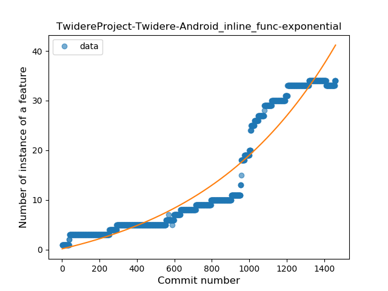
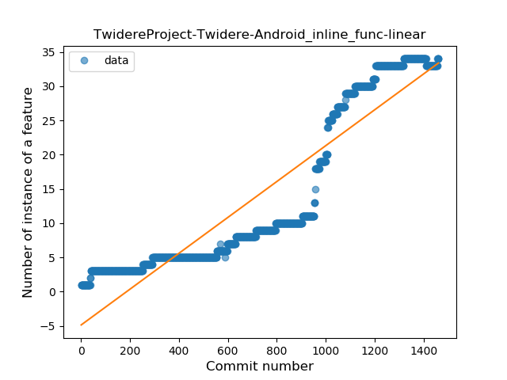
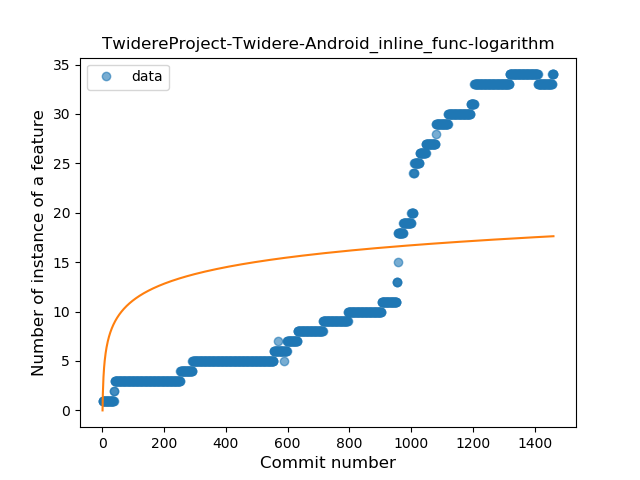
### <a name="overloaded_op">Overloaded Operator</a>
----
#### Functions
* **Sudden Rise - Exponential:** 
    * **R_Squared:** 0.95714012
* **Constant Rise - Linear:** 
    * **R_Squared:** 0.93769907
* **Sudden Rise Plateau - Logarithm:** 
    * **R_Squared:** 0.41318786

**Plots** :chart_with_upwards_trend:
-----

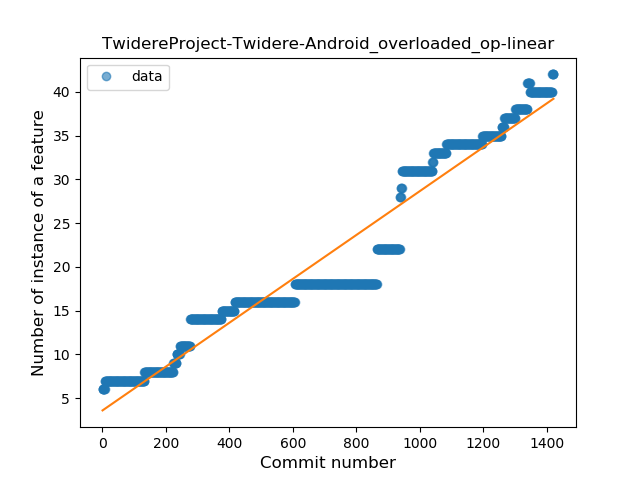
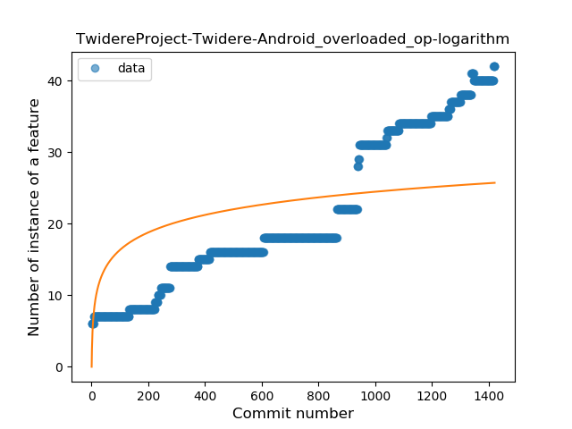
