## WYKCode-WYK-Android
----
#### Metrics provided by Detekt
* Number of lines of code 3849
* Number of Kotlin files: 56
* Cyclomatic complexity: 551
* Cyclomatic complexity by thousands of lines: 280 

----
**13** features analyzed

*	<a href="#type_inference">Type Inference</a> 
*	<a href="#lambda">Lambda</a> 
*	<a href="#safe_call">Safe Call</a> 
*	<a href="#when_expr">When expression</a> 
*	<a href="#companion_object">Companion Object</a> 
*	<a href="#unsafe_call">Unsafe Call</a> 
*	<a href="#string_template">String Template</a> 
*	<a href="#func_with_default_value">Function with Default Value</a> 
*	<a href="#singleton">Singleton</a> 
*	<a href="#smart_cast">Smart Cast</a> 
*	<a href="#func_call_with_named_arg">Function call with Named Argument</a> 
*	<a href="#data_class">Data Class</a> 
*	<a href="#property_delegation">Property Delegation</a> 

### <a name="type_inference">Type Inference</a>
----
#### Functions
* **Sudden Rise Plateau - Logarithm:** 
    * **R_Squared:** 0.04637488
* **Constant Decline - Linear:** 
    * **R_Squared:** 0.01645129

**Plots** :chart_with_upwards_trend:
-----

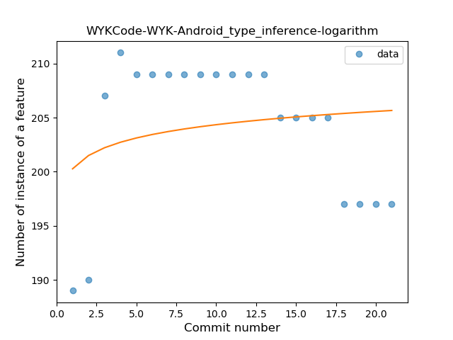
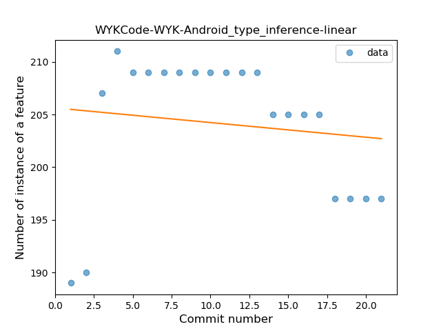
### <a name="lambda">Lambda</a>
----
#### Functions
* **Sudden Rise Plateau - Logarithm:** 
    * **R_Squared:** 0.14567775
* **Constant Rise - Linear:** 
    * **R_Squared:** 0.00247068

**Plots** :chart_with_upwards_trend:
-----

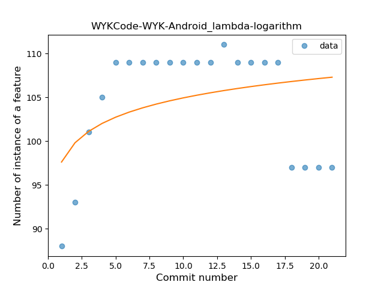
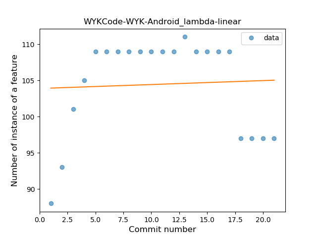
### <a name="safe_call">Safe Call</a>
----
#### Functions
* **Instability - Polinomial 4:** 
    * **R_Squared:** 0.83185768
* **Instability - Polinomial 3:** )
    * **R_Squared:** 0.76951206
* **Sudden Rise Plateau - Logarithm:** 
    * **R_Squared:** 0.34545596
* **Constant Rise - Linear:** 
    * **R_Squared:** 0.09208417

**Plots** :chart_with_upwards_trend:
-----

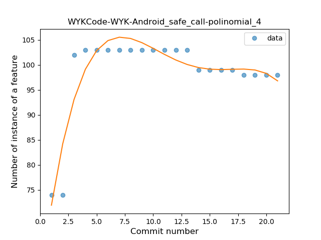
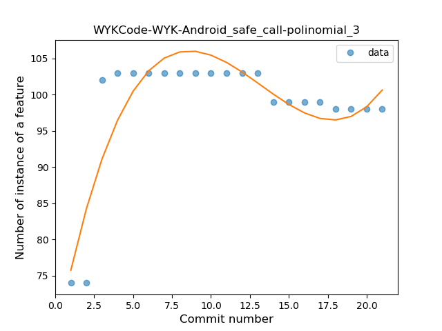
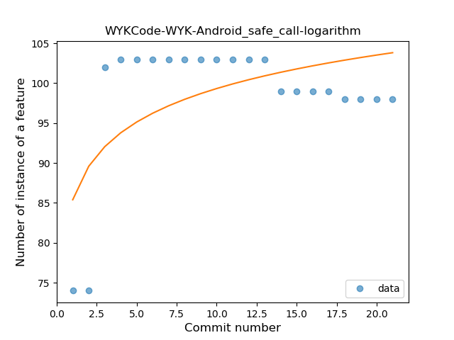
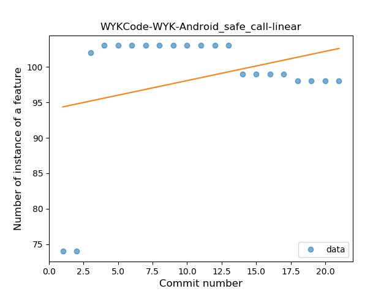
### <a name="when_expr">When expression</a>
----
#### Functions
* **Constant Decline - Linear:** 
    * **R_Squared:** 0.02626042
* **Sudden Rise Plateau - Logarithm:** 
    * **R_Squared:** 0.03461909

**Plots** :chart_with_upwards_trend:
-----

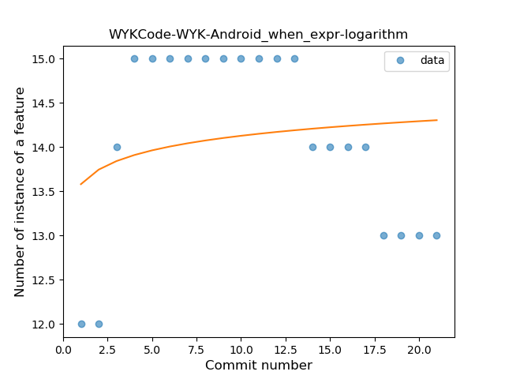
### <a name="companion_object">Companion Object</a>
----
#### Functions
* **Instability - Polinomial 4:** 
    * **R_Squared:** 0.83873518
* **Instability - Polinomial 3:** )
    * **R_Squared:** 0.74802372
* **Sudden Rise Plateau - Logarithm:** 
    * **R_Squared:** 0.54431151
* **Constant Rise - Linear:** 
    * **R_Squared:** 0.25909091

**Plots** :chart_with_upwards_trend:
-----

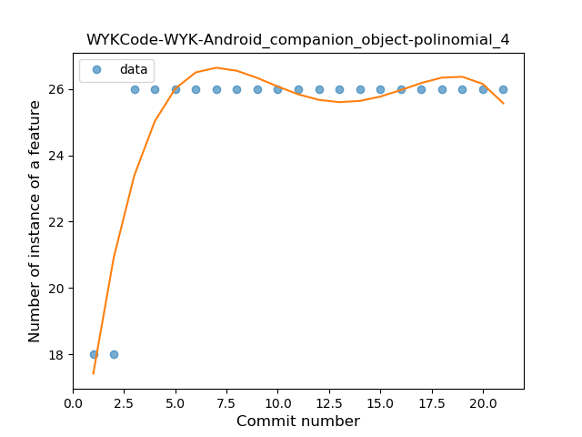
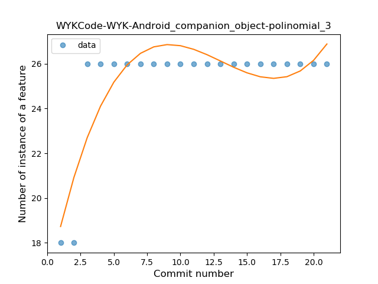
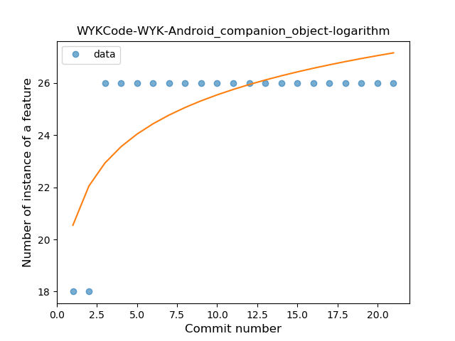
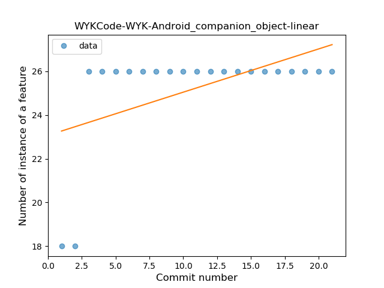
### <a name="unsafe_call">Unsafe Call</a>
----
#### Functions
* **Instability - Polinomial 3:** )
    * **R_Squared:** 0.91381575
* **Sudden Rise Plateau - Logarithm:** 
    * **R_Squared:** 0.78313215
* **Constant Rise - Linear:** 
    * **R_Squared:** 0.53229249

**Plots** :chart_with_upwards_trend:
-----

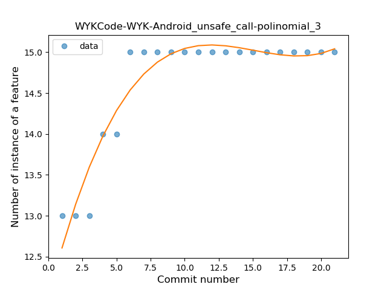
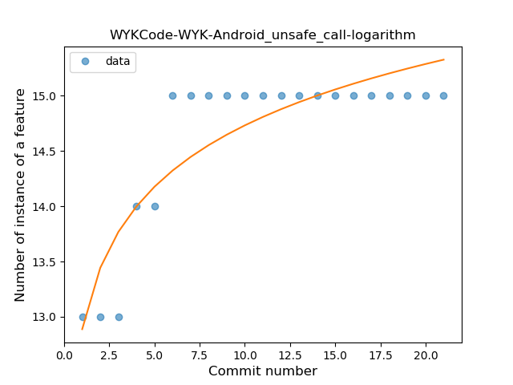
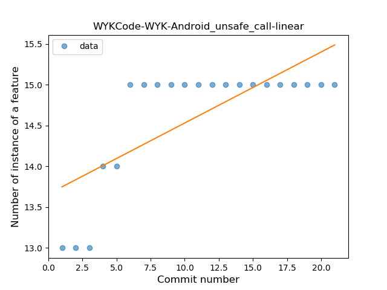
### <a name="string_template">String Template</a>
----
#### Functions
* **Plateau Gradual Rise - Sigmoid:** 
    * **R_Squared:** 0.4875817
* **Sudden Rise Plateau - Logarithm:** 
    * **R_Squared:** 0.09270116
* **Constant Decline - Linear:** 
    * **R_Squared:** 0.00048128
* **Sudden Decline - Exponential:** 
    * **R_Squared:** 0.00025962

**Plots** :chart_with_upwards_trend:
-----

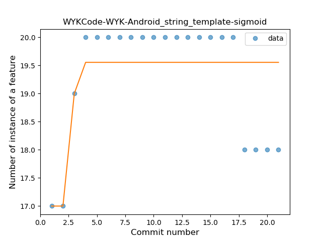
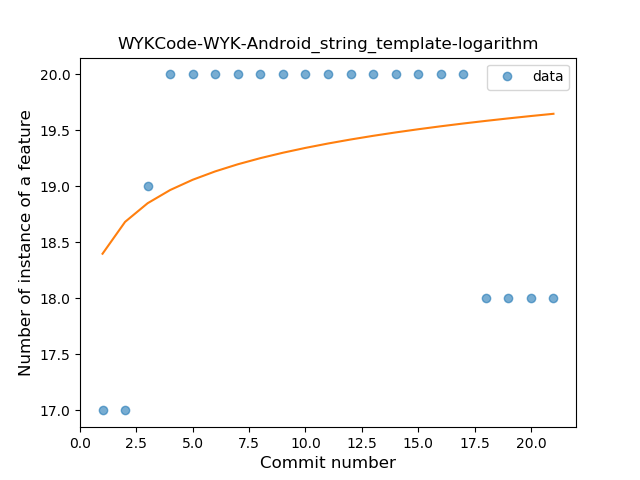
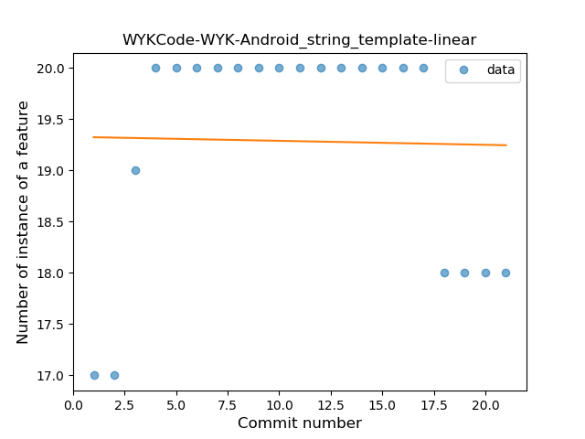
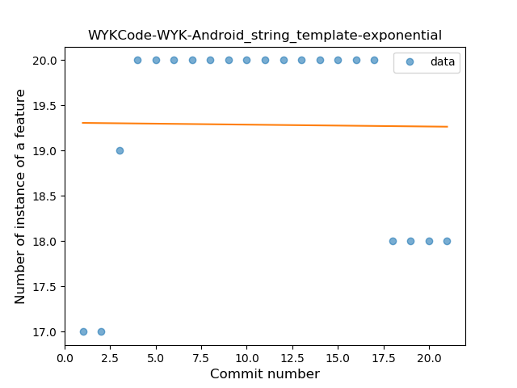
### <a name="func_with_default_value">Function with Default Value</a>
----
#### Functions
* **Instability - Polinomial 4:** 
    * **R_Squared:** 0.83873518
* **Instability - Polinomial 3:** )
    * **R_Squared:** 0.74802372
* **Sudden Rise Plateau - Logarithm:** 
    * **R_Squared:** 0.54431151
* **Constant Rise - Linear:** 
    * **R_Squared:** 0.25909091

**Plots** :chart_with_upwards_trend:
-----

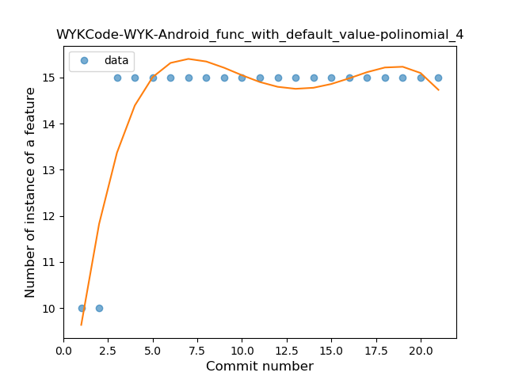

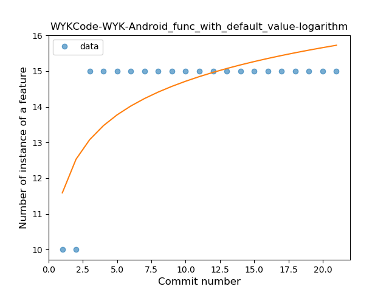
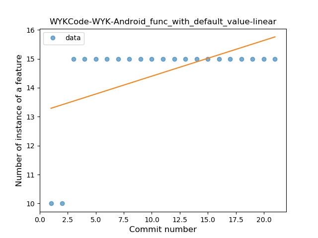
### <a name="singleton">Singleton</a>
----
#### Functions
* **Plateau Sudden Rise - Binary Sigmoid:** 
    * **R_Squared:** 1.0
* **Instability - Polinomial 4:** 
    * **R_Squared:** 0.83873518
* **Instability - Polinomial 3:** )
    * **R_Squared:** 0.74802372
* **Sudden Rise Plateau - Logarithm:** 
    * **R_Squared:** 0.54431151
* **Constant Rise - Linear:** 
    * **R_Squared:** 0.25909091

**Plots** :chart_with_upwards_trend:
-----

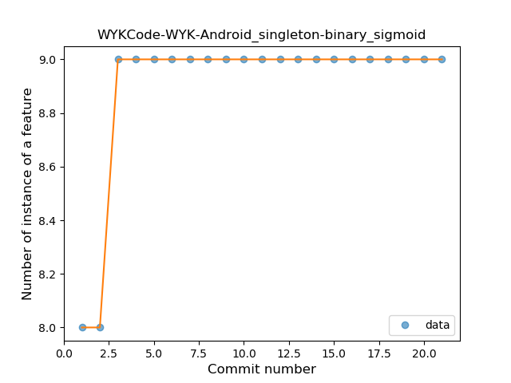
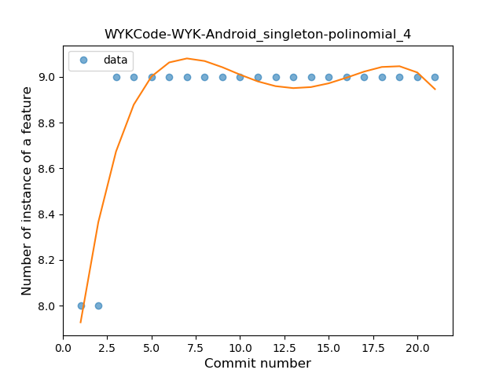
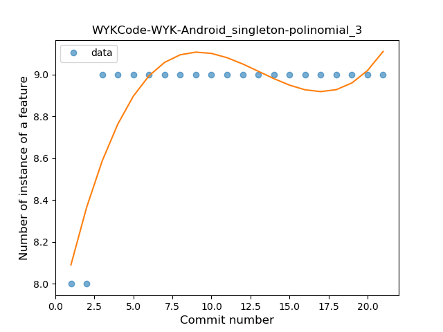

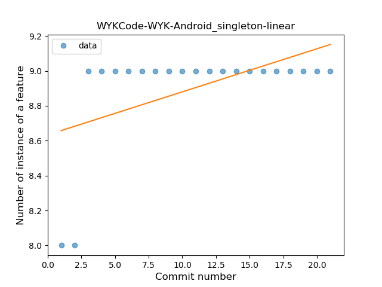
### <a name="smart_cast">Smart Cast</a>
----
#### Functions
* **Plateau Sudden Decline - Binary Sigmoid:** 
    * **R_Squared:** 0.47058823
* **Sudden Rise Plateau - Logarithm:** 
    * **R_Squared:** 0.03416057
* **Constant Decline - Linear:** 
    * **R_Squared:** 0.01363636

**Plots** :chart_with_upwards_trend:
-----

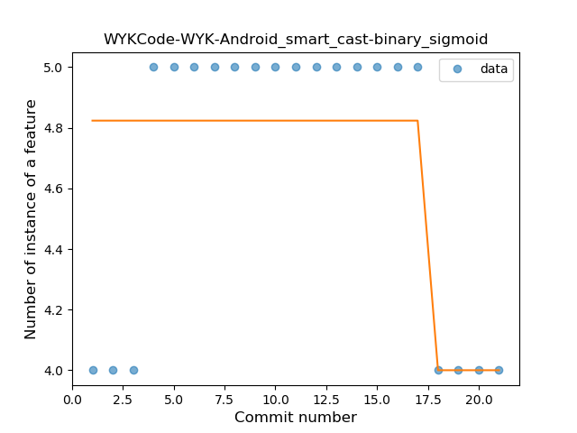
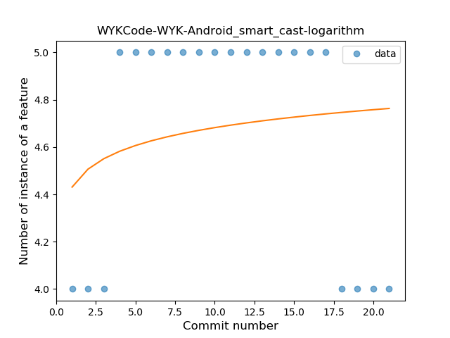
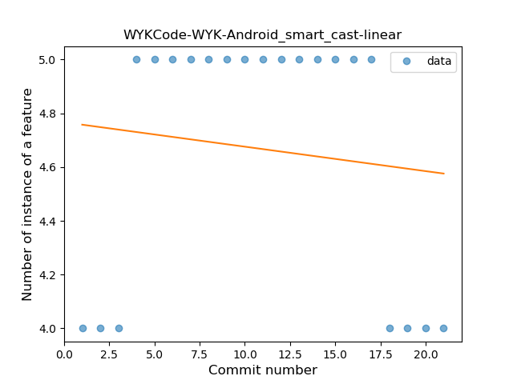
### <a name="func_call_with_named_arg">Function call with Named Argument</a>
----
#### Functions
* **Plateau Sudden Rise - Binary Sigmoid:** 
    * **R_Squared:** 1.0
* **Instability - Polinomial 4:** 
    * **R_Squared:** 0.83873518
* **Instability - Polinomial 3:** )
    * **R_Squared:** 0.74802372
* **Sudden Rise Plateau - Logarithm:** 
    * **R_Squared:** 0.54431151
* **Constant Rise - Linear:** 
    * **R_Squared:** 0.25909091

**Plots** :chart_with_upwards_trend:
-----

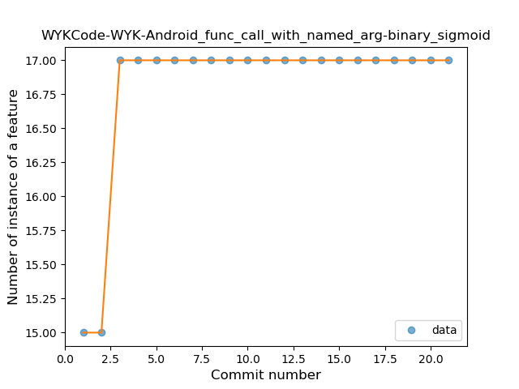
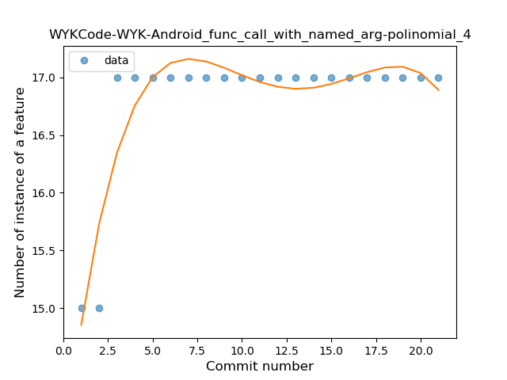
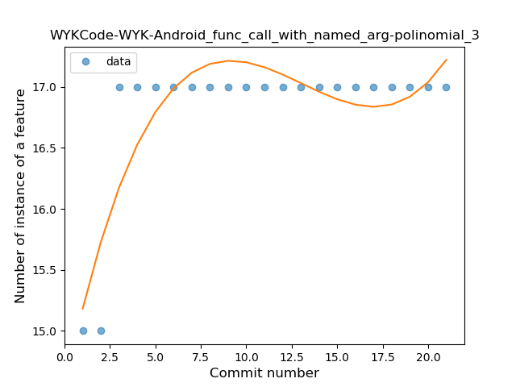
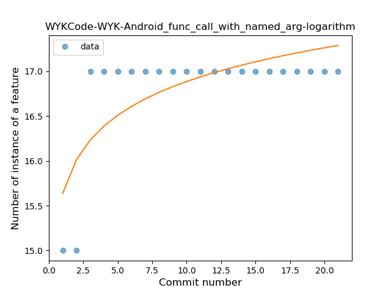
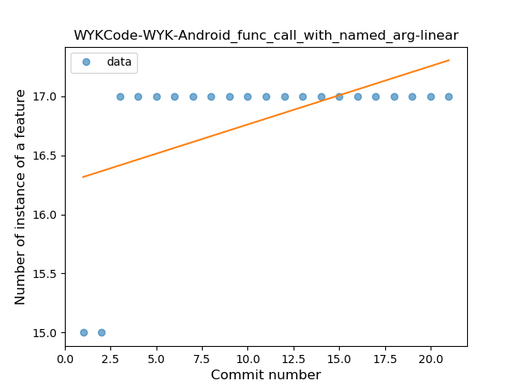
### <a name="data_class">Data Class</a>
----
#### Functions
* **Instability - Polinomial 4:** 
    * **R_Squared:** 0.86975542
* **Instability - Polinomial 3:** )
    * **R_Squared:** 0.78791049
* **Sudden Rise Plateau - Logarithm:** 
    * **R_Squared:** 0.57969923
* **Constant Rise - Linear:** 
    * **R_Squared:** 0.28285714

**Plots** :chart_with_upwards_trend:
-----

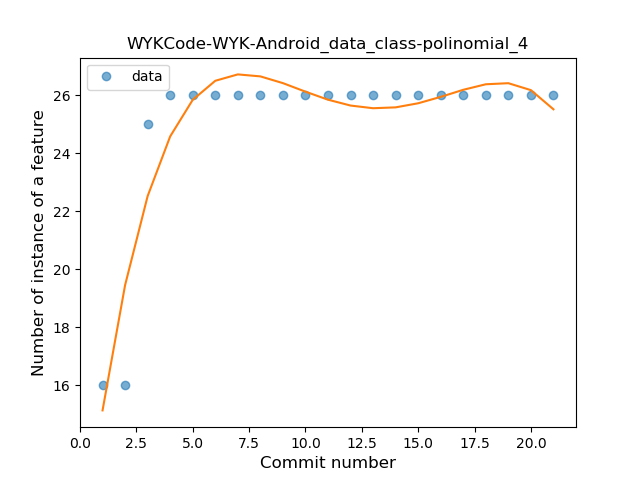
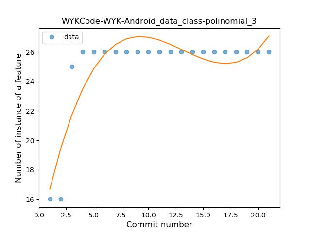
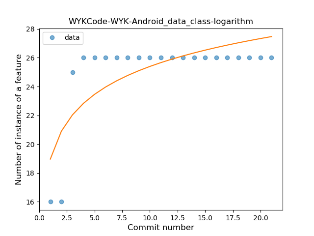
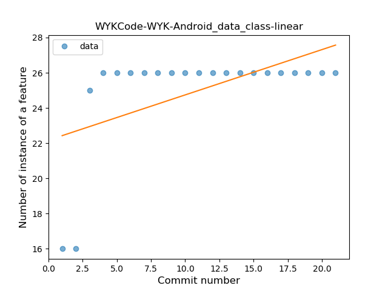
### <a name="property_delegation">Property Delegation</a>
----
#### Functions
* **Instability - Polinomial 3:** )
    * **R_Squared:** 0.87795544
* **Sudden Rise Plateau - Logarithm:** 
    * **R_Squared:** 0.73014524
* **Constant Rise - Linear:** 
    * **R_Squared:** 0.46868904

**Plots** :chart_with_upwards_trend:
-----

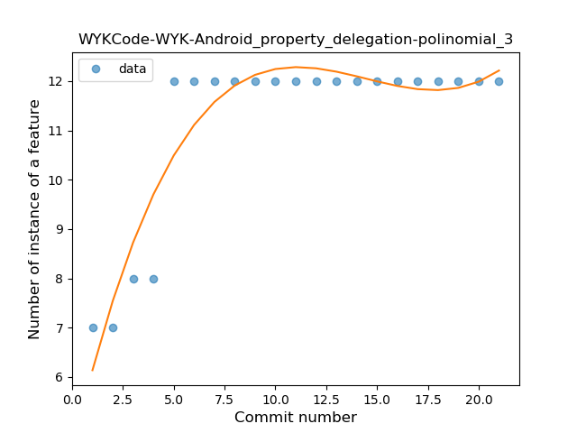
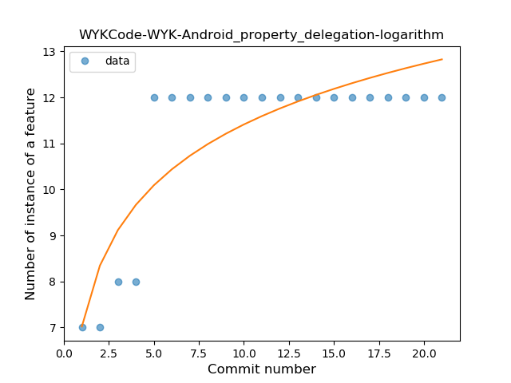
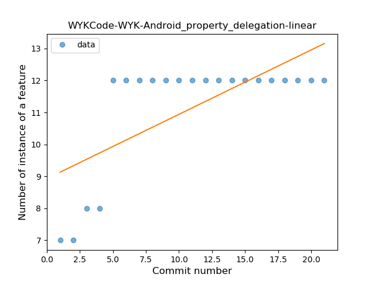
