## Waboodoo-HTTP-Shortcuts
----
#### Metrics provided by Detekt
* Number of lines of code 12071
* Number of Kotlin files: 168
* Cyclomatic complexity: 1473
* Cyclomatic complexity by thousands of lines: 210 

----
**17** features analyzed

*	<a href="#type_inference">Type Inference</a> 
*	<a href="#lambda">Lambda</a> 
*	<a href="#safe_call">Safe Call</a> 
*	<a href="#when_expr">When expression</a> 
*	<a href="#companion_object">Companion Object</a> 
*	<a href="#unsafe_call">Unsafe Call</a> 
*	<a href="#string_template">String Template</a> 
*	<a href="#func_with_default_value">Function with Default Value</a> 
*	<a href="#singleton">Singleton</a> 
*	<a href="#smart_cast">Smart Cast</a> 
*	<a href="#range_expr">Range Expression</a> 
*	<a href="#func_call_with_named_arg">Function call with Named Argument</a> 
*	<a href="#extension_function">Extension Function</a> 
*	<a href="#property_delegation">Property Delegation</a> 
*	<a href="#destructuring_declaration">Destructuring Declaration</a> 
*	<a href="#inline_func">Inline Function</a> 
*	<a href="#overloaded_op">Overloaded Operator</a> 

### <a name="type_inference">Type Inference</a>
----
#### Functions
* **Sudden Rise Plateau - Logarithm:** 
    * **R_Squared:** 0.8847448
* **Constant Rise - Linear:** 
    * **R_Squared:** 0.71492193

**Plots** :chart_with_upwards_trend:
-----

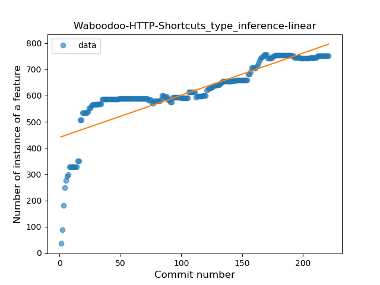
### <a name="lambda">Lambda</a>
----
#### Functions
* **Constant Rise - Linear:** 
    * **R_Squared:** 0.96898947
* **Sudden Rise Plateau - Logarithm:** 
    * **R_Squared:** 0.62784757

**Plots** :chart_with_upwards_trend:
-----

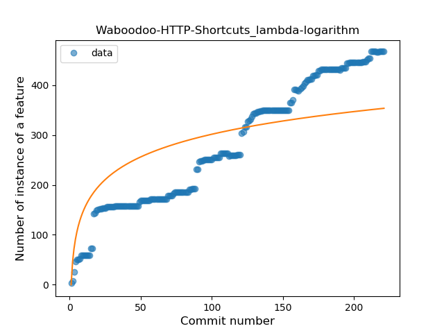
### <a name="safe_call">Safe Call</a>
----
#### Functions
* **Constant Rise - Linear:** 
    * **R_Squared:** 0.9566983
* **Sudden Rise - Exponential:** 
    * **R_Squared:** 0.96096232
* **Plateau Gradual Rise - Sigmoid:** 
    * **R_Squared:** 0.96672881
* **Sudden Rise Plateau - Logarithm:** 
    * **R_Squared:** 0.53314009

**Plots** :chart_with_upwards_trend:
-----

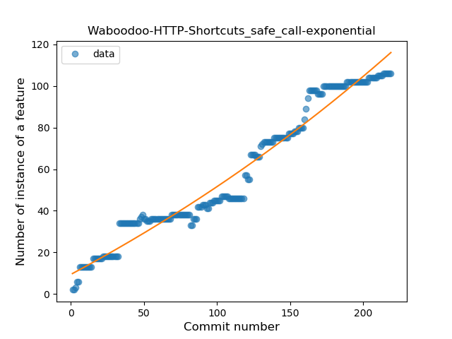
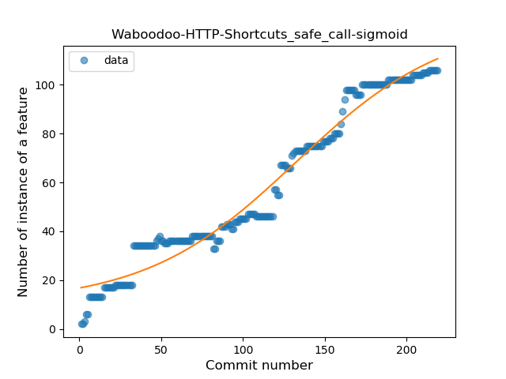
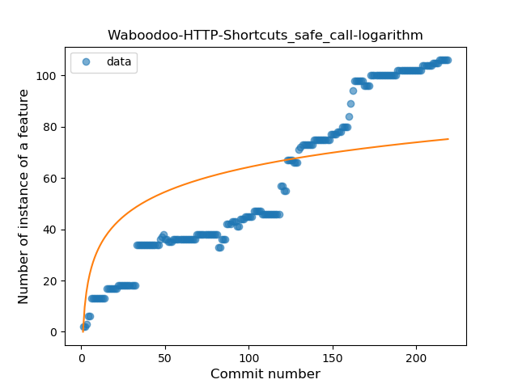
### <a name="when_expr">When expression</a>
----
#### Functions
* **Constant Rise - Linear:** 
    * **R_Squared:** 0.87892128
* **Sudden Rise Plateau - Logarithm:** 
    * **R_Squared:** 0.78771746
* **Plateau Sudden Rise - Binary Sigmoid:** 
    * **R_Squared:** 0.44747742

**Plots** :chart_with_upwards_trend:
-----

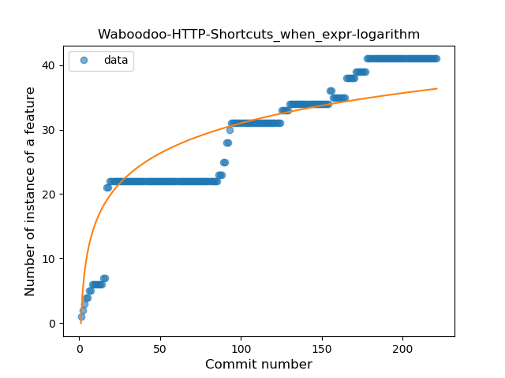
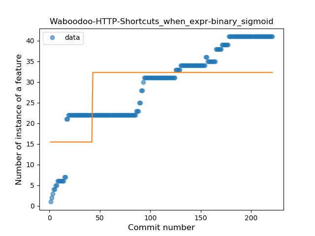
### <a name="companion_object">Companion Object</a>
----
#### Functions
* **Sudden Rise - Exponential:** 
    * **R_Squared:** 0.82031541
* **Constant Rise - Linear:** 
    * **R_Squared:** 0.79940182
* **Sudden Rise Plateau - Logarithm:** 
    * **R_Squared:** 0.68101332

**Plots** :chart_with_upwards_trend:
-----

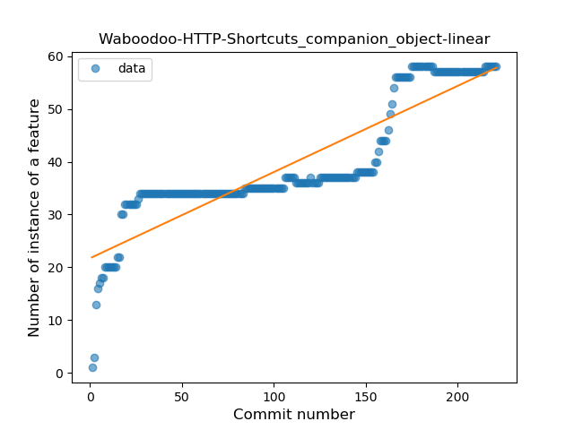
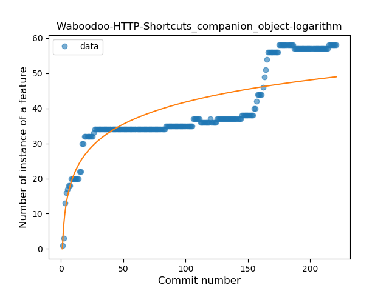
### <a name="unsafe_call">Unsafe Call</a>
----
#### Functions
* **Instability - Polinomial 3:** )
    * **R_Squared:** 0.53507949
* **Constant Decline - Linear:** 
    * **R_Squared:** 0.33055863
* **Sudden Decline - Exponential:** 
    * **R_Squared:** -0.0
* **Sudden Rise Plateau - Logarithm:** 
    * **R_Squared:** -0.0

**Plots** :chart_with_upwards_trend:
-----

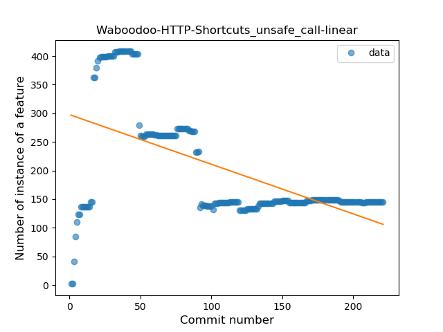
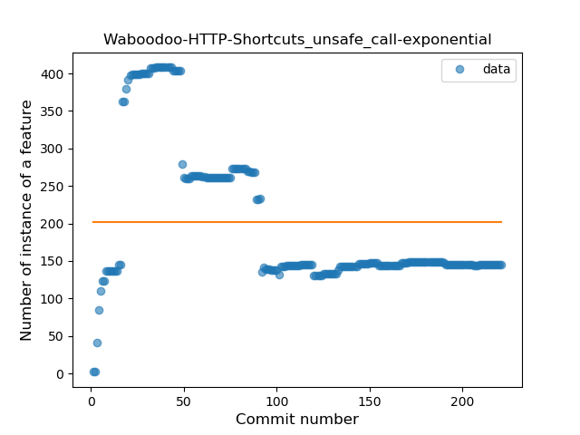

### <a name="string_template">String Template</a>
----
#### Functions
* **Plateau Gradual Rise - Sigmoid:** 
    * **R_Squared:** 0.94553637
* **Constant Rise - Linear:** 
    * **R_Squared:** 0.89940414
* **Sudden Rise - Exponential:** 
    * **R_Squared:** 0.90720858
* **Sudden Rise Plateau - Logarithm:** 
    * **R_Squared:** 0.59871896

**Plots** :chart_with_upwards_trend:
-----

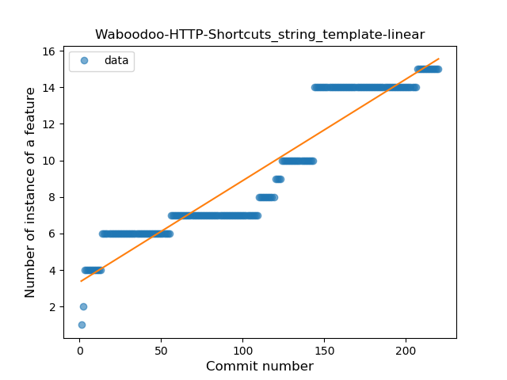
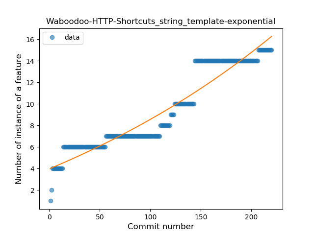

### <a name="func_with_default_value">Function with Default Value</a>
----
#### Functions
* **Constant Rise - Linear:** 
    * **R_Squared:** 0.91917662
* **Sudden Rise Plateau - Logarithm:** 
    * **R_Squared:** 0.52744986

**Plots** :chart_with_upwards_trend:
-----

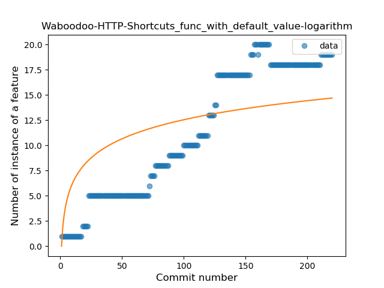
### <a name="singleton">Singleton</a>
----
#### Functions
* **Sudden Rise Plateau - Logarithm:** 
    * **R_Squared:** 0.84003283
* **Plateau Sudden Rise - Binary Sigmoid:** 
    * **R_Squared:** 0.53860691
* **Constant Rise - Linear:** 
    * **R_Squared:** 0.51743392

**Plots** :chart_with_upwards_trend:
-----

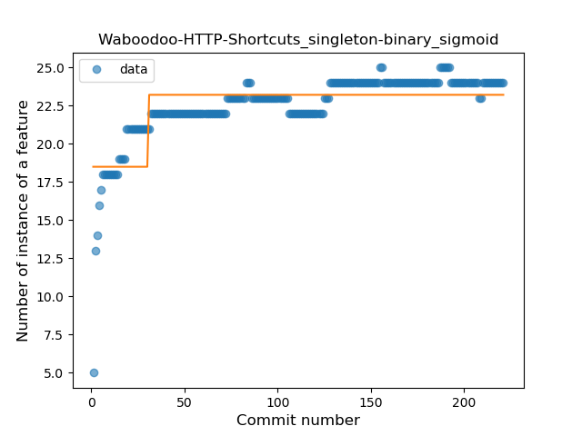
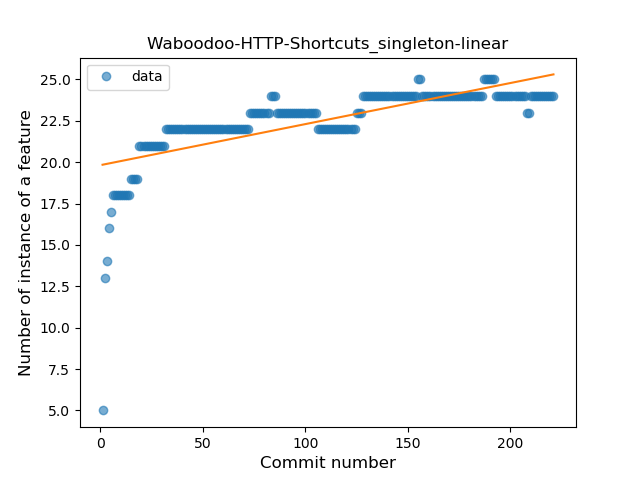
### <a name="smart_cast">Smart Cast</a>
----
#### Functions
* **Sudden Rise Plateau - Logarithm:** 
    * **R_Squared:** 0.04228338
* **Constant Decline - Linear:** 
    * **R_Squared:** 0.00295008

**Plots** :chart_with_upwards_trend:
-----

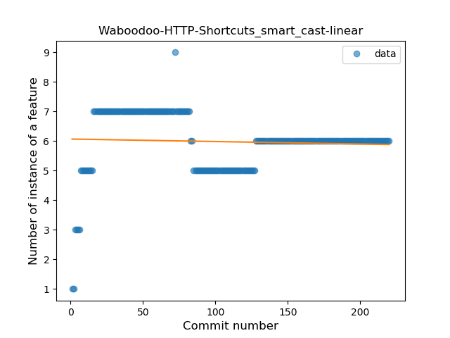
### <a name="range_expr">Range Expression</a>
----
#### Functions
* **Sudden Rise Plateau - Logarithm:** 
    * **R_Squared:** 0.11773176
* **Constant Rise - Linear:** 
    * **R_Squared:** 0.01024982

**Plots** :chart_with_upwards_trend:
-----

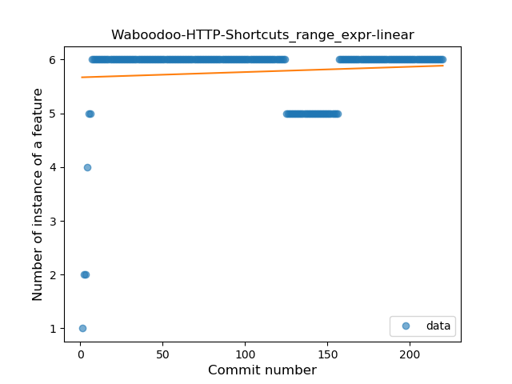
### <a name="func_call_with_named_arg">Function call with Named Argument</a>
----
#### Functions
* **Plateau Gradual Rise - Sigmoid:** 
    * **R_Squared:** 0.95974312
* **Sudden Rise - Exponential:** 
    * **R_Squared:** 0.91592795
* **Constant Rise - Linear:** 
    * **R_Squared:** 0.84865033
* **Sudden Rise Plateau - Logarithm:** 
    * **R_Squared:** 0.31200145

**Plots** :chart_with_upwards_trend:
-----

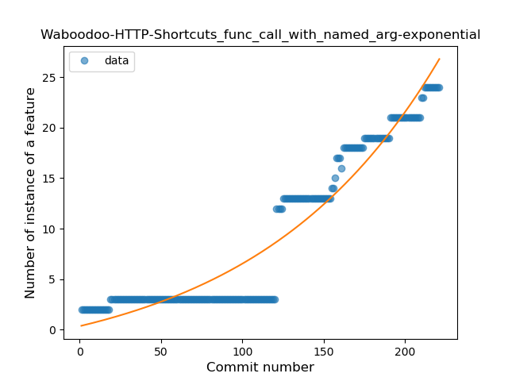
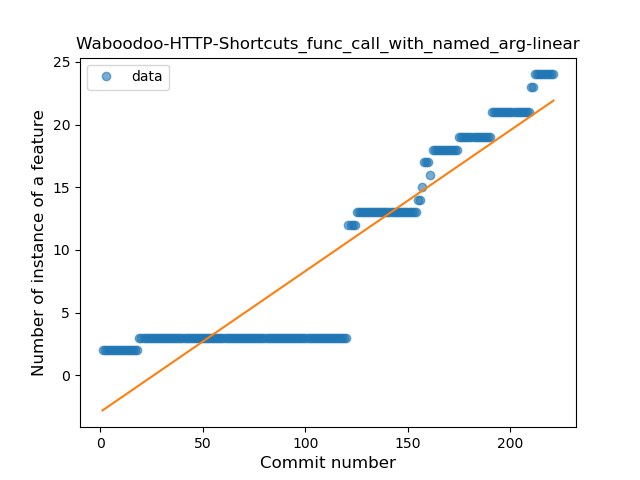
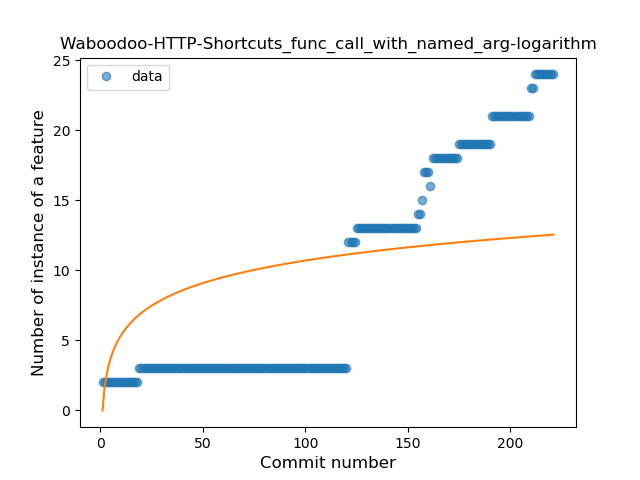
### <a name="extension_function">Extension Function</a>
----
#### Functions
* **Constant Rise - Linear:** 
    * **R_Squared:** 0.88791241
* **Sudden Rise Plateau - Logarithm:** 
    * **R_Squared:** 0.67222929

**Plots** :chart_with_upwards_trend:
-----

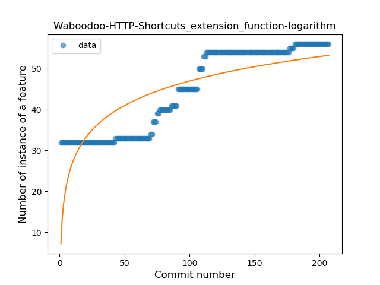
### <a name="property_delegation">Property Delegation</a>
----
#### Functions
* **Constant Rise - Linear:** 
    * **R_Squared:** 0.95273062
* **Sudden Rise Plateau - Logarithm:** 
    * **R_Squared:** 0.63163231
* **Plateau Sudden Rise - Binary Sigmoid:** 
    * **R_Squared:** 0.63533583

**Plots** :chart_with_upwards_trend:
-----

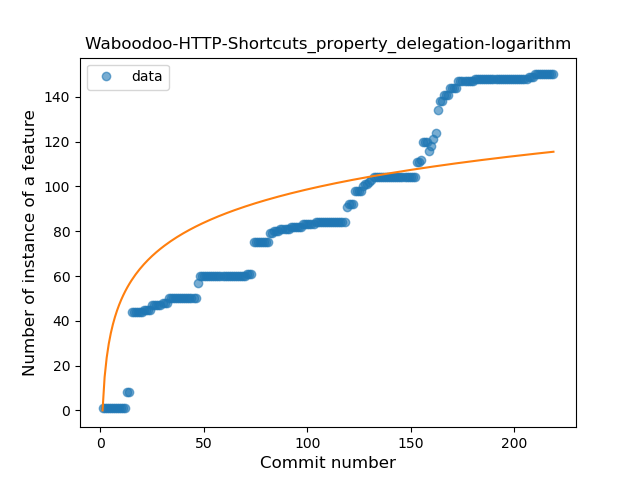
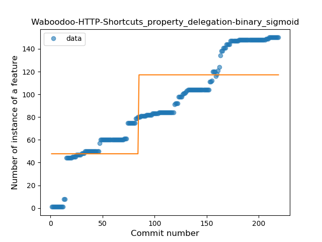
### <a name="destructuring_declaration">Destructuring Declaration</a>
----
#### Functions
* **Plateau Gradual Rise - Sigmoid:** 
    * **R_Squared:** 0.97887128
* **Constant Rise - Linear:** 
    * **R_Squared:** 0.89157534
* **Sudden Rise - Exponential:** 
    * **R_Squared:** 0.89409375
* **Sudden Rise Plateau - Logarithm:** 
    * **R_Squared:** 0.43735014

**Plots** :chart_with_upwards_trend:
-----

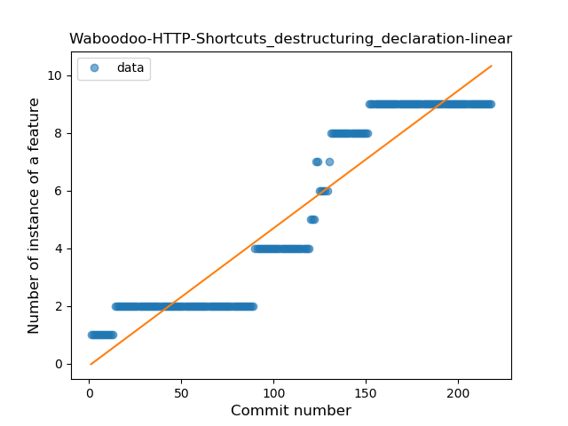
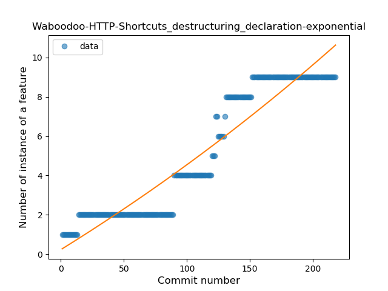
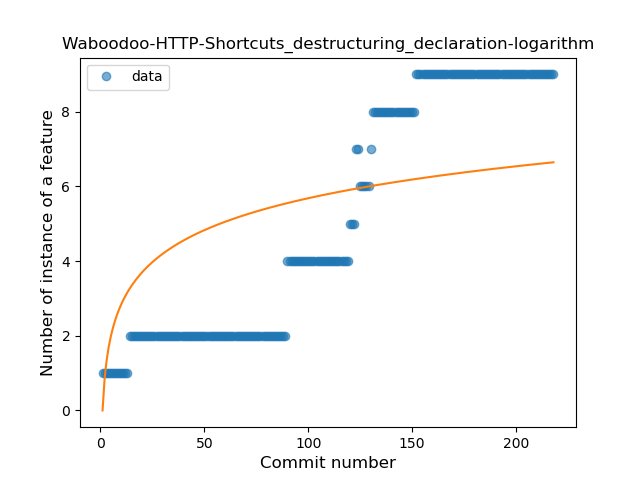
### <a name="inline_func">Inline Function</a>
----
#### Functions
* **Plateau Sudden Rise - Binary Sigmoid:** 
    * **R_Squared:** 1.0
* **Sudden Rise Plateau - Logarithm:** 
    * **R_Squared:** 0.22165576
* **Constant Rise - Linear:** 
    * **R_Squared:** 0.04443691

**Plots** :chart_with_upwards_trend:
-----

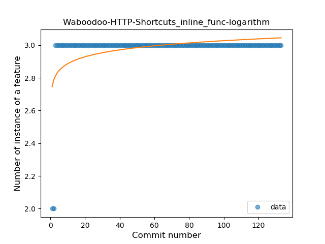
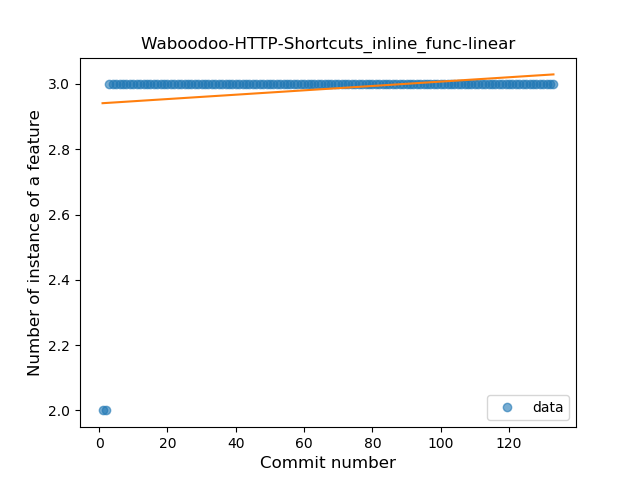
### <a name="overloaded_op">Overloaded Operator</a>
----
#### Functions
* **Plateau Sudden Decline - Binary Sigmoid:** 
    * **R_Squared:** 1.0
* **Sudden Decline - Exponential:** 
    * **R_Squared:** 0.80481363
* **Constant Decline - Linear:** 
    * **R_Squared:** 0.19352941
* **Sudden Rise Plateau - Logarithm:** 
    * **R_Squared:** -0.0

**Plots** :chart_with_upwards_trend:
-----

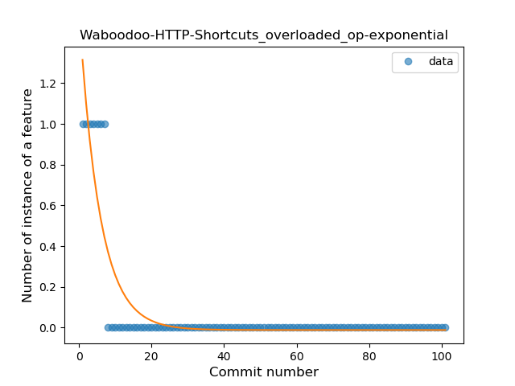
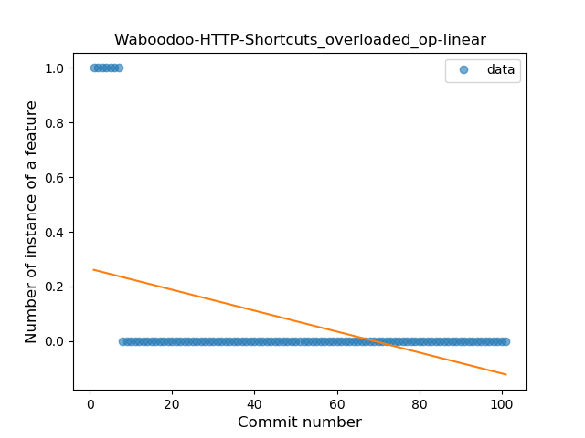
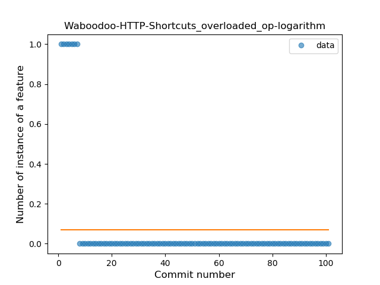
