## WilderPereira-lmgtfyGen
----
#### Metrics provided by Detekt
* Number of lines of code 391
* Number of Kotlin files: 11
* Cyclomatic complexity: 41
* Cyclomatic complexity by thousands of lines: 246 

----
**4** features analyzed

*	<a href="#type_inference">Type Inference</a> 
*	<a href="#lambda">Lambda</a> 
*	<a href="#safe_call">Safe Call</a> 
*	<a href="#companion_object">Companion Object</a> 

### <a name="type_inference">Type Inference</a>
----
#### Functions
* **Sudden Rise Plateau - Logarithm:** 
    * **R_Squared:** 0.8316355
* **Constant Rise - Linear:** 
    * **R_Squared:** 0.80045218

**Plots** :chart_with_upwards_trend:
-----

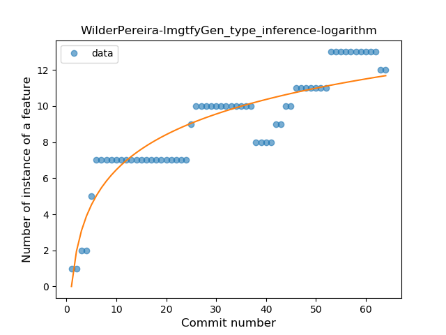
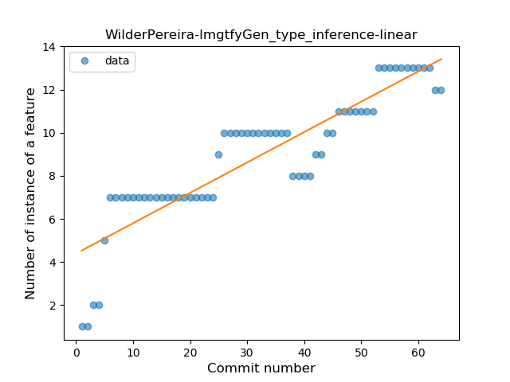
### <a name="lambda">Lambda</a>
----
#### Functions
* **Sudden Rise - Exponential:** 
    * **R_Squared:** 0.93702632
* **Constant Rise - Linear:** 
    * **R_Squared:** 0.87549358
* **Sudden Rise Plateau - Logarithm:** 
    * **R_Squared:** 0.52986497

**Plots** :chart_with_upwards_trend:
-----

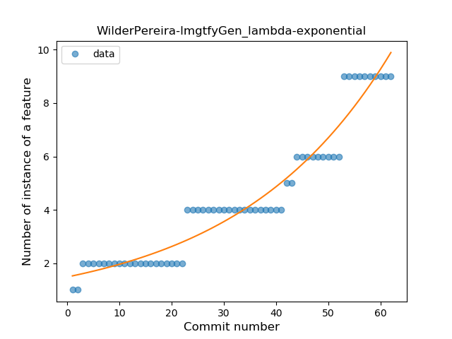
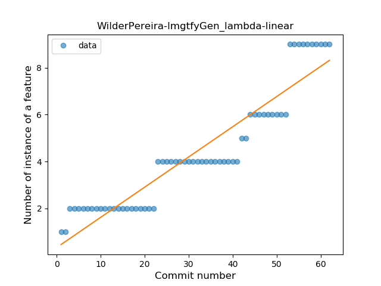
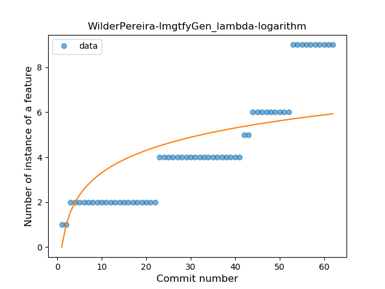
### <a name="safe_call">Safe Call</a>
----
#### Functions
* **Plateau Sudden Decline - Binary Sigmoid:** 
    * **R_Squared:** 1.0
* **Instability - Polinomial 4:** 
    * **R_Squared:** 0.88438228
* **Instability - Polinomial 3:** )
    * **R_Squared:** 0.85081585
* **Sudden Decline - Exponential:** 
    * **R_Squared:** 0.75826496
* **Constant Decline - Linear:** 
    * **R_Squared:** 0.73426573
* **Sudden Rise Plateau - Logarithm:** 
    * **R_Squared:** -0.0

**Plots** :chart_with_upwards_trend:
-----

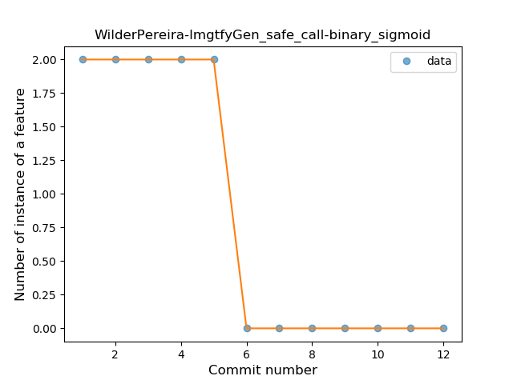
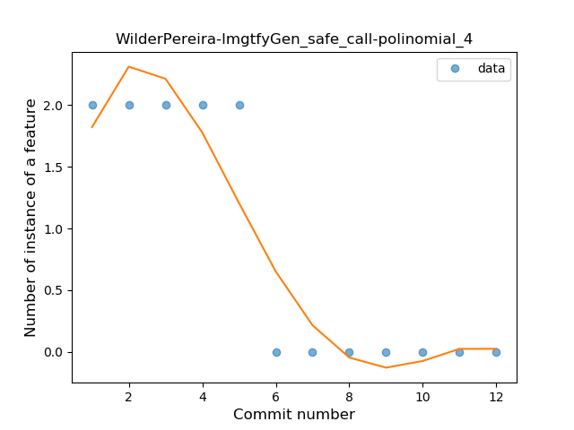
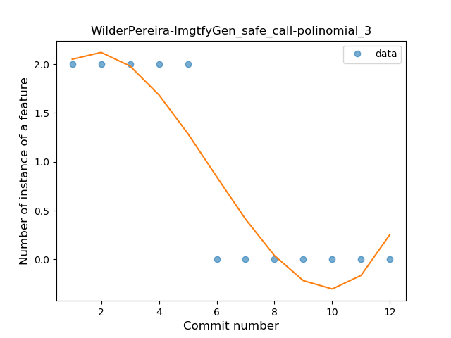
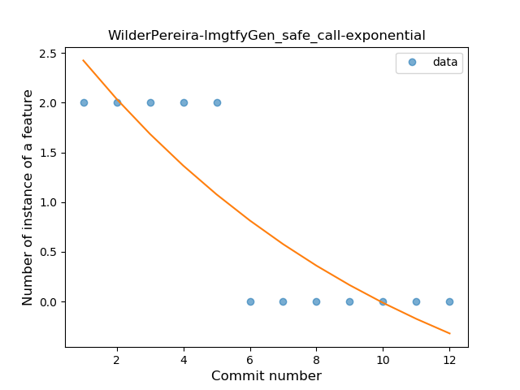
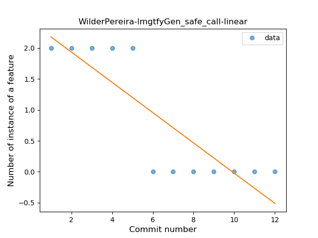
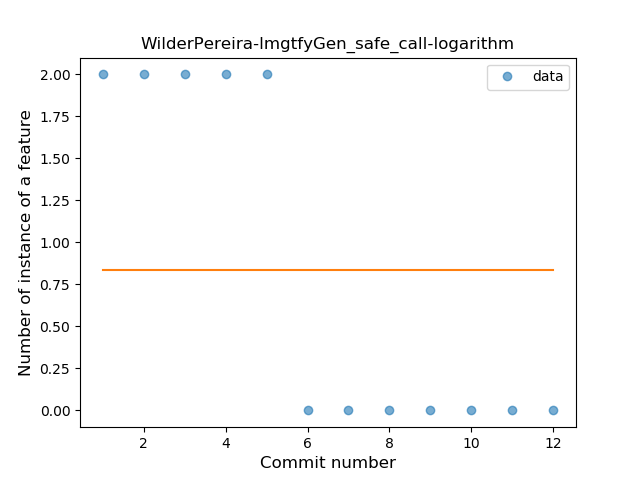
### <a name="companion_object">Companion Object</a>
----
#### Functions
* **Instability - Polinomial 4:** 
    * **R_Squared:** 0.87044221
* **Plateau Sudden Decline - Binary Sigmoid:** 
    * **R_Squared:** 0.69280514
* **Constant Decline - Linear:** 
    * **R_Squared:** 0.21491228
* **Sudden Rise Plateau - Logarithm:** 
    * **R_Squared:** -0.0

**Plots** :chart_with_upwards_trend:
-----

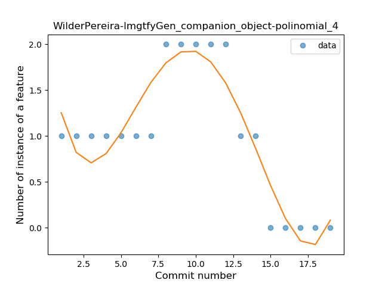
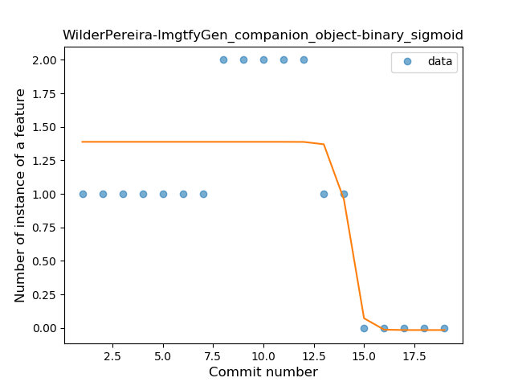
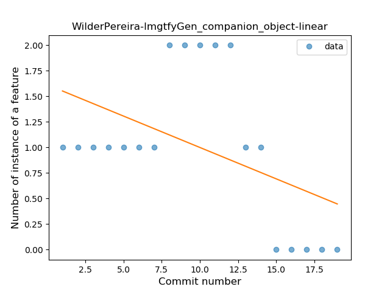
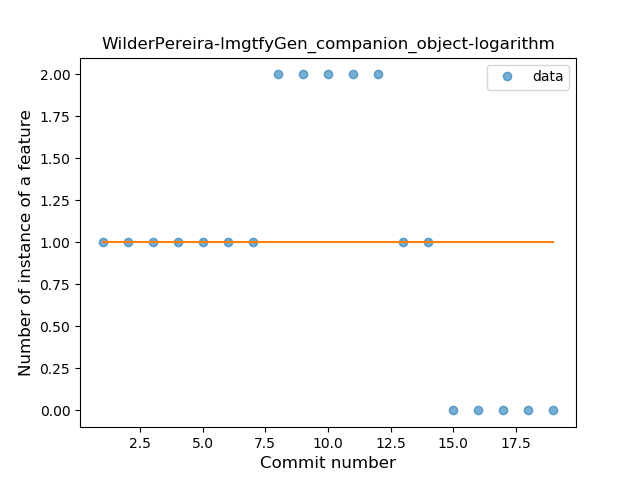
