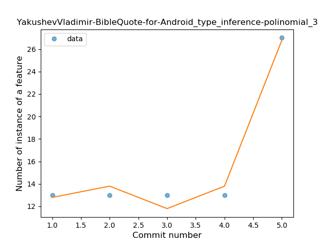
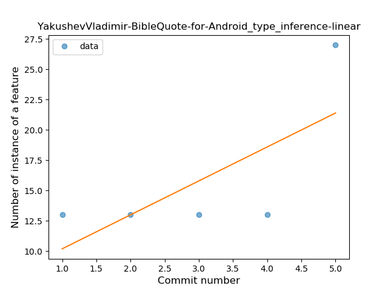
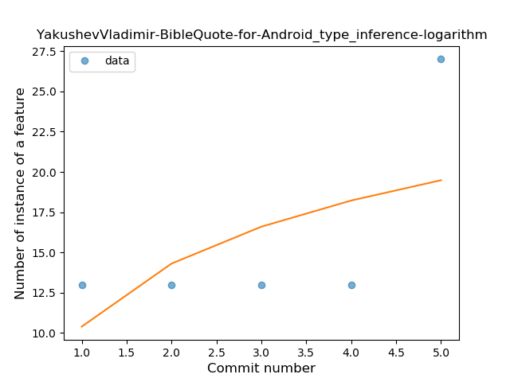
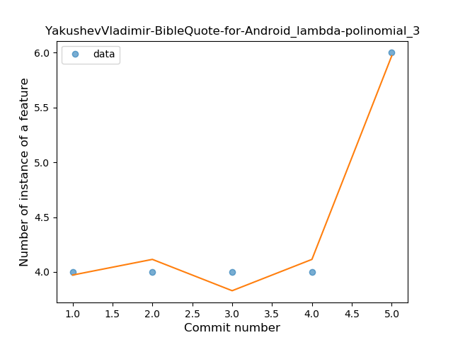
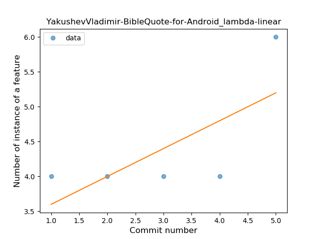
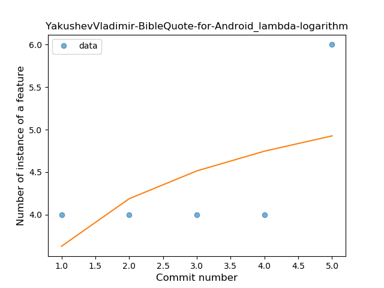

## YakushevVladimir-BibleQuote-for-Android
----
#### Metrics provided by Detekt
* Number of lines of code 690
* Number of Kotlin files: 9
* Cyclomatic complexity: 62
* Cyclomatic complexity by thousands of lines: 285 

----
**2** features analyzed

*	<a href="#type_inference">Type Inference</a> 
*	<a href="#lambda">Lambda</a> 

### <a name="type_inference">Type Inference</a>
----
#### Functions
* **Instability - Polinomial 4:** 
    * **R_Squared:** 1.0
* **Instability - Polinomial 3:** )
    * **R_Squared:** 0.98214286
* **Constant Rise - Linear:** 
    * **R_Squared:** 0.5
* **Sudden Rise Plateau - Logarithm:** 
    * **R_Squared:** 0.3288673

**Plots** :chart_with_upwards_trend:
-----

### <a name="lambda">Lambda</a>
----
#### Functions
* **Instability - Polinomial 4:** 
    * **R_Squared:** 1.0
* **Instability - Polinomial 3:** )
    * **R_Squared:** 0.98214286
* **Constant Rise - Linear:** 
    * **R_Squared:** 0.5
* **Sudden Rise Plateau - Logarithm:** 
    * **R_Squared:** 0.3288673

**Plots** :chart_with_upwards_trend:
-----

