## abertschi-ad-free
----
#### Metrics provided by Detekt
* Number of lines of code 3208
* Number of Kotlin files: 52
* Cyclomatic complexity: 342
* Cyclomatic complexity by thousands of lines: 265 

----
**12** features analyzed

*	<a href="#type_inference">Type Inference</a> 
*	<a href="#lambda">Lambda</a> 
*	<a href="#safe_call">Safe Call</a> 
*	<a href="#when_expr">When expression</a> 
*	<a href="#companion_object">Companion Object</a> 
*	<a href="#unsafe_call">Unsafe Call</a> 
*	<a href="#string_template">String Template</a> 
*	<a href="#func_with_default_value">Function with Default Value</a> 
*	<a href="#singleton">Singleton</a> 
*	<a href="#func_call_with_named_arg">Function call with Named Argument</a> 
*	<a href="#data_class">Data Class</a> 
*	<a href="#property_delegation">Property Delegation</a> 

### <a name="type_inference">Type Inference</a>
----
#### Functions
* **Constant Rise - Linear:** 
    * **R_Squared:** 0.91590816
* **Sudden Rise Plateau - Logarithm:** 
    * **R_Squared:** 0.64560722
* **Plateau Sudden Rise - Binary Sigmoid:** 
    * **R_Squared:** 0.30808665

**Plots** :chart_with_upwards_trend:
-----

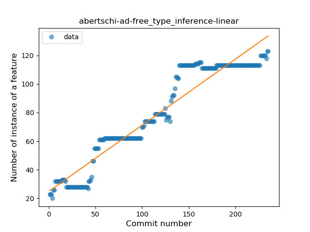
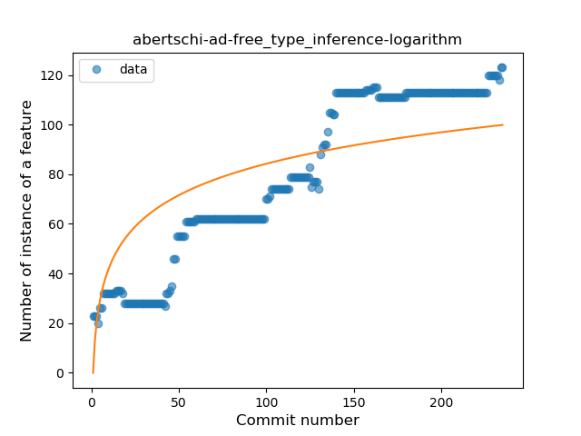
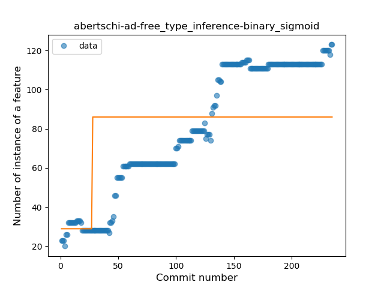
### <a name="lambda">Lambda</a>
----
#### Functions
* **Constant Rise - Linear:** 
    * **R_Squared:** 0.90827417
* **Plateau Gradual Rise - Sigmoid:** 
    * **R_Squared:** 0.58300654
* **Sudden Rise Plateau - Logarithm:** 
    * **R_Squared:** 0.5213998

**Plots** :chart_with_upwards_trend:
-----

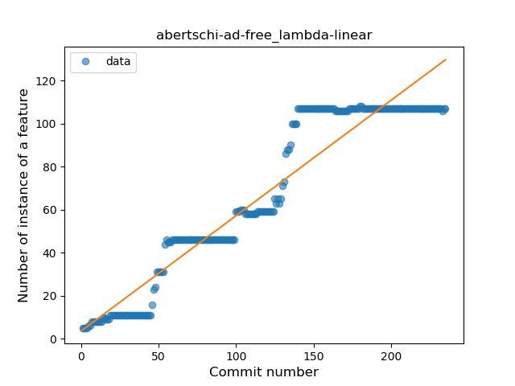
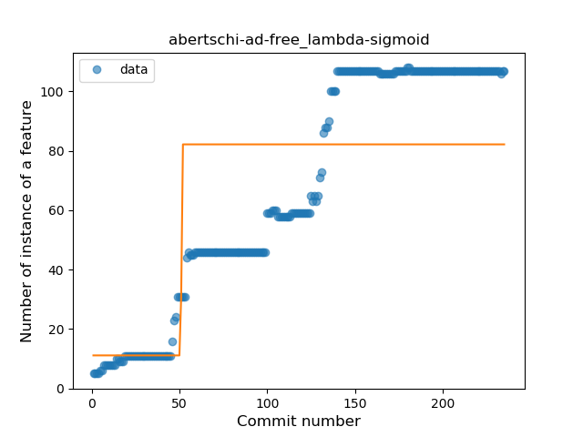
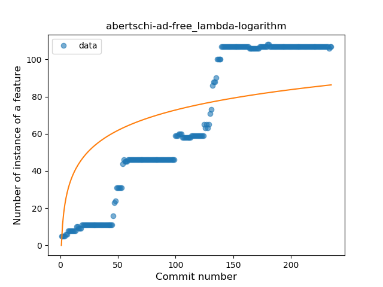
### <a name="safe_call">Safe Call</a>
----
#### Functions
* **Constant Rise - Linear:** 
    * **R_Squared:** 0.88613416
* **Plateau Sudden Rise - Binary Sigmoid:** 
    * **R_Squared:** 0.64630681
* **Sudden Rise Plateau - Logarithm:** 
    * **R_Squared:** 0.61938881

**Plots** :chart_with_upwards_trend:
-----

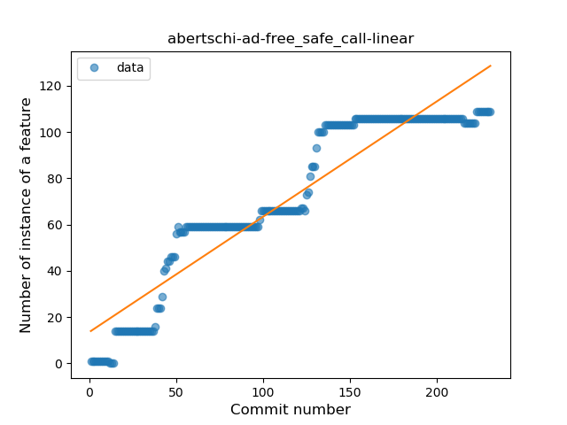
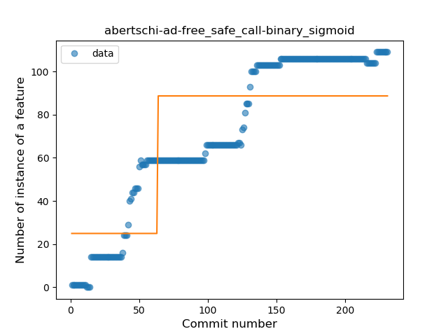
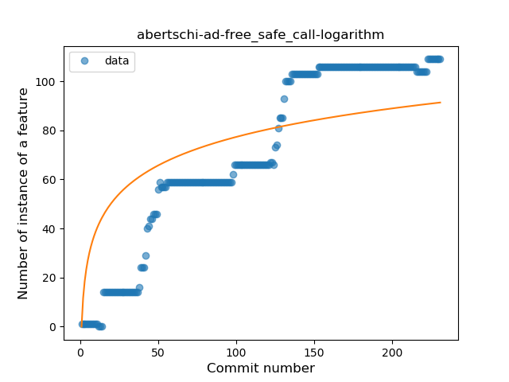
### <a name="when_expr">When expression</a>
----
#### Functions
* **Plateau Sudden Rise - Binary Sigmoid:** 
    * **R_Squared:** 0.98974442
* **Constant Rise - Linear:** 
    * **R_Squared:** 0.75378985
* **Sudden Rise Plateau - Logarithm:** 
    * **R_Squared:** 0.44515401

**Plots** :chart_with_upwards_trend:
-----

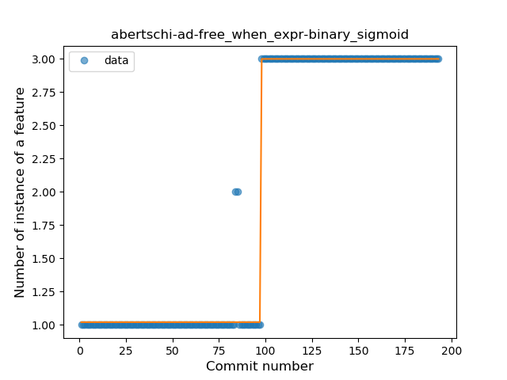
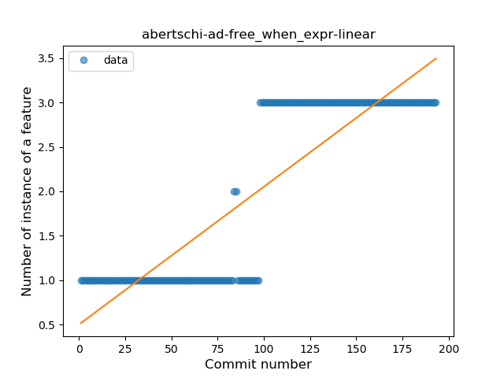
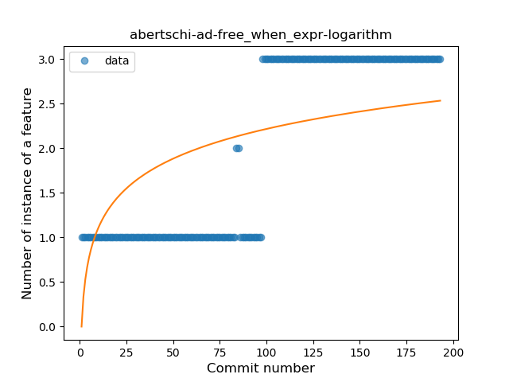
### <a name="companion_object">Companion Object</a>
----
#### Functions
* **Plateau Sudden Rise - Binary Sigmoid:** 
    * **R_Squared:** 0.40901913
* **Sudden Rise Plateau - Logarithm:** 
    * **R_Squared:** 0.12737387
* **Constant Rise - Linear:** 
    * **R_Squared:** 0.00048338
* **Sudden Rise - Exponential:** 
    * **R_Squared:** 0.00024789

**Plots** :chart_with_upwards_trend:
-----

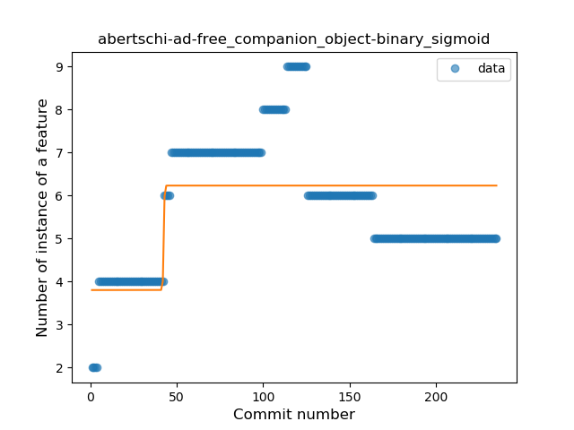
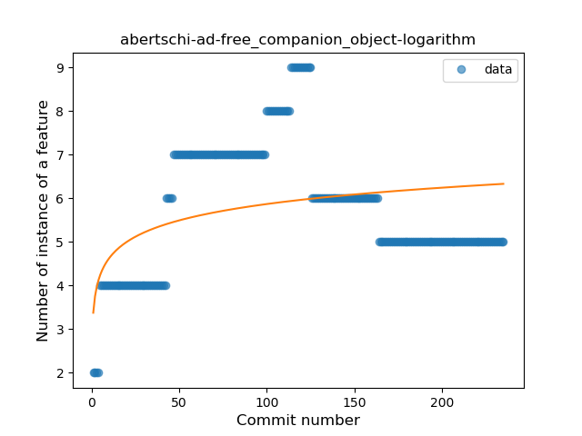
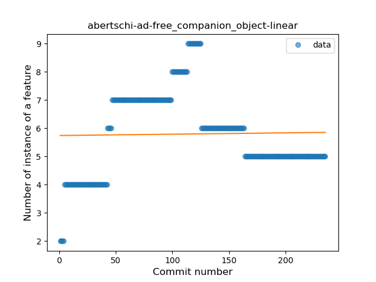
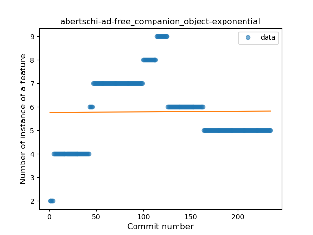
### <a name="unsafe_call">Unsafe Call</a>
----
#### Functions
* **Constant Rise - Linear:** 
    * **R_Squared:** 0.8434046
* **Sudden Rise Plateau - Logarithm:** 
    * **R_Squared:** 0.62096614
* **Plateau Sudden Rise - Binary Sigmoid:** 
    * **R_Squared:** 0.35879339

**Plots** :chart_with_upwards_trend:
-----

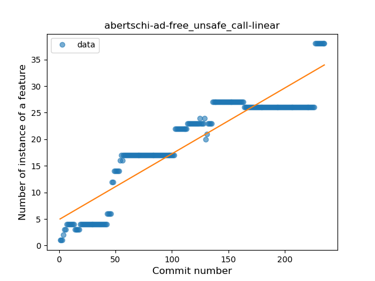
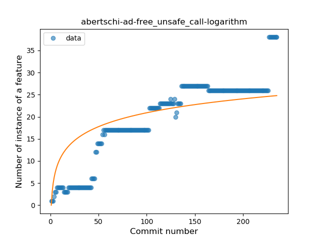
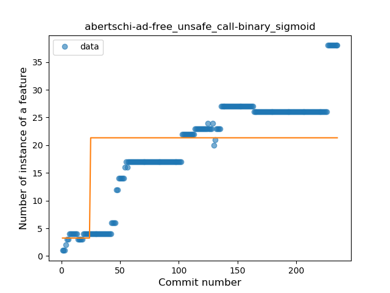
### <a name="string_template">String Template</a>
----
#### Functions
* **Plateau Gradual Rise - Sigmoid:** 
    * **R_Squared:** 0.97232518
* **Sudden Rise Plateau - Logarithm:** 
    * **R_Squared:** 0.75504062
* **Constant Rise - Linear:** 
    * **R_Squared:** 0.5838467

**Plots** :chart_with_upwards_trend:
-----

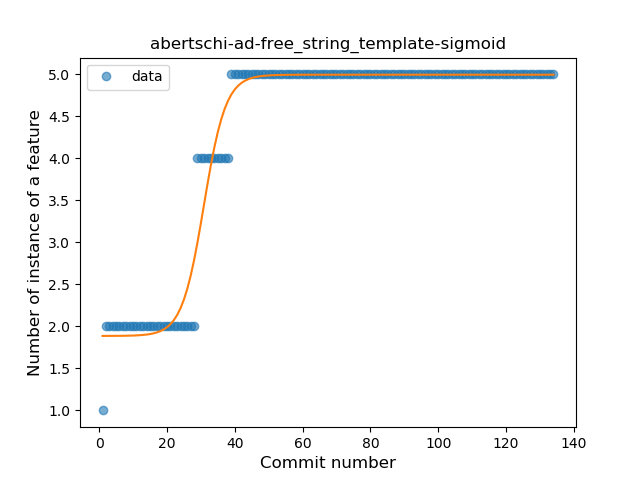
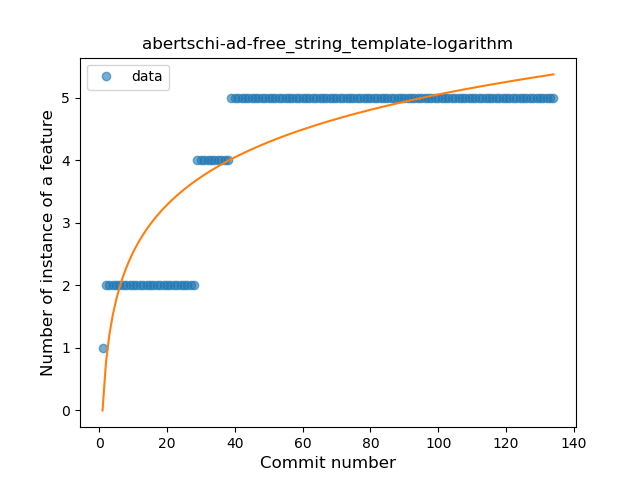
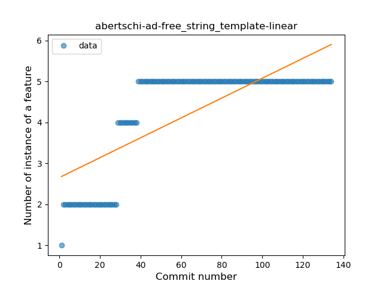
### <a name="func_with_default_value">Function with Default Value</a>
----
#### Functions
* **Plateau Gradual Rise - Sigmoid:** 
    * **R_Squared:** 0.91340304
* **Constant Rise - Linear:** 
    * **R_Squared:** 0.88999129
* **Sudden Rise Plateau - Logarithm:** 
    * **R_Squared:** 0.57271019

**Plots** :chart_with_upwards_trend:
-----

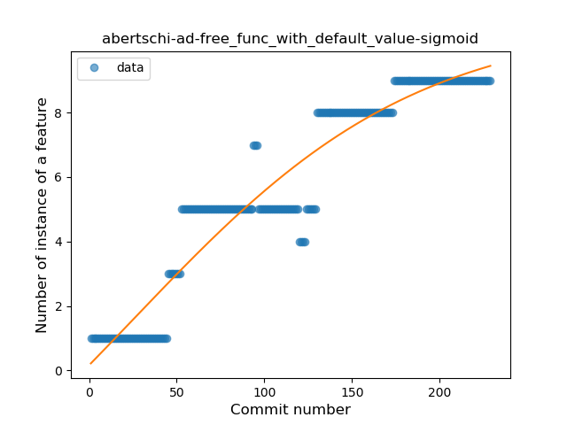
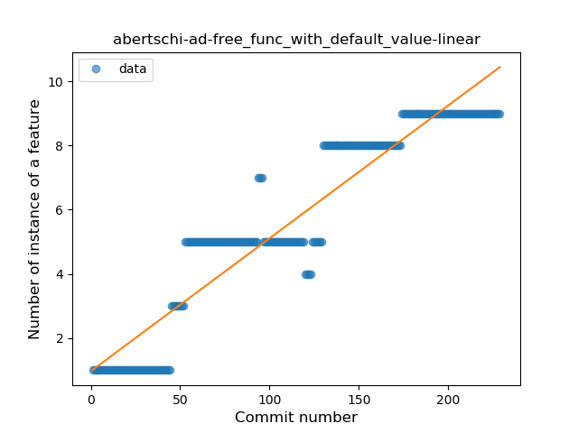
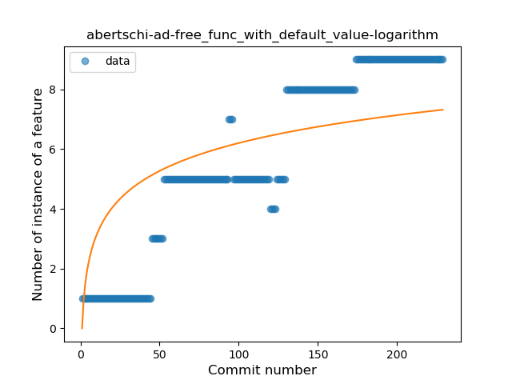
### <a name="singleton">Singleton</a>
----
#### Functions
* **Plateau Gradual Decline - Sigmoid:** 
    * **R_Squared:** 0.39328432
* **Constant Decline - Linear:** 
    * **R_Squared:** 0.0739483
* **Sudden Rise Plateau - Logarithm:** 
    * **R_Squared:** -0.0

**Plots** :chart_with_upwards_trend:
-----

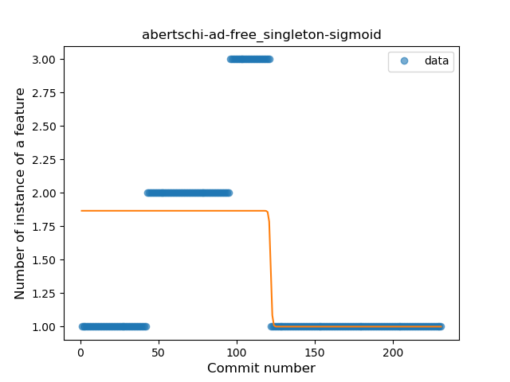
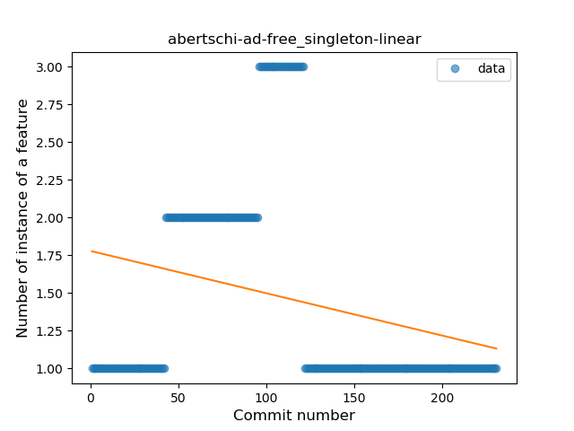
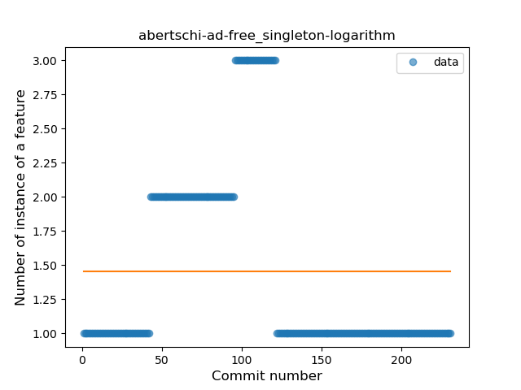
### <a name="func_call_with_named_arg">Function call with Named Argument</a>
----
#### Functions
* **Plateau Sudden Rise - Binary Sigmoid:** 
    * **R_Squared:** 0.95925846
* **Constant Rise - Linear:** 
    * **R_Squared:** 0.68989647
* **Sudden Rise Plateau - Logarithm:** 
    * **R_Squared:** 0.44531679

**Plots** :chart_with_upwards_trend:
-----

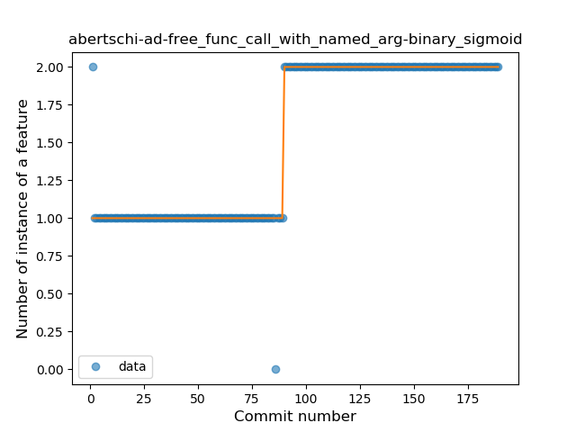
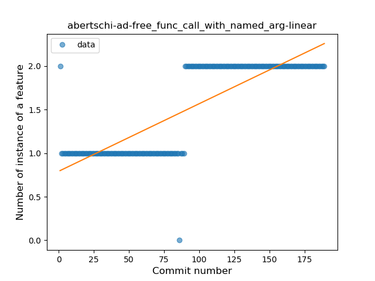
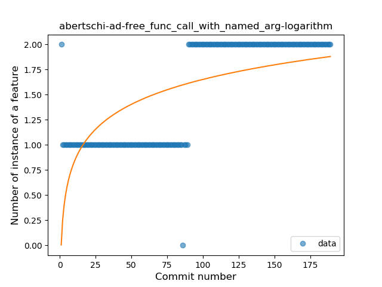
### <a name="data_class">Data Class</a>
----
#### Functions
* **Plateau Sudden Rise - Binary Sigmoid:** 
    * **R_Squared:** 0.37858812
* **Sudden Rise Plateau - Logarithm:** 
    * **R_Squared:** 0.05519266
* **Constant Decline - Linear:** 
    * **R_Squared:** 0.00035866
* **Sudden Decline - Exponential:** 
    * **R_Squared:** 0.00034812

**Plots** :chart_with_upwards_trend:
-----

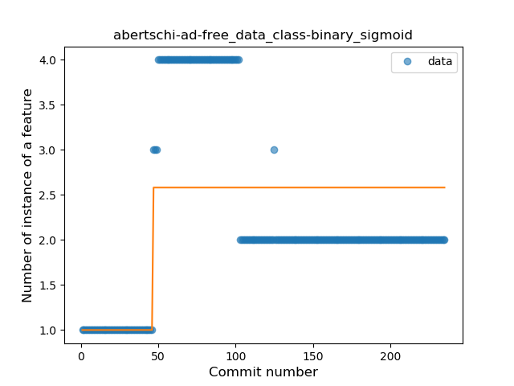
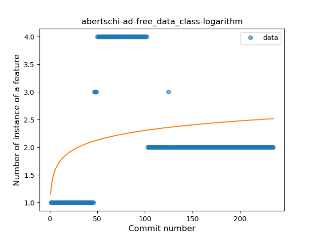
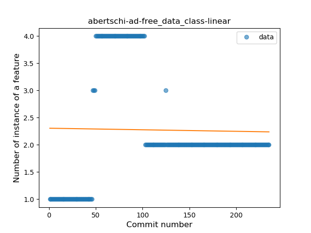

### <a name="property_delegation">Property Delegation</a>
----
#### Functions
* **Plateau Gradual Decline - Sigmoid:** 
    * **R_Squared:** 0.39328432
* **Constant Decline - Linear:** 
    * **R_Squared:** 0.0739483
* **Sudden Rise Plateau - Logarithm:** 
    * **R_Squared:** -0.0

**Plots** :chart_with_upwards_trend:
-----

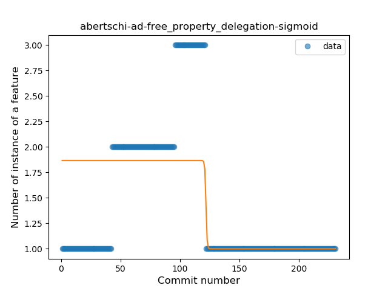
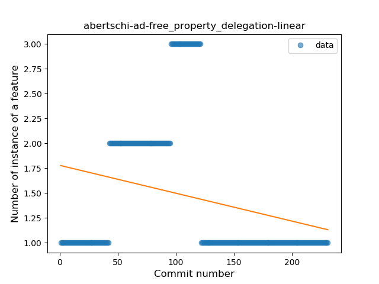
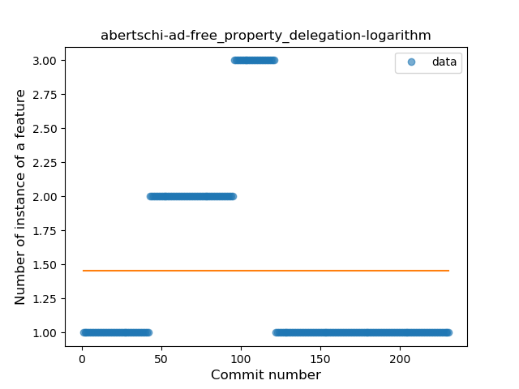
