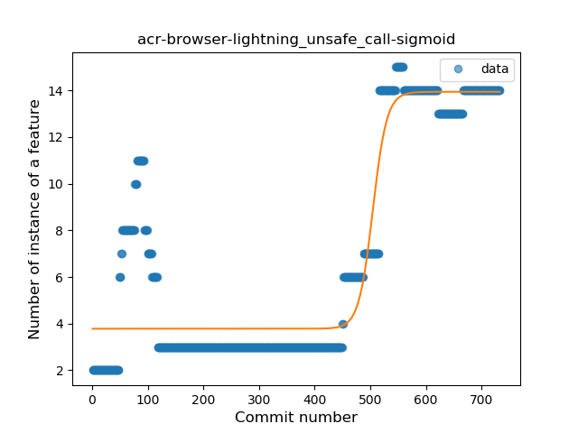
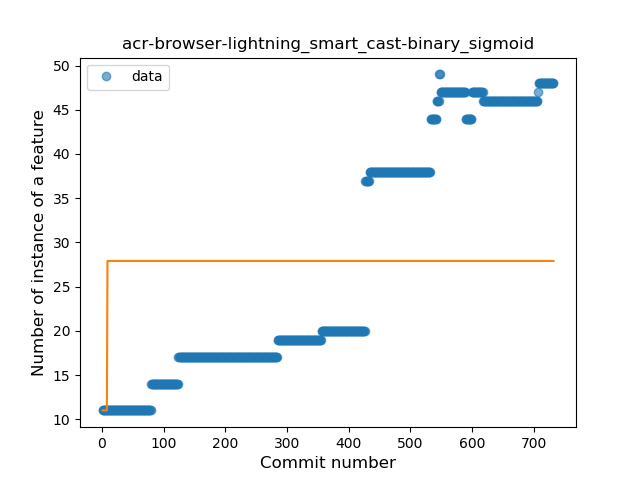
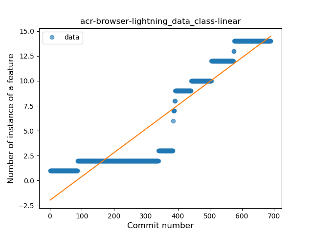

## acr-browser-lightning
----
#### Metrics provided by Detekt
* Number of lines of code 16903
* Number of Kotlin files: 222
* Cyclomatic complexity: 2064
* Cyclomatic complexity by thousands of lines: 266 

----
**18** features analyzed

*	<a href="#type_inference">Type Inference</a> 
*	<a href="#lambda">Lambda</a> 
*	<a href="#safe_call">Safe Call</a> 
*	<a href="#when_expr">When expression</a> 
*	<a href="#unsafe_call">Unsafe Call</a> 
*	<a href="#companion_object">Companion Object</a> 
*	<a href="#string_template">String Template</a> 
*	<a href="#func_with_default_value">Function with Default Value</a> 
*	<a href="#singleton">Singleton</a> 
*	<a href="#range_expr">Range Expression</a> 
*	<a href="#smart_cast">Smart Cast</a> 
*	<a href="#data_class">Data Class</a> 
*	<a href="#func_call_with_named_arg">Function call with Named Argument</a> 
*	<a href="#extension_function">Extension Function</a> 
*	<a href="#property_delegation">Property Delegation</a> 
*	<a href="#destructuring_declaration">Destructuring Declaration</a> 
*	<a href="#inline_func">Inline Function</a> 
*	<a href="#sealed_class">Sealed Class</a> 

### <a name="type_inference">Type Inference</a>
----
#### Functions
* **Sudden Rise Plateau - Logarithm:** 
    * **R_Squared:** 0.69892533
* **Constant Rise - Linear:** 
    * **R_Squared:** 0.67578514
* **Plateau Sudden Rise - Binary Sigmoid:** 
    * **R_Squared:** 0.66700228

**Plots** :chart_with_upwards_trend:
-----

### <a name="lambda">Lambda</a>
----
#### Functions
* **Constant Rise - Linear:** 
    * **R_Squared:** 0.94063305
* **Plateau Sudden Rise - Binary Sigmoid:** 
    * **R_Squared:** 0.7047363
* **Sudden Rise Plateau - Logarithm:** 
    * **R_Squared:** 0.53959906

**Plots** :chart_with_upwards_trend:
-----

### <a name="safe_call">Safe Call</a>
----
#### Functions
* **Sudden Rise Plateau - Logarithm:** 
    * **R_Squared:** 0.65621476
* **Constant Rise - Linear:** 
    * **R_Squared:** 0.60601962
* **Plateau Sudden Rise - Binary Sigmoid:** 
    * **R_Squared:** 0.32444592

**Plots** :chart_with_upwards_trend:
-----

### <a name="when_expr">When expression</a>
----
#### Functions
* **Constant Rise - Linear:** 
    * **R_Squared:** 0.84468971
* **Sudden Rise Plateau - Logarithm:** 
    * **R_Squared:** 0.66515538

**Plots** :chart_with_upwards_trend:
-----

### <a name="unsafe_call">Unsafe Call</a>
----
#### Functions
* **Plateau Gradual Rise - Sigmoid:** 
    * **R_Squared:** 0.87111067
* **Sudden Rise - Exponential:** 
    * **R_Squared:** 0.67339357
* **Constant Rise - Linear:** 
    * **R_Squared:** 0.53502257
* **Sudden Rise Plateau - Logarithm:** 
    * **R_Squared:** 0.19640089

**Plots** :chart_with_upwards_trend:
-----

### <a name="companion_object">Companion Object</a>
----
#### Functions
* **Constant Rise - Linear:** 
    * **R_Squared:** 0.81005711
* **Sudden Rise Plateau - Logarithm:** 
    * **R_Squared:** 0.75858065

**Plots** :chart_with_upwards_trend:
-----

### <a name="string_template">String Template</a>
----
#### Functions
* **Constant Rise - Linear:** 
    * **R_Squared:** 0.75961782
* **Sudden Rise Plateau - Logarithm:** 
    * **R_Squared:** 0.76388358
* **Plateau Sudden Rise - Binary Sigmoid:** 
    * **R_Squared:** 0.64952764

**Plots** :chart_with_upwards_trend:
-----

### <a name="func_with_default_value">Function with Default Value</a>
----
#### Functions
* **Sudden Rise - Exponential:** 
    * **R_Squared:** 0.97361009
* **Constant Rise - Linear:** 
    * **R_Squared:** 0.95475951
* **Sudden Rise Plateau - Logarithm:** 
    * **R_Squared:** 0.35388815

**Plots** :chart_with_upwards_trend:
-----

### <a name="singleton">Singleton</a>
----
#### Functions
* **Constant Rise - Linear:** 
    * **R_Squared:** 0.81160711
* **Sudden Rise Plateau - Logarithm:** 
    * **R_Squared:** 0.55731117

**Plots** :chart_with_upwards_trend:
-----

### <a name="range_expr">Range Expression</a>
----
#### Functions
* **Plateau Gradual Rise - Sigmoid:** 
    * **R_Squared:** 0.96888426
* **Sudden Rise - Exponential:** 
    * **R_Squared:** 0.90382727
* **Constant Rise - Linear:** 
    * **R_Squared:** 0.83476853
* **Sudden Rise Plateau - Logarithm:** 
    * **R_Squared:** 0.26128318

**Plots** :chart_with_upwards_trend:
-----

### <a name="smart_cast">Smart Cast</a>
----
#### Functions
* **Sudden Rise - Exponential:** 
    * **R_Squared:** 0.89994588
* **Constant Rise - Linear:** 
    * **R_Squared:** 0.88299534
* **Sudden Rise Plateau - Logarithm:** 
    * **R_Squared:** 0.41343087
* **Plateau Sudden Rise - Binary Sigmoid:** 
    * **R_Squared:** 0.01620892

**Plots** :chart_with_upwards_trend:
-----

### <a name="data_class">Data Class</a>
----
#### Functions
* **Plateau Gradual Rise - Sigmoid:** 
    * **R_Squared:** 0.9716622
* **Sudden Rise - Exponential:** 
    * **R_Squared:** 0.9075943
* **Constant Rise - Linear:** 
    * **R_Squared:** 0.86602027
* **Sudden Rise Plateau - Logarithm:** 
    * **R_Squared:** 0.27133566

**Plots** :chart_with_upwards_trend:
-----

### <a name="func_call_with_named_arg">Function call with Named Argument</a>
----
#### Functions
* **Constant Rise - Linear:** 
    * **R_Squared:** 0.93535061
* **Sudden Rise Plateau - Logarithm:** 
    * **R_Squared:** 0.33502248
* **Plateau Sudden Rise - Binary Sigmoid:** 
    * **R_Squared:** 0.13692135

**Plots** :chart_with_upwards_trend:
-----

### <a name="extension_function">Extension Function</a>
----
#### Functions
* **Sudden Rise - Exponential:** 
    * **R_Squared:** 0.96396618
* **Constant Rise - Linear:** 
    * **R_Squared:** 0.91352855
* **Sudden Rise Plateau - Logarithm:** 
    * **R_Squared:** 0.33760056
* **Plateau Sudden Rise - Binary Sigmoid:** 
    * **R_Squared:** 0.07239984

**Plots** :chart_with_upwards_trend:
-----

### <a name="property_delegation">Property Delegation</a>
----
#### Functions
* **Constant Rise - Linear:** 
    * **R_Squared:** 0.80813472
* **Sudden Rise Plateau - Logarithm:** 
    * **R_Squared:** 0.29987698

**Plots** :chart_with_upwards_trend:
-----

### <a name="destructuring_declaration">Destructuring Declaration</a>
----
#### Functions
* **Plateau Sudden Rise - Binary Sigmoid:** 
    * **R_Squared:** 0.76471748
* **Constant Rise - Linear:** 
    * **R_Squared:** 0.71338122
* **Sudden Rise - Exponential:** 
    * **R_Squared:** 0.71418447
* **Sudden Rise Plateau - Logarithm:** 
    * **R_Squared:** 0.64203016

**Plots** :chart_with_upwards_trend:
-----

### <a name="inline_func">Inline Function</a>
----
#### Functions
* **Constant Rise - Linear:** 
    * **R_Squared:** 0.84999188
* **Sudden Rise - Exponential:** 
    * **R_Squared:** 0.85206909
* **Sudden Rise Plateau - Logarithm:** 
    * **R_Squared:** 0.27892162

**Plots** :chart_with_upwards_trend:
-----

### <a name="sealed_class">Sealed Class</a>
----
#### Functions
* **Plateau Gradual Rise - Sigmoid:** 
    * **R_Squared:** 0.96754037
* **Sudden Rise - Exponential:** 
    * **R_Squared:** 0.85452358
* **Constant Rise - Linear:** 
    * **R_Squared:** 0.84017121
* **Sudden Rise Plateau - Logarithm:** 
    * **R_Squared:** 0.29132226

**Plots** :chart_with_upwards_trend:
-----

