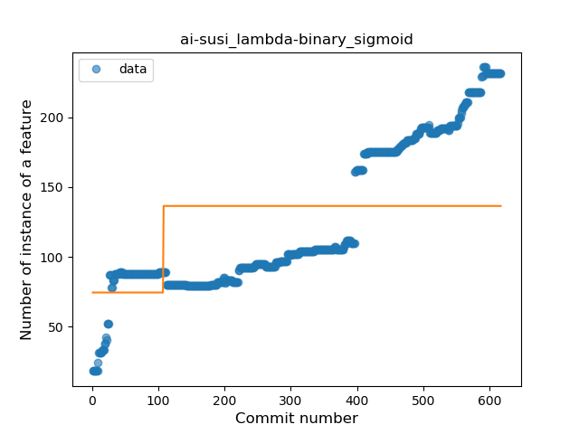
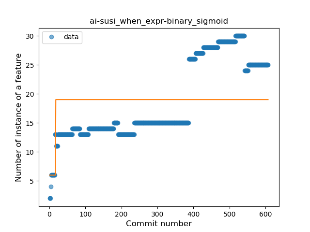
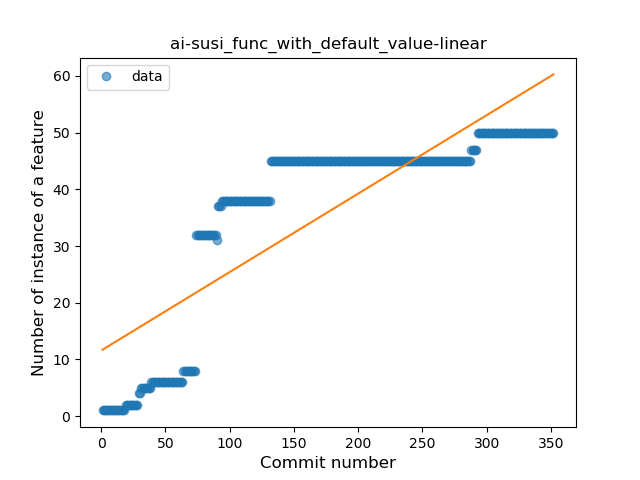
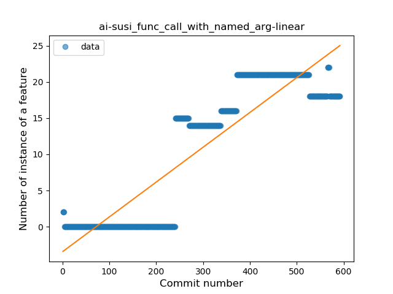

## ai-susi
----
#### Metrics provided by Detekt
* Number of lines of code 15419
* Number of Kotlin files: 233
* Cyclomatic complexity: 2227
* Cyclomatic complexity by thousands of lines: 279 

----
**15** features analyzed

*	<a href="#type_inference">Type Inference</a> 
*	<a href="#lambda">Lambda</a> 
*	<a href="#safe_call">Safe Call</a> 
*	<a href="#when_expr">When expression</a> 
*	<a href="#unsafe_call">Unsafe Call</a> 
*	<a href="#companion_object">Companion Object</a> 
*	<a href="#string_template">String Template</a> 
*	<a href="#func_with_default_value">Function with Default Value</a> 
*	<a href="#singleton">Singleton</a> 
*	<a href="#range_expr">Range Expression</a> 
*	<a href="#smart_cast">Smart Cast</a> 
*	<a href="#data_class">Data Class</a> 
*	<a href="#func_call_with_named_arg">Function call with Named Argument</a> 
*	<a href="#property_delegation">Property Delegation</a> 
*	<a href="#destructuring_declaration">Destructuring Declaration</a> 

### <a name="type_inference">Type Inference</a>
----
#### Functions
* **Sudden Rise - Exponential:** 
    * **R_Squared:** 0.9078489
* **Constant Rise - Linear:** 
    * **R_Squared:** 0.88307607
* **Sudden Rise Plateau - Logarithm:** 
    * **R_Squared:** 0.45977002
* **Plateau Sudden Rise - Binary Sigmoid:** 
    * **R_Squared:** 0.39147682

**Plots** :chart_with_upwards_trend:
-----

### <a name="lambda">Lambda</a>
----
#### Functions
* **Sudden Rise - Exponential:** 
    * **R_Squared:** 0.91908418
* **Constant Rise - Linear:** 
    * **R_Squared:** 0.85552368
* **Sudden Rise Plateau - Logarithm:** 
    * **R_Squared:** 0.46187175
* **Plateau Sudden Rise - Binary Sigmoid:** 
    * **R_Squared:** 0.18832465

**Plots** :chart_with_upwards_trend:
-----

### <a name="safe_call">Safe Call</a>
----
#### Functions
* **Constant Rise - Linear:** 
    * **R_Squared:** 0.93644215
* **Sudden Rise - Exponential:** 
    * **R_Squared:** 0.946323
* **Sudden Rise Plateau - Logarithm:** 
    * **R_Squared:** 0.46734274
* **Plateau Sudden Rise - Binary Sigmoid:** 
    * **R_Squared:** 0.39199947

**Plots** :chart_with_upwards_trend:
-----

### <a name="when_expr">When expression</a>
----
#### Functions
* **Constant Rise - Linear:** 
    * **R_Squared:** 0.73857349
* **Sudden Rise - Exponential:** 
    * **R_Squared:** 0.74816461
* **Sudden Rise Plateau - Logarithm:** 
    * **R_Squared:** 0.48359711
* **Plateau Sudden Rise - Binary Sigmoid:** 
    * **R_Squared:** 0.10044799

**Plots** :chart_with_upwards_trend:
-----

### <a name="unsafe_call">Unsafe Call</a>
----
#### Functions
* **Constant Decline - Linear:** 
    * **R_Squared:** 0.10963454
* **Sudden Rise Plateau - Logarithm:** 
    * **R_Squared:** -0.0
* **Plateau Sudden Rise - Binary Sigmoid:** 
    * **R_Squared:** 0.00497425

**Plots** :chart_with_upwards_trend:
-----

### <a name="companion_object">Companion Object</a>
----
#### Functions
* **Sudden Rise - Exponential:** 
    * **R_Squared:** 0.18591314
* **Constant Rise - Linear:** 
    * **R_Squared:** 0.00109134
* **Sudden Rise Plateau - Logarithm:** 
    * **R_Squared:** 0.00141178

**Plots** :chart_with_upwards_trend:
-----

### <a name="string_template">String Template</a>
----
#### Functions
* **Sudden Rise Plateau - Logarithm:** 
    * **R_Squared:** 0.7887712
* **Constant Rise - Linear:** 
    * **R_Squared:** 0.72837454

**Plots** :chart_with_upwards_trend:
-----

### <a name="func_with_default_value">Function with Default Value</a>
----
#### Functions
* **Constant Rise - Linear:** 
    * **R_Squared:** 0.70181429
* **Sudden Rise Plateau - Logarithm:** 
    * **R_Squared:** 0.59478556
* **Plateau Gradual Rise - Sigmoid:** 
    * **R_Squared:** 0.3805105

**Plots** :chart_with_upwards_trend:
-----

### <a name="singleton">Singleton</a>
----
#### Functions
* **Sudden Rise - Exponential:** 
    * **R_Squared:** 0.77393398
* **Constant Rise - Linear:** 
    * **R_Squared:** 0.72196692
* **Sudden Rise Plateau - Logarithm:** 
    * **R_Squared:** 0.28486727

**Plots** :chart_with_upwards_trend:
-----

### <a name="range_expr">Range Expression</a>
----
#### Functions
* **Constant Decline - Linear:** 
    * **R_Squared:** 0.06203122
* **Plateau Gradual Rise - Sigmoid:** 
    * **R_Squared:** 0.07157261
* **Sudden Rise Plateau - Logarithm:** 
    * **R_Squared:** -0.0

**Plots** :chart_with_upwards_trend:
-----

### <a name="smart_cast">Smart Cast</a>
----
#### Functions
* **Sudden Rise - Exponential:** 
    * **R_Squared:** 0.88306392
* **Constant Rise - Linear:** 
    * **R_Squared:** 0.82592702
* **Sudden Rise Plateau - Logarithm:** 
    * **R_Squared:** 0.23510026
* **Plateau Sudden Rise - Binary Sigmoid:** 
    * **R_Squared:** 0.01223569

**Plots** :chart_with_upwards_trend:
-----

### <a name="data_class">Data Class</a>
----
#### Functions
* **Constant Rise - Linear:** 
    * **R_Squared:** 0.69317979
* **Sudden Rise Plateau - Logarithm:** 
    * **R_Squared:** 0.62284216

**Plots** :chart_with_upwards_trend:
-----

### <a name="func_call_with_named_arg">Function call with Named Argument</a>
----
#### Functions
* **Plateau Gradual Rise - Sigmoid:** 
    * **R_Squared:** 0.9366953
* **Constant Rise - Linear:** 
    * **R_Squared:** 0.80238864
* **Sudden Rise Plateau - Logarithm:** 
    * **R_Squared:** 0.28953306

**Plots** :chart_with_upwards_trend:
-----

### <a name="property_delegation">Property Delegation</a>
----
#### Functions
* **Plateau Sudden Rise - Binary Sigmoid:** 
    * **R_Squared:** 0.92322987
* **Constant Rise - Linear:** 
    * **R_Squared:** 0.65691766
* **Sudden Rise Plateau - Logarithm:** 
    * **R_Squared:** 0.36148606

**Plots** :chart_with_upwards_trend:
-----

### <a name="destructuring_declaration">Destructuring Declaration</a>
----
#### Functions
* **Plateau Gradual Rise - Sigmoid:** 
    * **R_Squared:** 0.18628857
* **Constant Rise - Linear:** 
    * **R_Squared:** 0.03561361
* **Sudden Rise Plateau - Logarithm:** 
    * **R_Squared:** 0.0429987

**Plots** :chart_with_upwards_trend:
-----

