## albertolalanda-new-ultrasonic-fork-for-MyMusicQoE
----
#### Metrics provided by Detekt
* Number of lines of code 8057
* Number of Kotlin files: 187
* Cyclomatic complexity: 690
* Cyclomatic complexity by thousands of lines: 160 

----
**14** features analyzed

*	<a href="#type_inference">Type Inference</a> 
*	<a href="#lambda">Lambda</a> 
*	<a href="#safe_call">Safe Call</a> 
*	<a href="#when_expr">When expression</a> 
*	<a href="#companion_object">Companion Object</a> 
*	<a href="#unsafe_call">Unsafe Call</a> 
*	<a href="#string_template">String Template</a> 
*	<a href="#func_with_default_value">Function with Default Value</a> 
*	<a href="#range_expr">Range Expression</a> 
*	<a href="#func_call_with_named_arg">Function call with Named Argument</a> 
*	<a href="#data_class">Data Class</a> 
*	<a href="#extension_function">Extension Function</a> 
*	<a href="#property_delegation">Property Delegation</a> 
*	<a href="#overloaded_op">Overloaded Operator</a> 

### <a name="type_inference">Type Inference</a>
----
#### Functions
* **Constant Rise - Linear:** 
    * **R_Squared:** 0.91317748
* **Plateau Sudden Rise - Binary Sigmoid:** 
    * **R_Squared:** 0.70845026
* **Sudden Rise Plateau - Logarithm:** 
    * **R_Squared:** 0.57083448

**Plots** :chart_with_upwards_trend:
-----

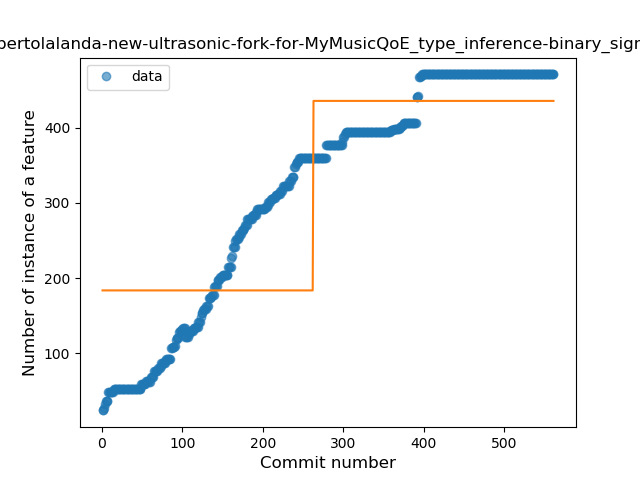
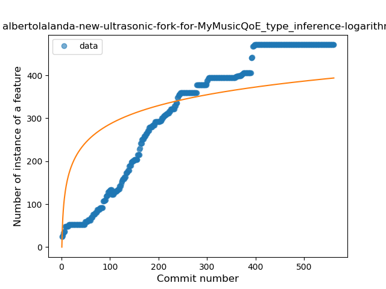
### <a name="lambda">Lambda</a>
----
#### Functions
* **Constant Rise - Linear:** 
    * **R_Squared:** 0.71668309
* **Sudden Rise Plateau - Logarithm:** 
    * **R_Squared:** 0.60225772
* **Plateau Sudden Rise - Binary Sigmoid:** 
    * **R_Squared:** 0.24607887

**Plots** :chart_with_upwards_trend:
-----

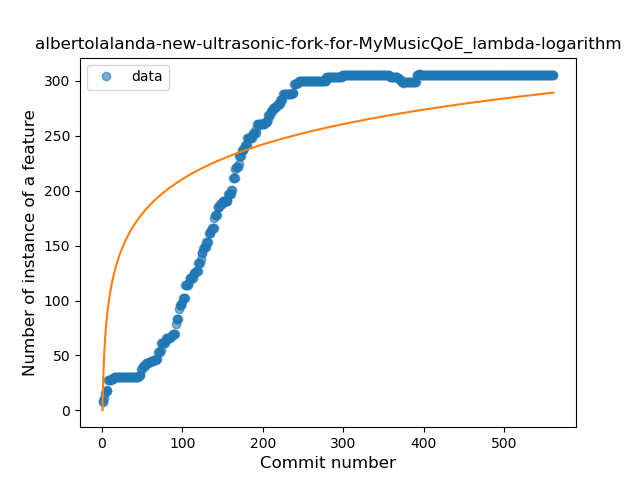
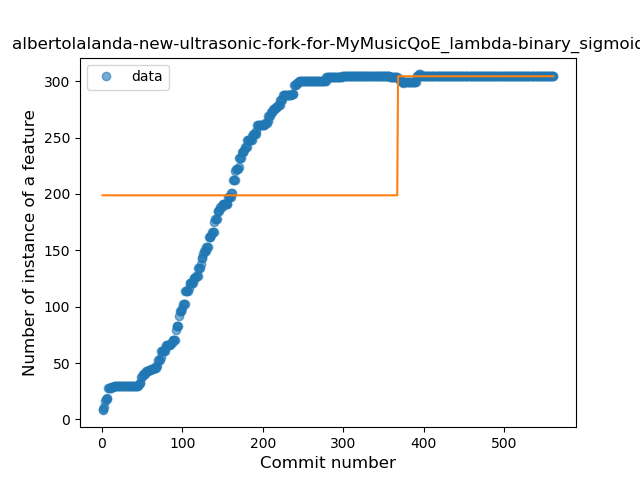
### <a name="safe_call">Safe Call</a>
----
#### Functions
* **Constant Rise - Linear:** 
    * **R_Squared:** 0.92539451
* **Sudden Rise Plateau - Logarithm:** 
    * **R_Squared:** 0.5365585

**Plots** :chart_with_upwards_trend:
-----

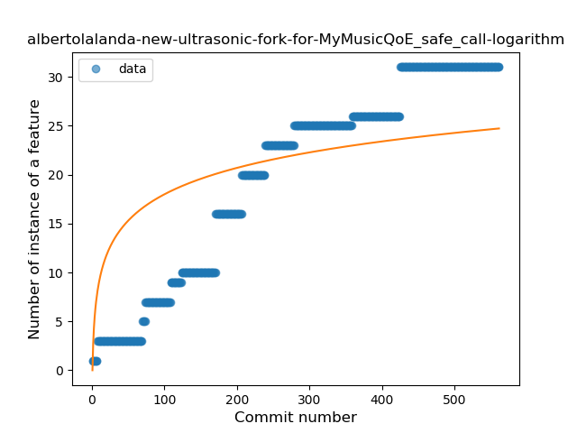
### <a name="when_expr">When expression</a>
----
#### Functions
* **Plateau Gradual Rise - Sigmoid:** 
    * **R_Squared:** 0.95786431
* **Constant Rise - Linear:** 
    * **R_Squared:** 0.84379767
* **Sudden Rise Plateau - Logarithm:** 
    * **R_Squared:** 0.41380319

**Plots** :chart_with_upwards_trend:
-----

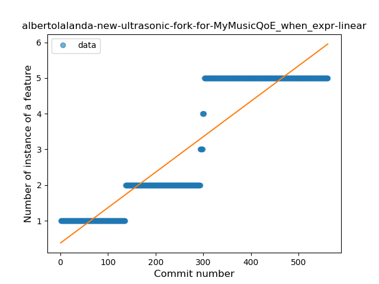
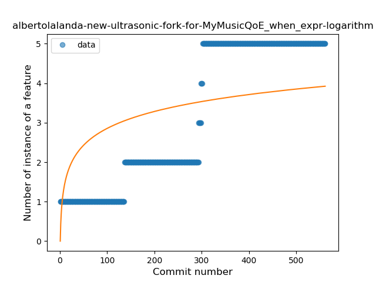
### <a name="companion_object">Companion Object</a>
----
#### Functions
* **Plateau Gradual Rise - Sigmoid:** 
    * **R_Squared:** 0.94749437
* **Sudden Rise - Exponential:** 
    * **R_Squared:** 0.64407686
* **Constant Rise - Linear:** 
    * **R_Squared:** 0.52463279
* **Sudden Rise Plateau - Logarithm:** 
    * **R_Squared:** 0.24500553

**Plots** :chart_with_upwards_trend:
-----

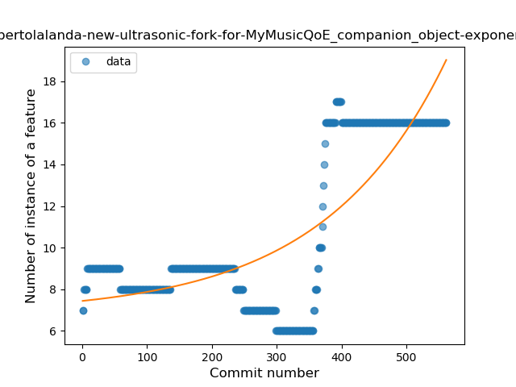
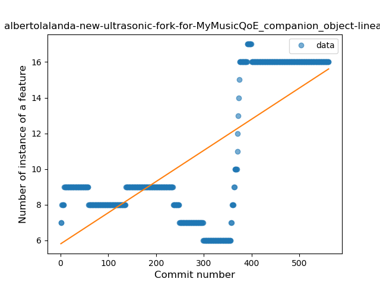
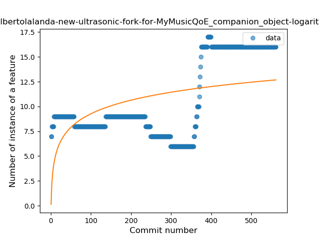
### <a name="unsafe_call">Unsafe Call</a>
----
#### Functions
* **Sudden Rise - Exponential:** 
    * **R_Squared:** 0.78914756
* **Constant Rise - Linear:** 
    * **R_Squared:** 0.60498141
* **Sudden Rise Plateau - Logarithm:** 
    * **R_Squared:** 0.15650424

**Plots** :chart_with_upwards_trend:
-----

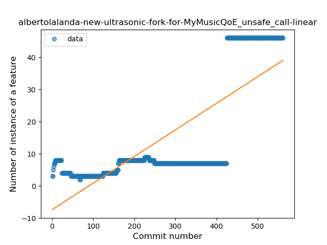

### <a name="string_template">String Template</a>
----
#### Functions
* **Plateau Sudden Rise - Binary Sigmoid:** 
    * **R_Squared:** 0.78827405
* **Constant Rise - Linear:** 
    * **R_Squared:** 0.71193482
* **Sudden Rise Plateau - Logarithm:** 
    * **R_Squared:** 0.59983849

**Plots** :chart_with_upwards_trend:
-----

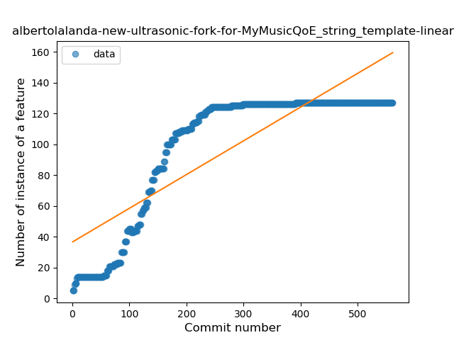
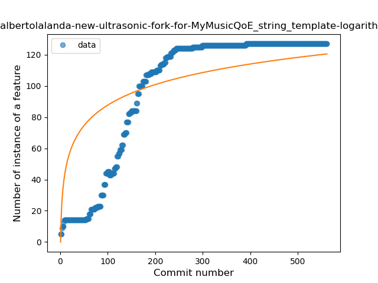
### <a name="func_with_default_value">Function with Default Value</a>
----
#### Functions
* **Constant Rise - Linear:** 
    * **R_Squared:** 0.83550355
* **Sudden Rise Plateau - Logarithm:** 
    * **R_Squared:** 0.63210183
* **Plateau Sudden Rise - Binary Sigmoid:** 
    * **R_Squared:** 0.44721422

**Plots** :chart_with_upwards_trend:
-----

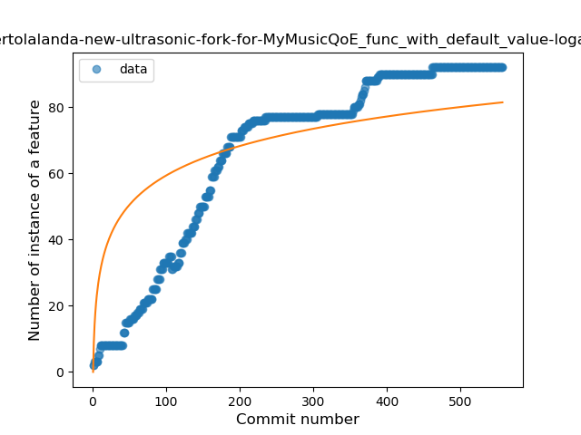

### <a name="range_expr">Range Expression</a>
----
#### Functions
* **Plateau Sudden Rise - Binary Sigmoid:** 
    * **R_Squared:** 1.0
* **Sudden Rise Plateau - Logarithm:** 
    * **R_Squared:** 0.63556198
* **Constant Rise - Linear:** 
    * **R_Squared:** 0.60451591

**Plots** :chart_with_upwards_trend:
-----

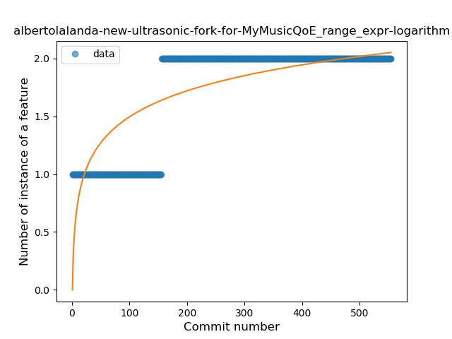
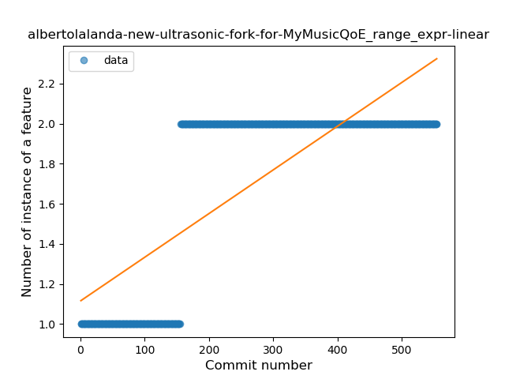
### <a name="func_call_with_named_arg">Function call with Named Argument</a>
----
#### Functions
* **Constant Rise - Linear:** 
    * **R_Squared:** 0.67935942
* **Sudden Rise Plateau - Logarithm:** 
    * **R_Squared:** 0.59115187
* **Plateau Sudden Rise - Binary Sigmoid:** 
    * **R_Squared:** 0.19785259

**Plots** :chart_with_upwards_trend:
-----

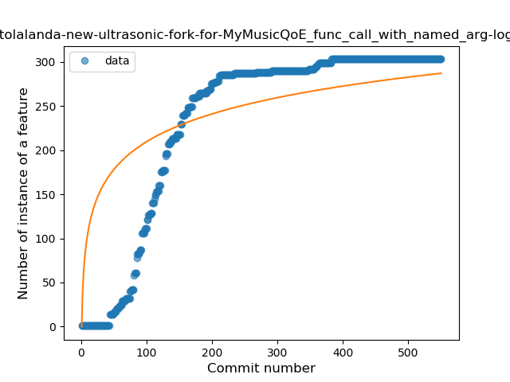
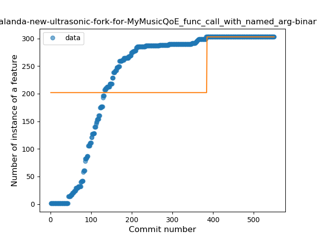
### <a name="data_class">Data Class</a>
----
#### Functions
* **Constant Rise - Linear:** 
    * **R_Squared:** 0.93090707
* **Sudden Rise - Exponential:** 
    * **R_Squared:** 0.93109971
* **Sudden Rise Plateau - Logarithm:** 
    * **R_Squared:** 0.48586033
* **Plateau Sudden Rise - Binary Sigmoid:** 
    * **R_Squared:** 0.16750835

**Plots** :chart_with_upwards_trend:
-----

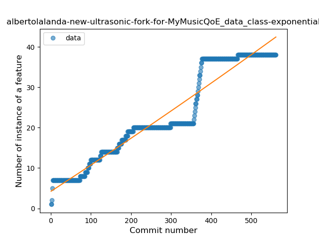

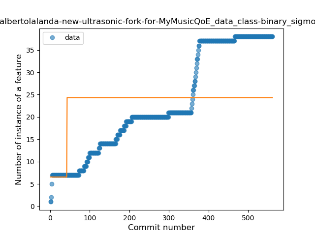
### <a name="extension_function">Extension Function</a>
----
#### Functions
* **Constant Rise - Linear:** 
    * **R_Squared:** 0.7449885
* **Sudden Rise Plateau - Logarithm:** 
    * **R_Squared:** 0.68461633

**Plots** :chart_with_upwards_trend:
-----

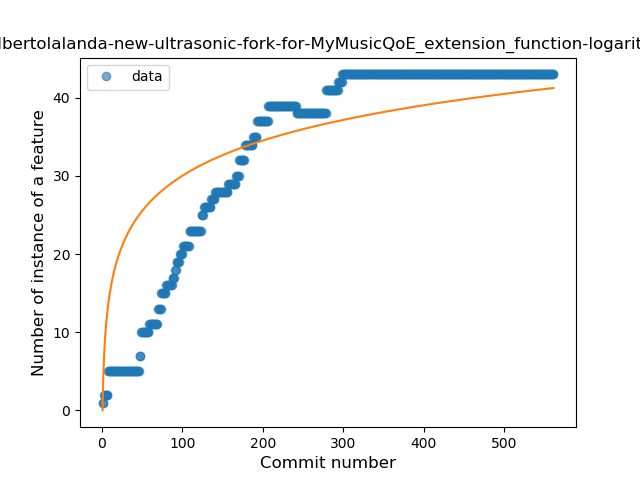
### <a name="property_delegation">Property Delegation</a>
----
#### Functions
* **Sudden Rise Plateau - Logarithm:** 
    * **R_Squared:** 0.75911219
* **Constant Rise - Linear:** 
    * **R_Squared:** 0.73602802

**Plots** :chart_with_upwards_trend:
-----

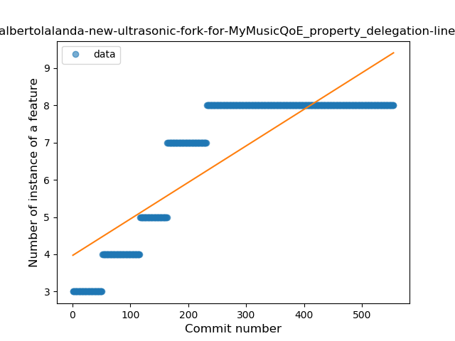
### <a name="overloaded_op">Overloaded Operator</a>
----
#### Functions
* **Plateau Sudden Rise - Binary Sigmoid:** 
    * **R_Squared:** 1.0
* **Constant Rise - Linear:** 
    * **R_Squared:** 0.74740898
* **Sudden Rise - Exponential:** 
    * **R_Squared:** 0.75029249
* **Sudden Rise Plateau - Logarithm:** 
    * **R_Squared:** 0.30979987

**Plots** :chart_with_upwards_trend:
-----

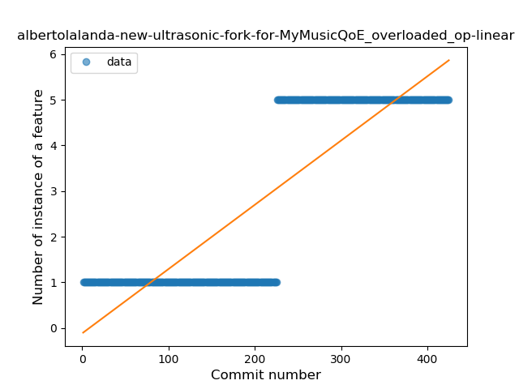
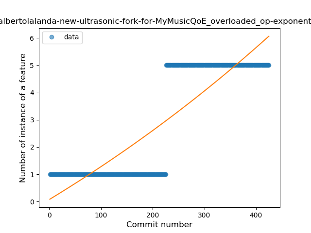
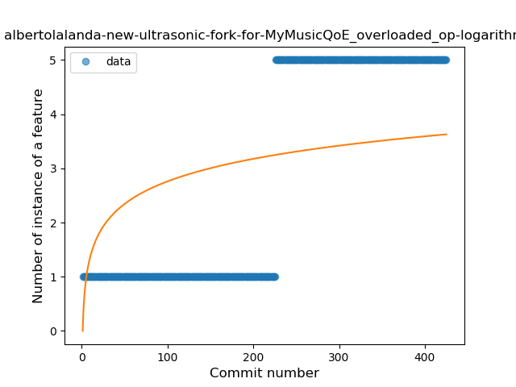
