## alessio-b-zak-myRivers
----
#### Metrics provided by Detekt
* Number of lines of code 4089
* Number of Kotlin files: 42
* Cyclomatic complexity: 316
* Cyclomatic complexity by thousands of lines: 184 

----
**11** features analyzed

*	<a href="#type_inference">Type Inference</a> 
*	<a href="#lambda">Lambda</a> 
*	<a href="#when_expr">When expression</a> 
*	<a href="#companion_object">Companion Object</a> 
*	<a href="#unsafe_call">Unsafe Call</a> 
*	<a href="#string_template">String Template</a> 
*	<a href="#func_with_default_value">Function with Default Value</a> 
*	<a href="#smart_cast">Smart Cast</a> 
*	<a href="#range_expr">Range Expression</a> 
*	<a href="#data_class">Data Class</a> 
*	<a href="#extension_function">Extension Function</a> 

### <a name="type_inference">Type Inference</a>
----
#### Functions
* **Constant Rise - Linear:** 
    * **R_Squared:** 0.94438979
* **Sudden Rise Plateau - Logarithm:** 
    * **R_Squared:** 0.63412875

**Plots** :chart_with_upwards_trend:
-----

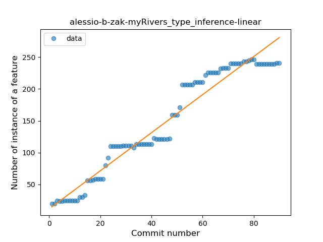
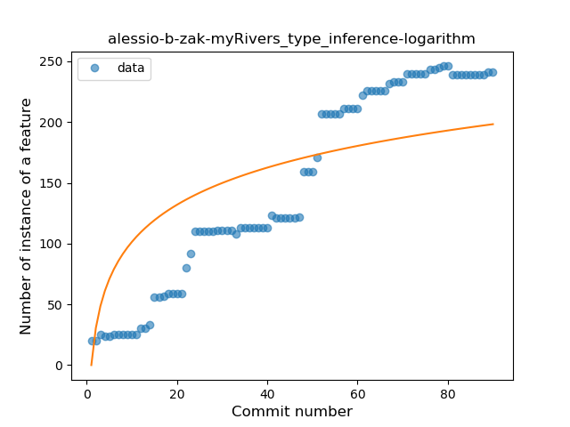
### <a name="lambda">Lambda</a>
----
#### Functions
* **Plateau Gradual Rise - Sigmoid:** 
    * **R_Squared:** 0.98475174
* **Constant Rise - Linear:** 
    * **R_Squared:** 0.95004259
* **Sudden Rise Plateau - Logarithm:** 
    * **R_Squared:** 0.64198793

**Plots** :chart_with_upwards_trend:
-----

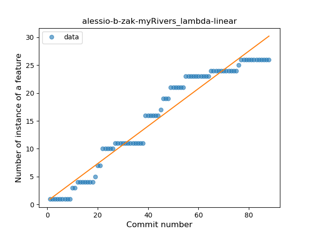
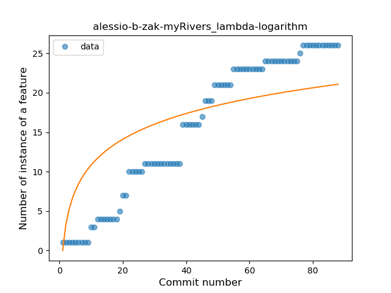
### <a name="when_expr">When expression</a>
----
#### Functions
* **Plateau Gradual Rise - Sigmoid:** 
    * **R_Squared:** 0.97819253
* **Instability - Polinomial 3:** )
    * **R_Squared:** 0.94847401
* **Constant Rise - Linear:** 
    * **R_Squared:** 0.87901698
* **Sudden Rise Plateau - Logarithm:** 
    * **R_Squared:** 0.53679178

**Plots** :chart_with_upwards_trend:
-----

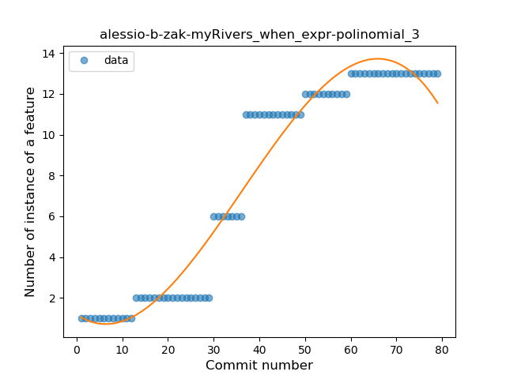
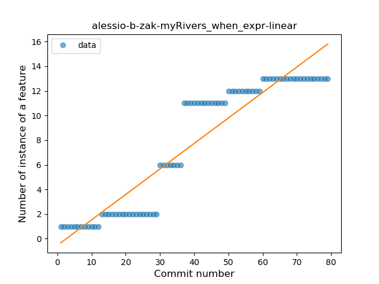
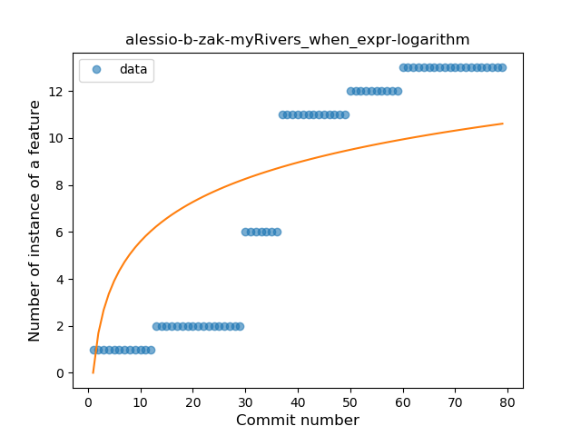
### <a name="companion_object">Companion Object</a>
----
#### Functions
* **Plateau Gradual Rise - Sigmoid:** 
    * **R_Squared:** 0.89973746
* **Sudden Rise Plateau - Logarithm:** 
    * **R_Squared:** 0.59126668
* **Constant Rise - Linear:** 
    * **R_Squared:** 0.33778035

**Plots** :chart_with_upwards_trend:
-----

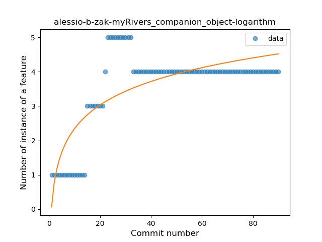
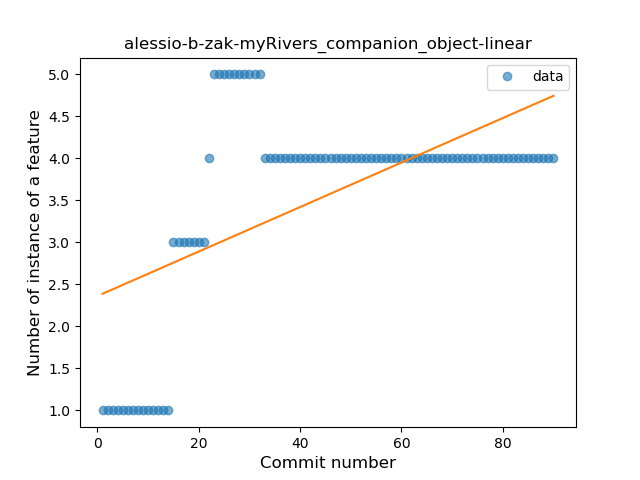
### <a name="unsafe_call">Unsafe Call</a>
----
#### Functions
* **Sudden Rise Plateau - Logarithm:** 
    * **R_Squared:** 0.64402947
* **Constant Rise - Linear:** 
    * **R_Squared:** 0.54713062
* **Plateau Sudden Rise - Binary Sigmoid:** 
    * **R_Squared:** 0.46858275

**Plots** :chart_with_upwards_trend:
-----

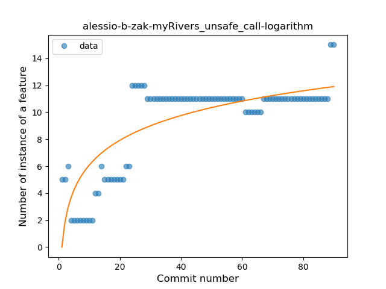
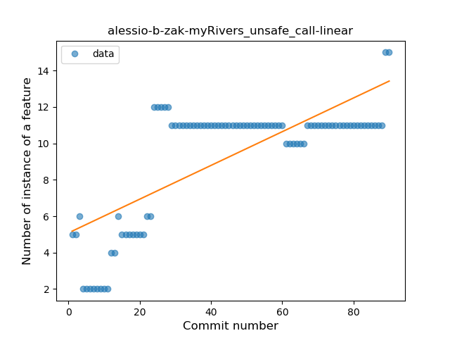
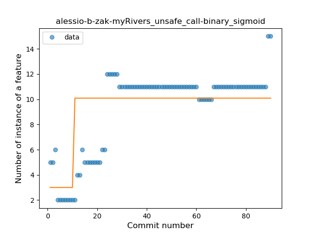
### <a name="string_template">String Template</a>
----
#### Functions
* **Plateau Gradual Rise - Sigmoid:** 
    * **R_Squared:** 0.93444449
* **Sudden Rise - Exponential:** 
    * **R_Squared:** 0.83341606
* **Constant Rise - Linear:** 
    * **R_Squared:** 0.61399276
* **Sudden Rise Plateau - Logarithm:** 
    * **R_Squared:** 0.26104632

**Plots** :chart_with_upwards_trend:
-----

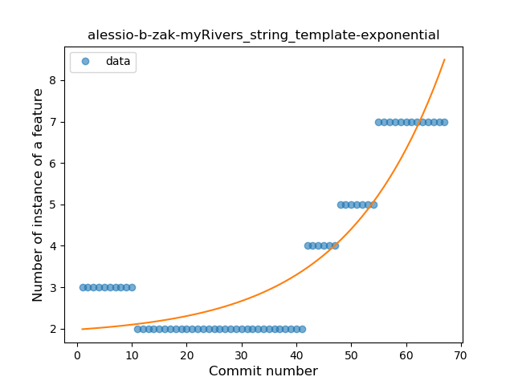
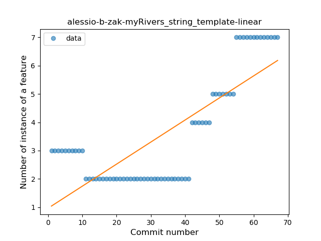
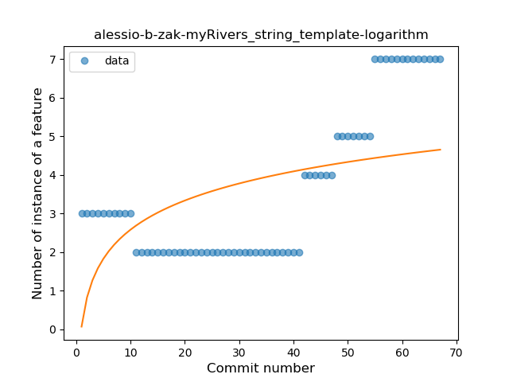
### <a name="func_with_default_value">Function with Default Value</a>
----
#### Functions
* **Plateau Gradual Rise - Sigmoid:** 
    * **R_Squared:** 0.79852873
* **Sudden Rise - Exponential:** 
    * **R_Squared:** 0.76813381
* **Constant Rise - Linear:** 
    * **R_Squared:** 0.74088481
* **Sudden Rise Plateau - Logarithm:** 
    * **R_Squared:** 0.56515908

**Plots** :chart_with_upwards_trend:
-----

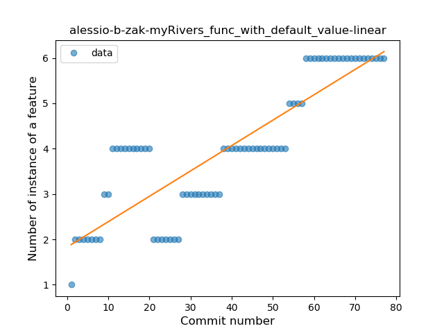
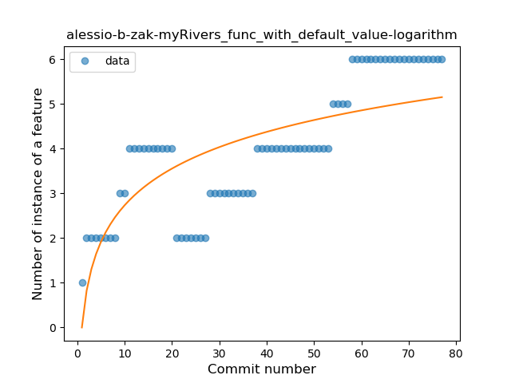
### <a name="smart_cast">Smart Cast</a>
----
#### Functions
* **Sudden Decline - Exponential:** 
    * **R_Squared:** 0.82057835
* **Constant Decline - Linear:** 
    * **R_Squared:** 0.11376623
* **Sudden Rise Plateau - Logarithm:** 
    * **R_Squared:** -0.0

**Plots** :chart_with_upwards_trend:
-----

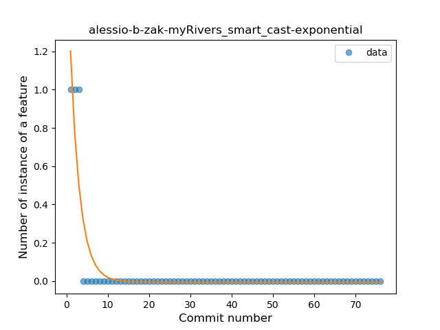
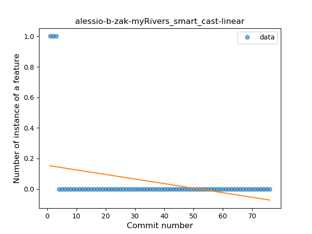

### <a name="range_expr">Range Expression</a>
----
#### Functions
* **Plateau Sudden Decline - Binary Sigmoid:** 
    * **R_Squared:** 1.0
* **Sudden Decline - Exponential:** 
    * **R_Squared:** 0.75703343
* **Constant Decline - Linear:** 
    * **R_Squared:** 0.68749228
* **Sudden Rise Plateau - Logarithm:** 
    * **R_Squared:** -0.0

**Plots** :chart_with_upwards_trend:
-----

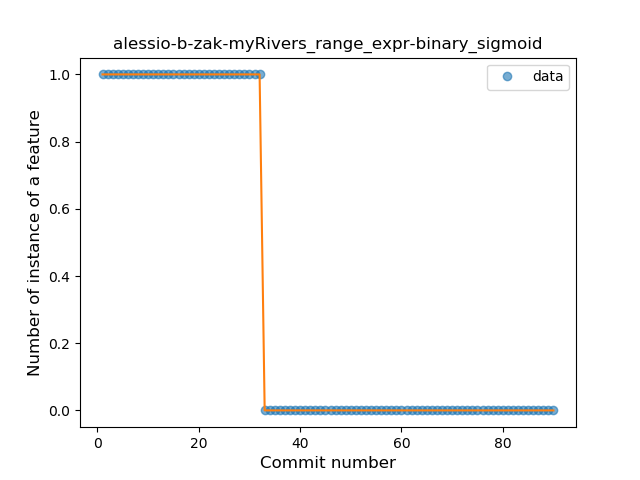
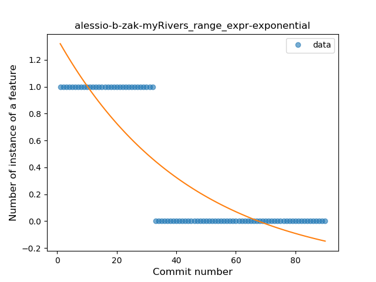
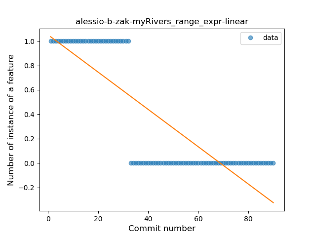
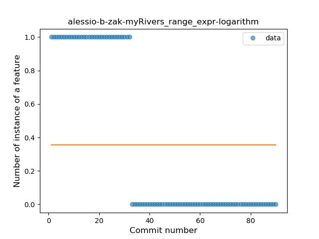
### <a name="data_class">Data Class</a>
----
#### Functions
* **Plateau Gradual Rise - Sigmoid:** 
    * **R_Squared:** 0.94776905
* **Sudden Rise Plateau - Logarithm:** 
    * **R_Squared:** 0.79127716
* **Constant Rise - Linear:** 
    * **R_Squared:** 0.70988201

**Plots** :chart_with_upwards_trend:
-----

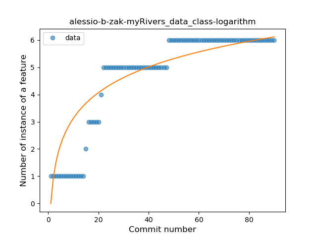
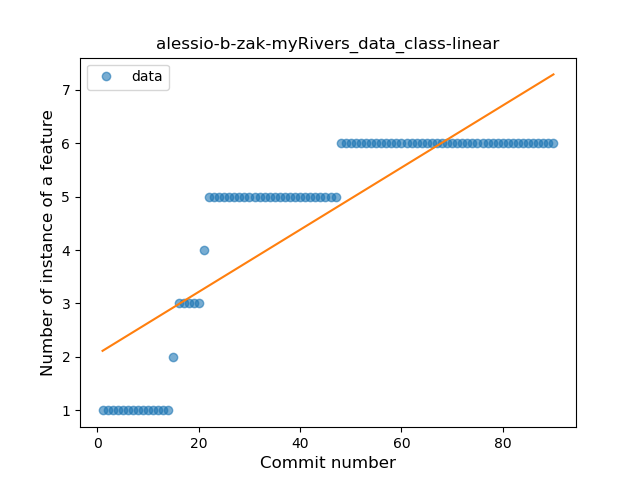
### <a name="extension_function">Extension Function</a>
----
#### Functions
* **Sudden Decline - Exponential:** 
    * **R_Squared:** 0.52764407
* **Constant Decline - Linear:** 
    * **R_Squared:** 0.46789764
* **Sudden Rise Plateau - Logarithm:** 
    * **R_Squared:** -0.0

**Plots** :chart_with_upwards_trend:
-----

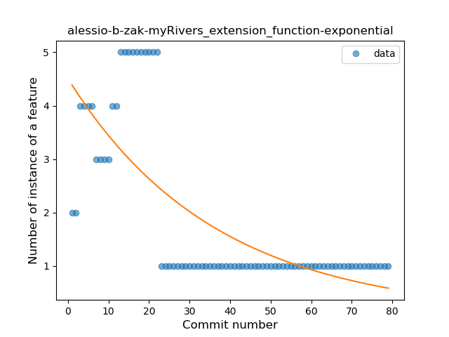
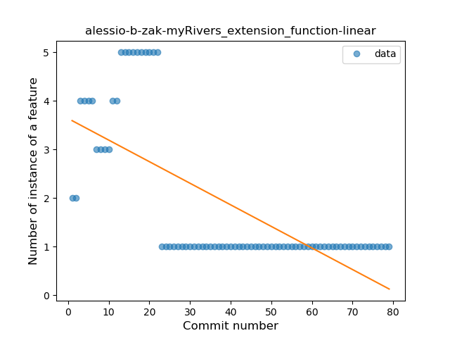
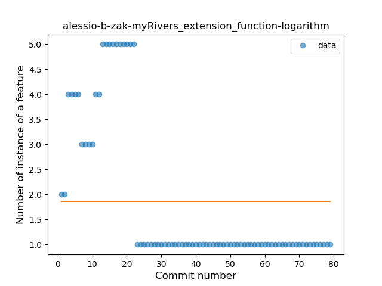
