## aminecmi-ReaderforSelfoss
----
#### Metrics provided by Detekt
* Number of lines of code 6189
* Number of Kotlin files: 53
* Cyclomatic complexity: 773
* Cyclomatic complexity by thousands of lines: 207 

----
**13** features analyzed

*	<a href="#type_inference">Type Inference</a> 
*	<a href="#lambda">Lambda</a> 
*	<a href="#safe_call">Safe Call</a> 
*	<a href="#when_expr">When expression</a> 
*	<a href="#companion_object">Companion Object</a> 
*	<a href="#unsafe_call">Unsafe Call</a> 
*	<a href="#string_template">String Template</a> 
*	<a href="#func_with_default_value">Function with Default Value</a> 
*	<a href="#smart_cast">Smart Cast</a> 
*	<a href="#func_call_with_named_arg">Function call with Named Argument</a> 
*	<a href="#data_class">Data Class</a> 
*	<a href="#extension_function">Extension Function</a> 
*	<a href="#destructuring_declaration">Destructuring Declaration</a> 

### <a name="type_inference">Type Inference</a>
----
#### Functions
* **Sudden Rise - Exponential:** 
    * **R_Squared:** 0.76735776
* **Constant Rise - Linear:** 
    * **R_Squared:** 0.71570138
* **Sudden Rise Plateau - Logarithm:** 
    * **R_Squared:** 0.44628301
* **Plateau Sudden Rise - Binary Sigmoid:** 
    * **R_Squared:** 0.31173463

**Plots** :chart_with_upwards_trend:
-----

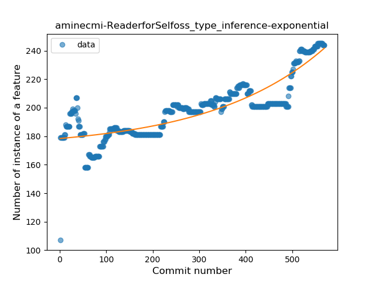
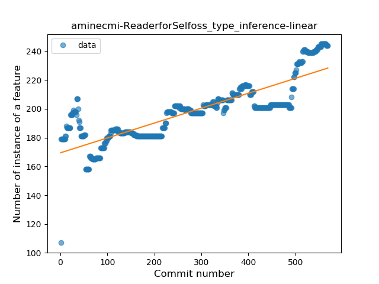
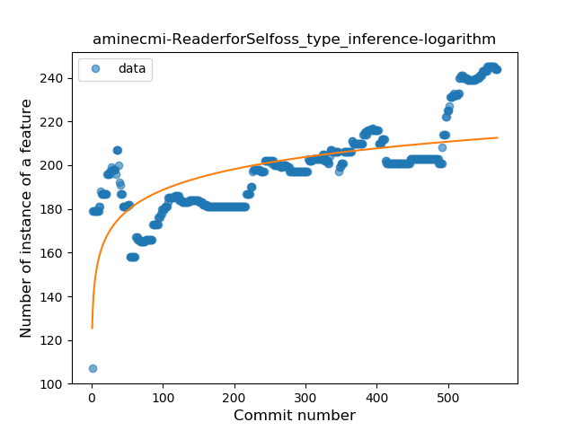

### <a name="lambda">Lambda</a>
----
#### Functions
* **Sudden Rise - Exponential:** 
    * **R_Squared:** 0.95597166
* **Constant Rise - Linear:** 
    * **R_Squared:** 0.83128888
* **Sudden Rise Plateau - Logarithm:** 
    * **R_Squared:** 0.4909541
* **Plateau Sudden Rise - Binary Sigmoid:** 
    * **R_Squared:** 0.06800347

**Plots** :chart_with_upwards_trend:
-----

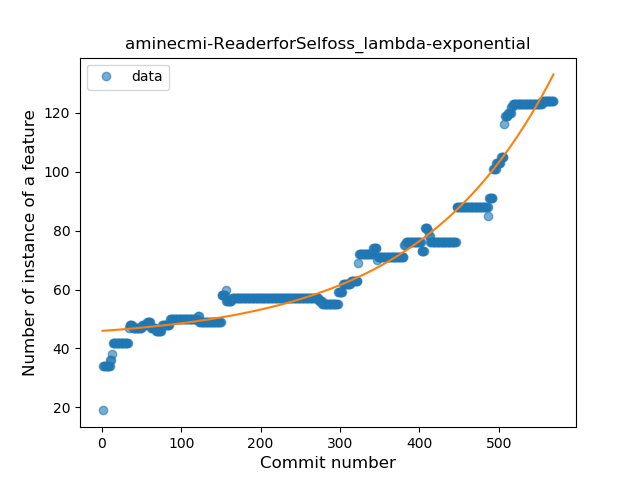
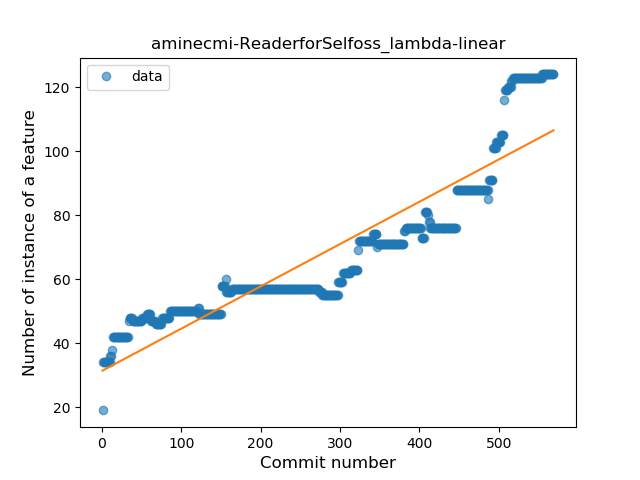
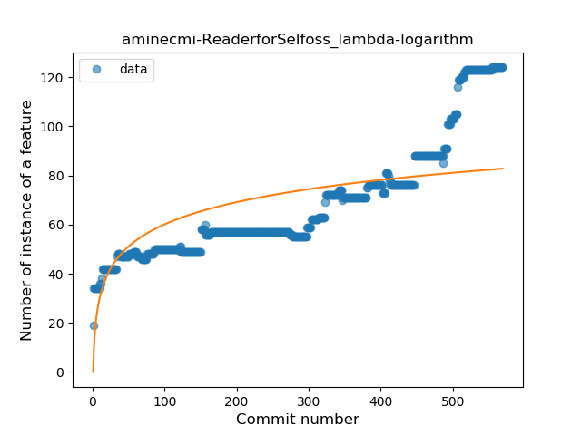
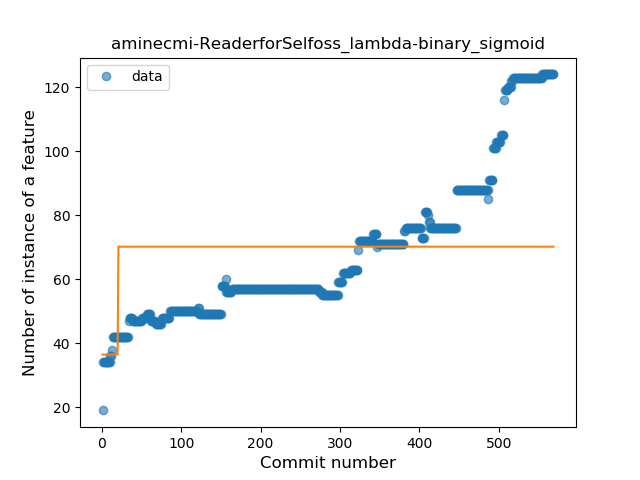
### <a name="safe_call">Safe Call</a>
----
#### Functions
* **Constant Rise - Linear:** 
    * **R_Squared:** 0.72259655
* **Sudden Rise Plateau - Logarithm:** 
    * **R_Squared:** 0.72722793
* **Plateau Gradual Decline - Sigmoid:** 
    * **R_Squared:** 0.0

**Plots** :chart_with_upwards_trend:
-----

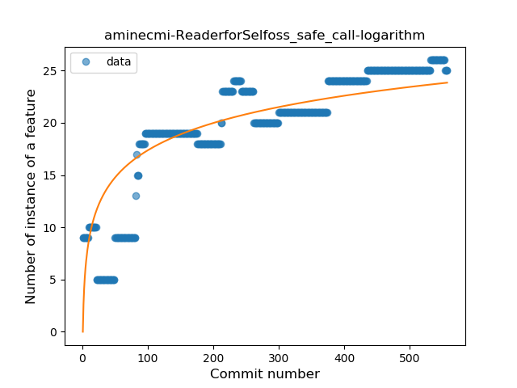
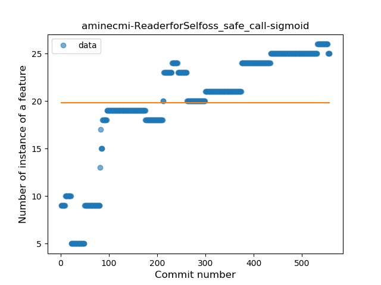
### <a name="when_expr">When expression</a>
----
#### Functions
* **Constant Rise - Linear:** 
    * **R_Squared:** 0.81684383
* **Sudden Rise Plateau - Logarithm:** 
    * **R_Squared:** 0.63970833
* **Plateau Gradual Rise - Sigmoid:** 
    * **R_Squared:** -0.0

**Plots** :chart_with_upwards_trend:
-----

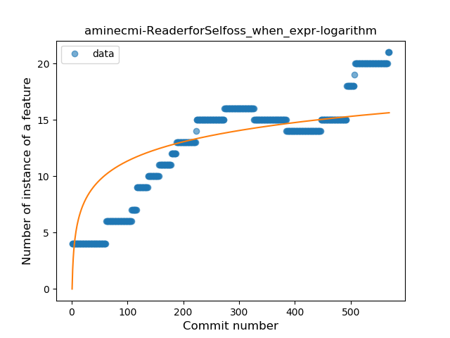
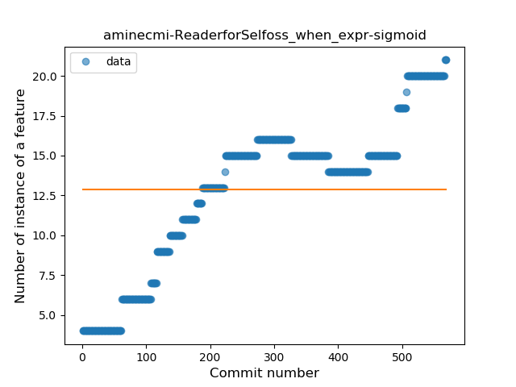
### <a name="companion_object">Companion Object</a>
----
#### Functions
* **Plateau Gradual Rise - Sigmoid:** 
    * **R_Squared:** 0.96278485
* **Constant Rise - Linear:** 
    * **R_Squared:** 0.808455
* **Sudden Rise Plateau - Logarithm:** 
    * **R_Squared:** 0.56932929

**Plots** :chart_with_upwards_trend:
-----

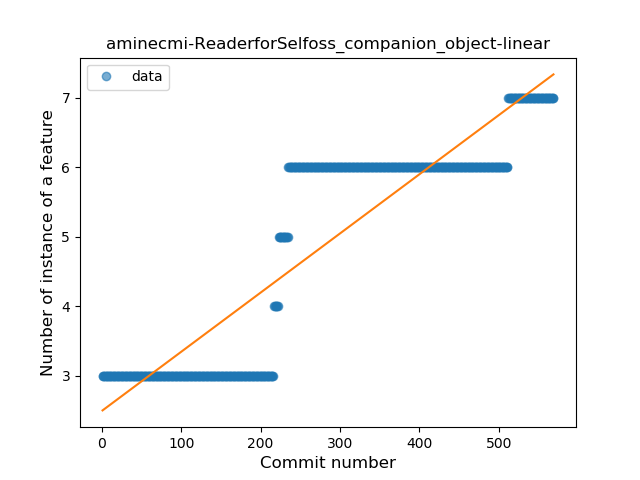
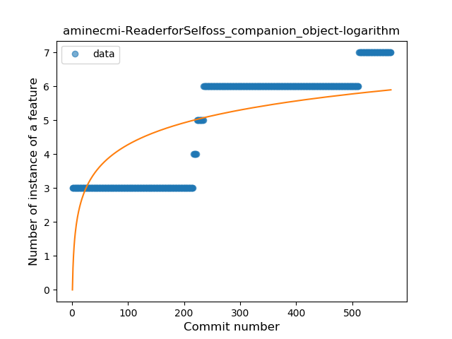
### <a name="unsafe_call">Unsafe Call</a>
----
#### Functions
* **Plateau Sudden Decline - Binary Sigmoid:** 
    * **R_Squared:** 0.12052611
* **Sudden Rise - Exponential:** 
    * **R_Squared:** 0.07581321
* **Constant Rise - Linear:** 
    * **R_Squared:** 0.00404688
* **Sudden Rise Plateau - Logarithm:** 
    * **R_Squared:** 0.0

**Plots** :chart_with_upwards_trend:
-----

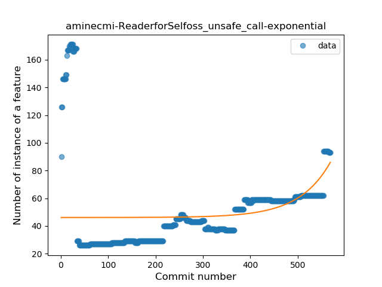
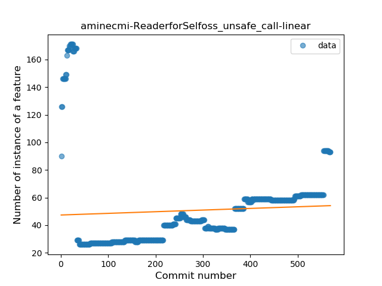
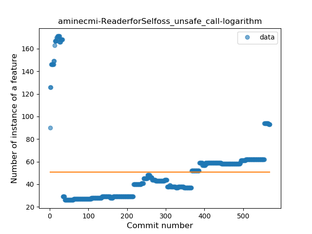
### <a name="string_template">String Template</a>
----
#### Functions
* **Constant Rise - Linear:** 
    * **R_Squared:** 0.83053231
* **Sudden Rise Plateau - Logarithm:** 
    * **R_Squared:** 0.58690336
* **Plateau Sudden Rise - Binary Sigmoid:** 
    * **R_Squared:** 0.19729768

**Plots** :chart_with_upwards_trend:
-----

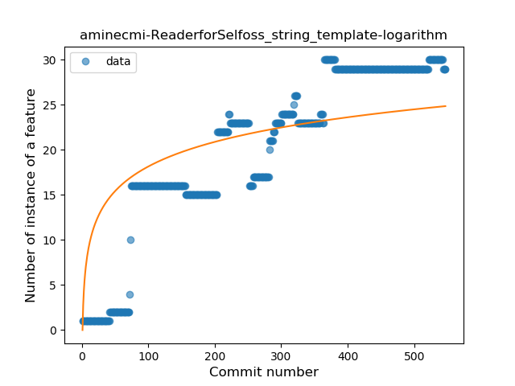
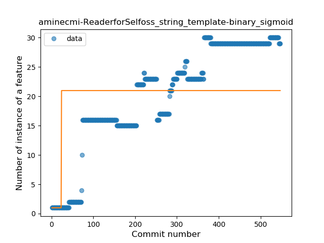
### <a name="func_with_default_value">Function with Default Value</a>
----
#### Functions
* **Plateau Gradual Rise - Sigmoid:** 
    * **R_Squared:** 0.90706391
* **Sudden Rise Plateau - Logarithm:** 
    * **R_Squared:** 0.56855112
* **Constant Rise - Linear:** 
    * **R_Squared:** 0.53515583

**Plots** :chart_with_upwards_trend:
-----

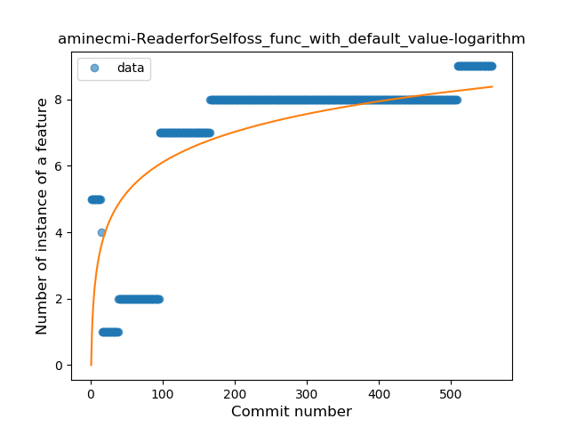
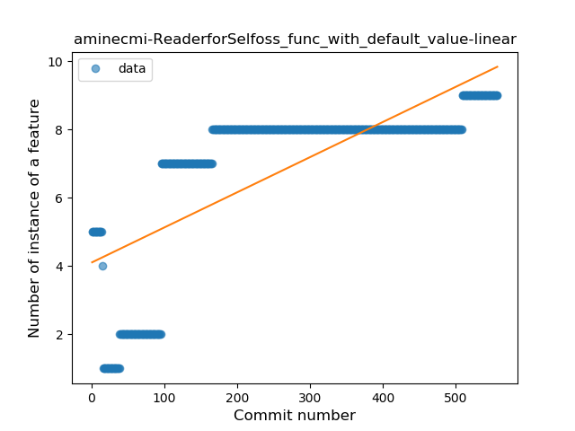
### <a name="smart_cast">Smart Cast</a>
----
#### Functions
* **Plateau Gradual Rise - Sigmoid:** 
    * **R_Squared:** 0.94685411
* **Sudden Rise Plateau - Logarithm:** 
    * **R_Squared:** 0.60204383
* **Constant Rise - Linear:** 
    * **R_Squared:** 0.43397004

**Plots** :chart_with_upwards_trend:
-----

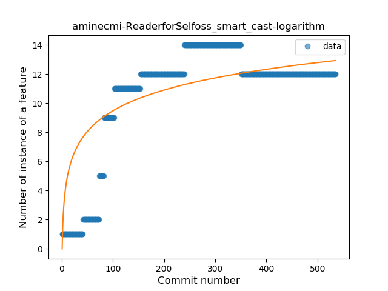
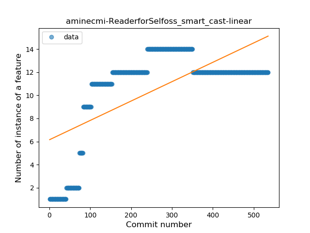
### <a name="func_call_with_named_arg">Function call with Named Argument</a>
----
#### Functions
* **Sudden Rise Plateau - Logarithm:** 
    * **R_Squared:** 0.86626159
* **Constant Rise - Linear:** 
    * **R_Squared:** 0.57987564

**Plots** :chart_with_upwards_trend:
-----

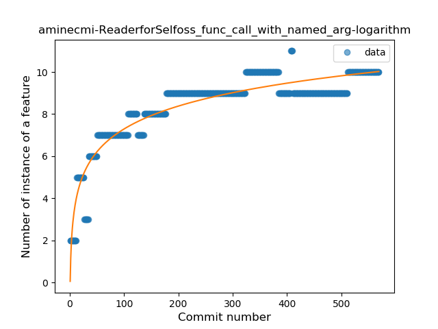
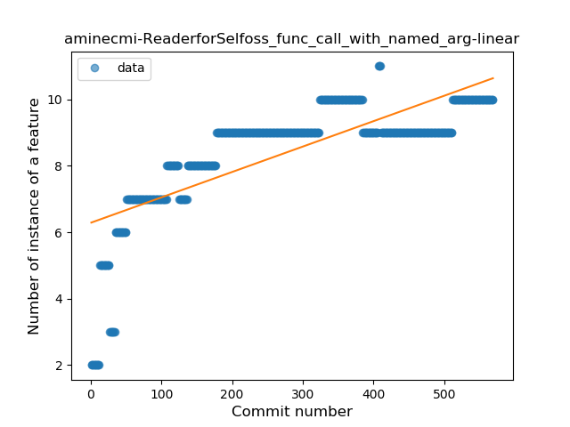
### <a name="data_class">Data Class</a>
----
#### Functions
* **Plateau Gradual Rise - Sigmoid:** 
    * **R_Squared:** 0.93270062
* **Sudden Rise - Exponential:** 
    * **R_Squared:** 0.89133136
* **Constant Rise - Linear:** 
    * **R_Squared:** 0.63768856
* **Sudden Rise Plateau - Logarithm:** 
    * **R_Squared:** 0.32327061

**Plots** :chart_with_upwards_trend:
-----

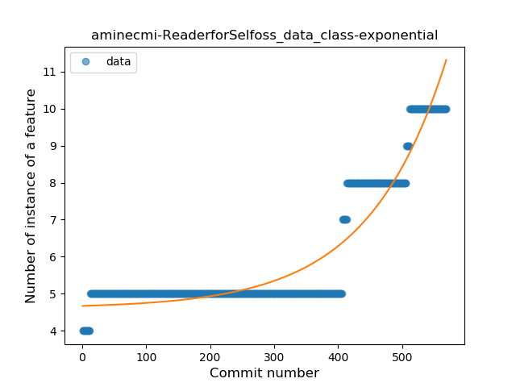
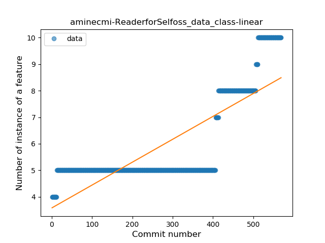
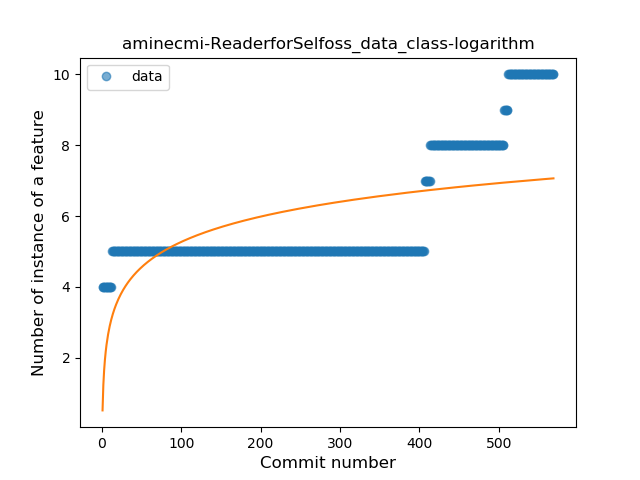
### <a name="extension_function">Extension Function</a>
----
#### Functions
* **Sudden Rise - Exponential:** 
    * **R_Squared:** 0.91372087
* **Constant Rise - Linear:** 
    * **R_Squared:** 0.88143412
* **Sudden Rise Plateau - Logarithm:** 
    * **R_Squared:** 0.66789032
* **Plateau Sudden Rise - Binary Sigmoid:** 
    * **R_Squared:** 0.22237063

**Plots** :chart_with_upwards_trend:
-----

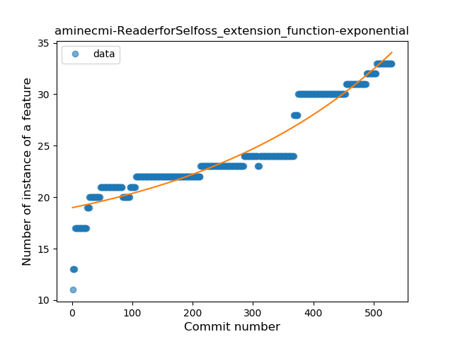
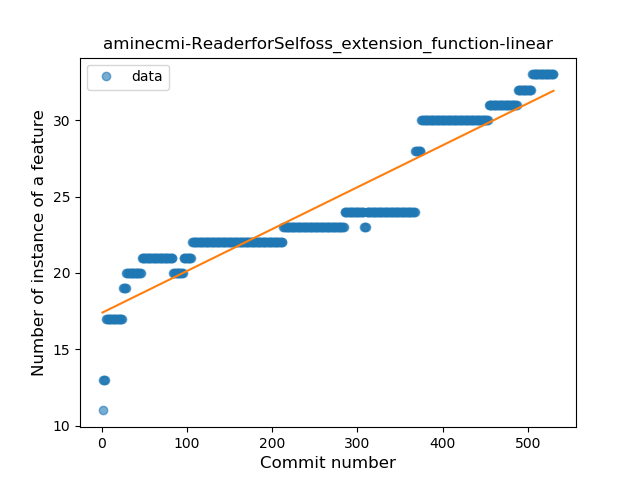
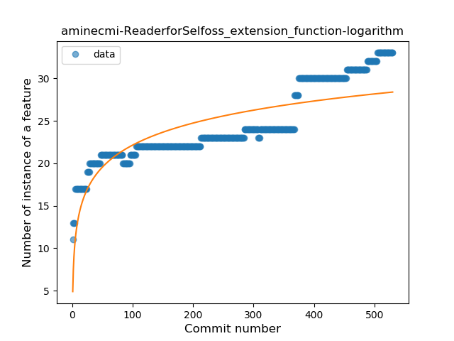
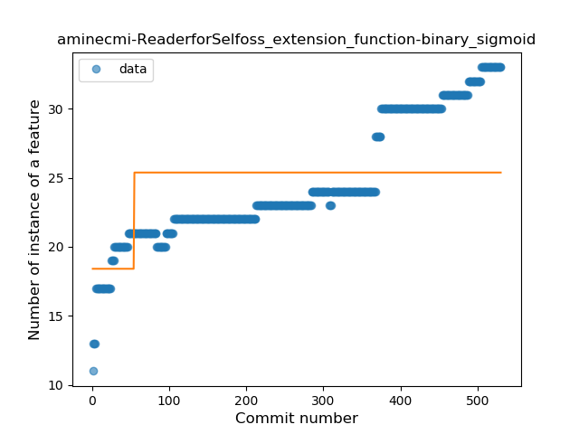
### <a name="destructuring_declaration">Destructuring Declaration</a>
----
#### Functions
* **Plateau Sudden Rise - Binary Sigmoid:** 
    * **R_Squared:** 0.10363385
* **Sudden Rise Plateau - Logarithm:** 
    * **R_Squared:** 0.01896926
* **Constant Rise - Linear:** 
    * **R_Squared:** 2.755e-05
* **Sudden Rise - Exponential:** 
    * **R_Squared:** 2.482e-05

**Plots** :chart_with_upwards_trend:
-----

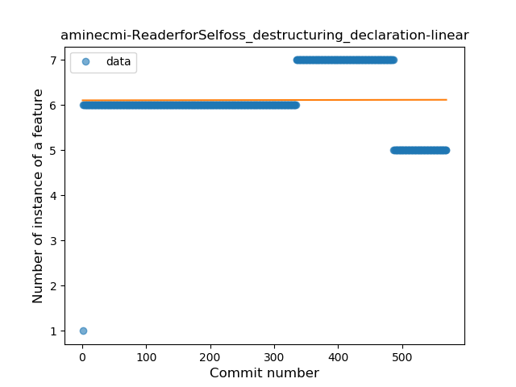
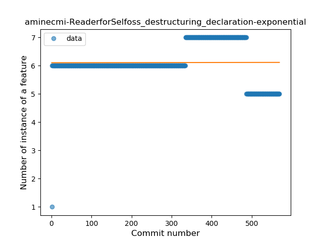
