## anthonycr-Lightning-Browser
----
#### Metrics provided by Detekt
* Number of lines of code 14681
* Number of Kotlin files: 166
* Cyclomatic complexity: 1925
* Cyclomatic complexity by thousands of lines: 275 

----
**17** features analyzed

*	<a href="#type_inference">Type Inference</a> 
*	<a href="#lambda">Lambda</a> 
*	<a href="#safe_call">Safe Call</a> 
*	<a href="#when_expr">When expression</a> 
*	<a href="#companion_object">Companion Object</a> 
*	<a href="#unsafe_call">Unsafe Call</a> 
*	<a href="#string_template">String Template</a> 
*	<a href="#func_with_default_value">Function with Default Value</a> 
*	<a href="#singleton">Singleton</a> 
*	<a href="#smart_cast">Smart Cast</a> 
*	<a href="#range_expr">Range Expression</a> 
*	<a href="#func_call_with_named_arg">Function call with Named Argument</a> 
*	<a href="#data_class">Data Class</a> 
*	<a href="#extension_function">Extension Function</a> 
*	<a href="#property_delegation">Property Delegation</a> 
*	<a href="#destructuring_declaration">Destructuring Declaration</a> 
*	<a href="#inline_func">Inline Function</a> 

### <a name="type_inference">Type Inference</a>
----
#### Functions
* **Constant Rise - Linear:** 
    * **R_Squared:** 0.69670272
* **Sudden Rise Plateau - Logarithm:** 
    * **R_Squared:** 0.64640245
* **Plateau Sudden Rise - Binary Sigmoid:** 
    * **R_Squared:** 0.32490114

**Plots** :chart_with_upwards_trend:
-----

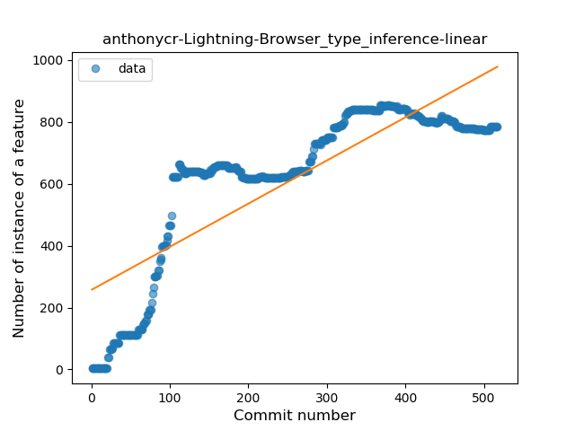
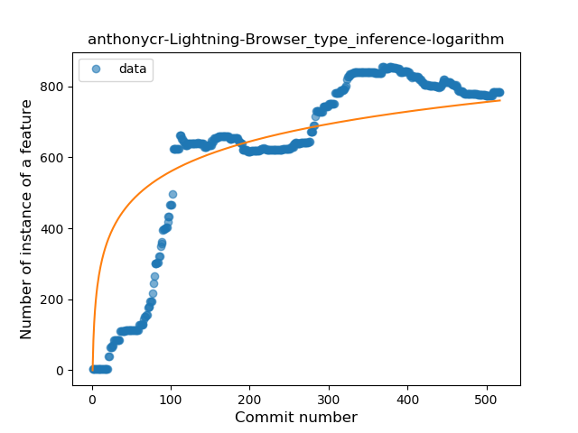
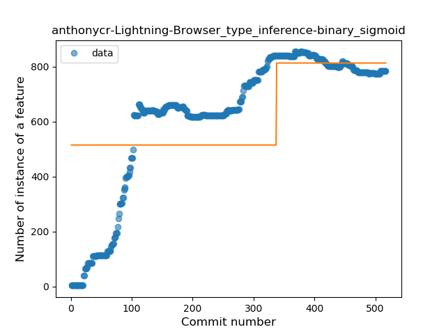
### <a name="lambda">Lambda</a>
----
#### Functions
* **Constant Rise - Linear:** 
    * **R_Squared:** 0.94284707
* **Plateau Sudden Rise - Binary Sigmoid:** 
    * **R_Squared:** 0.69251194
* **Sudden Rise Plateau - Logarithm:** 
    * **R_Squared:** 0.50872693

**Plots** :chart_with_upwards_trend:
-----

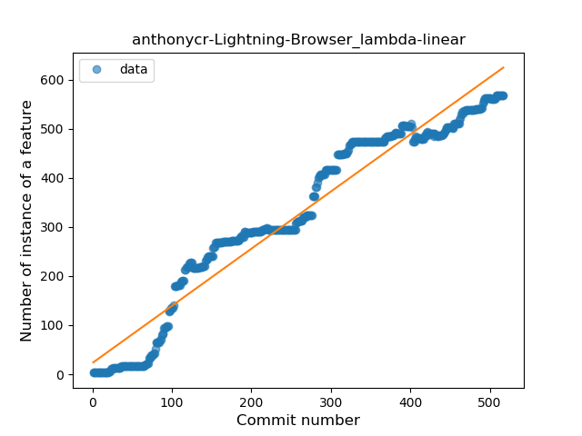
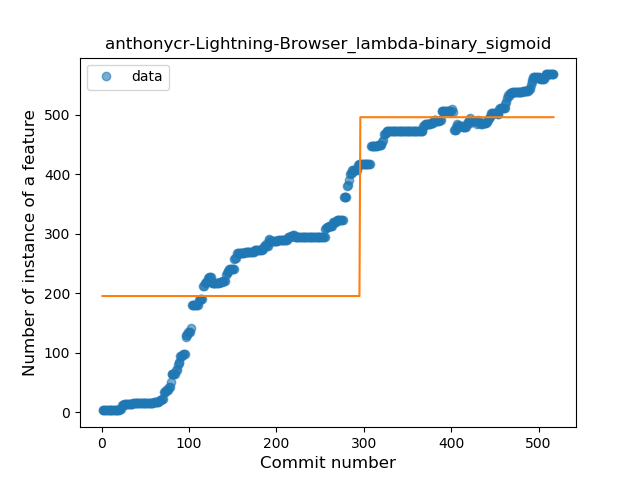
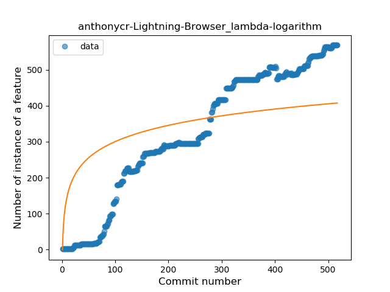
### <a name="safe_call">Safe Call</a>
----
#### Functions
* **Constant Rise - Linear:** 
    * **R_Squared:** 0.63974462
* **Sudden Rise Plateau - Logarithm:** 
    * **R_Squared:** 0.58726857
* **Plateau Sudden Rise - Binary Sigmoid:** 
    * **R_Squared:** 0.22253105

**Plots** :chart_with_upwards_trend:
-----

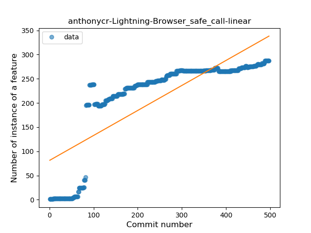
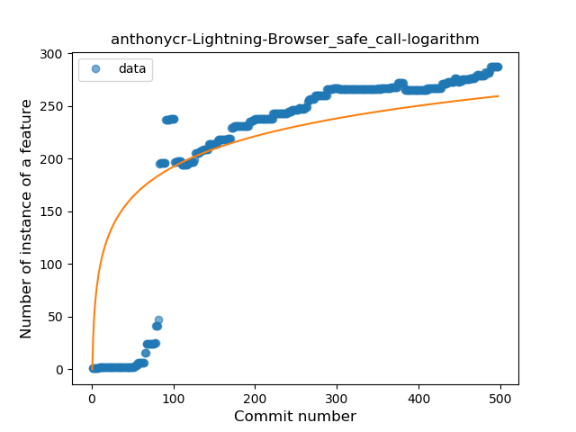
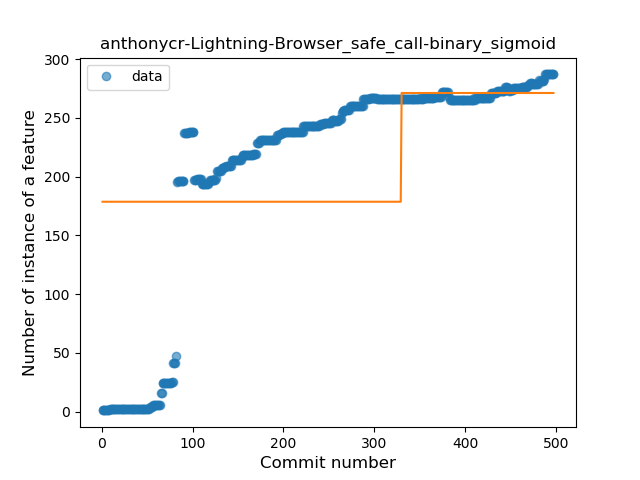
### <a name="when_expr">When expression</a>
----
#### Functions
* **Constant Rise - Linear:** 
    * **R_Squared:** 0.85558196
* **Sudden Rise Plateau - Logarithm:** 
    * **R_Squared:** 0.62108788
* **Plateau Gradual Rise - Sigmoid:** 
    * **R_Squared:** 0.47876025

**Plots** :chart_with_upwards_trend:
-----

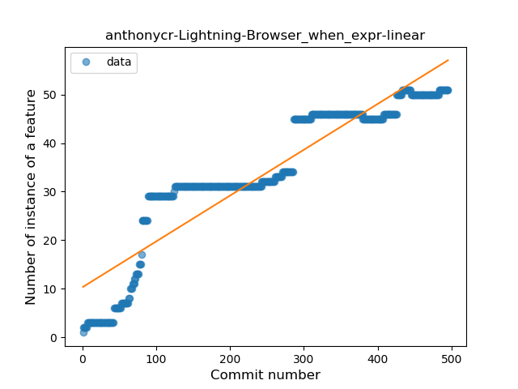
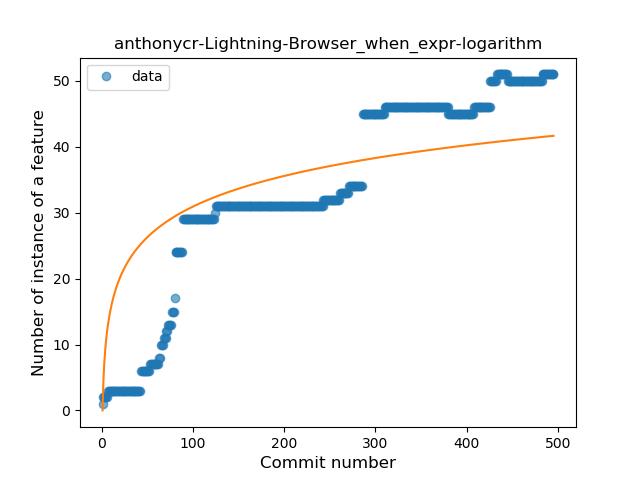
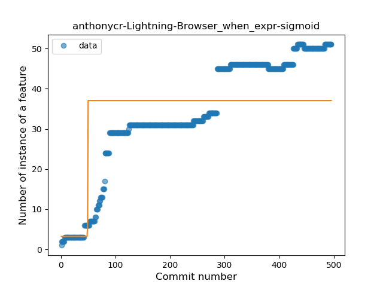
### <a name="companion_object">Companion Object</a>
----
#### Functions
* **Constant Rise - Linear:** 
    * **R_Squared:** 0.75873562
* **Sudden Rise Plateau - Logarithm:** 
    * **R_Squared:** 0.74764935
* **Plateau Gradual Rise - Sigmoid:** 
    * **R_Squared:** 0.71867326

**Plots** :chart_with_upwards_trend:
-----

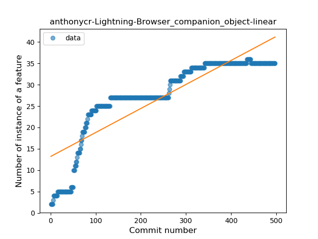
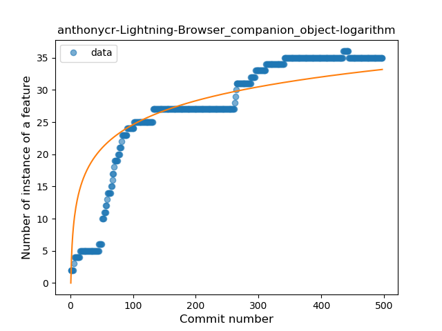
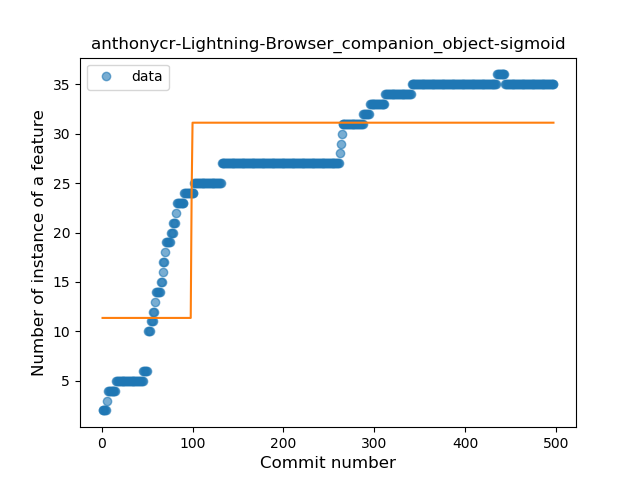
### <a name="unsafe_call">Unsafe Call</a>
----
#### Functions
* **Plateau Sudden Rise - Binary Sigmoid:** 
    * **R_Squared:** 0.09205619
* **Sudden Decline - Exponential:** 
    * **R_Squared:** 0.0235768
* **Constant Decline - Linear:** 
    * **R_Squared:** 0.00982835
* **Sudden Rise Plateau - Logarithm:** 
    * **R_Squared:** -0.0

**Plots** :chart_with_upwards_trend:
-----

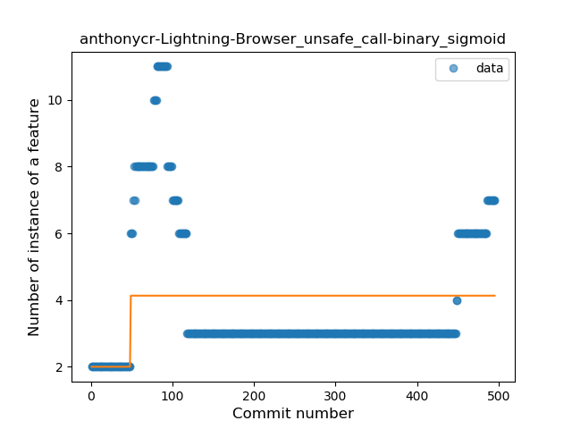
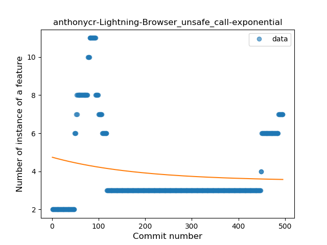
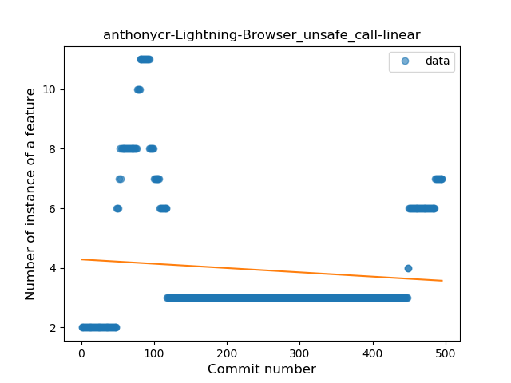
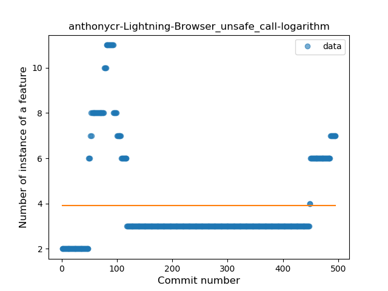
### <a name="string_template">String Template</a>
----
#### Functions
* **Constant Rise - Linear:** 
    * **R_Squared:** 0.75959651
* **Plateau Gradual Rise - Sigmoid:** 
    * **R_Squared:** 0.76782753
* **Sudden Rise Plateau - Logarithm:** 
    * **R_Squared:** 0.72605291

**Plots** :chart_with_upwards_trend:
-----

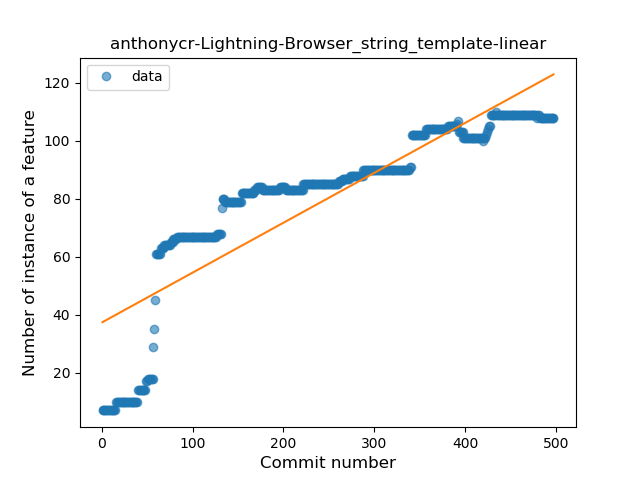
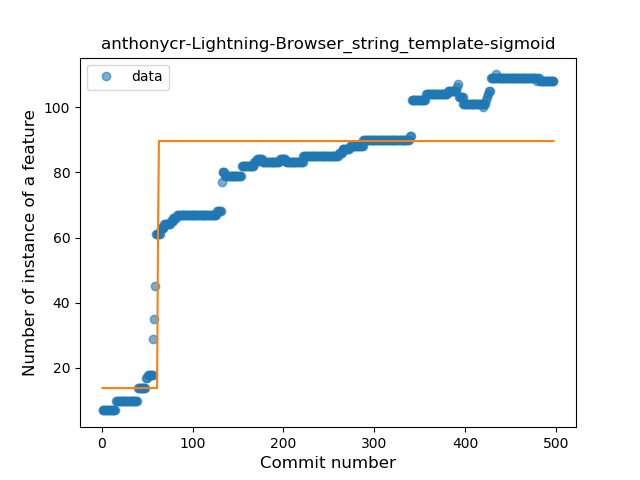
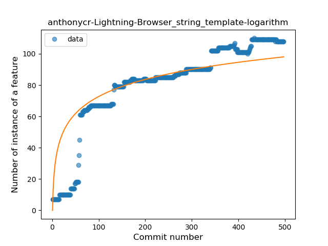
### <a name="func_with_default_value">Function with Default Value</a>
----
#### Functions
* **Sudden Rise - Exponential:** 
    * **R_Squared:** 0.91084846
* **Plateau Gradual Rise - Sigmoid:** 
    * **R_Squared:** 0.91377376
* **Constant Rise - Linear:** 
    * **R_Squared:** 0.89010348
* **Sudden Rise Plateau - Logarithm:** 
    * **R_Squared:** 0.37503091

**Plots** :chart_with_upwards_trend:
-----

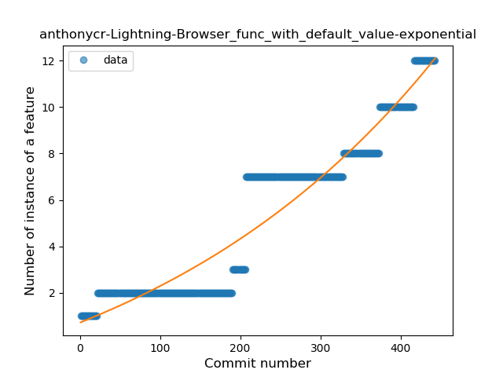
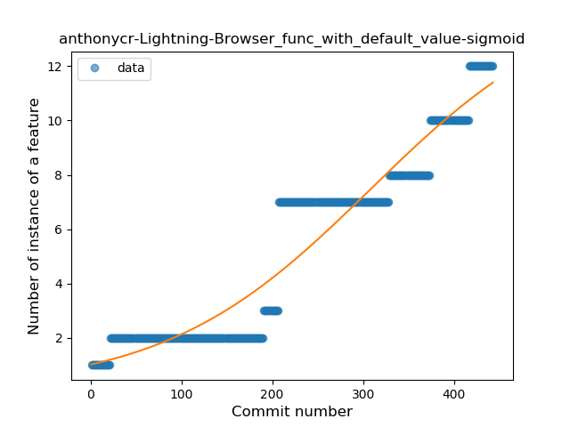
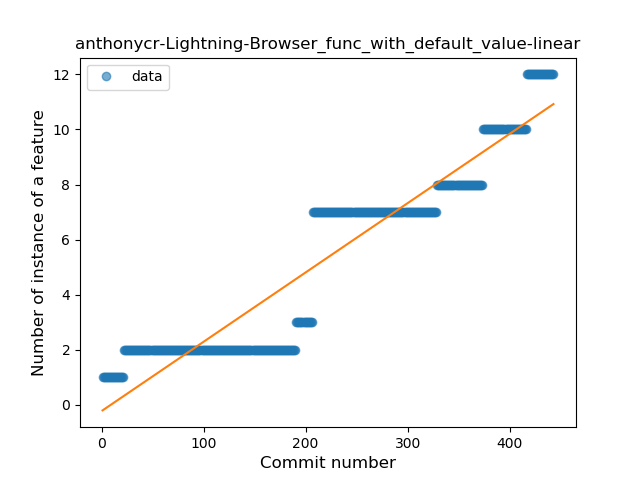
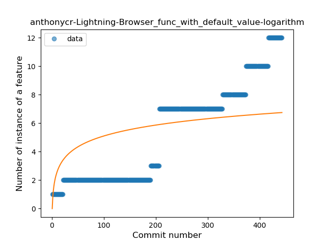
### <a name="singleton">Singleton</a>
----
#### Functions
* **Constant Rise - Linear:** 
    * **R_Squared:** 0.88158608
* **Sudden Rise - Exponential:** 
    * **R_Squared:** 0.88517872
* **Sudden Rise Plateau - Logarithm:** 
    * **R_Squared:** 0.49777738

**Plots** :chart_with_upwards_trend:
-----

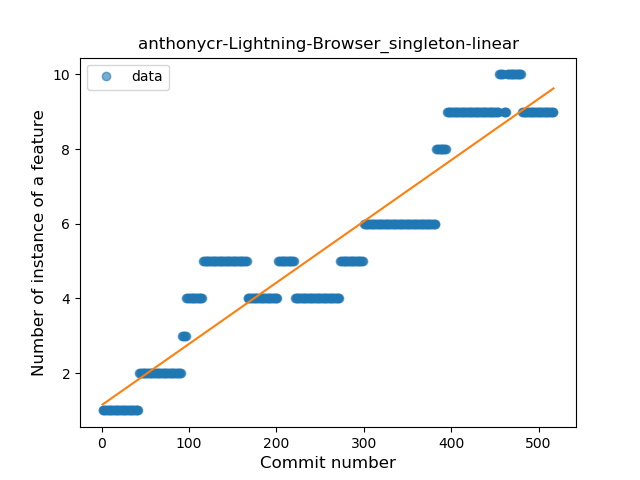
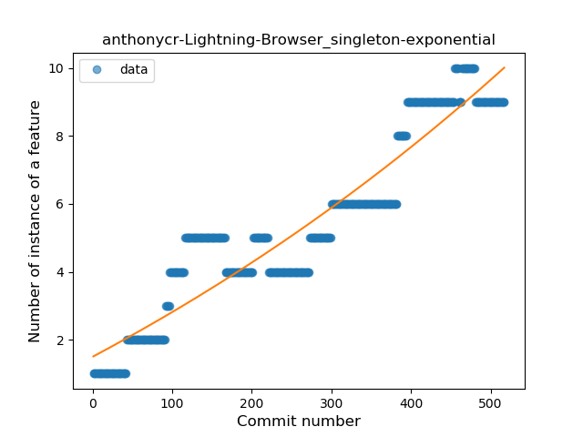
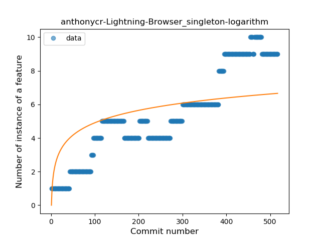
### <a name="smart_cast">Smart Cast</a>
----
#### Functions
* **Sudden Rise - Exponential:** 
    * **R_Squared:** 0.81504343
* **Constant Rise - Linear:** 
    * **R_Squared:** 0.7381516
* **Sudden Rise Plateau - Logarithm:** 
    * **R_Squared:** 0.47919231
* **Plateau Sudden Rise - Binary Sigmoid:** 
    * **R_Squared:** 0.05742033

**Plots** :chart_with_upwards_trend:
-----

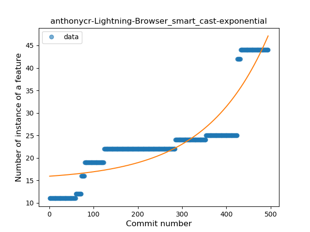
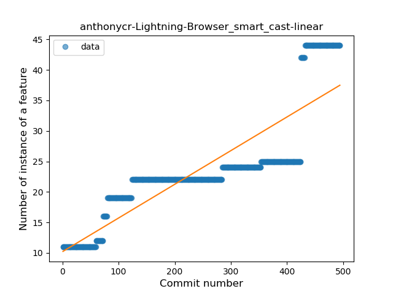
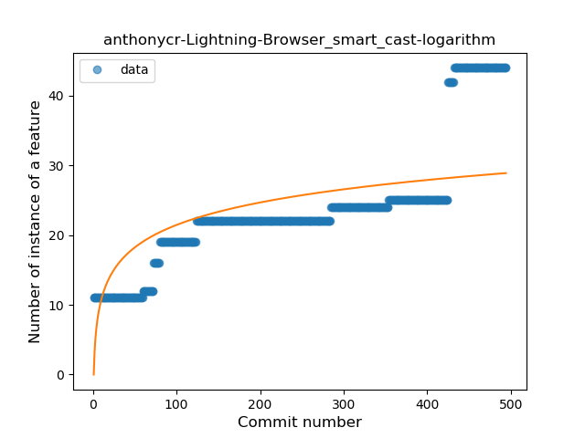
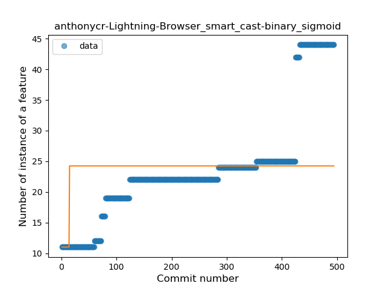
### <a name="range_expr">Range Expression</a>
----
#### Functions
* **Sudden Rise - Exponential:** 
    * **R_Squared:** 0.83405217
* **Constant Rise - Linear:** 
    * **R_Squared:** 0.74846746
* **Sudden Rise Plateau - Logarithm:** 
    * **R_Squared:** 0.38610076

**Plots** :chart_with_upwards_trend:
-----

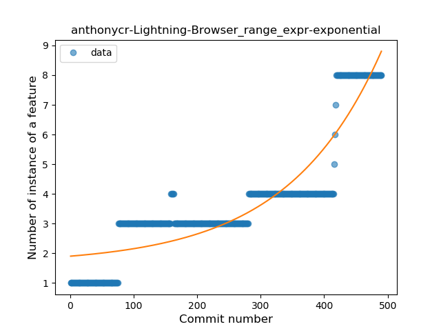

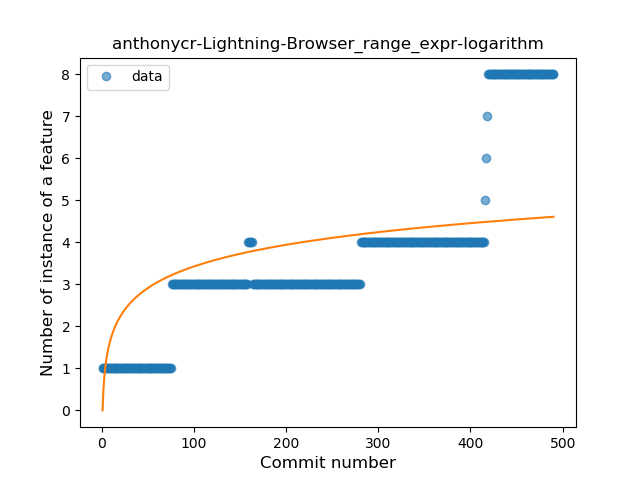
### <a name="func_call_with_named_arg">Function call with Named Argument</a>
----
#### Functions
* **Constant Rise - Linear:** 
    * **R_Squared:** 0.8301288
* **Sudden Rise - Exponential:** 
    * **R_Squared:** 0.83394522
* **Plateau Sudden Rise - Binary Sigmoid:** 
    * **R_Squared:** 0.365259
* **Sudden Rise Plateau - Logarithm:** 
    * **R_Squared:** 0.27756321

**Plots** :chart_with_upwards_trend:
-----

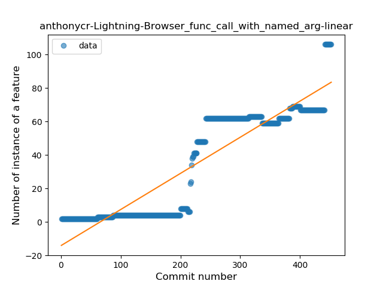
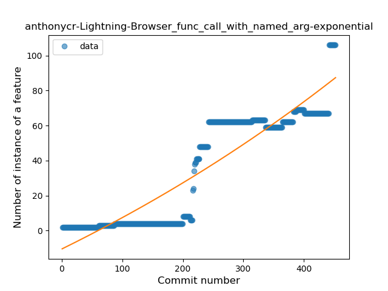
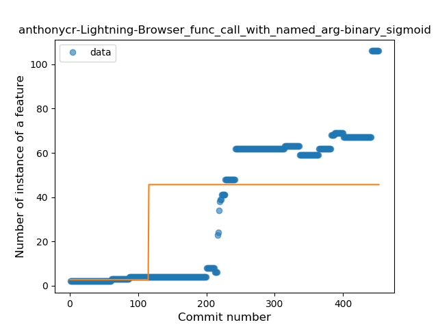
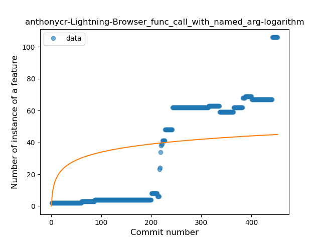
### <a name="data_class">Data Class</a>
----
#### Functions
* **Plateau Gradual Rise - Sigmoid:** 
    * **R_Squared:** 0.95809177
* **Sudden Rise - Exponential:** 
    * **R_Squared:** 0.87993489
* **Constant Rise - Linear:** 
    * **R_Squared:** 0.55540742
* **Sudden Rise Plateau - Logarithm:** 
    * **R_Squared:** 0.18795003

**Plots** :chart_with_upwards_trend:
-----

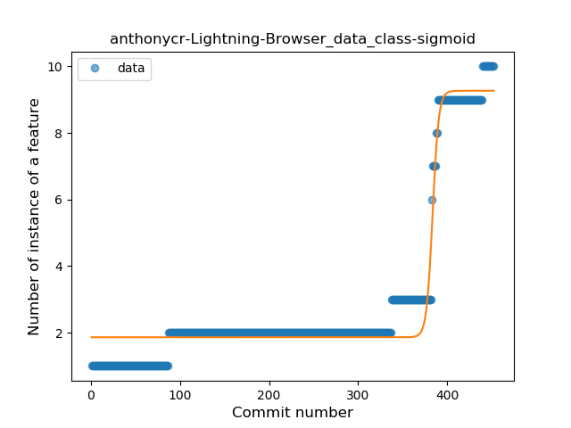
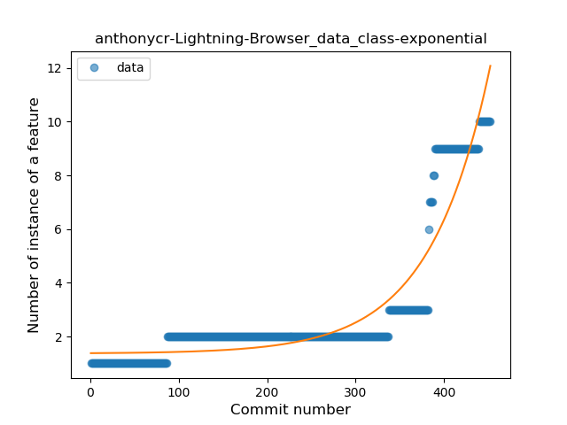
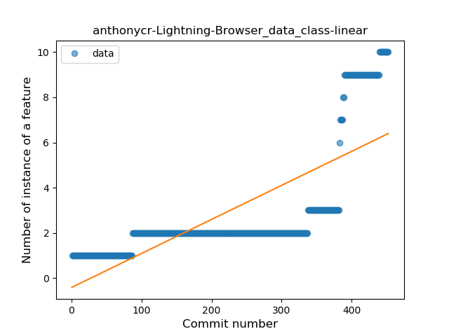
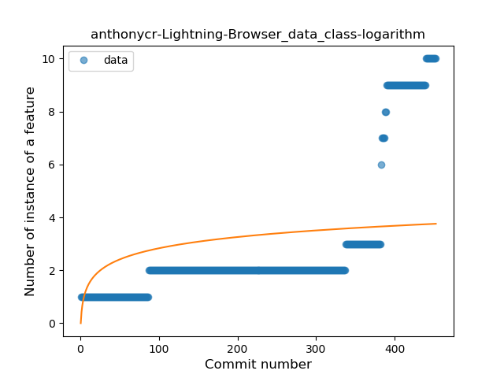
### <a name="extension_function">Extension Function</a>
----
#### Functions
* **Sudden Rise - Exponential:** 
    * **R_Squared:** 0.92374714
* **Constant Rise - Linear:** 
    * **R_Squared:** 0.80893244
* **Sudden Rise Plateau - Logarithm:** 
    * **R_Squared:** 0.43009419

**Plots** :chart_with_upwards_trend:
-----

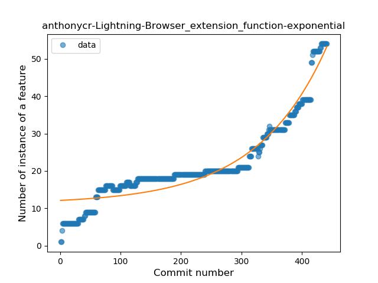
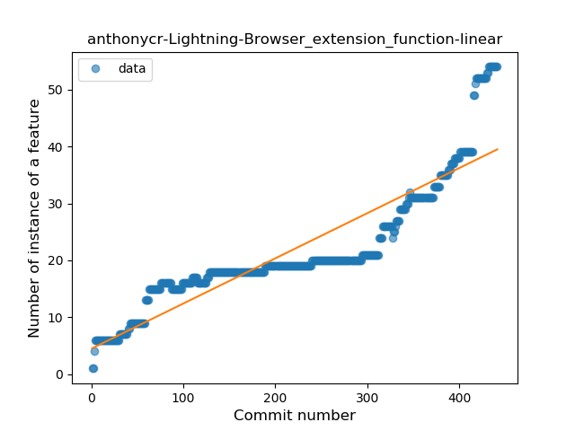
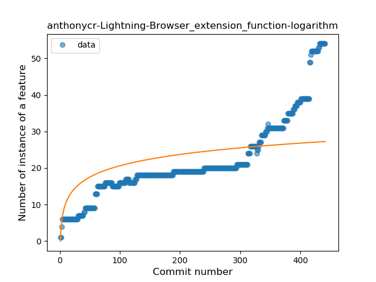
### <a name="property_delegation">Property Delegation</a>
----
#### Functions
* **Sudden Rise - Exponential:** 
    * **R_Squared:** 0.78183245
* **Constant Rise - Linear:** 
    * **R_Squared:** 0.73493073
* **Sudden Rise Plateau - Logarithm:** 
    * **R_Squared:** 0.19058714
* **Plateau Sudden Rise - Binary Sigmoid:** 
    * **R_Squared:** 0.04309447

**Plots** :chart_with_upwards_trend:
-----

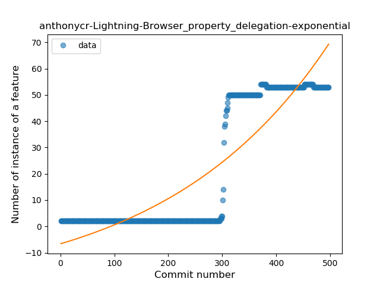
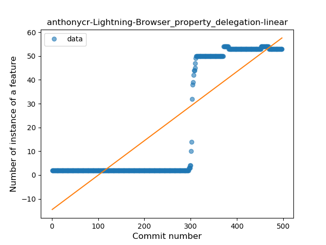
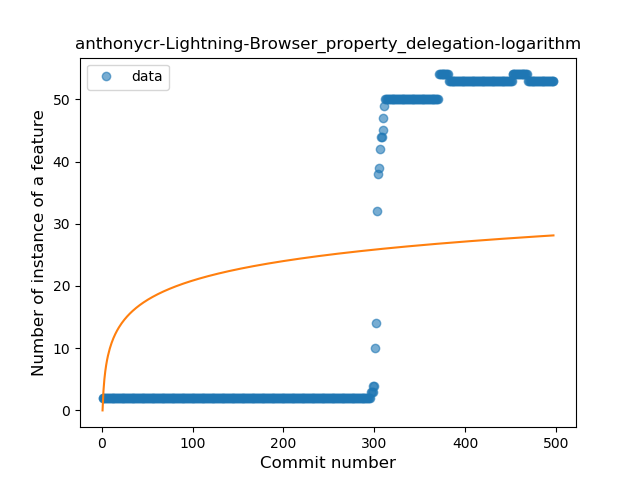
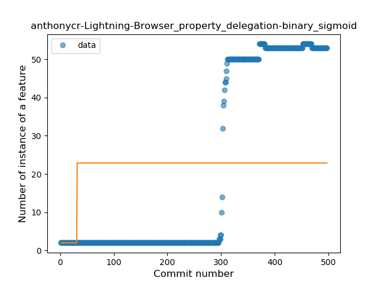
### <a name="destructuring_declaration">Destructuring Declaration</a>
----
#### Functions
* **Instability - Polinomial 3:** )
    * **R_Squared:** 0.60463784
* **Sudden Rise Plateau - Logarithm:** 
    * **R_Squared:** 0.50017716
* **Constant Rise - Linear:** 
    * **R_Squared:** 0.16507286

**Plots** :chart_with_upwards_trend:
-----

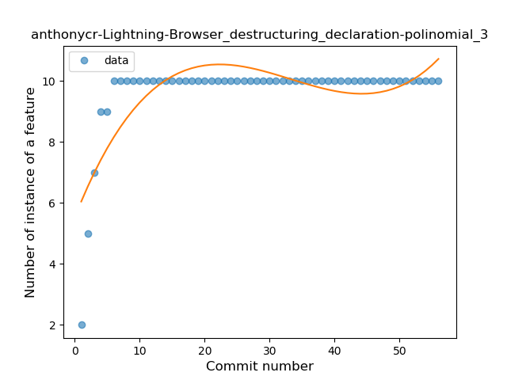
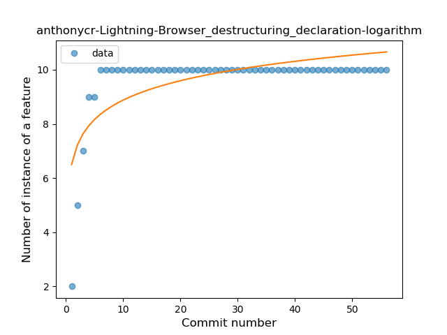

### <a name="inline_func">Inline Function</a>
----
#### Functions
* **Sudden Rise - Exponential:** 
    * **R_Squared:** 0.95420394
* **Plateau Gradual Rise - Sigmoid:** 
    * **R_Squared:** 0.96292207
* **Constant Rise - Linear:** 
    * **R_Squared:** 0.50495098
* **Sudden Rise Plateau - Logarithm:** 
    * **R_Squared:** 0.12516019

**Plots** :chart_with_upwards_trend:
-----

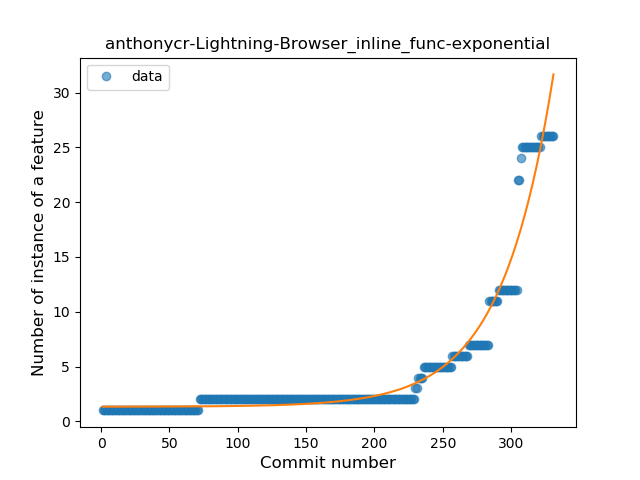
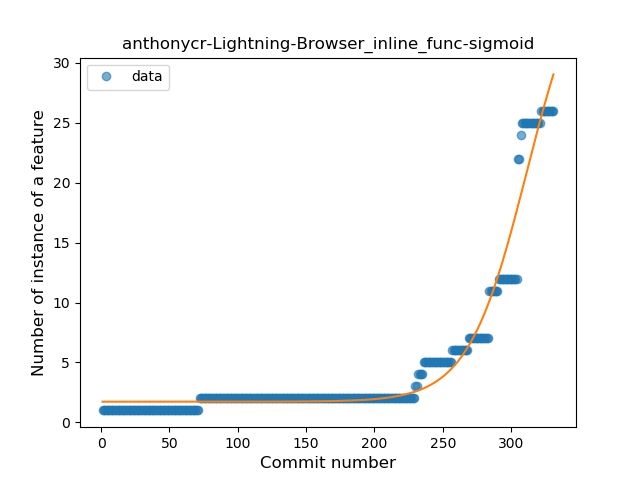
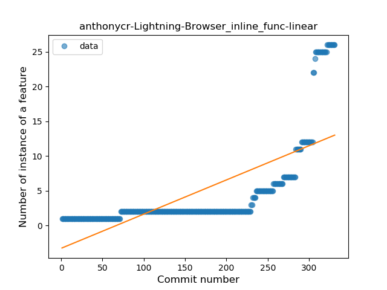
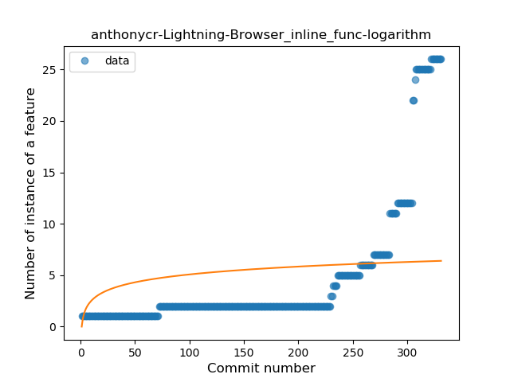
