## apiote-Bimba
----
#### Metrics provided by Detekt
* Number of lines of code 3836
* Number of Kotlin files: 35
* Cyclomatic complexity: 668
* Cyclomatic complexity by thousands of lines: 284 

----
**15** features analyzed

*	<a href="#type_inference">Type Inference</a> 
*	<a href="#lambda">Lambda</a> 
*	<a href="#safe_call">Safe Call</a> 
*	<a href="#when_expr">When expression</a> 
*	<a href="#companion_object">Companion Object</a> 
*	<a href="#unsafe_call">Unsafe Call</a> 
*	<a href="#string_template">String Template</a> 
*	<a href="#func_with_default_value">Function with Default Value</a> 
*	<a href="#smart_cast">Smart Cast</a> 
*	<a href="#range_expr">Range Expression</a> 
*	<a href="#func_call_with_named_arg">Function call with Named Argument</a> 
*	<a href="#data_class">Data Class</a> 
*	<a href="#extension_function">Extension Function</a> 
*	<a href="#destructuring_declaration">Destructuring Declaration</a> 
*	<a href="#overloaded_op">Overloaded Operator</a> 

### <a name="type_inference">Type Inference</a>
----
#### Functions
* **Constant Rise - Linear:** 
    * **R_Squared:** 0.82796011
* **Sudden Rise Plateau - Logarithm:** 
    * **R_Squared:** 0.67714778

**Plots** :chart_with_upwards_trend:
-----

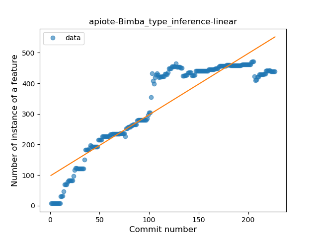
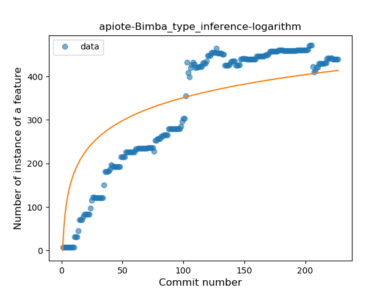
### <a name="lambda">Lambda</a>
----
#### Functions
* **Plateau Sudden Rise - Binary Sigmoid:** 
    * **R_Squared:** 0.79350673
* **Constant Rise - Linear:** 
    * **R_Squared:** 0.77475532
* **Sudden Rise Plateau - Logarithm:** 
    * **R_Squared:** 0.49672873

**Plots** :chart_with_upwards_trend:
-----

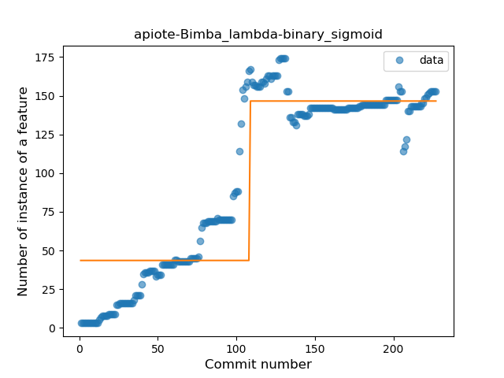
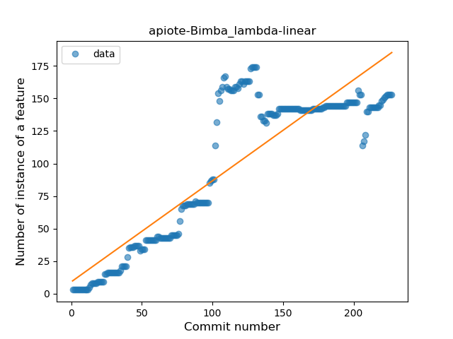
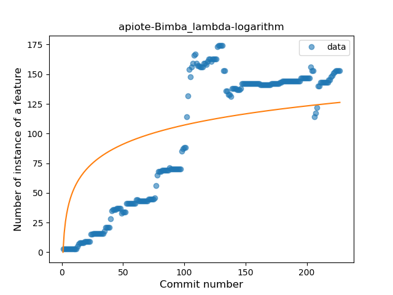
### <a name="safe_call">Safe Call</a>
----
#### Functions
* **Sudden Rise Plateau - Logarithm:** 
    * **R_Squared:** 0.12209504
* **Constant Decline - Linear:** 
    * **R_Squared:** 0.00031079
* **Sudden Decline - Exponential:** 
    * **R_Squared:** 2.51e-05

**Plots** :chart_with_upwards_trend:
-----

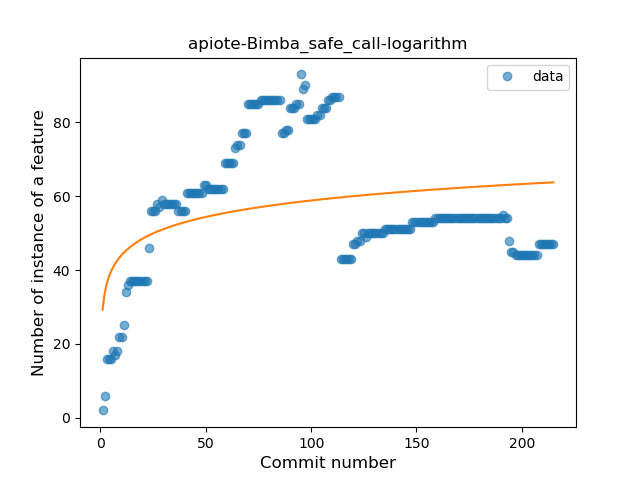

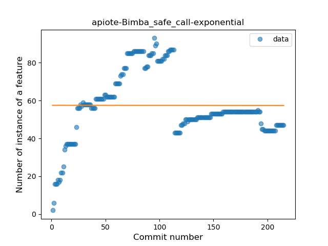
### <a name="when_expr">When expression</a>
----
#### Functions
* **Constant Rise - Linear:** 
    * **R_Squared:** 0.84819707
* **Sudden Rise Plateau - Logarithm:** 
    * **R_Squared:** 0.79248756

**Plots** :chart_with_upwards_trend:
-----

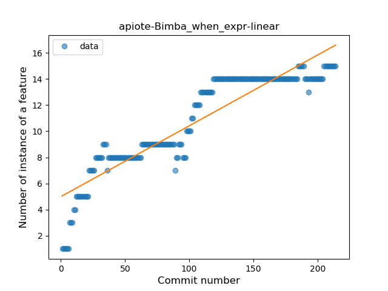
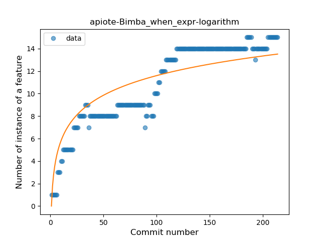
### <a name="companion_object">Companion Object</a>
----
#### Functions
* **Plateau Gradual Rise - Sigmoid:** 
    * **R_Squared:** 0.97817924
* **Constant Rise - Linear:** 
    * **R_Squared:** 0.83894034
* **Sudden Rise Plateau - Logarithm:** 
    * **R_Squared:** 0.59163775

**Plots** :chart_with_upwards_trend:
-----

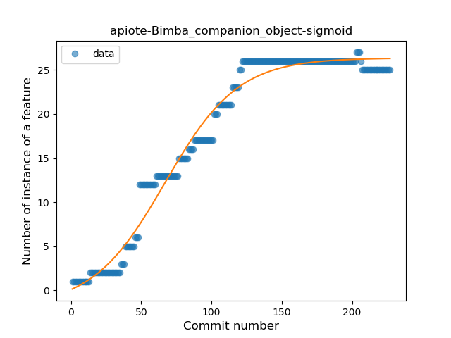
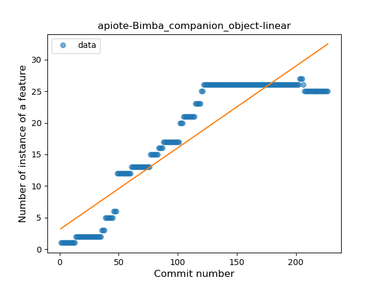
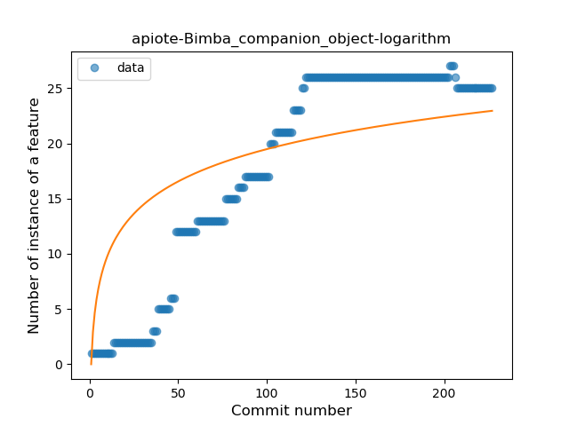
### <a name="unsafe_call">Unsafe Call</a>
----
#### Functions
* **Plateau Sudden Rise - Binary Sigmoid:** 
    * **R_Squared:** 0.60978051
* **Constant Rise - Linear:** 
    * **R_Squared:** 0.4902532
* **Sudden Rise Plateau - Logarithm:** 
    * **R_Squared:** 0.4535775

**Plots** :chart_with_upwards_trend:
-----

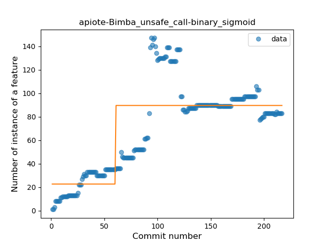

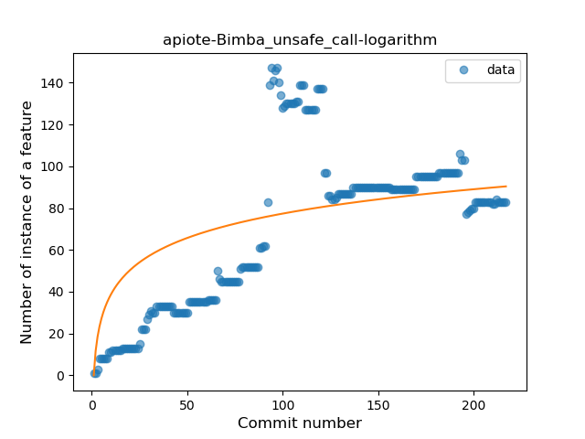
### <a name="string_template">String Template</a>
----
#### Functions
* **Sudden Rise Plateau - Logarithm:** 
    * **R_Squared:** 0.53967307
* **Constant Rise - Linear:** 
    * **R_Squared:** 0.5061988
* **Plateau Gradual Rise - Sigmoid:** 
    * **R_Squared:** 0.44046594

**Plots** :chart_with_upwards_trend:
-----

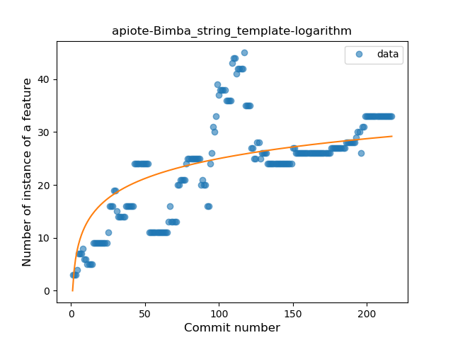
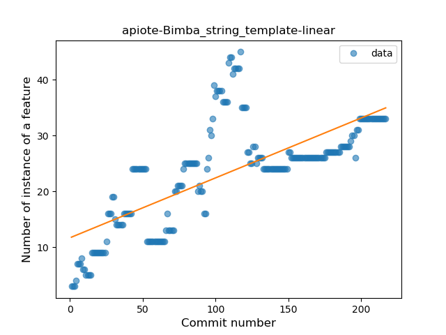
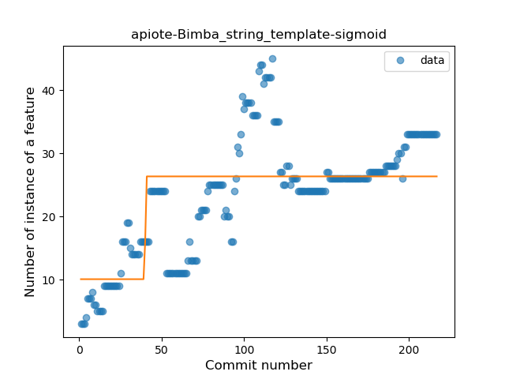
### <a name="func_with_default_value">Function with Default Value</a>
----
#### Functions
* **Sudden Rise - Exponential:** 
    * **R_Squared:** 0.87837935
* **Constant Rise - Linear:** 
    * **R_Squared:** 0.86518118
* **Sudden Rise Plateau - Logarithm:** 
    * **R_Squared:** 0.54356033

**Plots** :chart_with_upwards_trend:
-----

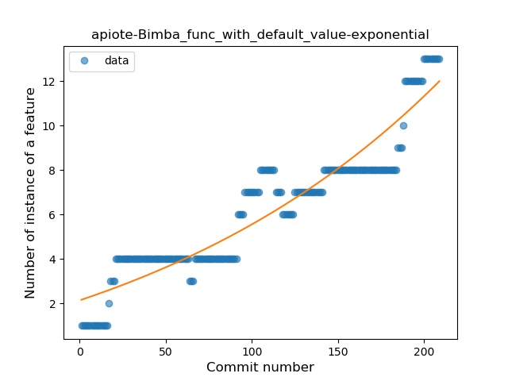
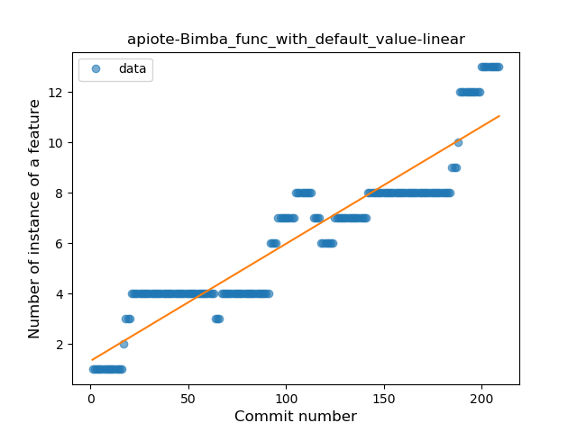
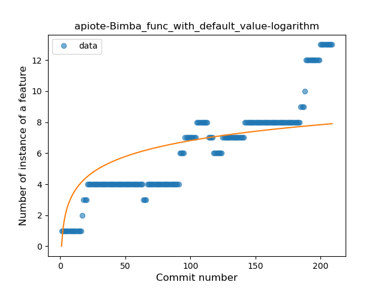
### <a name="smart_cast">Smart Cast</a>
----
#### Functions
* **Sudden Rise Plateau - Logarithm:** 
    * **R_Squared:** 0.83930913
* **Constant Rise - Linear:** 
    * **R_Squared:** 0.66157572

**Plots** :chart_with_upwards_trend:
-----

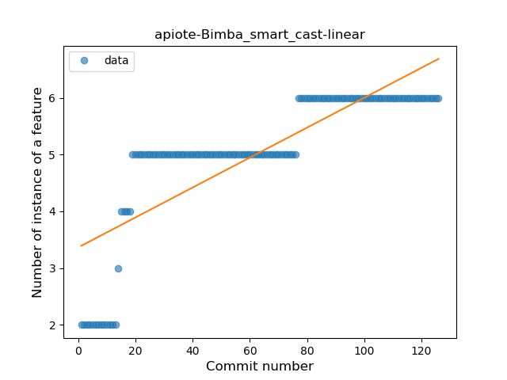
### <a name="range_expr">Range Expression</a>
----
#### Functions
* **Plateau Gradual Rise - Sigmoid:** 
    * **R_Squared:** 0.88487693
* **Constant Rise - Linear:** 
    * **R_Squared:** 0.86474057
* **Sudden Rise Plateau - Logarithm:** 
    * **R_Squared:** 0.56577261

**Plots** :chart_with_upwards_trend:
-----

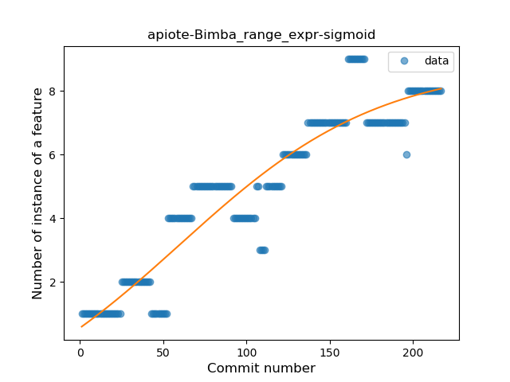
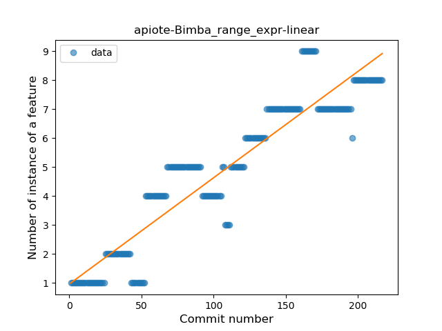
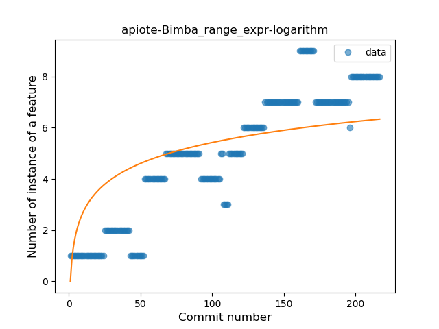
### <a name="func_call_with_named_arg">Function call with Named Argument</a>
----
#### Functions
* **Sudden Rise - Exponential:** 
    * **R_Squared:** 0.14570593
* **Constant Rise - Linear:** 
    * **R_Squared:** 0.12331732
* **Plateau Gradual Decline - Sigmoid:** 
    * **R_Squared:** 0.05978742
* **Sudden Rise Plateau - Logarithm:** 
    * **R_Squared:** 0.0167946

**Plots** :chart_with_upwards_trend:
-----

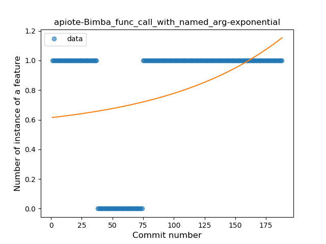
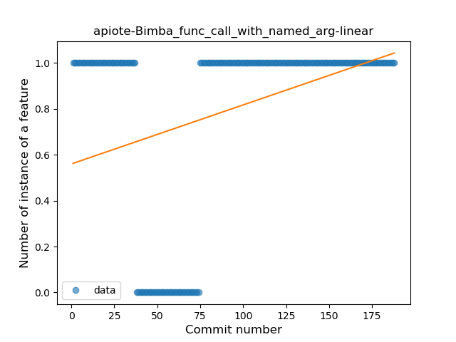
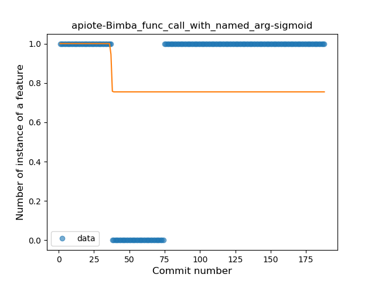
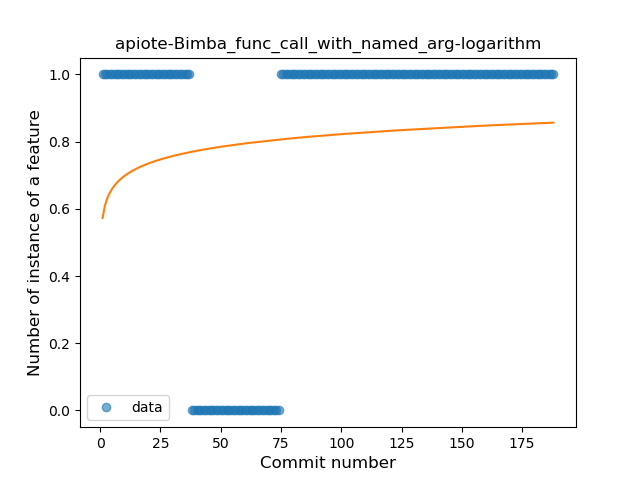
### <a name="data_class">Data Class</a>
----
#### Functions
* **Constant Rise - Linear:** 
    * **R_Squared:** 0.75527578
* **Sudden Rise Plateau - Logarithm:** 
    * **R_Squared:** 0.40403834

**Plots** :chart_with_upwards_trend:
-----

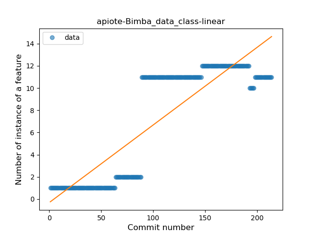
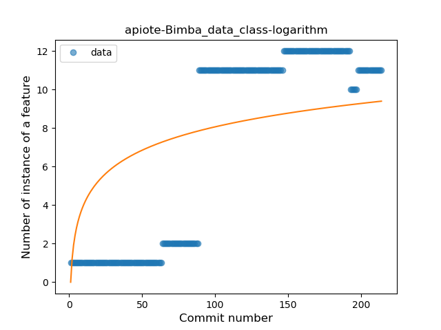
### <a name="extension_function">Extension Function</a>
----
#### Functions
* **Plateau Gradual Rise - Sigmoid:** 
    * **R_Squared:** 0.97240691
* **Constant Rise - Linear:** 
    * **R_Squared:** 0.87666436
* **Sudden Rise Plateau - Logarithm:** 
    * **R_Squared:** 0.54284685

**Plots** :chart_with_upwards_trend:
-----

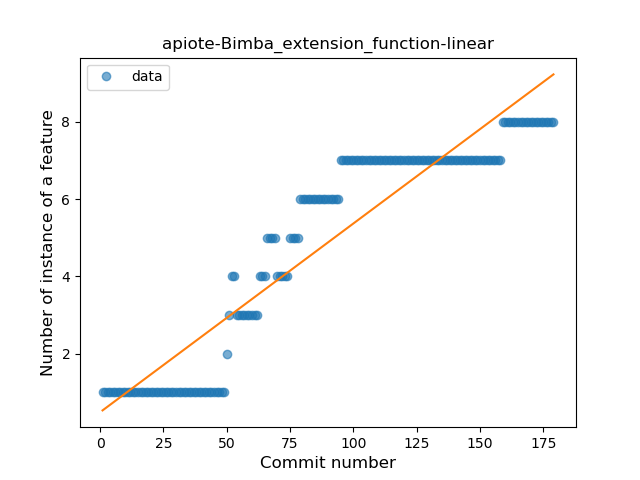
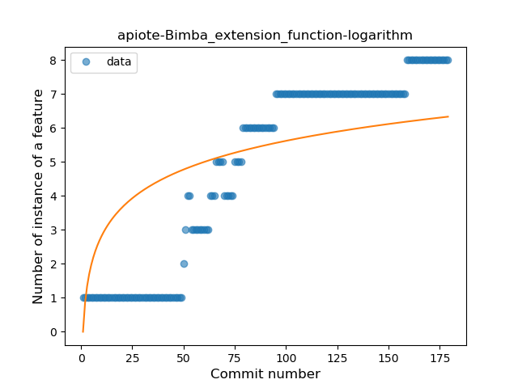
### <a name="destructuring_declaration">Destructuring Declaration</a>
----
#### Functions
* **Constant Rise - Linear:** 
    * **R_Squared:** 0.6321596
* **Sudden Rise Plateau - Logarithm:** 
    * **R_Squared:** 0.58762949

**Plots** :chart_with_upwards_trend:
-----

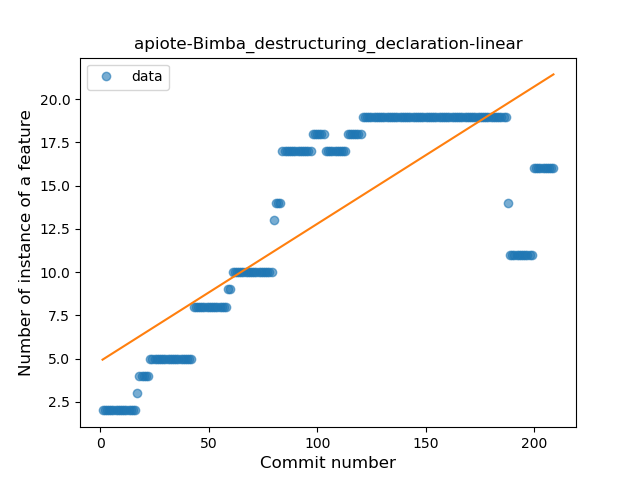
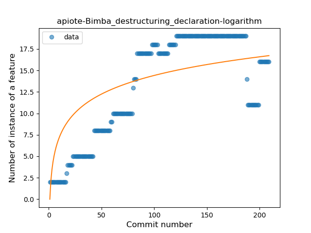
### <a name="overloaded_op">Overloaded Operator</a>
----
#### Functions
* **Sudden Rise - Exponential:** 
    * **R_Squared:** 0.83685149
* **Constant Rise - Linear:** 
    * **R_Squared:** 0.65917342
* **Sudden Rise Plateau - Logarithm:** 
    * **R_Squared:** 0.46201657

**Plots** :chart_with_upwards_trend:
-----

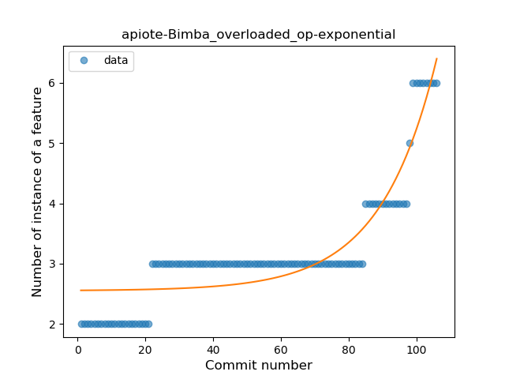
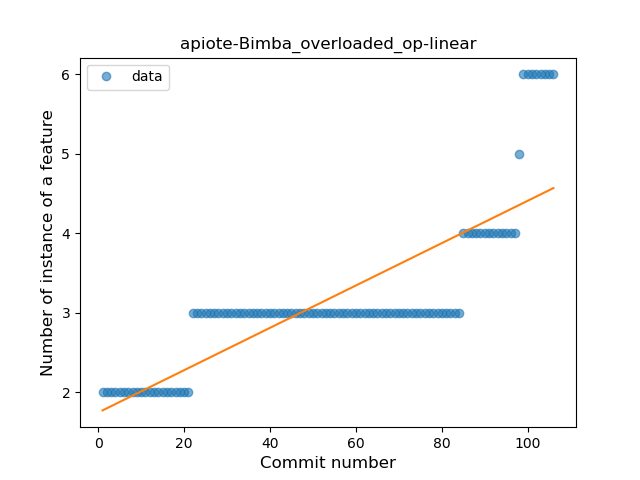
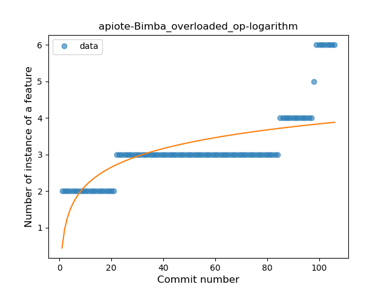
