## apoi-quickbeer-android
----
#### Metrics provided by Detekt
* Number of lines of code 11978
* Number of Kotlin files: 161
* Cyclomatic complexity: 1061
* Cyclomatic complexity by thousands of lines: 238 

----
**13** features analyzed

*	<a href="#type_inference">Type Inference</a> 
*	<a href="#lambda">Lambda</a> 
*	<a href="#safe_call">Safe Call</a> 
*	<a href="#when_expr">When expression</a> 
*	<a href="#companion_object">Companion Object</a> 
*	<a href="#unsafe_call">Unsafe Call</a> 
*	<a href="#string_template">String Template</a> 
*	<a href="#func_with_default_value">Function with Default Value</a> 
*	<a href="#smart_cast">Smart Cast</a> 
*	<a href="#func_call_with_named_arg">Function call with Named Argument</a> 
*	<a href="#data_class">Data Class</a> 
*	<a href="#extension_function">Extension Function</a> 
*	<a href="#destructuring_declaration">Destructuring Declaration</a> 

### <a name="type_inference">Type Inference</a>
----
#### Functions
* **Sudden Rise - Exponential:** 
    * **R_Squared:** 0.96523869
* **Constant Rise - Linear:** 
    * **R_Squared:** 0.81046567
* **Plateau Sudden Rise - Binary Sigmoid:** 
    * **R_Squared:** 0.67830435
* **Sudden Rise Plateau - Logarithm:** 
    * **R_Squared:** 0.29042889

**Plots** :chart_with_upwards_trend:
-----

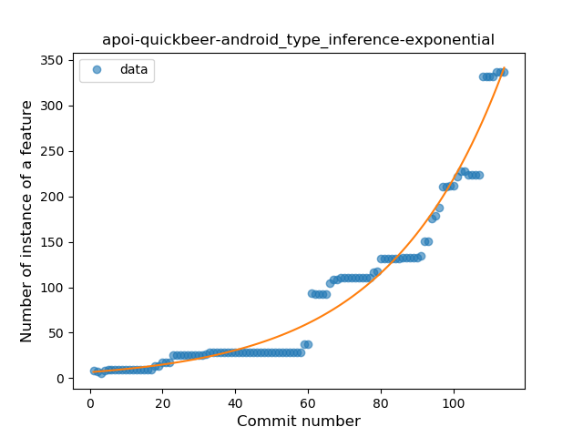
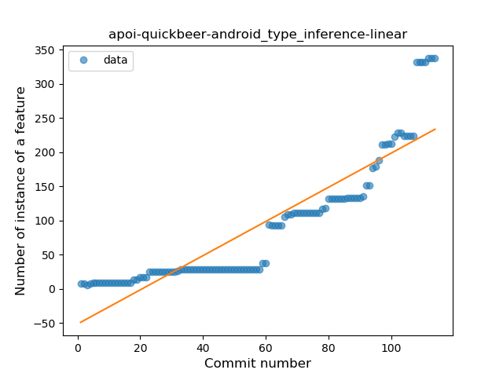
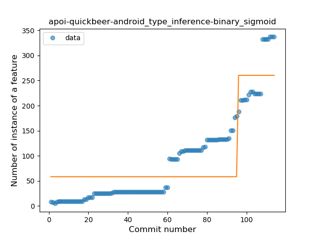
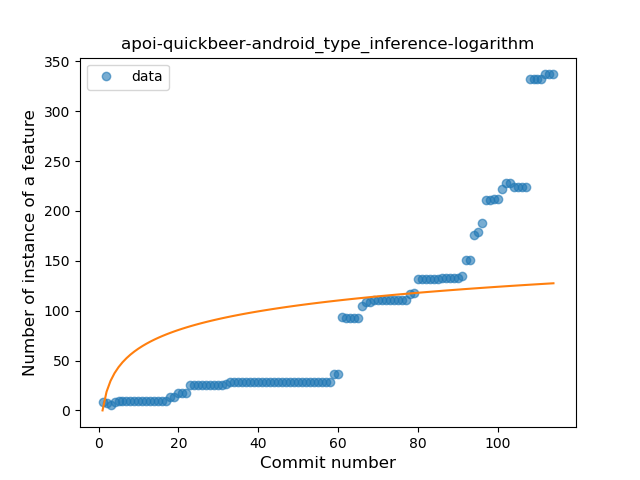
### <a name="lambda">Lambda</a>
----
#### Functions
* **Sudden Rise - Exponential:** 
    * **R_Squared:** 0.9618066
* **Constant Rise - Linear:** 
    * **R_Squared:** 0.84003437
* **Sudden Rise Plateau - Logarithm:** 
    * **R_Squared:** 0.2800167

**Plots** :chart_with_upwards_trend:
-----

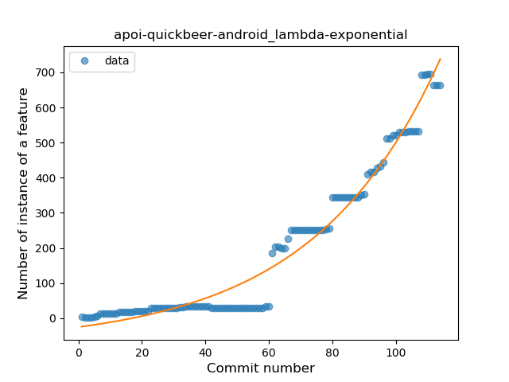
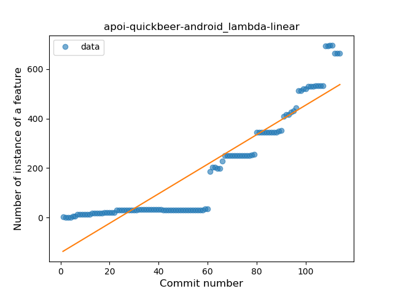
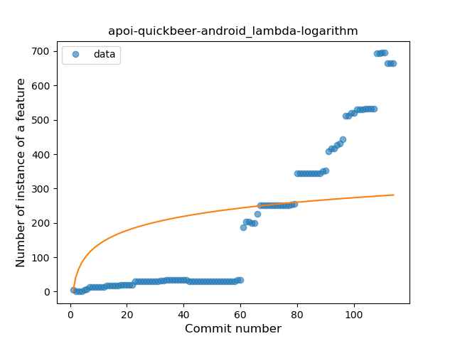
### <a name="safe_call">Safe Call</a>
----
#### Functions
* **Sudden Rise - Exponential:** 
    * **R_Squared:** 0.91617899
* **Constant Rise - Linear:** 
    * **R_Squared:** 0.83462669
* **Sudden Rise Plateau - Logarithm:** 
    * **R_Squared:** 0.5153329

**Plots** :chart_with_upwards_trend:
-----

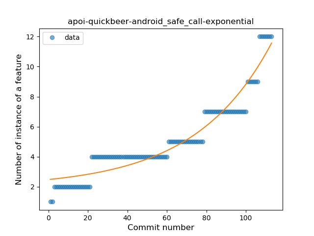
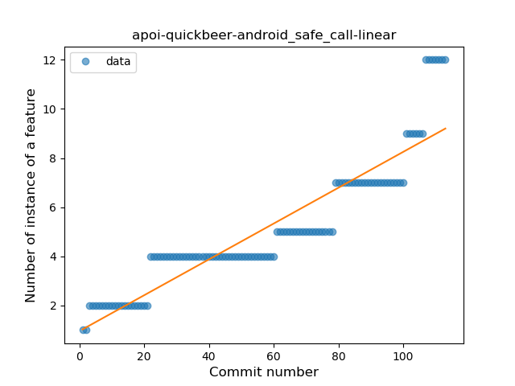
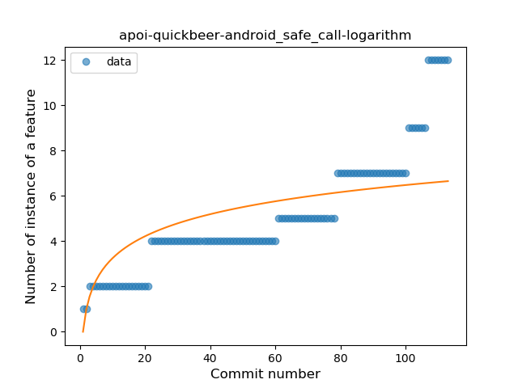
### <a name="when_expr">When expression</a>
----
#### Functions
* **Sudden Rise - Exponential:** 
    * **R_Squared:** 0.94006181
* **Constant Rise - Linear:** 
    * **R_Squared:** 0.90140649
* **Sudden Rise Plateau - Logarithm:** 
    * **R_Squared:** 0.44084441

**Plots** :chart_with_upwards_trend:
-----

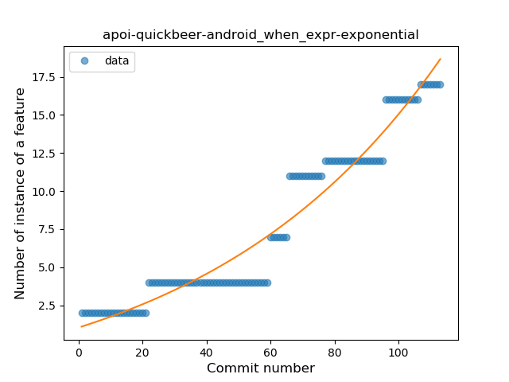
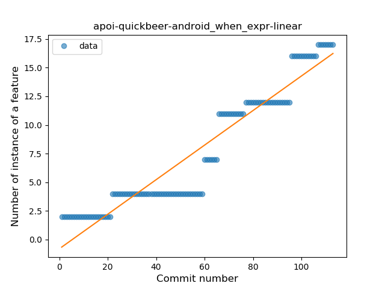
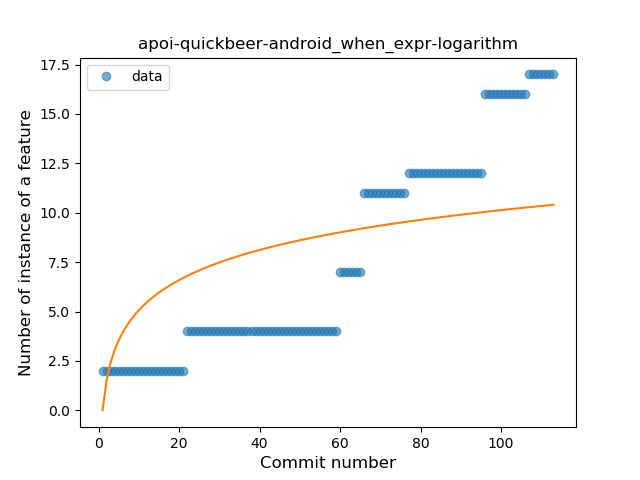
### <a name="companion_object">Companion Object</a>
----
#### Functions
* **Sudden Rise - Exponential:** 
    * **R_Squared:** 0.94546417
* **Constant Rise - Linear:** 
    * **R_Squared:** 0.87941005
* **Sudden Rise Plateau - Logarithm:** 
    * **R_Squared:** 0.37461208

**Plots** :chart_with_upwards_trend:
-----

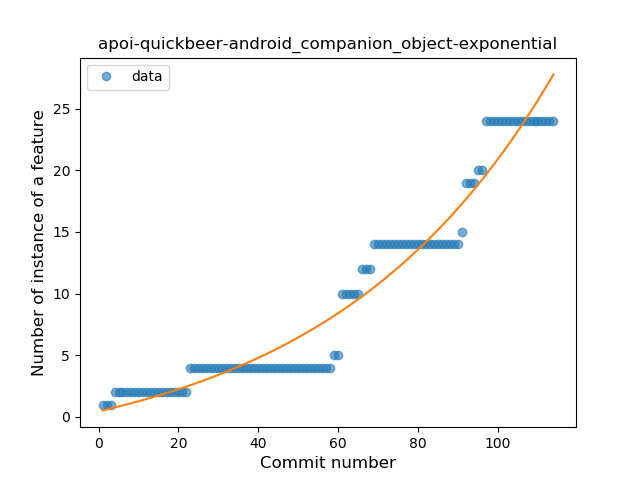
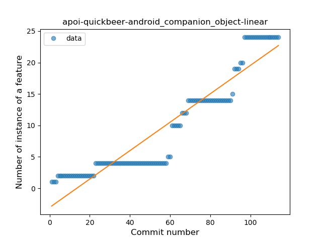
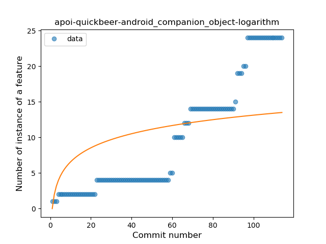
### <a name="unsafe_call">Unsafe Call</a>
----
#### Functions
* **Sudden Rise - Exponential:** 
    * **R_Squared:** 0.90738309
* **Constant Rise - Linear:** 
    * **R_Squared:** 0.6666414
* **Sudden Rise Plateau - Logarithm:** 
    * **R_Squared:** 0.18601728

**Plots** :chart_with_upwards_trend:
-----

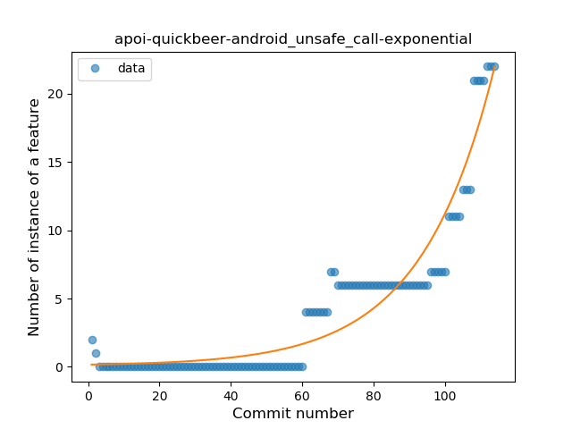
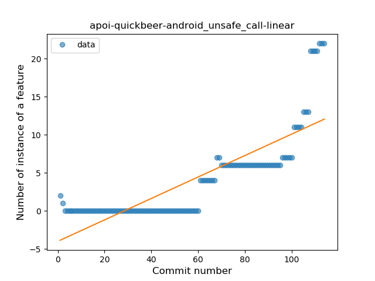
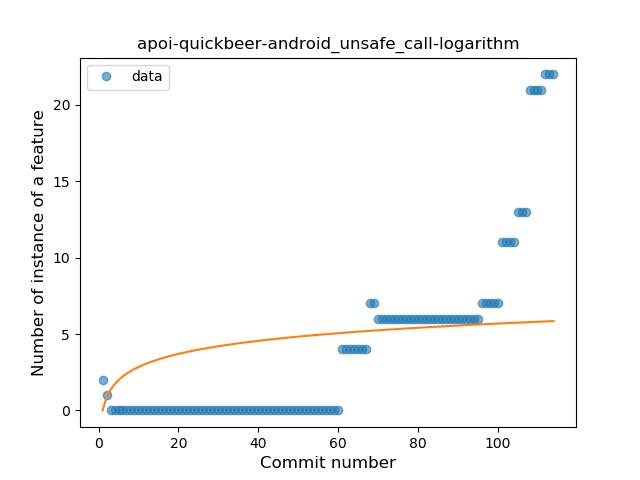
### <a name="string_template">String Template</a>
----
#### Functions
* **Plateau Gradual Rise - Sigmoid:** 
    * **R_Squared:** 0.93638178
* **Sudden Rise - Exponential:** 
    * **R_Squared:** 0.899328
* **Constant Rise - Linear:** 
    * **R_Squared:** 0.8702734
* **Sudden Rise Plateau - Logarithm:** 
    * **R_Squared:** 0.64055954

**Plots** :chart_with_upwards_trend:
-----

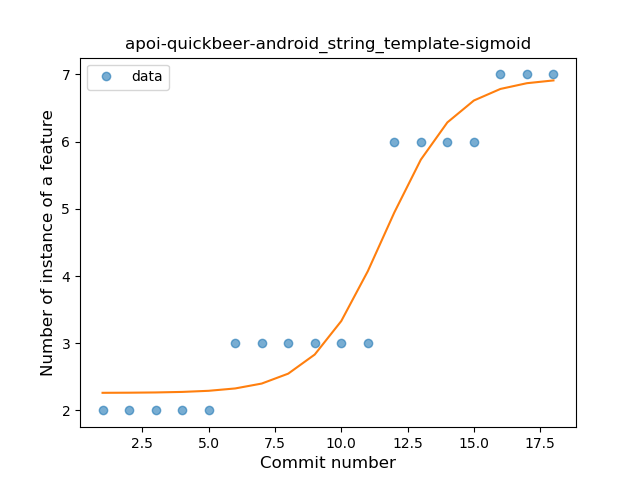
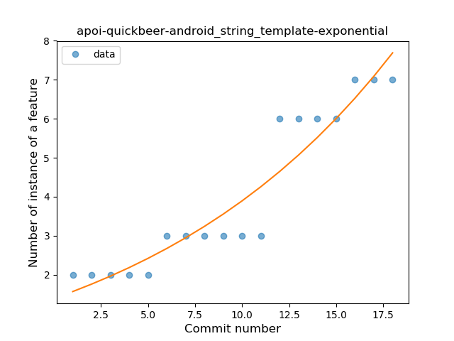
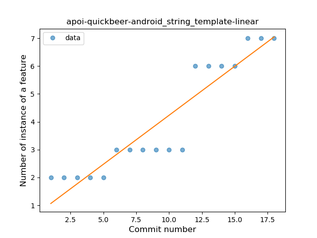
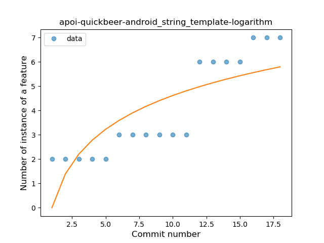
### <a name="func_with_default_value">Function with Default Value</a>
----
#### Functions
* **Plateau Gradual Rise - Sigmoid:** 
    * **R_Squared:** 0.91905927
* **Sudden Rise - Exponential:** 
    * **R_Squared:** 0.87652944
* **Constant Rise - Linear:** 
    * **R_Squared:** 0.81969964
* **Sudden Rise Plateau - Logarithm:** 
    * **R_Squared:** 0.49703778

**Plots** :chart_with_upwards_trend:
-----

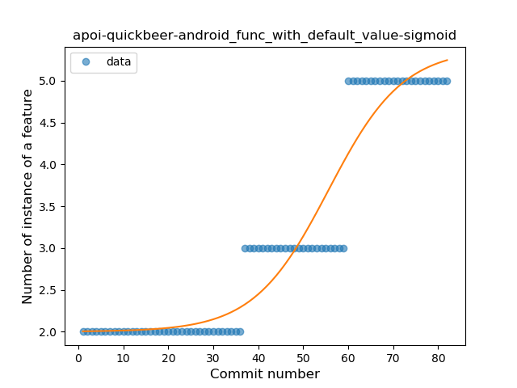

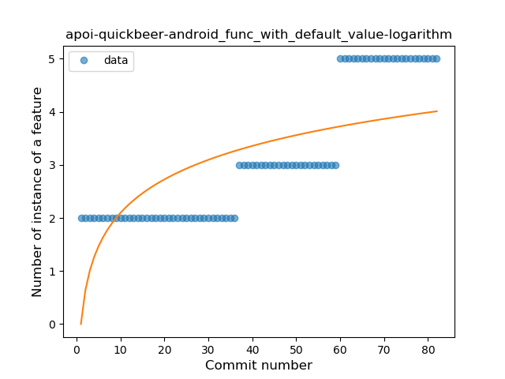
### <a name="smart_cast">Smart Cast</a>
----
#### Functions
* **Constant Rise - Linear:** 
    * **R_Squared:** 0.75765766
* **Sudden Rise Plateau - Logarithm:** 
    * **R_Squared:** 0.69226521

**Plots** :chart_with_upwards_trend:
-----

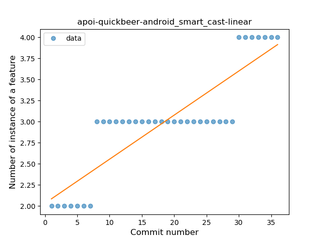
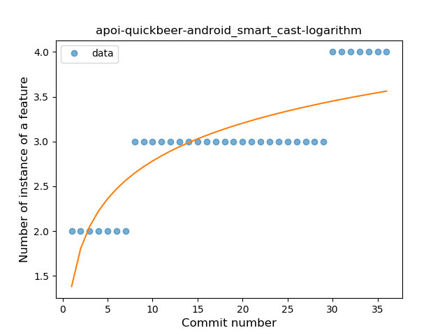
### <a name="func_call_with_named_arg">Function call with Named Argument</a>
----
#### Functions
* **Plateau Sudden Rise - Binary Sigmoid:** 
    * **R_Squared:** 0.85199102
* **Constant Rise - Linear:** 
    * **R_Squared:** 0.77473684
* **Sudden Rise Plateau - Logarithm:** 
    * **R_Squared:** 0.75058929

**Plots** :chart_with_upwards_trend:
-----

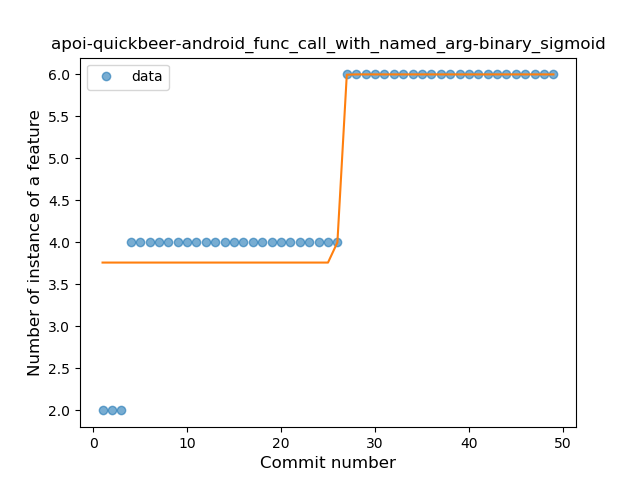
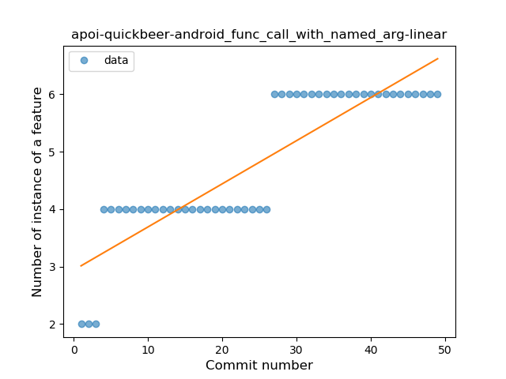
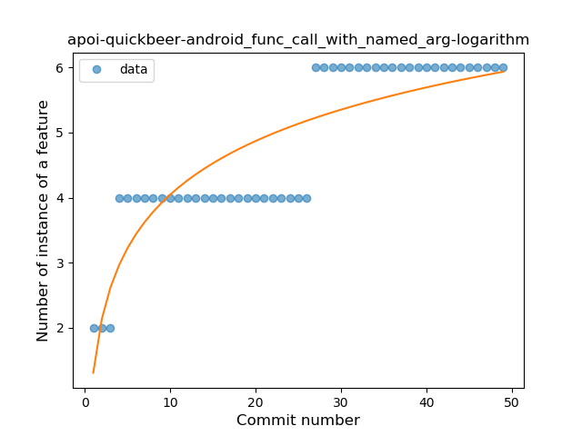
### <a name="data_class">Data Class</a>
----
#### Functions
* **Plateau Gradual Rise - Sigmoid:** 
    * **R_Squared:** 0.95029331
* **Sudden Rise - Exponential:** 
    * **R_Squared:** 0.91250205
* **Constant Rise - Linear:** 
    * **R_Squared:** 0.88201037
* **Sudden Rise Plateau - Logarithm:** 
    * **R_Squared:** 0.4675178

**Plots** :chart_with_upwards_trend:
-----

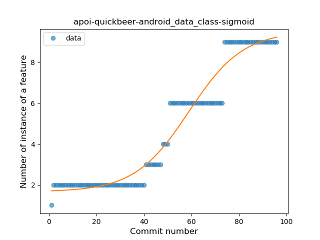
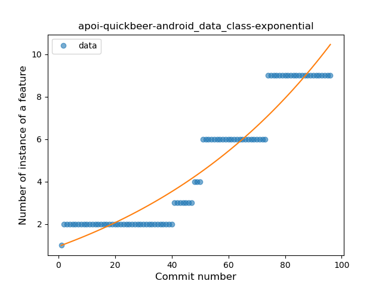
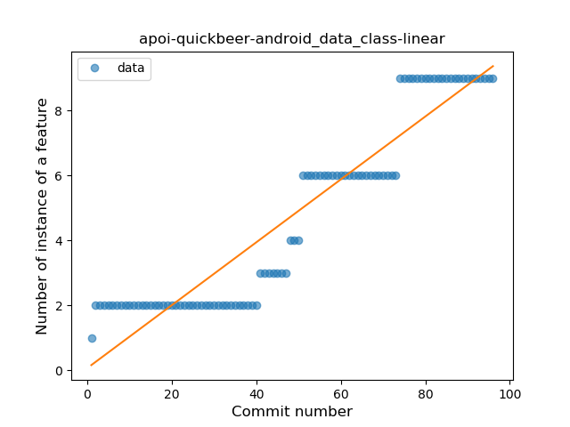
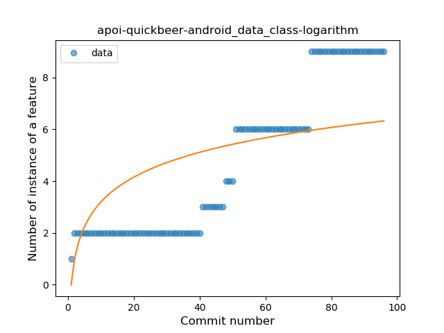
### <a name="extension_function">Extension Function</a>
----
#### Functions
* **Plateau Sudden Rise - Binary Sigmoid:** 
    * **R_Squared:** 1.0
* **Instability - Polinomial 4:** 
    * **R_Squared:** 0.87179487
* **Sudden Rise - Exponential:** 
    * **R_Squared:** 0.78170689
* **Constant Rise - Linear:** 
    * **R_Squared:** 0.6
* **Sudden Rise Plateau - Logarithm:** 
    * **R_Squared:** 0.3162667

**Plots** :chart_with_upwards_trend:
-----

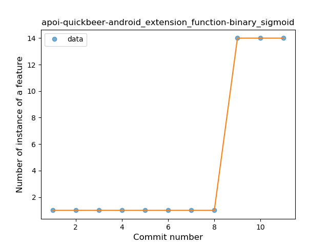
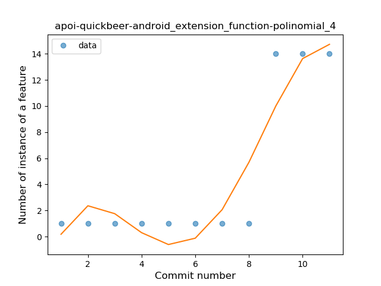

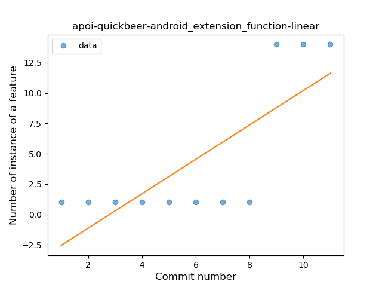
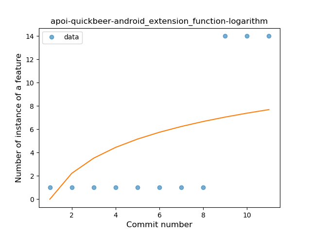
### <a name="destructuring_declaration">Destructuring Declaration</a>
----
#### Functions
* **Plateau Sudden Rise - Binary Sigmoid:** 
    * **R_Squared:** 1.0
* **Instability - Polinomial 3:** )
    * **R_Squared:** 0.85546442
* **Constant Rise - Linear:** 
    * **R_Squared:** 0.74509804
* **Sudden Rise Plateau - Logarithm:** 
    * **R_Squared:** 0.5956636

**Plots** :chart_with_upwards_trend:
-----

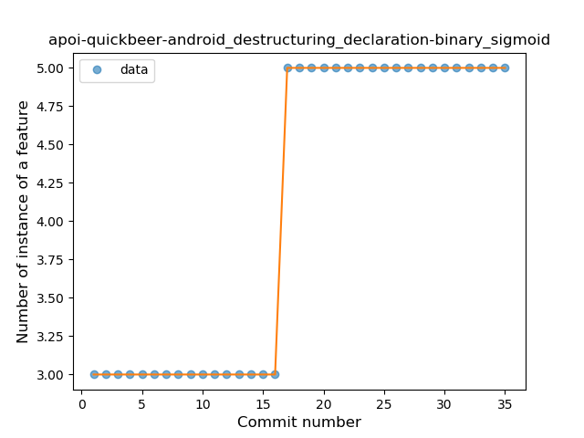
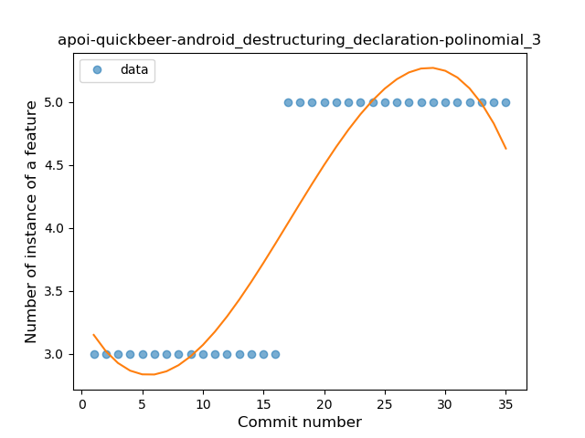
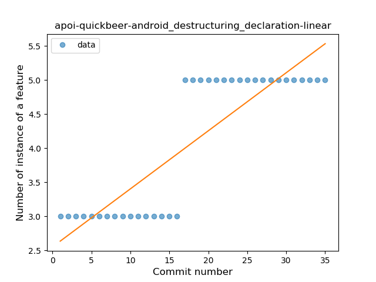
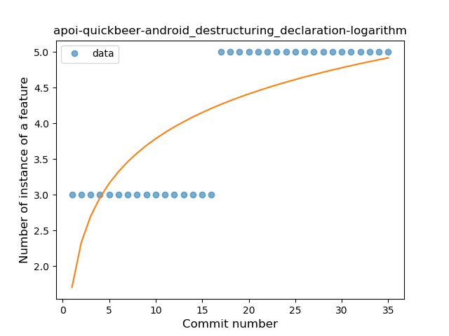
