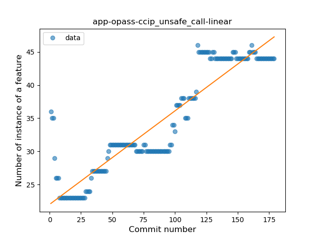
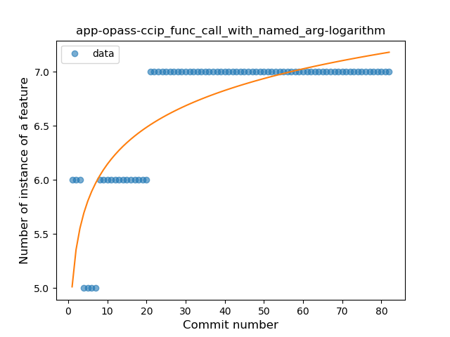

## app-opass-ccip
----
#### Metrics provided by Detekt
* Number of lines of code 4188
* Number of Kotlin files: 69
* Cyclomatic complexity: 609
* Cyclomatic complexity by thousands of lines: 264 

----
**19** features analyzed

*	<a href="#type_inference">Type Inference</a> 
*	<a href="#lambda">Lambda</a> 
*	<a href="#safe_call">Safe Call</a> 
*	<a href="#when_expr">When expression</a> 
*	<a href="#unsafe_call">Unsafe Call</a> 
*	<a href="#companion_object">Companion Object</a> 
*	<a href="#string_template">String Template</a> 
*	<a href="#func_with_default_value">Function with Default Value</a> 
*	<a href="#singleton">Singleton</a> 
*	<a href="#range_expr">Range Expression</a> 
*	<a href="#smart_cast">Smart Cast</a> 
*	<a href="#data_class">Data Class</a> 
*	<a href="#func_call_with_named_arg">Function call with Named Argument</a> 
*	<a href="#extension_function">Extension Function</a> 
*	<a href="#property_delegation">Property Delegation</a> 
*	<a href="#destructuring_declaration">Destructuring Declaration</a> 
*	<a href="#coroutine">Coroutine</a> 
*	<a href="#sealed_class">Sealed Class</a> 
*	<a href="#super_delegation">Super Delegation</a> 

### <a name="type_inference">Type Inference</a>
----
#### Functions
* **Instability - Polinomial 3:** )
    * **R_Squared:** 0.93192824
* **Constant Rise - Linear:** 
    * **R_Squared:** 0.89131883
* **Sudden Rise - Exponential:** 
    * **R_Squared:** 0.89210211
* **Sudden Rise Plateau - Logarithm:** 
    * **R_Squared:** 0.62232277

**Plots** :chart_with_upwards_trend:
-----

### <a name="lambda">Lambda</a>
----
#### Functions
* **Sudden Rise - Exponential:** 
    * **R_Squared:** 0.95518174
* **Constant Rise - Linear:** 
    * **R_Squared:** 0.93787489
* **Sudden Rise Plateau - Logarithm:** 
    * **R_Squared:** 0.53488065

**Plots** :chart_with_upwards_trend:
-----

### <a name="safe_call">Safe Call</a>
----
#### Functions
* **Sudden Rise - Exponential:** 
    * **R_Squared:** 0.92151982
* **Constant Rise - Linear:** 
    * **R_Squared:** 0.8700332
* **Sudden Rise Plateau - Logarithm:** 
    * **R_Squared:** 0.36330071
* **Plateau Sudden Rise - Binary Sigmoid:** 
    * **R_Squared:** 0.25845947

**Plots** :chart_with_upwards_trend:
-----

### <a name="when_expr">When expression</a>
----
#### Functions
* **Sudden Rise - Exponential:** 
    * **R_Squared:** 0.86039061
* **Constant Rise - Linear:** 
    * **R_Squared:** 0.84159327
* **Sudden Rise Plateau - Logarithm:** 
    * **R_Squared:** 0.47854628
* **Plateau Sudden Rise - Binary Sigmoid:** 
    * **R_Squared:** 0.14523227

**Plots** :chart_with_upwards_trend:
-----

### <a name="unsafe_call">Unsafe Call</a>
----
#### Functions
* **Constant Rise - Linear:** 
    * **R_Squared:** 0.84370347
* **Sudden Rise - Exponential:** 
    * **R_Squared:** 0.84648771
* **Sudden Rise Plateau - Logarithm:** 
    * **R_Squared:** 0.52738741

**Plots** :chart_with_upwards_trend:
-----

### <a name="companion_object">Companion Object</a>
----
#### Functions
* **Constant Rise - Linear:** 
    * **R_Squared:** 0.06639565
* **Sudden Rise - Exponential:** 
    * **R_Squared:** 0.07132522
* **Plateau Sudden Rise - Binary Sigmoid:** 
    * **R_Squared:** 0.07623691
* **Sudden Rise Plateau - Logarithm:** 
    * **R_Squared:** 0.04402396

**Plots** :chart_with_upwards_trend:
-----

### <a name="string_template">String Template</a>
----
#### Functions
* **Plateau Gradual Rise - Sigmoid:** 
    * **R_Squared:** 0.94402316
* **Constant Rise - Linear:** 
    * **R_Squared:** 0.91024094
* **Sudden Rise - Exponential:** 
    * **R_Squared:** 0.91799647
* **Sudden Rise Plateau - Logarithm:** 
    * **R_Squared:** 0.59595376

**Plots** :chart_with_upwards_trend:
-----

### <a name="func_with_default_value">Function with Default Value</a>
----
#### Functions
* **Plateau Gradual Rise - Sigmoid:** 
    * **R_Squared:** 0.97261909
* **Sudden Rise - Exponential:** 
    * **R_Squared:** 0.81756978
* **Constant Rise - Linear:** 
    * **R_Squared:** 0.79574257
* **Sudden Rise Plateau - Logarithm:** 
    * **R_Squared:** 0.45254269

**Plots** :chart_with_upwards_trend:
-----

### <a name="singleton">Singleton</a>
----
#### Functions
* **Sudden Rise - Exponential:** 
    * **R_Squared:** 0.85065774
* **Constant Rise - Linear:** 
    * **R_Squared:** 0.83565913
* **Sudden Rise Plateau - Logarithm:** 
    * **R_Squared:** 0.54942155
* **Plateau Gradual Rise - Sigmoid:** 
    * **R_Squared:** 0.2355098

**Plots** :chart_with_upwards_trend:
-----

### <a name="range_expr">Range Expression</a>
----
#### Functions
* **Plateau Sudden Rise - Binary Sigmoid:** 
    * **R_Squared:** 1.0
* **Constant Rise - Linear:** 
    * **R_Squared:** 0.7488764
* **Sudden Rise - Exponential:** 
    * **R_Squared:** 0.75015099
* **Sudden Rise Plateau - Logarithm:** 
    * **R_Squared:** 0.49281068

**Plots** :chart_with_upwards_trend:
-----

### <a name="smart_cast">Smart Cast</a>
----
#### Functions
* **Instability - Polinomial 3:** )
    * **R_Squared:** 0.74400742
* **Constant Rise - Linear:** 
    * **R_Squared:** 0.59064614
* **Sudden Rise Plateau - Logarithm:** 
    * **R_Squared:** 0.39141893

**Plots** :chart_with_upwards_trend:
-----

### <a name="data_class">Data Class</a>
----
#### Functions
* **Constant Rise - Linear:** 
    * **R_Squared:** 0.80686587
* **Sudden Rise - Exponential:** 
    * **R_Squared:** 0.80720426
* **Sudden Rise Plateau - Logarithm:** 
    * **R_Squared:** 0.61884469

**Plots** :chart_with_upwards_trend:
-----

### <a name="func_call_with_named_arg">Function call with Named Argument</a>
----
#### Functions
* **Sudden Rise Plateau - Logarithm:** 
    * **R_Squared:** 0.66195117
* **Constant Rise - Linear:** 
    * **R_Squared:** 0.50871542
* **Plateau Gradual Rise - Sigmoid:** 
    * **R_Squared:** 0.09682377

**Plots** :chart_with_upwards_trend:
-----

### <a name="extension_function">Extension Function</a>
----
#### Functions
* **Plateau Sudden Rise - Binary Sigmoid:** 
    * **R_Squared:** 1.0
* **Sudden Rise Plateau - Logarithm:** 
    * **R_Squared:** 0.66700827
* **Constant Rise - Linear:** 
    * **R_Squared:** 0.61581137

**Plots** :chart_with_upwards_trend:
-----

### <a name="property_delegation">Property Delegation</a>
----
#### Functions
* **Sudden Rise - Exponential:** 
    * **R_Squared:** 0.61223851
* **Constant Rise - Linear:** 
    * **R_Squared:** 0.57800067
* **Sudden Rise Plateau - Logarithm:** 
    * **R_Squared:** 0.39417583

**Plots** :chart_with_upwards_trend:
-----

### <a name="destructuring_declaration">Destructuring Declaration</a>
----
#### Functions
* **Plateau Gradual Rise - Sigmoid:** 
    * **R_Squared:** 0.94932475
* **Sudden Rise - Exponential:** 
    * **R_Squared:** 0.87032735
* **Constant Rise - Linear:** 
    * **R_Squared:** 0.82279661
* **Sudden Rise Plateau - Logarithm:** 
    * **R_Squared:** 0.47831263

**Plots** :chart_with_upwards_trend:
-----

### <a name="coroutine">Coroutine</a>
----
#### Functions
* **Sudden Rise Plateau - Logarithm:** 
    * **R_Squared:** 0.58436051
* **Constant Rise - Linear:** 
    * **R_Squared:** 0.51880343

**Plots** :chart_with_upwards_trend:
-----

### <a name="sealed_class">Sealed Class</a>
----
#### Functions
* **Plateau Sudden Rise - Binary Sigmoid:** 
    * **R_Squared:** 1.0
* **Constant Rise - Linear:** 
    * **R_Squared:** 0.71396698
* **Sudden Rise Plateau - Logarithm:** 
    * **R_Squared:** 0.61691707

**Plots** :chart_with_upwards_trend:
-----

### <a name="super_delegation">Super Delegation</a>
----
#### Functions
* **Constant Rise - Linear:** 
    * **R_Squared:** 0.13934666
* **Sudden Rise Plateau - Logarithm:** 
    * **R_Squared:** 0.06737481

**Plots** :chart_with_upwards_trend:
-----

