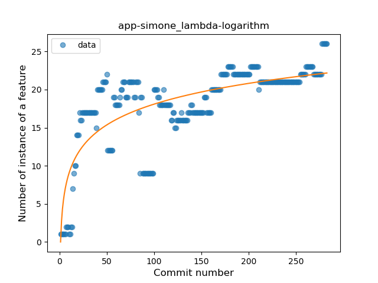
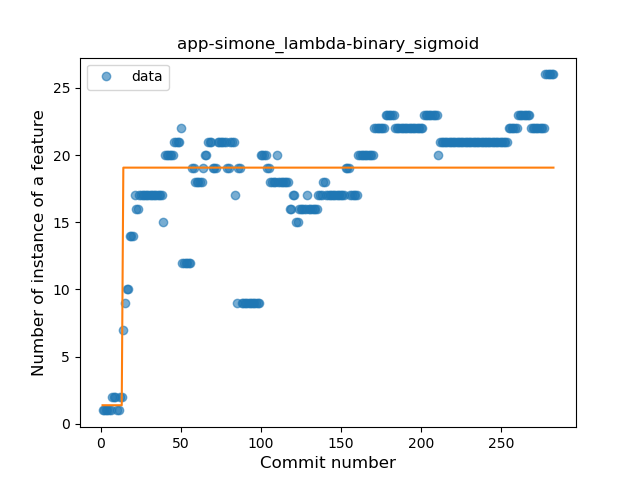
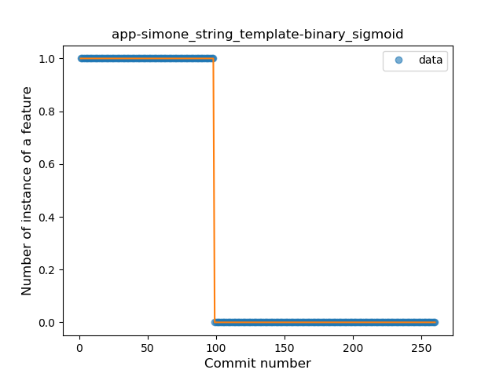
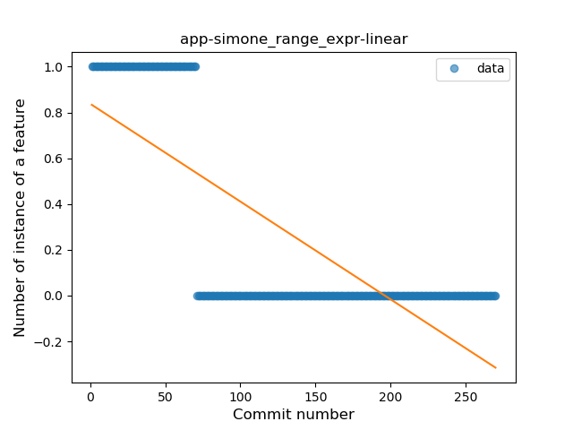
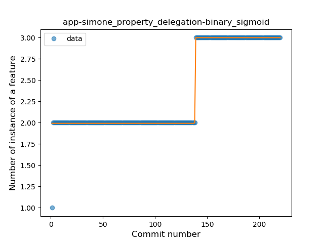
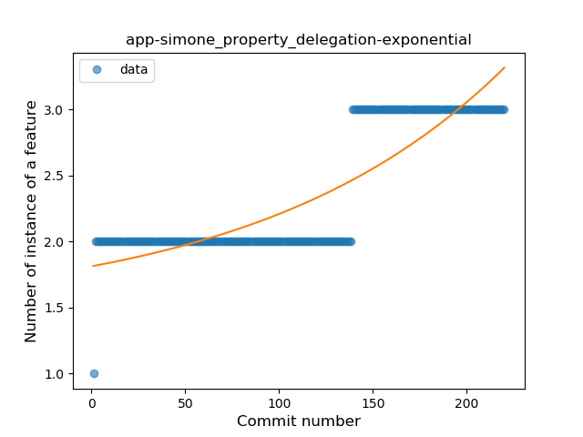

## app-simone
----
#### Metrics provided by Detekt
* Number of lines of code 2253
* Number of Kotlin files: 37
* Cyclomatic complexity: 248
* Cyclomatic complexity by thousands of lines: 272 

----
**11** features analyzed

*	<a href="#type_inference">Type Inference</a> 
*	<a href="#lambda">Lambda</a> 
*	<a href="#safe_call">Safe Call</a> 
*	<a href="#when_expr">When expression</a> 
*	<a href="#unsafe_call">Unsafe Call</a> 
*	<a href="#companion_object">Companion Object</a> 
*	<a href="#string_template">String Template</a> 
*	<a href="#singleton">Singleton</a> 
*	<a href="#range_expr">Range Expression</a> 
*	<a href="#extension_function">Extension Function</a> 
*	<a href="#property_delegation">Property Delegation</a> 

### <a name="type_inference">Type Inference</a>
----
#### Functions
* **Constant Rise - Linear:** 
    * **R_Squared:** 0.86205045
* **Plateau Sudden Rise - Binary Sigmoid:** 
    * **R_Squared:** 0.70783156
* **Sudden Rise Plateau - Logarithm:** 
    * **R_Squared:** 0.61144359

**Plots** :chart_with_upwards_trend:
-----

### <a name="lambda">Lambda</a>
----
#### Functions
* **Sudden Rise Plateau - Logarithm:** 
    * **R_Squared:** 0.59907534
* **Plateau Sudden Rise - Binary Sigmoid:** 
    * **R_Squared:** 0.50967591
* **Constant Rise - Linear:** 
    * **R_Squared:** 0.45249503

**Plots** :chart_with_upwards_trend:
-----

### <a name="safe_call">Safe Call</a>
----
#### Functions
* **Constant Rise - Linear:** 
    * **R_Squared:** 0.86166191
* **Sudden Rise - Exponential:** 
    * **R_Squared:** 0.86740285
* **Plateau Sudden Rise - Binary Sigmoid:** 
    * **R_Squared:** 0.67704705
* **Sudden Rise Plateau - Logarithm:** 
    * **R_Squared:** 0.38062661

**Plots** :chart_with_upwards_trend:
-----

### <a name="when_expr">When expression</a>
----
#### Functions
* **Constant Rise - Linear:** 
    * **R_Squared:** 0.71529274
* **Sudden Rise Plateau - Logarithm:** 
    * **R_Squared:** 0.46852797

**Plots** :chart_with_upwards_trend:
-----

### <a name="unsafe_call">Unsafe Call</a>
----
#### Functions
* **Sudden Rise - Exponential:** 
    * **R_Squared:** 0.31349718
* **Constant Rise - Linear:** 
    * **R_Squared:** 0.26495863
* **Sudden Rise Plateau - Logarithm:** 
    * **R_Squared:** 0.15941225

**Plots** :chart_with_upwards_trend:
-----

### <a name="companion_object">Companion Object</a>
----
#### Functions
* **Constant Rise - Linear:** 
    * **R_Squared:** 0.92939054
* **Plateau Gradual Rise - Sigmoid:** 
    * **R_Squared:** 0.93359729
* **Sudden Rise Plateau - Logarithm:** 
    * **R_Squared:** 0.53556262

**Plots** :chart_with_upwards_trend:
-----

### <a name="string_template">String Template</a>
----
#### Functions
* **Plateau Sudden Decline - Binary Sigmoid:** 
    * **R_Squared:** 1.0
* **Sudden Decline - Exponential:** 
    * **R_Squared:** 0.75503655
* **Constant Decline - Linear:** 
    * **R_Squared:** 0.70456664
* **Sudden Rise Plateau - Logarithm:** 
    * **R_Squared:** -0.0

**Plots** :chart_with_upwards_trend:
-----

### <a name="singleton">Singleton</a>
----
#### Functions
* **Plateau Gradual Rise - Sigmoid:** 
    * **R_Squared:** 0.90670086
* **Sudden Rise - Exponential:** 
    * **R_Squared:** 0.88972781
* **Constant Rise - Linear:** 
    * **R_Squared:** 0.71422476
* **Sudden Rise Plateau - Logarithm:** 
    * **R_Squared:** 0.38483619

**Plots** :chart_with_upwards_trend:
-----

### <a name="range_expr">Range Expression</a>
----
#### Functions
* **Plateau Sudden Decline - Binary Sigmoid:** 
    * **R_Squared:** 1.0
* **Sudden Decline - Exponential:** 
    * **R_Squared:** 0.76881603
* **Constant Decline - Linear:** 
    * **R_Squared:** 0.57613959
* **Sudden Rise Plateau - Logarithm:** 
    * **R_Squared:** -0.0

**Plots** :chart_with_upwards_trend:
-----

### <a name="extension_function">Extension Function</a>
----
#### Functions
* **Constant Decline - Linear:** 
    * **R_Squared:** 0.703346
* **Sudden Rise Plateau - Logarithm:** 
    * **R_Squared:** -0.0

**Plots** :chart_with_upwards_trend:
-----

### <a name="property_delegation">Property Delegation</a>
----
#### Functions
* **Plateau Sudden Rise - Binary Sigmoid:** 
    * **R_Squared:** 0.98133224
* **Sudden Rise - Exponential:** 
    * **R_Squared:** 0.75110567
* **Constant Rise - Linear:** 
    * **R_Squared:** 0.70497112
* **Sudden Rise Plateau - Logarithm:** 
    * **R_Squared:** 0.42885084

**Plots** :chart_with_upwards_trend:
-----

