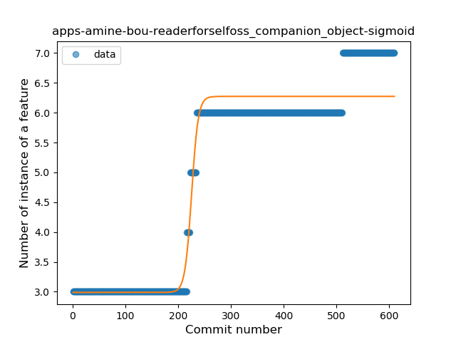
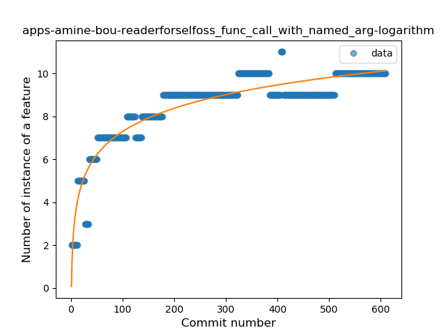

## apps-amine-bou-readerforselfoss
----
#### Metrics provided by Detekt
* Number of lines of code 6231
* Number of Kotlin files: 51
* Cyclomatic complexity: 791
* Cyclomatic complexity by thousands of lines: 207 

----
**13** features analyzed

*	<a href="#type_inference">Type Inference</a> 
*	<a href="#lambda">Lambda</a> 
*	<a href="#safe_call">Safe Call</a> 
*	<a href="#when_expr">When expression</a> 
*	<a href="#unsafe_call">Unsafe Call</a> 
*	<a href="#companion_object">Companion Object</a> 
*	<a href="#string_template">String Template</a> 
*	<a href="#func_with_default_value">Function with Default Value</a> 
*	<a href="#smart_cast">Smart Cast</a> 
*	<a href="#data_class">Data Class</a> 
*	<a href="#func_call_with_named_arg">Function call with Named Argument</a> 
*	<a href="#extension_function">Extension Function</a> 
*	<a href="#destructuring_declaration">Destructuring Declaration</a> 

### <a name="type_inference">Type Inference</a>
----
#### Functions
* **Sudden Rise - Exponential:** 
    * **R_Squared:** 0.84736568
* **Constant Rise - Linear:** 
    * **R_Squared:** 0.76584538
* **Sudden Rise Plateau - Logarithm:** 
    * **R_Squared:** 0.470419
* **Plateau Sudden Rise - Binary Sigmoid:** 
    * **R_Squared:** 0.09137421

**Plots** :chart_with_upwards_trend:
-----

### <a name="lambda">Lambda</a>
----
#### Functions
* **Sudden Rise - Exponential:** 
    * **R_Squared:** 0.96121425
* **Constant Rise - Linear:** 
    * **R_Squared:** 0.85563064
* **Sudden Rise Plateau - Logarithm:** 
    * **R_Squared:** 0.47380384

**Plots** :chart_with_upwards_trend:
-----

### <a name="safe_call">Safe Call</a>
----
#### Functions
* **Constant Rise - Linear:** 
    * **R_Squared:** 0.7430976
* **Sudden Rise Plateau - Logarithm:** 
    * **R_Squared:** 0.73435344

**Plots** :chart_with_upwards_trend:
-----

### <a name="when_expr">When expression</a>
----
#### Functions
* **Constant Rise - Linear:** 
    * **R_Squared:** 0.84744823
* **Sudden Rise Plateau - Logarithm:** 
    * **R_Squared:** 0.62822532

**Plots** :chart_with_upwards_trend:
-----

### <a name="unsafe_call">Unsafe Call</a>
----
#### Functions
* **Sudden Rise - Exponential:** 
    * **R_Squared:** 0.2167185
* **Constant Rise - Linear:** 
    * **R_Squared:** 0.05035941
* **Plateau Sudden Decline - Binary Sigmoid:** 
    * **R_Squared:** 0.05669914
* **Sudden Rise Plateau - Logarithm:** 
    * **R_Squared:** -0.0

**Plots** :chart_with_upwards_trend:
-----

### <a name="companion_object">Companion Object</a>
----
#### Functions
* **Plateau Gradual Rise - Sigmoid:** 
    * **R_Squared:** 0.95090738
* **Constant Rise - Linear:** 
    * **R_Squared:** 0.82337637
* **Sudden Rise Plateau - Logarithm:** 
    * **R_Squared:** 0.58798296

**Plots** :chart_with_upwards_trend:
-----

### <a name="string_template">String Template</a>
----
#### Functions
* **Constant Rise - Linear:** 
    * **R_Squared:** 0.85424654
* **Sudden Rise Plateau - Logarithm:** 
    * **R_Squared:** 0.56881813
* **Plateau Sudden Rise - Binary Sigmoid:** 
    * **R_Squared:** 0.22681654

**Plots** :chart_with_upwards_trend:
-----

### <a name="func_with_default_value">Function with Default Value</a>
----
#### Functions
* **Plateau Gradual Rise - Sigmoid:** 
    * **R_Squared:** 0.89828228
* **Sudden Rise Plateau - Logarithm:** 
    * **R_Squared:** 0.58690724
* **Constant Rise - Linear:** 
    * **R_Squared:** 0.5476444

**Plots** :chart_with_upwards_trend:
-----

### <a name="smart_cast">Smart Cast</a>
----
#### Functions
* **Plateau Gradual Rise - Sigmoid:** 
    * **R_Squared:** 0.91882818
* **Sudden Rise Plateau - Logarithm:** 
    * **R_Squared:** 0.55804241
* **Constant Rise - Linear:** 
    * **R_Squared:** 0.38783783

**Plots** :chart_with_upwards_trend:
-----

### <a name="data_class">Data Class</a>
----
#### Functions
* **Plateau Gradual Rise - Sigmoid:** 
    * **R_Squared:** 0.94954704
* **Sudden Rise - Exponential:** 
    * **R_Squared:** 0.88169351
* **Constant Rise - Linear:** 
    * **R_Squared:** 0.70541175
* **Sudden Rise Plateau - Logarithm:** 
    * **R_Squared:** 0.3670016

**Plots** :chart_with_upwards_trend:
-----

### <a name="func_call_with_named_arg">Function call with Named Argument</a>
----
#### Functions
* **Sudden Rise Plateau - Logarithm:** 
    * **R_Squared:** 0.87345378
* **Constant Rise - Linear:** 
    * **R_Squared:** 0.59077641

**Plots** :chart_with_upwards_trend:
-----

### <a name="extension_function">Extension Function</a>
----
#### Functions
* **Sudden Rise - Exponential:** 
    * **R_Squared:** 0.9310642
* **Constant Rise - Linear:** 
    * **R_Squared:** 0.90460037
* **Sudden Rise Plateau - Logarithm:** 
    * **R_Squared:** 0.67187795

**Plots** :chart_with_upwards_trend:
-----

### <a name="destructuring_declaration">Destructuring Declaration</a>
----
#### Functions
* **Plateau Sudden Rise - Binary Sigmoid:** 
    * **R_Squared:** 0.08470347
* **Constant Decline - Linear:** 
    * **R_Squared:** 0.02818553
* **Sudden Rise Plateau - Logarithm:** 
    * **R_Squared:** 0.00030181

**Plots** :chart_with_upwards_trend:
-----

