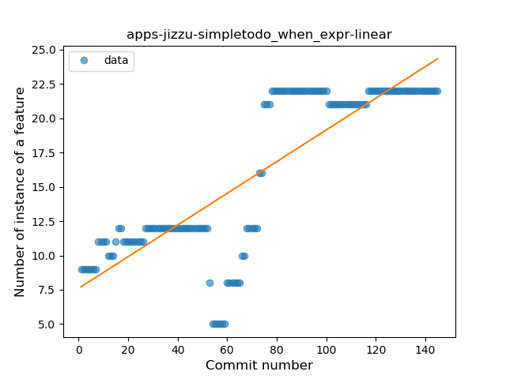
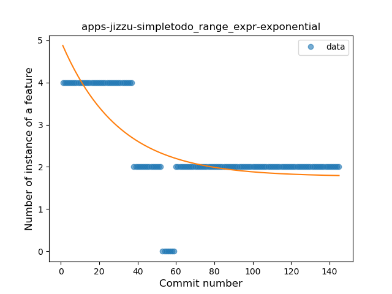
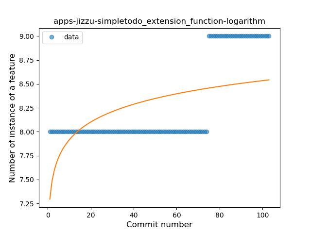

## apps-jizzu-simpletodo
----
#### Metrics provided by Detekt
* Number of lines of code 3207
* Number of Kotlin files: 47
* Cyclomatic complexity: 544
* Cyclomatic complexity by thousands of lines: 318 

----
**12** features analyzed

*	<a href="#type_inference">Type Inference</a> 
*	<a href="#lambda">Lambda</a> 
*	<a href="#safe_call">Safe Call</a> 
*	<a href="#when_expr">When expression</a> 
*	<a href="#unsafe_call">Unsafe Call</a> 
*	<a href="#companion_object">Companion Object</a> 
*	<a href="#string_template">String Template</a> 
*	<a href="#func_with_default_value">Function with Default Value</a> 
*	<a href="#range_expr">Range Expression</a> 
*	<a href="#extension_function">Extension Function</a> 
*	<a href="#property_delegation">Property Delegation</a> 
*	<a href="#destructuring_declaration">Destructuring Declaration</a> 

### <a name="type_inference">Type Inference</a>
----
#### Functions
* **Instability - Polinomial 3:** )
    * **R_Squared:** 0.42101176
* **Sudden Decline - Exponential:** 
    * **R_Squared:** 0.18942486
* **Constant Decline - Linear:** 
    * **R_Squared:** 0.00947586
* **Sudden Rise Plateau - Logarithm:** 
    * **R_Squared:** -0.0

**Plots** :chart_with_upwards_trend:
-----

### <a name="lambda">Lambda</a>
----
#### Functions
* **Constant Rise - Linear:** 
    * **R_Squared:** 0.848473
* **Sudden Rise Plateau - Logarithm:** 
    * **R_Squared:** 0.7836623

**Plots** :chart_with_upwards_trend:
-----

### <a name="safe_call">Safe Call</a>
----
#### Functions
* **Constant Rise - Linear:** 
    * **R_Squared:** 0.8575494
* **Plateau Gradual Rise - Sigmoid:** 
    * **R_Squared:** 0.78087915
* **Sudden Rise Plateau - Logarithm:** 
    * **R_Squared:** 0.56095381

**Plots** :chart_with_upwards_trend:
-----

### <a name="when_expr">When expression</a>
----
#### Functions
* **Constant Rise - Linear:** 
    * **R_Squared:** 0.68790888
* **Sudden Rise - Exponential:** 
    * **R_Squared:** 0.68874478
* **Sudden Rise Plateau - Logarithm:** 
    * **R_Squared:** 0.48260798

**Plots** :chart_with_upwards_trend:
-----

### <a name="unsafe_call">Unsafe Call</a>
----
#### Functions
* **Constant Decline - Linear:** 
    * **R_Squared:** 0.22156338
* **Sudden Rise Plateau - Logarithm:** 
    * **R_Squared:** -0.0

**Plots** :chart_with_upwards_trend:
-----

### <a name="companion_object">Companion Object</a>
----
#### Functions
* **Sudden Rise Plateau - Logarithm:** 
    * **R_Squared:** 0.27192785
* **Constant Rise - Linear:** 
    * **R_Squared:** 0.24808158
* **Plateau Gradual Rise - Sigmoid:** 
    * **R_Squared:** 0.23908022

**Plots** :chart_with_upwards_trend:
-----

### <a name="string_template">String Template</a>
----
#### Functions
* **Constant Decline - Linear:** 
    * **R_Squared:** 0.32809407
* **Sudden Rise - Exponential:** 
    * **R_Squared:** -0.0
* **Sudden Rise Plateau - Logarithm:** 
    * **R_Squared:** -0.0

**Plots** :chart_with_upwards_trend:
-----

### <a name="func_with_default_value">Function with Default Value</a>
----
#### Functions
* **Plateau Sudden Rise - Binary Sigmoid:** 
    * **R_Squared:** 1.0
* **Sudden Rise - Exponential:** 
    * **R_Squared:** 0.76219376
* **Constant Rise - Linear:** 
    * **R_Squared:** 0.64006791
* **Sudden Rise Plateau - Logarithm:** 
    * **R_Squared:** 0.29006743

**Plots** :chart_with_upwards_trend:
-----

### <a name="range_expr">Range Expression</a>
----
#### Functions
* **Plateau Sudden Decline - Binary Sigmoid:** 
    * **R_Squared:** 0.82689815
* **Sudden Decline - Exponential:** 
    * **R_Squared:** 0.58340921
* **Constant Decline - Linear:** 
    * **R_Squared:** 0.36773833
* **Sudden Rise Plateau - Logarithm:** 
    * **R_Squared:** -0.0

**Plots** :chart_with_upwards_trend:
-----

### <a name="extension_function">Extension Function</a>
----
#### Functions
* **Sudden Rise - Exponential:** 
    * **R_Squared:** 0.7657238
* **Constant Rise - Linear:** 
    * **R_Squared:** 0.60690045
* **Sudden Rise Plateau - Logarithm:** 
    * **R_Squared:** 0.30656507

**Plots** :chart_with_upwards_trend:
-----

### <a name="property_delegation">Property Delegation</a>
----
#### Functions
* **Constant Decline - Linear:** 
    * **R_Squared:** 0.54707549
* **Sudden Rise - Exponential:** 
    * **R_Squared:** 0.0
* **Sudden Rise Plateau - Logarithm:** 
    * **R_Squared:** -0.0

**Plots** :chart_with_upwards_trend:
-----

### <a name="destructuring_declaration">Destructuring Declaration</a>
----
#### Functions
* **Constant Rise - Linear:** 
    * **R_Squared:** 0.07578671
* **Sudden Rise Plateau - Logarithm:** 
    * **R_Squared:** 0.03320227

**Plots** :chart_with_upwards_trend:
-----

