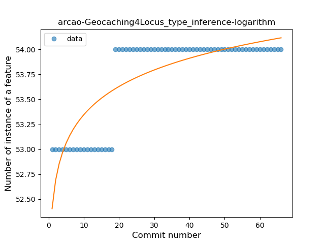
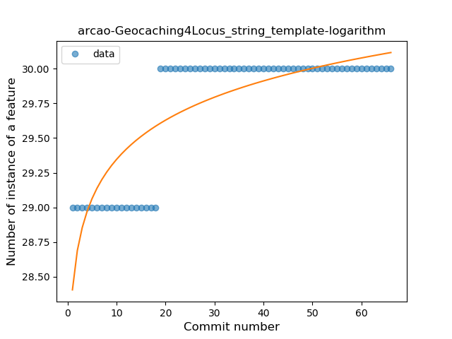
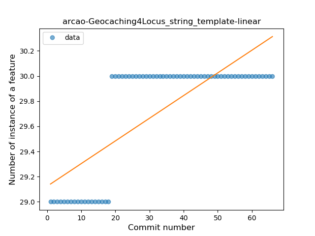

## arcao-Geocaching4Locus
----
#### Metrics provided by Detekt
* Number of lines of code 88
* Number of Kotlin files: 3
* Cyclomatic complexity: 0
* Cyclomatic complexity by thousands of lines: 0 

----
**2** features analyzed

*	<a href="#type_inference">Type Inference</a> 
*	<a href="#string_template">String Template</a> 

### <a name="type_inference">Type Inference</a>
----
#### Functions
* **Sudden Rise Plateau - Logarithm:** 
    * **R_Squared:** 0.68224963
* **Constant Rise - Linear:** 
    * **R_Squared:** 0.59517796

**Plots** :chart_with_upwards_trend:
-----

### <a name="string_template">String Template</a>
----
#### Functions
* **Sudden Rise Plateau - Logarithm:** 
    * **R_Squared:** 0.68224963
* **Constant Rise - Linear:** 
    * **R_Squared:** 0.59517796

**Plots** :chart_with_upwards_trend:
-----

