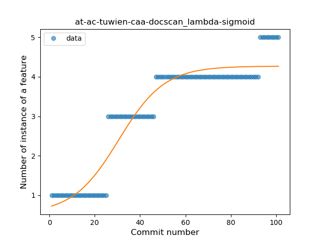
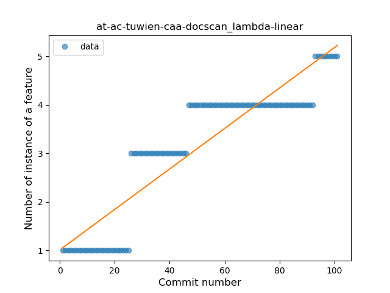
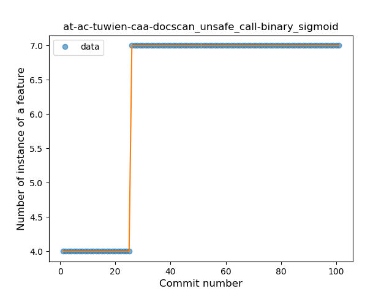

## at-ac-tuwien-caa-docscan
----
#### Metrics provided by Detekt
* Number of lines of code 745
* Number of Kotlin files: 11
* Cyclomatic complexity: 42
* Cyclomatic complexity by thousands of lines: 111 

----
**5** features analyzed

*	<a href="#type_inference">Type Inference</a> 
*	<a href="#lambda">Lambda</a> 
*	<a href="#safe_call">Safe Call</a> 
*	<a href="#when_expr">When expression</a> 
*	<a href="#unsafe_call">Unsafe Call</a> 

### <a name="type_inference">Type Inference</a>
----
#### Functions
* **Constant Rise - Linear:** 
    * **R_Squared:** 0.8429766
* **Sudden Rise Plateau - Logarithm:** 
    * **R_Squared:** 0.72109796
* **Plateau Sudden Rise - Binary Sigmoid:** 
    * **R_Squared:** 0.33896008

**Plots** :chart_with_upwards_trend:
-----

### <a name="lambda">Lambda</a>
----
#### Functions
* **Plateau Gradual Rise - Sigmoid:** 
    * **R_Squared:** 0.90884415
* **Constant Rise - Linear:** 
    * **R_Squared:** 0.82864265
* **Sudden Rise Plateau - Logarithm:** 
    * **R_Squared:** 0.69698298

**Plots** :chart_with_upwards_trend:
-----

### <a name="safe_call">Safe Call</a>
----
#### Functions
* **Plateau Sudden Rise - Binary Sigmoid:** 
    * **R_Squared:** 1.0
* **Sudden Rise Plateau - Logarithm:** 
    * **R_Squared:** 0.67116199
* **Constant Rise - Linear:** 
    * **R_Squared:** 0.55882353

**Plots** :chart_with_upwards_trend:
-----

### <a name="when_expr">When expression</a>
----
#### Functions
* **Plateau Sudden Rise - Binary Sigmoid:** 
    * **R_Squared:** 1.0
* **Sudden Rise - Exponential:** 
    * **R_Squared:** 0.78652575
* **Constant Rise - Linear:** 
    * **R_Squared:** 0.41071429
* **Sudden Rise Plateau - Logarithm:** 
    * **R_Squared:** 0.18815664

**Plots** :chart_with_upwards_trend:
-----

### <a name="unsafe_call">Unsafe Call</a>
----
#### Functions
* **Plateau Sudden Rise - Binary Sigmoid:** 
    * **R_Squared:** 1.0
* **Sudden Rise Plateau - Logarithm:** 
    * **R_Squared:** 0.67852941
* **Constant Rise - Linear:** 
    * **R_Squared:** 0.55882353

**Plots** :chart_with_upwards_trend:
-----

