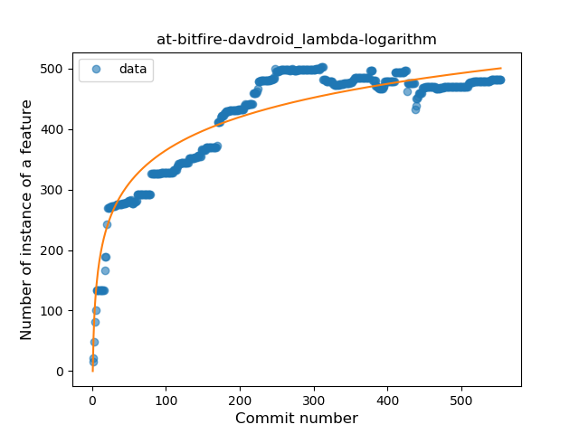
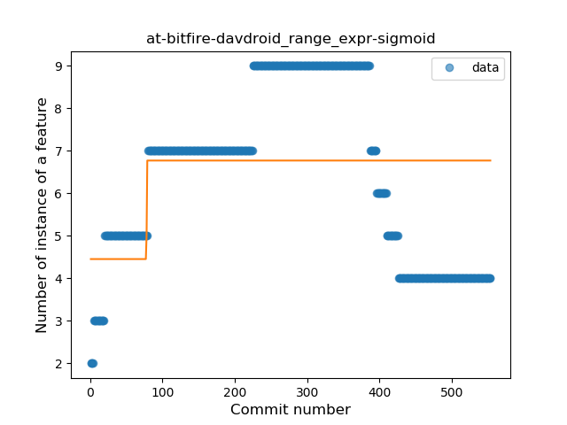
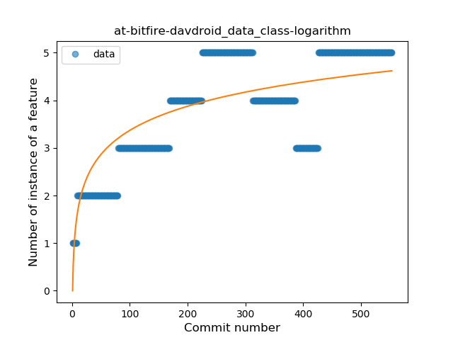
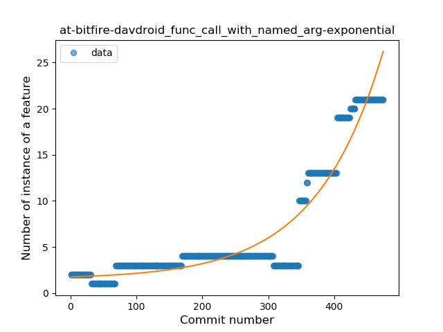
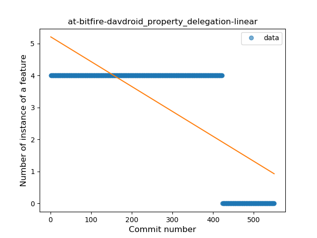

## at-bitfire-davdroid
----
#### Metrics provided by Detekt
* Number of lines of code 12862
* Number of Kotlin files: 97
* Cyclomatic complexity: 1811
* Cyclomatic complexity by thousands of lines: 270 

----
**17** features analyzed

*	<a href="#type_inference">Type Inference</a> 
*	<a href="#lambda">Lambda</a> 
*	<a href="#safe_call">Safe Call</a> 
*	<a href="#when_expr">When expression</a> 
*	<a href="#unsafe_call">Unsafe Call</a> 
*	<a href="#companion_object">Companion Object</a> 
*	<a href="#string_template">String Template</a> 
*	<a href="#func_with_default_value">Function with Default Value</a> 
*	<a href="#singleton">Singleton</a> 
*	<a href="#range_expr">Range Expression</a> 
*	<a href="#smart_cast">Smart Cast</a> 
*	<a href="#data_class">Data Class</a> 
*	<a href="#func_call_with_named_arg">Function call with Named Argument</a> 
*	<a href="#extension_function">Extension Function</a> 
*	<a href="#property_delegation">Property Delegation</a> 
*	<a href="#destructuring_declaration">Destructuring Declaration</a> 
*	<a href="#super_delegation">Super Delegation</a> 

### <a name="type_inference">Type Inference</a>
----
#### Functions
* **Sudden Rise Plateau - Logarithm:** 
    * **R_Squared:** 0.60914322
* **Constant Rise - Linear:** 
    * **R_Squared:** 0.1977152

**Plots** :chart_with_upwards_trend:
-----

### <a name="lambda">Lambda</a>
----
#### Functions
* **Sudden Rise Plateau - Logarithm:** 
    * **R_Squared:** 0.88476999
* **Plateau Sudden Rise - Binary Sigmoid:** 
    * **R_Squared:** 0.70358791
* **Constant Rise - Linear:** 
    * **R_Squared:** 0.63115693

**Plots** :chart_with_upwards_trend:
-----

### <a name="safe_call">Safe Call</a>
----
#### Functions
* **Sudden Rise Plateau - Logarithm:** 
    * **R_Squared:** 0.45951312
* **Constant Rise - Linear:** 
    * **R_Squared:** 0.11363996
* **Plateau Sudden Decline - Binary Sigmoid:** 
    * **R_Squared:** 0.00070186

**Plots** :chart_with_upwards_trend:
-----

### <a name="when_expr">When expression</a>
----
#### Functions
* **Sudden Rise Plateau - Logarithm:** 
    * **R_Squared:** 0.79914544
* **Constant Rise - Linear:** 
    * **R_Squared:** 0.58889328

**Plots** :chart_with_upwards_trend:
-----

### <a name="unsafe_call">Unsafe Call</a>
----
#### Functions
* **Sudden Rise Plateau - Logarithm:** 
    * **R_Squared:** 0.75618189
* **Plateau Gradual Rise - Sigmoid:** 
    * **R_Squared:** 0.71562934
* **Constant Rise - Linear:** 
    * **R_Squared:** 0.65545155

**Plots** :chart_with_upwards_trend:
-----

### <a name="companion_object">Companion Object</a>
----
#### Functions
* **Sudden Rise Plateau - Logarithm:** 
    * **R_Squared:** 0.60785689
* **Constant Rise - Linear:** 
    * **R_Squared:** 0.20875127

**Plots** :chart_with_upwards_trend:
-----

### <a name="string_template">String Template</a>
----
#### Functions
* **Sudden Rise Plateau - Logarithm:** 
    * **R_Squared:** 0.13053944
* **Plateau Sudden Decline - Binary Sigmoid:** 
    * **R_Squared:** 0.04584888
* **Constant Decline - Linear:** 
    * **R_Squared:** 0.00452755
* **Sudden Decline - Exponential:** 
    * **R_Squared:** -0.0

**Plots** :chart_with_upwards_trend:
-----

### <a name="func_with_default_value">Function with Default Value</a>
----
#### Functions
* **Plateau Gradual Rise - Sigmoid:** 
    * **R_Squared:** 0.947706
* **Constant Rise - Linear:** 
    * **R_Squared:** 0.73923759
* **Sudden Rise Plateau - Logarithm:** 
    * **R_Squared:** 0.52778819

**Plots** :chart_with_upwards_trend:
-----

### <a name="singleton">Singleton</a>
----
#### Functions
* **Sudden Rise - Exponential:** 
    * **R_Squared:** 0.86551304
* **Plateau Gradual Rise - Sigmoid:** 
    * **R_Squared:** 0.87477577
* **Constant Rise - Linear:** 
    * **R_Squared:** 0.76798693
* **Sudden Rise Plateau - Logarithm:** 
    * **R_Squared:** 0.5383734

**Plots** :chart_with_upwards_trend:
-----

### <a name="range_expr">Range Expression</a>
----
#### Functions
* **Plateau Gradual Rise - Sigmoid:** 
    * **R_Squared:** 0.15648399
* **Constant Decline - Linear:** 
    * **R_Squared:** 0.02777201
* **Sudden Rise Plateau - Logarithm:** 
    * **R_Squared:** 0.03450912

**Plots** :chart_with_upwards_trend:
-----

### <a name="smart_cast">Smart Cast</a>
----
#### Functions
* **Plateau Gradual Rise - Sigmoid:** 
    * **R_Squared:** 0.76413169
* **Sudden Rise Plateau - Logarithm:** 
    * **R_Squared:** 0.58498025
* **Constant Rise - Linear:** 
    * **R_Squared:** 0.42478596

**Plots** :chart_with_upwards_trend:
-----

### <a name="data_class">Data Class</a>
----
#### Functions
* **Plateau Gradual Rise - Sigmoid:** 
    * **R_Squared:** 0.7202077
* **Sudden Rise Plateau - Logarithm:** 
    * **R_Squared:** 0.62742764
* **Constant Rise - Linear:** 
    * **R_Squared:** 0.57413192

**Plots** :chart_with_upwards_trend:
-----

### <a name="func_call_with_named_arg">Function call with Named Argument</a>
----
#### Functions
* **Sudden Rise - Exponential:** 
    * **R_Squared:** 0.9077706
* **Constant Rise - Linear:** 
    * **R_Squared:** 0.66868149
* **Sudden Rise Plateau - Logarithm:** 
    * **R_Squared:** 0.19678773

**Plots** :chart_with_upwards_trend:
-----

### <a name="extension_function">Extension Function</a>
----
#### Functions
* **Plateau Gradual Rise - Sigmoid:** 
    * **R_Squared:** 0.99183936
* **Sudden Rise - Exponential:** 
    * **R_Squared:** 0.79900179
* **Constant Rise - Linear:** 
    * **R_Squared:** 0.5841114
* **Sudden Rise Plateau - Logarithm:** 
    * **R_Squared:** 0.23128327

**Plots** :chart_with_upwards_trend:
-----

### <a name="property_delegation">Property Delegation</a>
----
#### Functions
* **Plateau Sudden Decline - Binary Sigmoid:** 
    * **R_Squared:** 1.0
* **Constant Decline - Linear:** 
    * **R_Squared:** 0.53569764
* **Sudden Rise Plateau - Logarithm:** 
    * **R_Squared:** -0.0

**Plots** :chart_with_upwards_trend:
-----

### <a name="destructuring_declaration">Destructuring Declaration</a>
----
#### Functions
* **Constant Decline - Linear:** 
    * **R_Squared:** 0.41339134
* **Plateau Sudden Rise - Binary Sigmoid:** 
    * **R_Squared:** 0.0402997
* **Sudden Rise Plateau - Logarithm:** 
    * **R_Squared:** 0.0

**Plots** :chart_with_upwards_trend:
-----

### <a name="super_delegation">Super Delegation</a>
----
#### Functions
* **Sudden Decline - Exponential:** 
    * **R_Squared:** 0.26529957
* **Constant Decline - Linear:** 
    * **R_Squared:** 0.195962
* **Sudden Rise Plateau - Logarithm:** 
    * **R_Squared:** -0.0

**Plots** :chart_with_upwards_trend:
-----

