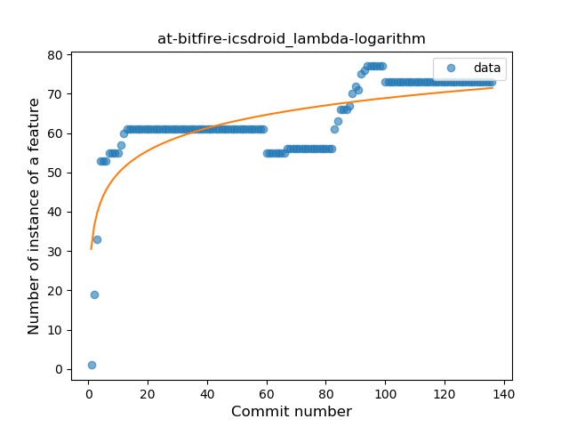
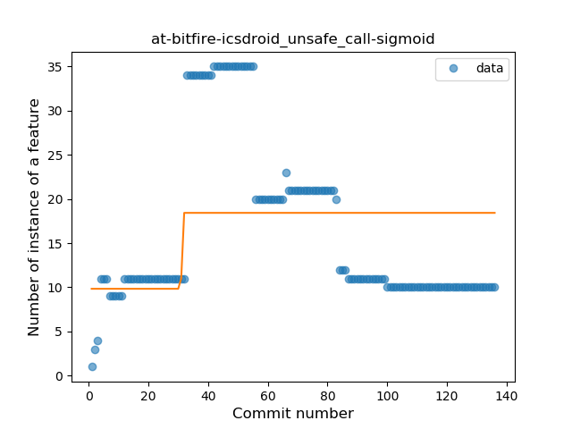
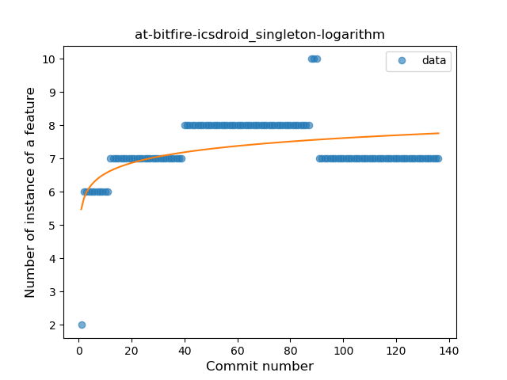
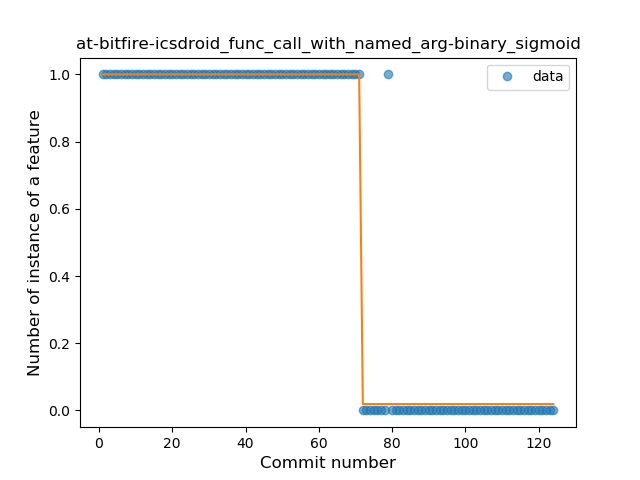
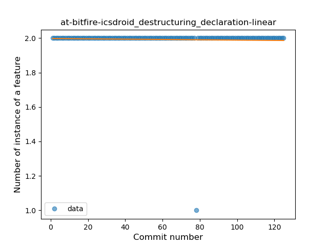

## at-bitfire-icsdroid
----
#### Metrics provided by Detekt
* Number of lines of code 2496
* Number of Kotlin files: 28
* Cyclomatic complexity: 321
* Cyclomatic complexity by thousands of lines: 264 

----
**12** features analyzed

*	<a href="#type_inference">Type Inference</a> 
*	<a href="#lambda">Lambda</a> 
*	<a href="#safe_call">Safe Call</a> 
*	<a href="#when_expr">When expression</a> 
*	<a href="#unsafe_call">Unsafe Call</a> 
*	<a href="#companion_object">Companion Object</a> 
*	<a href="#string_template">String Template</a> 
*	<a href="#func_with_default_value">Function with Default Value</a> 
*	<a href="#singleton">Singleton</a> 
*	<a href="#smart_cast">Smart Cast</a> 
*	<a href="#func_call_with_named_arg">Function call with Named Argument</a> 
*	<a href="#destructuring_declaration">Destructuring Declaration</a> 

### <a name="type_inference">Type Inference</a>
----
#### Functions
* **Instability - Polinomial 3:** )
    * **R_Squared:** 0.51141673
* **Sudden Rise Plateau - Logarithm:** 
    * **R_Squared:** 0.23500134
* **Constant Rise - Linear:** 
    * **R_Squared:** 0.0095008

**Plots** :chart_with_upwards_trend:
-----

### <a name="lambda">Lambda</a>
----
#### Functions
* **Sudden Rise Plateau - Logarithm:** 
    * **R_Squared:** 0.58724942
* **Constant Rise - Linear:** 
    * **R_Squared:** 0.49053039
* **Plateau Sudden Rise - Binary Sigmoid:** 
    * **R_Squared:** 0.19208462

**Plots** :chart_with_upwards_trend:
-----

### <a name="safe_call">Safe Call</a>
----
#### Functions
* **Instability - Polinomial 3:** )
    * **R_Squared:** 0.72702047
* **Plateau Sudden Decline - Binary Sigmoid:** 
    * **R_Squared:** 0.35876729
* **Constant Decline - Linear:** 
    * **R_Squared:** 0.17074421
* **Sudden Decline - Exponential:** 
    * **R_Squared:** -0.0
* **Sudden Rise Plateau - Logarithm:** 
    * **R_Squared:** -0.0

**Plots** :chart_with_upwards_trend:
-----

### <a name="when_expr">When expression</a>
----
#### Functions
* **Plateau Gradual Rise - Sigmoid:** 
    * **R_Squared:** 0.31878496
* **Constant Decline - Linear:** 
    * **R_Squared:** 0.17253322
* **Sudden Rise Plateau - Logarithm:** 
    * **R_Squared:** 0.0

**Plots** :chart_with_upwards_trend:
-----

### <a name="unsafe_call">Unsafe Call</a>
----
#### Functions
* **Instability - Polinomial 3:** )
    * **R_Squared:** 0.65172029
* **Plateau Gradual Rise - Sigmoid:** 
    * **R_Squared:** 0.15053749
* **Constant Decline - Linear:** 
    * **R_Squared:** 0.06317396
* **Sudden Decline - Exponential:** 
    * **R_Squared:** 0.0
* **Sudden Rise Plateau - Logarithm:** 
    * **R_Squared:** 0.00322757

**Plots** :chart_with_upwards_trend:
-----

### <a name="companion_object">Companion Object</a>
----
#### Functions
* **Constant Decline - Linear:** 
    * **R_Squared:** 0.08995027
* **Plateau Sudden Rise - Binary Sigmoid:** 
    * **R_Squared:** 0.02866438
* **Sudden Rise Plateau - Logarithm:** 
    * **R_Squared:** 0.00216199

**Plots** :chart_with_upwards_trend:
-----

### <a name="string_template">String Template</a>
----
#### Functions
* **Plateau Sudden Rise - Binary Sigmoid:** 
    * **R_Squared:** 0.12107526
* **Sudden Rise Plateau - Logarithm:** 
    * **R_Squared:** 0.08076614
* **Constant Decline - Linear:** 
    * **R_Squared:** 0.01867084

**Plots** :chart_with_upwards_trend:
-----

### <a name="func_with_default_value">Function with Default Value</a>
----
#### Functions
* **Plateau Gradual Decline - Sigmoid:** 
    * **R_Squared:** 0.93602652
* **Constant Decline - Linear:** 
    * **R_Squared:** 0.64244007
* **Sudden Rise Plateau - Logarithm:** 
    * **R_Squared:** -0.0

**Plots** :chart_with_upwards_trend:
-----

### <a name="singleton">Singleton</a>
----
#### Functions
* **Sudden Rise Plateau - Logarithm:** 
    * **R_Squared:** 0.26623551
* **Constant Rise - Linear:** 
    * **R_Squared:** 0.04000347

**Plots** :chart_with_upwards_trend:
-----

### <a name="smart_cast">Smart Cast</a>
----
#### Functions
* **Constant Decline - Linear:** 
    * **R_Squared:** 0.46855205
* **Sudden Rise Plateau - Logarithm:** 
    * **R_Squared:** -0.0
* **Plateau Sudden Rise - Binary Sigmoid:** 
    * **R_Squared:** 0.00211054

**Plots** :chart_with_upwards_trend:
-----

### <a name="func_call_with_named_arg">Function call with Named Argument</a>
----
#### Functions
* **Plateau Sudden Decline - Binary Sigmoid:** 
    * **R_Squared:** 0.96750524
* **Constant Decline - Linear:** 
    * **R_Squared:** 0.72508339
* **Sudden Rise Plateau - Logarithm:** 
    * **R_Squared:** -0.0

**Plots** :chart_with_upwards_trend:
-----

### <a name="destructuring_declaration">Destructuring Declaration</a>
----
#### Functions
* **Constant Decline - Linear:** 
    * **R_Squared:** 0.00139364
* **Sudden Decline - Exponential:** 
    * **R_Squared:** 0.00140296
* **Sudden Rise Plateau - Logarithm:** 
    * **R_Squared:** -0.0

**Plots** :chart_with_upwards_trend:
-----

