## bassph-bassph-app-android
----
#### Metrics provided by Detekt
* Number of lines of code 2329
* Number of Kotlin files: 51
* Cyclomatic complexity: 262
* Cyclomatic complexity by thousands of lines: 239 

----
**7** features analyzed

*	<a href="#type_inference">Type Inference</a> 
*	<a href="#lambda">Lambda</a> 
*	<a href="#safe_call">Safe Call</a> 
*	<a href="#unsafe_call">Unsafe Call</a> 
*	<a href="#string_template">String Template</a> 
*	<a href="#func_with_default_value">Function with Default Value</a> 
*	<a href="#func_call_with_named_arg">Function call with Named Argument</a> 

### <a name="type_inference">Type Inference</a>
----
#### Functions
* **Instability - Polinomial 3:** )
    * **R_Squared:** 0.93897012
* **Instability - Polinomial 4:** 
    * **R_Squared:** 0.94324221
* **Constant Rise - Linear:** 
    * **R_Squared:** 0.84106802
* **Sudden Rise - Exponential:** 
    * **R_Squared:** 0.84417602
* **Sudden Rise Plateau - Logarithm:** 
    * **R_Squared:** 0.66805908

**Plots** :chart_with_upwards_trend:
-----

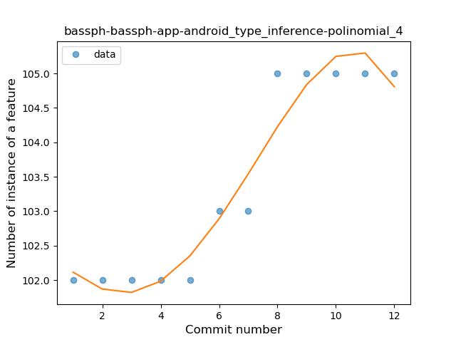
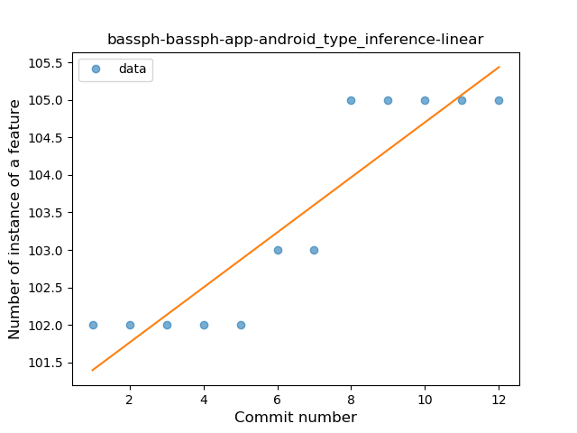
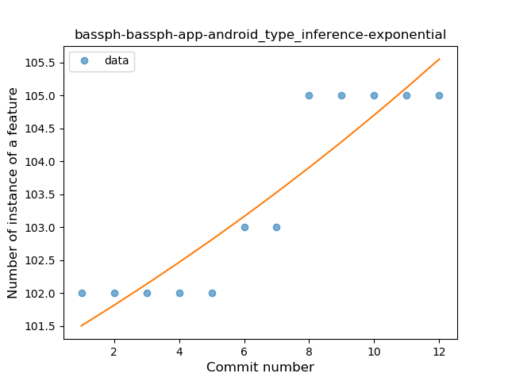
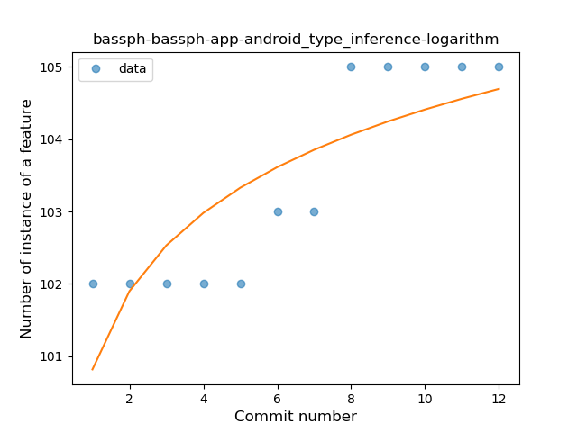
### <a name="lambda">Lambda</a>
----
#### Functions
* **Instability - Polinomial 3:** )
    * **R_Squared:** 0.87115799
* **Constant Rise - Linear:** 
    * **R_Squared:** 0.81959935
* **Sudden Rise - Exponential:** 
    * **R_Squared:** 0.82365344
* **Sudden Rise Plateau - Logarithm:** 
    * **R_Squared:** 0.66888394

**Plots** :chart_with_upwards_trend:
-----

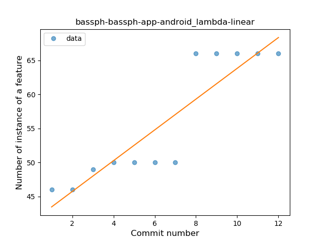
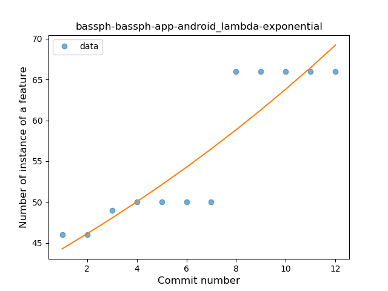
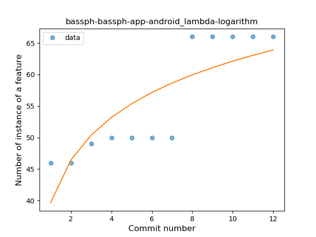
### <a name="safe_call">Safe Call</a>
----
#### Functions
* **Instability - Polinomial 3:** )
    * **R_Squared:** 0.85341098
* **Instability - Polinomial 4:** 
    * **R_Squared:** 0.85622838
* **Constant Decline - Linear:** 
    * **R_Squared:** 0.77232873
* **Sudden Rise Plateau - Logarithm:** 
    * **R_Squared:** -0.0

**Plots** :chart_with_upwards_trend:
-----

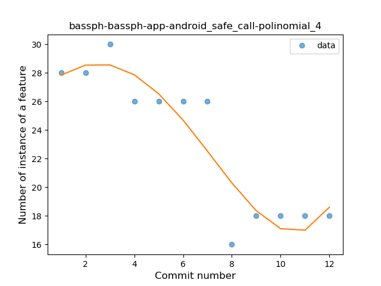
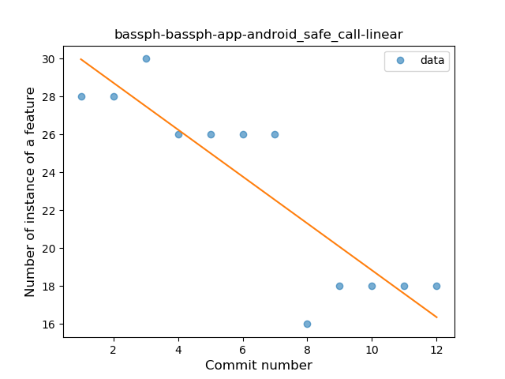
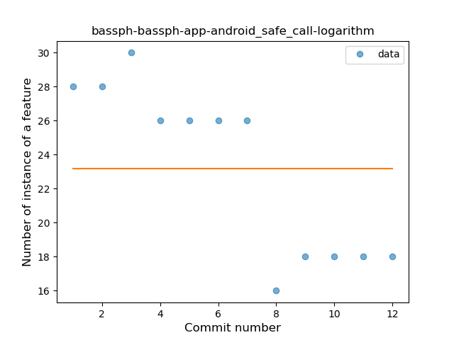
### <a name="unsafe_call">Unsafe Call</a>
----
#### Functions
* **Instability - Polinomial 4:** 
    * **R_Squared:** 0.88438228
* **Instability - Polinomial 3:** )
    * **R_Squared:** 0.85081585
* **Constant Decline - Linear:** 
    * **R_Squared:** 0.73426573
* **Sudden Rise Plateau - Logarithm:** 
    * **R_Squared:** -0.0

**Plots** :chart_with_upwards_trend:
-----

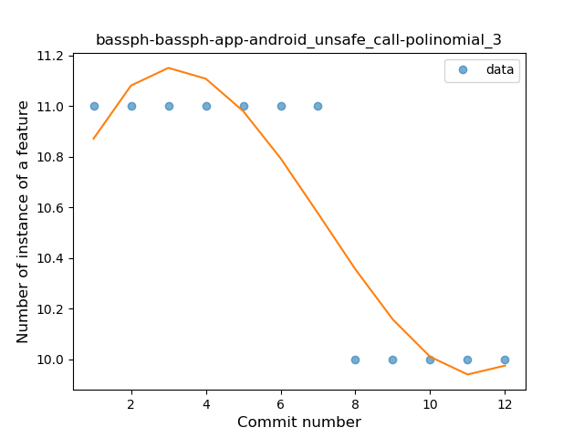
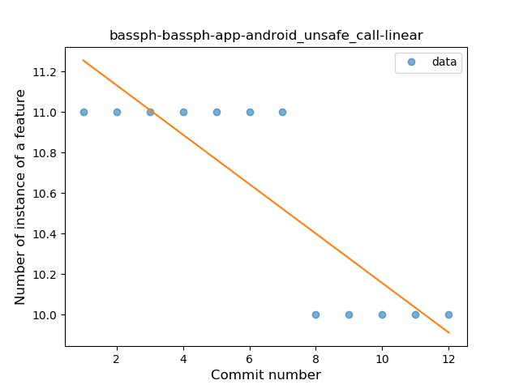
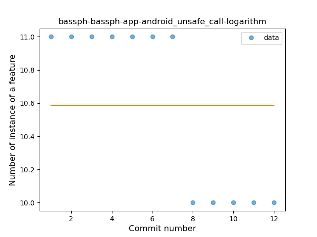
### <a name="string_template">String Template</a>
----
#### Functions
* **Plateau Sudden Rise - Binary Sigmoid:** 
    * **R_Squared:** 1.0
* **Instability - Polinomial 3:** )
    * **R_Squared:** 0.84415584
* **Instability - Polinomial 4:** 
    * **R_Squared:** 0.84685315
* **Sudden Rise Plateau - Logarithm:** 
    * **R_Squared:** 0.6644626
* **Constant Rise - Linear:** 
    * **R_Squared:** 0.41958042

**Plots** :chart_with_upwards_trend:
-----

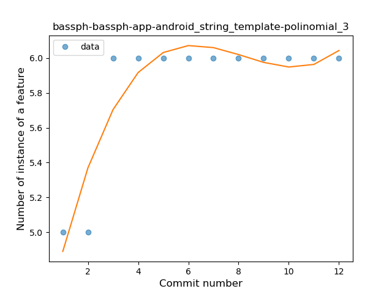
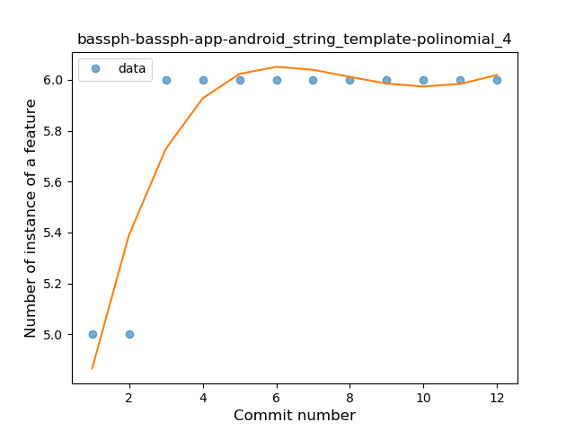
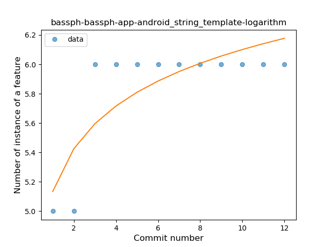
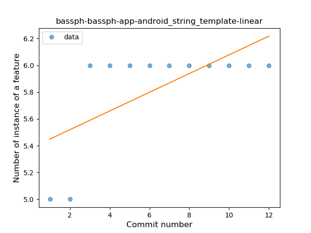
### <a name="func_with_default_value">Function with Default Value</a>
----
#### Functions
* **Plateau Sudden Rise - Binary Sigmoid:** 
    * **R_Squared:** 1.0
* **Instability - Polinomial 4:** 
    * **R_Squared:** 0.88438228
* **Instability - Polinomial 3:** )
    * **R_Squared:** 0.85081585
* **Sudden Rise - Exponential:** 
    * **R_Squared:** 0.75826496
* **Constant Rise - Linear:** 
    * **R_Squared:** 0.73426573
* **Sudden Rise Plateau - Logarithm:** 
    * **R_Squared:** 0.53589013

**Plots** :chart_with_upwards_trend:
-----

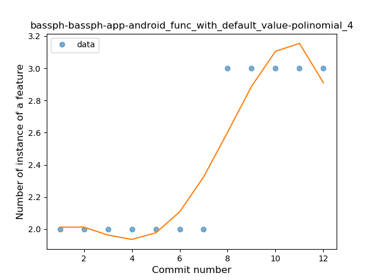
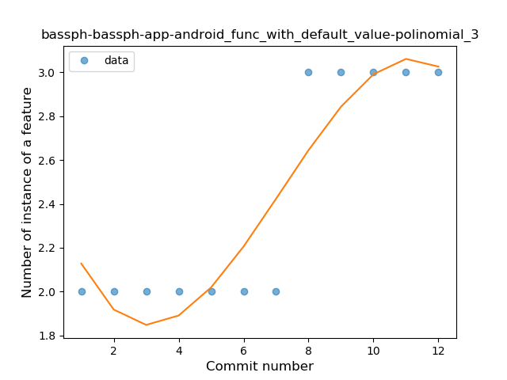

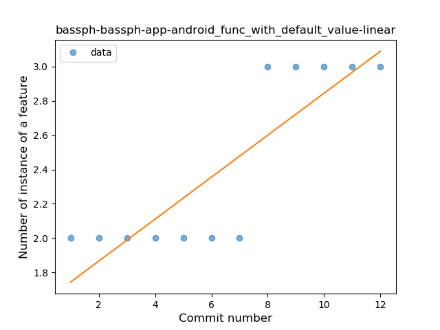
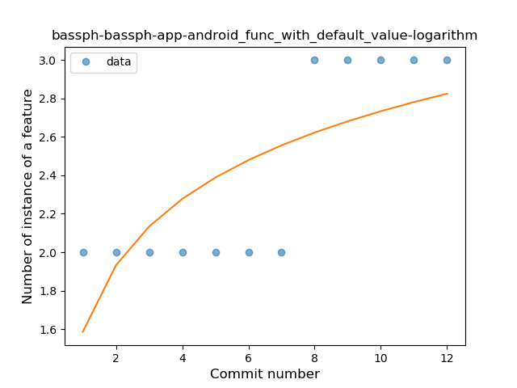
### <a name="func_call_with_named_arg">Function call with Named Argument</a>
----
#### Functions
* **Instability - Polinomial 4:** 
    * **R_Squared:** 0.88438228
* **Instability - Polinomial 3:** )
    * **R_Squared:** 0.85081585
* **Sudden Rise - Exponential:** 
    * **R_Squared:** 0.75826496
* **Constant Rise - Linear:** 
    * **R_Squared:** 0.73426573
* **Sudden Rise Plateau - Logarithm:** 
    * **R_Squared:** 0.53589013

**Plots** :chart_with_upwards_trend:
-----

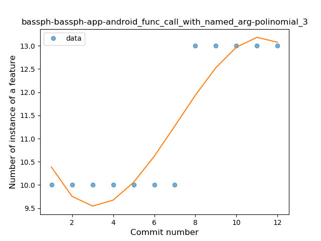
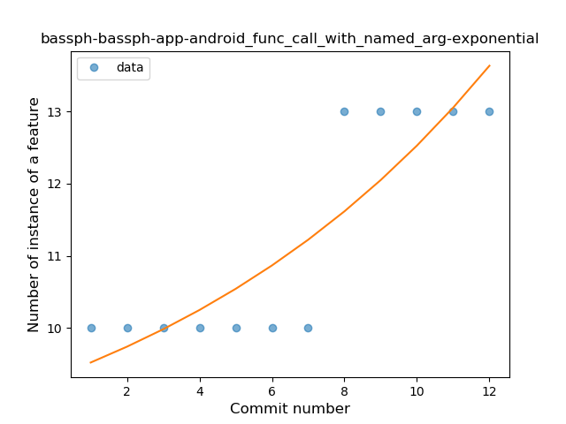
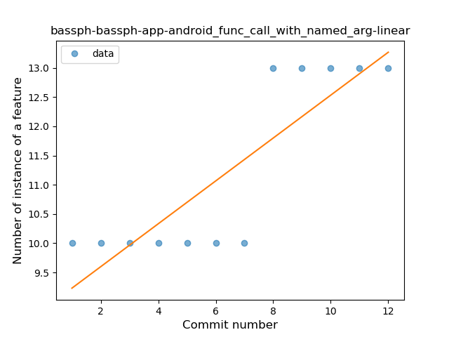
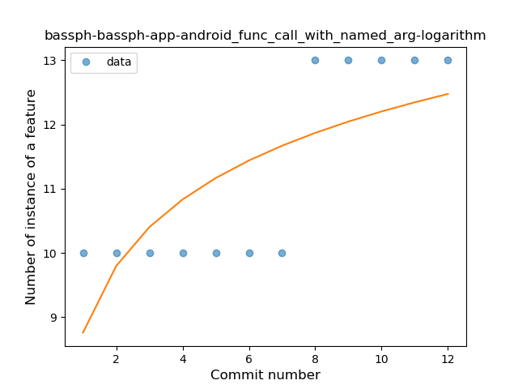
