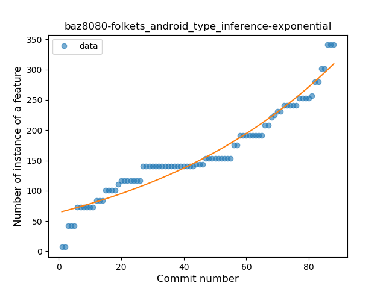
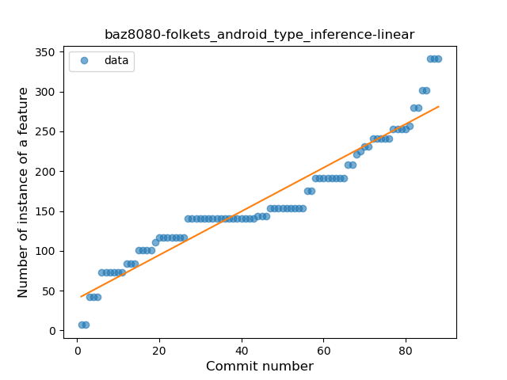
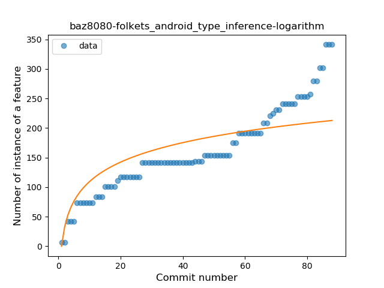
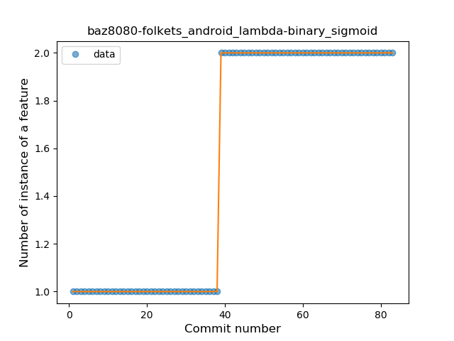
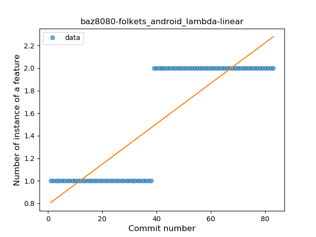
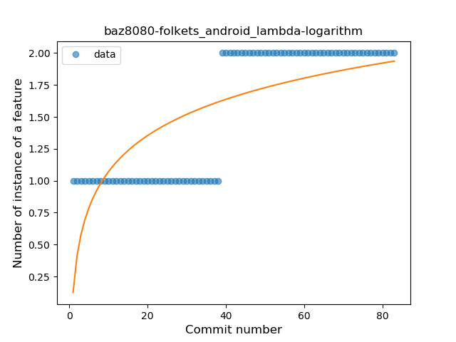

## baz8080-folkets_android
----
#### Metrics provided by Detekt
* Number of lines of code 2798
* Number of Kotlin files: 22
* Cyclomatic complexity: 266
* Cyclomatic complexity by thousands of lines: 160 

----
**2** features analyzed

*	<a href="#type_inference">Type Inference</a> 
*	<a href="#lambda">Lambda</a> 

### <a name="type_inference">Type Inference</a>
----
#### Functions
* **Sudden Rise - Exponential:** 
    * **R_Squared:** 0.94128005
* **Constant Rise - Linear:** 
    * **R_Squared:** 0.92176947
* **Sudden Rise Plateau - Logarithm:** 
    * **R_Squared:** 0.67820557

**Plots** :chart_with_upwards_trend:
-----

### <a name="lambda">Lambda</a>
----
#### Functions
* **Plateau Sudden Rise - Binary Sigmoid:** 
    * **R_Squared:** 1.0
* **Constant Rise - Linear:** 
    * **R_Squared:** 0.74477352
* **Sudden Rise Plateau - Logarithm:** 
    * **R_Squared:** 0.56454827

**Plots** :chart_with_upwards_trend:
-----

