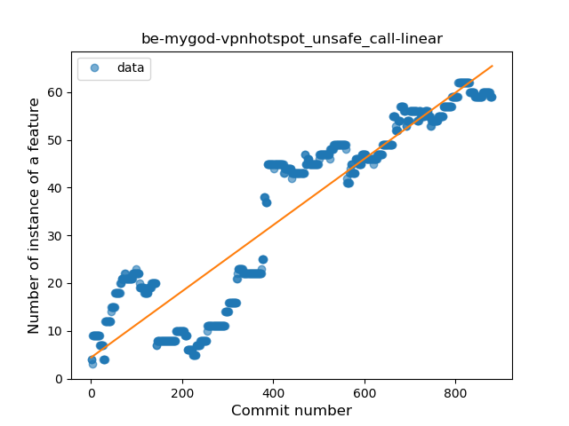
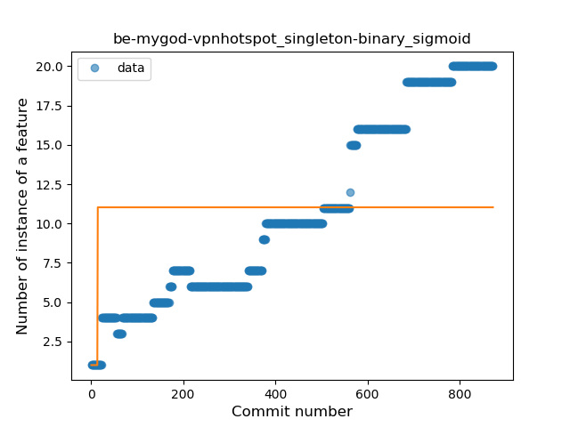
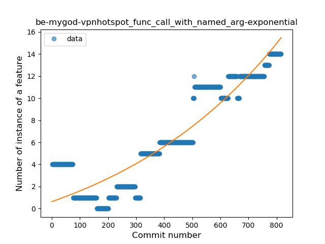
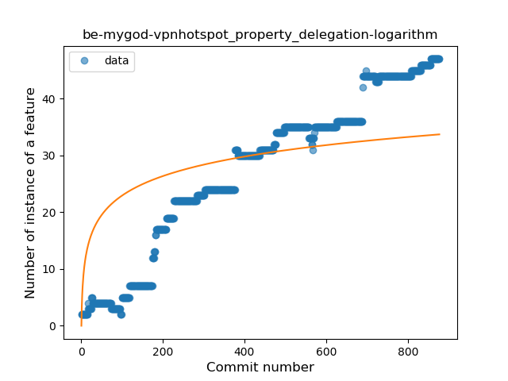
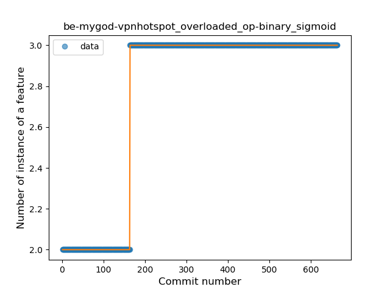
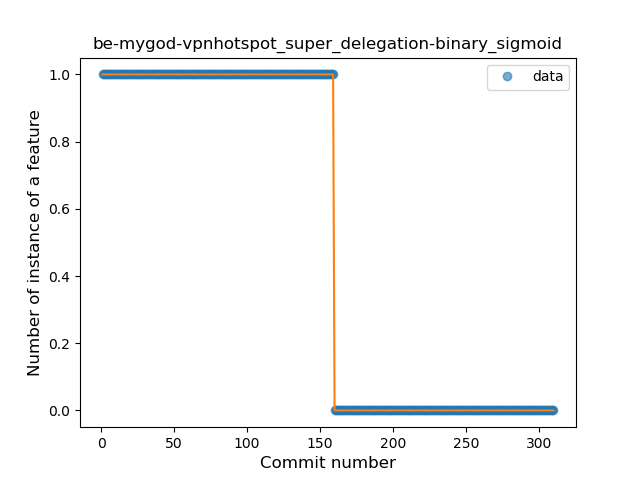

## be-mygod-vpnhotspot
----
#### Metrics provided by Detekt
* Number of lines of code 6935
* Number of Kotlin files: 78
* Cyclomatic complexity: 1465
* Cyclomatic complexity by thousands of lines: 370 

----
**21** features analyzed

*	<a href="#type_inference">Type Inference</a> 
*	<a href="#lambda">Lambda</a> 
*	<a href="#safe_call">Safe Call</a> 
*	<a href="#when_expr">When expression</a> 
*	<a href="#unsafe_call">Unsafe Call</a> 
*	<a href="#companion_object">Companion Object</a> 
*	<a href="#string_template">String Template</a> 
*	<a href="#func_with_default_value">Function with Default Value</a> 
*	<a href="#singleton">Singleton</a> 
*	<a href="#range_expr">Range Expression</a> 
*	<a href="#smart_cast">Smart Cast</a> 
*	<a href="#data_class">Data Class</a> 
*	<a href="#func_call_with_named_arg">Function call with Named Argument</a> 
*	<a href="#extension_function">Extension Function</a> 
*	<a href="#property_delegation">Property Delegation</a> 
*	<a href="#destructuring_declaration">Destructuring Declaration</a> 
*	<a href="#inline_func">Inline Function</a> 
*	<a href="#overloaded_op">Overloaded Operator</a> 
*	<a href="#coroutine">Coroutine</a> 
*	<a href="#sealed_class">Sealed Class</a> 
*	<a href="#super_delegation">Super Delegation</a> 

### <a name="type_inference">Type Inference</a>
----
#### Functions
* **Constant Rise - Linear:** 
    * **R_Squared:** 0.9436627
* **Plateau Sudden Rise - Binary Sigmoid:** 
    * **R_Squared:** 0.70886412
* **Sudden Rise Plateau - Logarithm:** 
    * **R_Squared:** 0.58282353

**Plots** :chart_with_upwards_trend:
-----

### <a name="lambda">Lambda</a>
----
#### Functions
* **Constant Rise - Linear:** 
    * **R_Squared:** 0.99257258
* **Sudden Rise - Exponential:** 
    * **R_Squared:** 0.99320105
* **Plateau Sudden Rise - Binary Sigmoid:** 
    * **R_Squared:** 0.75213578
* **Sudden Rise Plateau - Logarithm:** 
    * **R_Squared:** 0.45372972

**Plots** :chart_with_upwards_trend:
-----

### <a name="safe_call">Safe Call</a>
----
#### Functions
* **Constant Rise - Linear:** 
    * **R_Squared:** 0.98450713
* **Sudden Rise - Exponential:** 
    * **R_Squared:** 0.98536424
* **Sudden Rise Plateau - Logarithm:** 
    * **R_Squared:** 0.55433258
* **Plateau Sudden Rise - Binary Sigmoid:** 
    * **R_Squared:** 0.31256901

**Plots** :chart_with_upwards_trend:
-----

### <a name="when_expr">When expression</a>
----
#### Functions
* **Constant Rise - Linear:** 
    * **R_Squared:** 0.96029074
* **Sudden Rise - Exponential:** 
    * **R_Squared:** 0.96249301
* **Sudden Rise Plateau - Logarithm:** 
    * **R_Squared:** 0.57314068

**Plots** :chart_with_upwards_trend:
-----

### <a name="unsafe_call">Unsafe Call</a>
----
#### Functions
* **Constant Rise - Linear:** 
    * **R_Squared:** 0.85033953
* **Sudden Rise Plateau - Logarithm:** 
    * **R_Squared:** 0.38785848
* **Plateau Sudden Rise - Binary Sigmoid:** 
    * **R_Squared:** 0.0560184

**Plots** :chart_with_upwards_trend:
-----

### <a name="companion_object">Companion Object</a>
----
#### Functions
* **Constant Rise - Linear:** 
    * **R_Squared:** 0.8208075
* **Sudden Rise Plateau - Logarithm:** 
    * **R_Squared:** 0.56071679
* **Plateau Sudden Rise - Binary Sigmoid:** 
    * **R_Squared:** 0.13405338

**Plots** :chart_with_upwards_trend:
-----

### <a name="string_template">String Template</a>
----
#### Functions
* **Constant Rise - Linear:** 
    * **R_Squared:** 0.94056227
* **Sudden Rise Plateau - Logarithm:** 
    * **R_Squared:** 0.62778966
* **Plateau Gradual Rise - Sigmoid:** 
    * **R_Squared:** 0.59706858

**Plots** :chart_with_upwards_trend:
-----

### <a name="func_with_default_value">Function with Default Value</a>
----
#### Functions
* **Constant Rise - Linear:** 
    * **R_Squared:** 0.9418969
* **Plateau Sudden Rise - Binary Sigmoid:** 
    * **R_Squared:** 0.73294182
* **Sudden Rise Plateau - Logarithm:** 
    * **R_Squared:** 0.58030661

**Plots** :chart_with_upwards_trend:
-----

### <a name="singleton">Singleton</a>
----
#### Functions
* **Sudden Rise - Exponential:** 
    * **R_Squared:** 0.95956079
* **Constant Rise - Linear:** 
    * **R_Squared:** 0.94699517
* **Sudden Rise Plateau - Logarithm:** 
    * **R_Squared:** 0.41929334
* **Plateau Sudden Rise - Binary Sigmoid:** 
    * **R_Squared:** 0.04581002

**Plots** :chart_with_upwards_trend:
-----

### <a name="range_expr">Range Expression</a>
----
#### Functions
* **Plateau Gradual Rise - Sigmoid:** 
    * **R_Squared:** 0.92097429
* **Sudden Rise - Exponential:** 
    * **R_Squared:** 0.89006214
* **Constant Rise - Linear:** 
    * **R_Squared:** 0.81432769
* **Sudden Rise Plateau - Logarithm:** 
    * **R_Squared:** 0.36178231

**Plots** :chart_with_upwards_trend:
-----

### <a name="smart_cast">Smart Cast</a>
----
#### Functions
* **Constant Rise - Linear:** 
    * **R_Squared:** 0.92303433
* **Sudden Rise - Exponential:** 
    * **R_Squared:** 0.92405497
* **Plateau Gradual Rise - Sigmoid:** 
    * **R_Squared:** 0.92492923
* **Sudden Rise Plateau - Logarithm:** 
    * **R_Squared:** 0.4293348

**Plots** :chart_with_upwards_trend:
-----

### <a name="data_class">Data Class</a>
----
#### Functions
* **Plateau Gradual Rise - Sigmoid:** 
    * **R_Squared:** 0.93917345
* **Constant Rise - Linear:** 
    * **R_Squared:** 0.84399639
* **Sudden Rise Plateau - Logarithm:** 
    * **R_Squared:** 0.3096975

**Plots** :chart_with_upwards_trend:
-----

### <a name="func_call_with_named_arg">Function call with Named Argument</a>
----
#### Functions
* **Plateau Gradual Rise - Sigmoid:** 
    * **R_Squared:** 0.91955685
* **Sudden Rise - Exponential:** 
    * **R_Squared:** 0.8610946
* **Constant Rise - Linear:** 
    * **R_Squared:** 0.82984803
* **Sudden Rise Plateau - Logarithm:** 
    * **R_Squared:** 0.26829085

**Plots** :chart_with_upwards_trend:
-----

### <a name="extension_function">Extension Function</a>
----
#### Functions
* **Plateau Gradual Rise - Sigmoid:** 
    * **R_Squared:** 0.95179565
* **Constant Rise - Linear:** 
    * **R_Squared:** 0.93920206
* **Sudden Rise Plateau - Logarithm:** 
    * **R_Squared:** 0.37636343

**Plots** :chart_with_upwards_trend:
-----

### <a name="property_delegation">Property Delegation</a>
----
#### Functions
* **Constant Rise - Linear:** 
    * **R_Squared:** 0.9441142
* **Sudden Rise Plateau - Logarithm:** 
    * **R_Squared:** 0.50293655
* **Plateau Sudden Rise - Binary Sigmoid:** 
    * **R_Squared:** 0.12609592

**Plots** :chart_with_upwards_trend:
-----

### <a name="destructuring_declaration">Destructuring Declaration</a>
----
#### Functions
* **Plateau Gradual Rise - Sigmoid:** 
    * **R_Squared:** 0.92940065
* **Constant Rise - Linear:** 
    * **R_Squared:** 0.76821188
* **Sudden Rise Plateau - Logarithm:** 
    * **R_Squared:** 0.63527892

**Plots** :chart_with_upwards_trend:
-----

### <a name="inline_func">Inline Function</a>
----
#### Functions
* **Constant Rise - Linear:** 
    * **R_Squared:** 0.42315407
* **Sudden Rise Plateau - Logarithm:** 
    * **R_Squared:** 0.16620447
* **Plateau Gradual Decline - Sigmoid:** 
    * **R_Squared:** 0.02795512

**Plots** :chart_with_upwards_trend:
-----

### <a name="overloaded_op">Overloaded Operator</a>
----
#### Functions
* **Plateau Sudden Rise - Binary Sigmoid:** 
    * **R_Squared:** 1.0
* **Sudden Rise Plateau - Logarithm:** 
    * **R_Squared:** 0.65456758
* **Constant Rise - Linear:** 
    * **R_Squared:** 0.55566291

**Plots** :chart_with_upwards_trend:
-----

### <a name="coroutine">Coroutine</a>
----
#### Functions
* **Plateau Gradual Rise - Sigmoid:** 
    * **R_Squared:** 0.98599916
* **Sudden Rise - Exponential:** 
    * **R_Squared:** 0.80365028
* **Constant Rise - Linear:** 
    * **R_Squared:** 0.59394886
* **Sudden Rise Plateau - Logarithm:** 
    * **R_Squared:** 0.24415288

**Plots** :chart_with_upwards_trend:
-----

### <a name="sealed_class">Sealed Class</a>
----
#### Functions
* **Constant Rise - Linear:** 
    * **R_Squared:** 0.88709667
* **Sudden Rise Plateau - Logarithm:** 
    * **R_Squared:** 0.70652796

**Plots** :chart_with_upwards_trend:
-----

### <a name="super_delegation">Super Delegation</a>
----
#### Functions
* **Plateau Sudden Decline - Binary Sigmoid:** 
    * **R_Squared:** 1.0
* **Constant Decline - Linear:** 
    * **R_Squared:** 0.74950832
* **Sudden Rise Plateau - Logarithm:** 
    * **R_Squared:** -0.0

**Plots** :chart_with_upwards_trend:
-----

