## bitfireAT-davdroid
----
#### Metrics provided by Detekt
* Number of lines of code 12630
* Number of Kotlin files: 79
* Cyclomatic complexity: 1954
* Cyclomatic complexity by thousands of lines: 293 

----
**14** features analyzed

*	<a href="#type_inference">Type Inference</a> 
*	<a href="#lambda">Lambda</a> 
*	<a href="#safe_call">Safe Call</a> 
*	<a href="#when_expr">When expression</a> 
*	<a href="#companion_object">Companion Object</a> 
*	<a href="#unsafe_call">Unsafe Call</a> 
*	<a href="#string_template">String Template</a> 
*	<a href="#func_with_default_value">Function with Default Value</a> 
*	<a href="#singleton">Singleton</a> 
*	<a href="#smart_cast">Smart Cast</a> 
*	<a href="#range_expr">Range Expression</a> 
*	<a href="#func_call_with_named_arg">Function call with Named Argument</a> 
*	<a href="#data_class">Data Class</a> 
*	<a href="#destructuring_declaration">Destructuring Declaration</a> 

### <a name="type_inference">Type Inference</a>
----
#### Functions
* **Sudden Rise Plateau - Logarithm:** 
    * **R_Squared:** 0.79038295
* **Instability - Polinomial 3:** )
    * **R_Squared:** 0.71628992
* **Plateau Gradual Rise - Sigmoid:** 
    * **R_Squared:** 0.48159145
* **Constant Rise - Linear:** 
    * **R_Squared:** 0.38340973

**Plots** :chart_with_upwards_trend:
-----

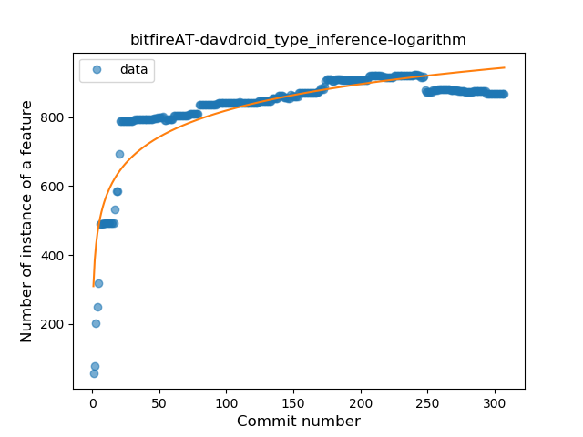
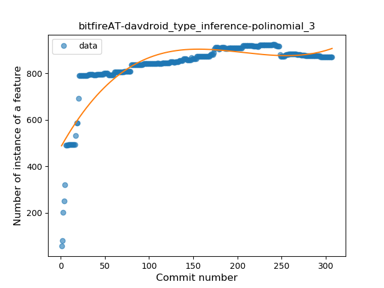
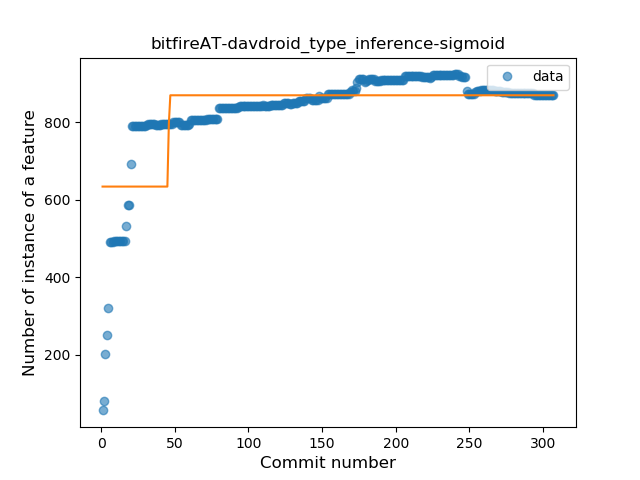
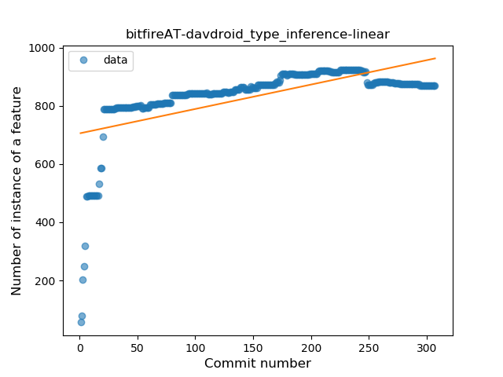
### <a name="lambda">Lambda</a>
----
#### Functions
* **Constant Rise - Linear:** 
    * **R_Squared:** 0.90638101
* **Sudden Rise Plateau - Logarithm:** 
    * **R_Squared:** 0.86167879
* **Plateau Sudden Rise - Binary Sigmoid:** 
    * **R_Squared:** 0.47267167

**Plots** :chart_with_upwards_trend:
-----

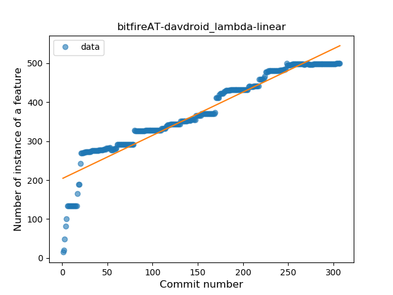
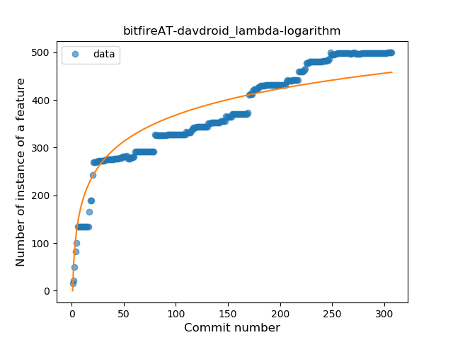
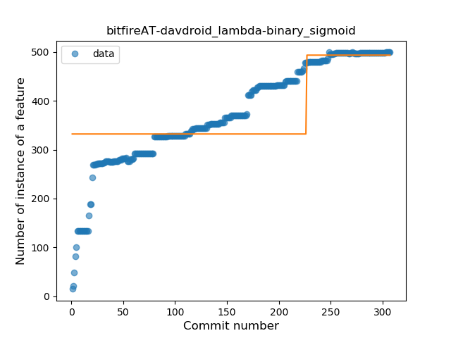
### <a name="safe_call">Safe Call</a>
----
#### Functions
* **Sudden Rise Plateau - Logarithm:** 
    * **R_Squared:** 0.92172178
* **Constant Rise - Linear:** 
    * **R_Squared:** 0.85731348

**Plots** :chart_with_upwards_trend:
-----

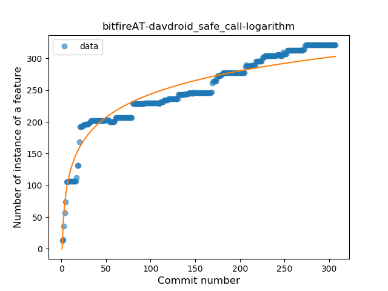
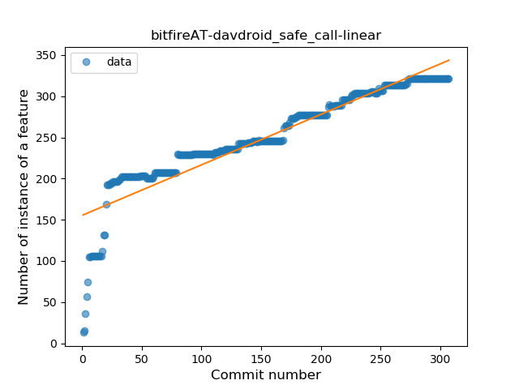
### <a name="when_expr">When expression</a>
----
#### Functions
* **Constant Rise - Linear:** 
    * **R_Squared:** 0.89557924
* **Sudden Rise Plateau - Logarithm:** 
    * **R_Squared:** 0.77264079
* **Plateau Sudden Rise - Binary Sigmoid:** 
    * **R_Squared:** 0.3577621

**Plots** :chart_with_upwards_trend:
-----

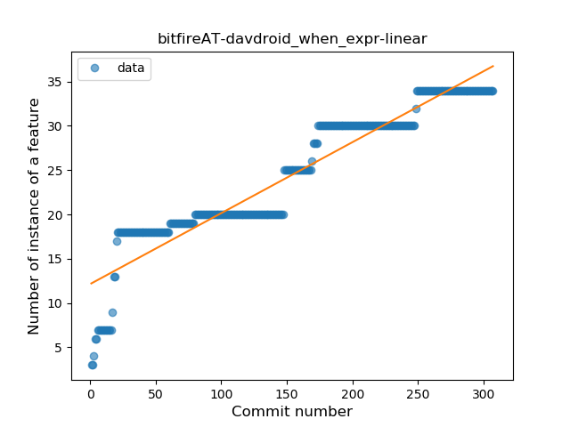

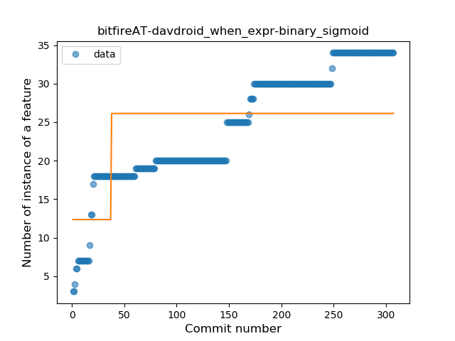
### <a name="companion_object">Companion Object</a>
----
#### Functions
* **Sudden Rise Plateau - Logarithm:** 
    * **R_Squared:** 0.91075566
* **Constant Rise - Linear:** 
    * **R_Squared:** 0.66001383

**Plots** :chart_with_upwards_trend:
-----

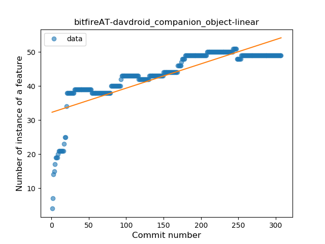
### <a name="unsafe_call">Unsafe Call</a>
----
#### Functions
* **Constant Rise - Linear:** 
    * **R_Squared:** 0.90178365
* **Sudden Rise Plateau - Logarithm:** 
    * **R_Squared:** 0.76490166
* **Plateau Sudden Rise - Binary Sigmoid:** 
    * **R_Squared:** 0.59254758

**Plots** :chart_with_upwards_trend:
-----

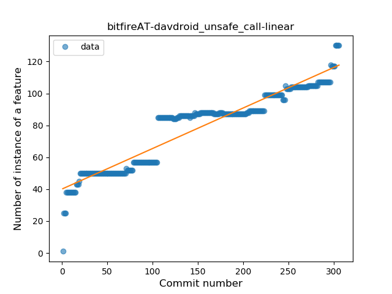
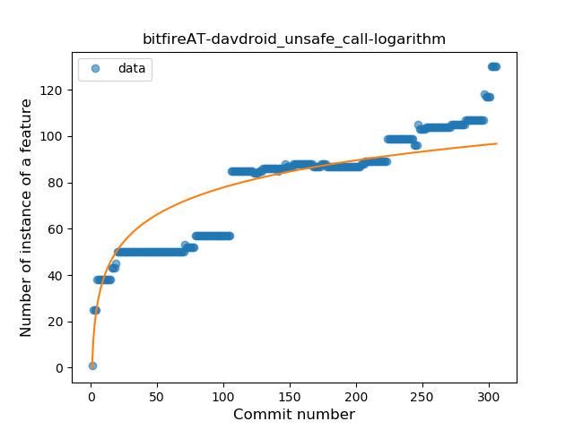
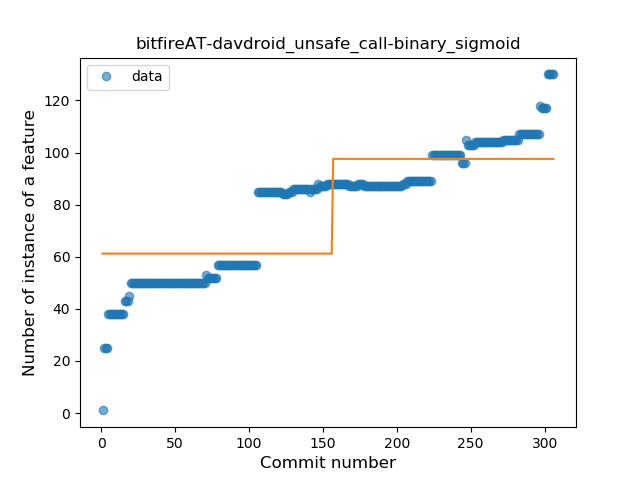
### <a name="string_template">String Template</a>
----
#### Functions
* **Sudden Rise Plateau - Logarithm:** 
    * **R_Squared:** 0.88766747
* **Constant Rise - Linear:** 
    * **R_Squared:** 0.55313142

**Plots** :chart_with_upwards_trend:
-----

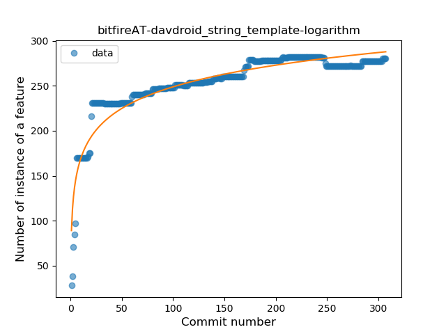
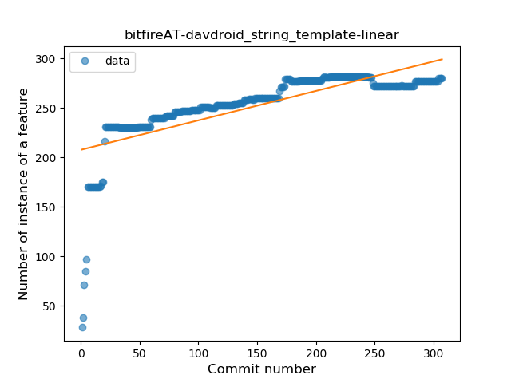
### <a name="func_with_default_value">Function with Default Value</a>
----
#### Functions
* **Plateau Gradual Rise - Sigmoid:** 
    * **R_Squared:** 0.9726325
* **Sudden Rise - Exponential:** 
    * **R_Squared:** 0.93532945
* **Constant Rise - Linear:** 
    * **R_Squared:** 0.87649411
* **Sudden Rise Plateau - Logarithm:** 
    * **R_Squared:** 0.40067557

**Plots** :chart_with_upwards_trend:
-----

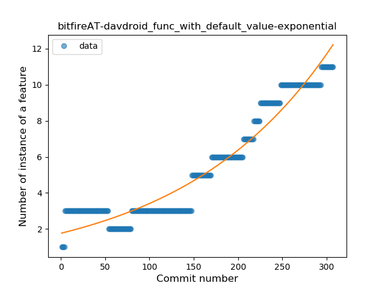
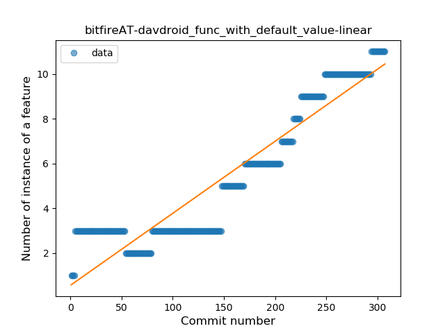
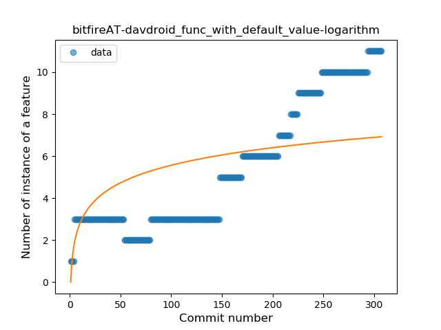
### <a name="singleton">Singleton</a>
----
#### Functions
* **Sudden Rise Plateau - Logarithm:** 
    * **R_Squared:** 0.41037501
* **Constant Rise - Linear:** 
    * **R_Squared:** 0.1962423

**Plots** :chart_with_upwards_trend:
-----

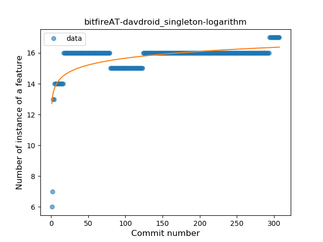
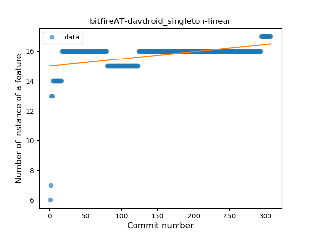
### <a name="smart_cast">Smart Cast</a>
----
#### Functions
* **Sudden Rise - Exponential:** 
    * **R_Squared:** 0.83571959
* **Constant Rise - Linear:** 
    * **R_Squared:** 0.81375705
* **Sudden Rise Plateau - Logarithm:** 
    * **R_Squared:** 0.67698815
* **Plateau Gradual Rise - Sigmoid:** 
    * **R_Squared:** 0.2043967

**Plots** :chart_with_upwards_trend:
-----

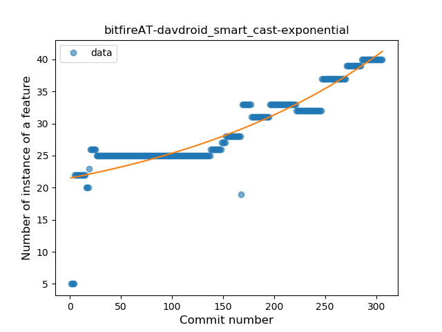
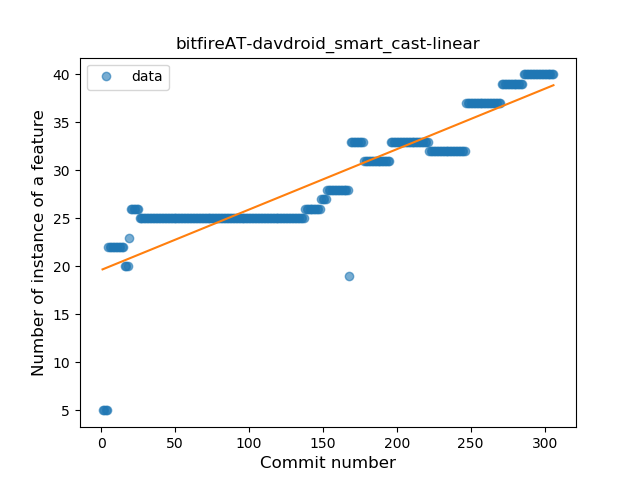
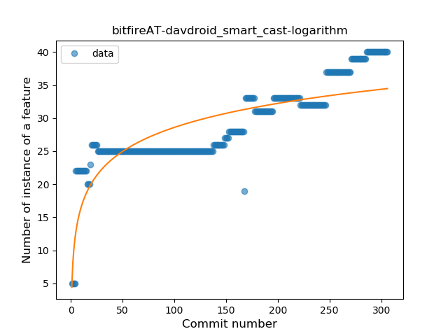
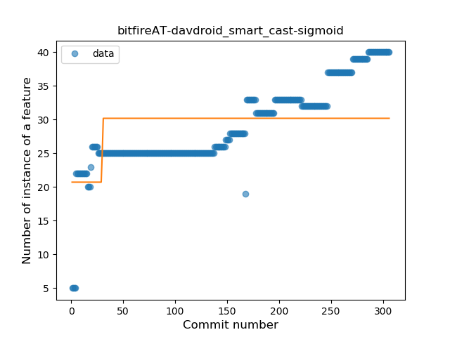
### <a name="range_expr">Range Expression</a>
----
#### Functions
* **Constant Rise - Linear:** 
    * **R_Squared:** 0.83188299
* **Sudden Rise Plateau - Logarithm:** 
    * **R_Squared:** 0.83044767

**Plots** :chart_with_upwards_trend:
-----

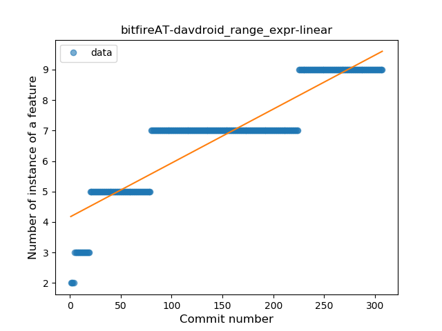
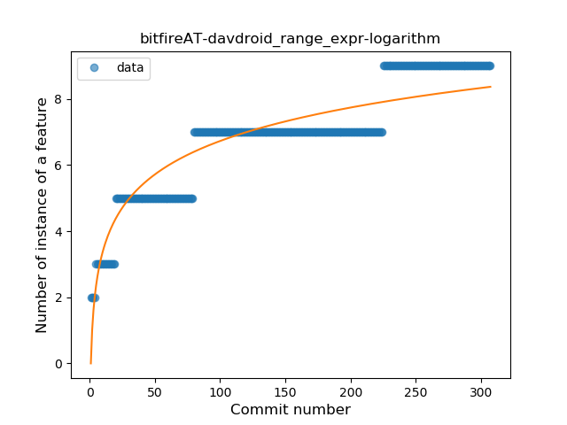
### <a name="func_call_with_named_arg">Function call with Named Argument</a>
----
#### Functions
* **Plateau Gradual Rise - Sigmoid:** 
    * **R_Squared:** 0.74538844
* **Constant Rise - Linear:** 
    * **R_Squared:** 0.72837415
* **Sudden Rise - Exponential:** 
    * **R_Squared:** 0.72865941
* **Sudden Rise Plateau - Logarithm:** 
    * **R_Squared:** 0.47003203

**Plots** :chart_with_upwards_trend:
-----

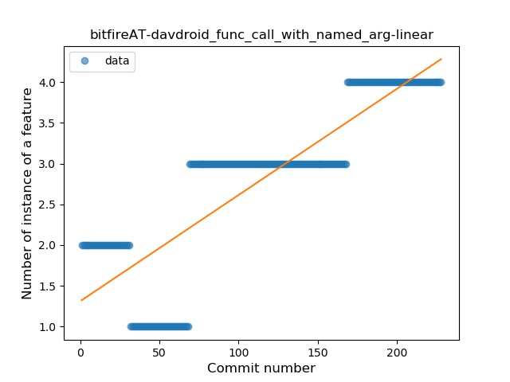
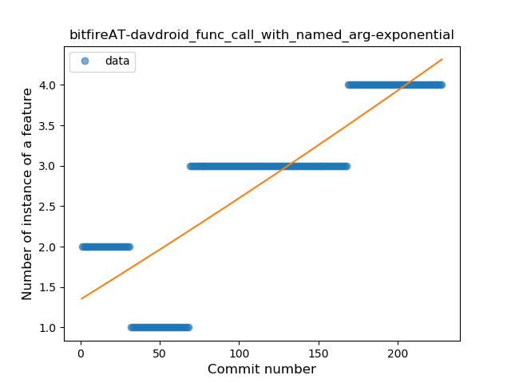
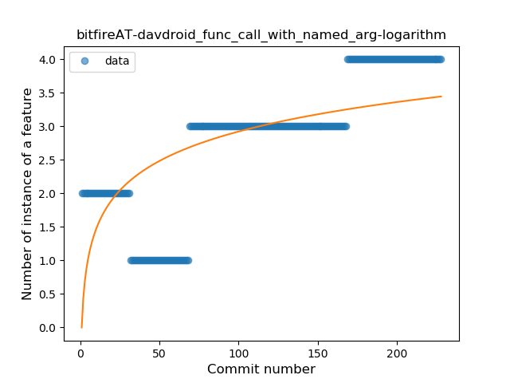
### <a name="data_class">Data Class</a>
----
#### Functions
* **Constant Rise - Linear:** 
    * **R_Squared:** 0.93376793
* **Plateau Gradual Rise - Sigmoid:** 
    * **R_Squared:** 0.93689935
* **Sudden Rise Plateau - Logarithm:** 
    * **R_Squared:** 0.67007418

**Plots** :chart_with_upwards_trend:
-----

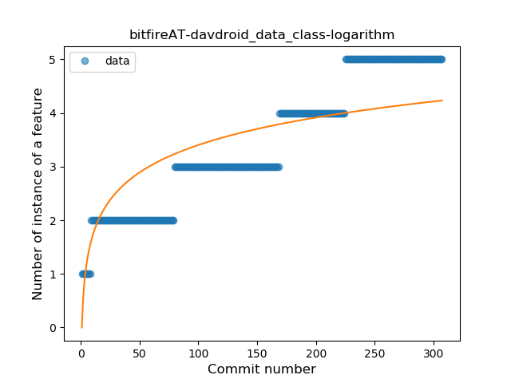
### <a name="destructuring_declaration">Destructuring Declaration</a>
----
#### Functions
* **Plateau Sudden Rise - Binary Sigmoid:** 
    * **R_Squared:** 0.18130577
* **Sudden Rise Plateau - Logarithm:** 
    * **R_Squared:** 0.10153734
* **Constant Decline - Linear:** 
    * **R_Squared:** 0.00323349
* **Sudden Decline - Exponential:** 
    * **R_Squared:** 0.00055051

**Plots** :chart_with_upwards_trend:
-----

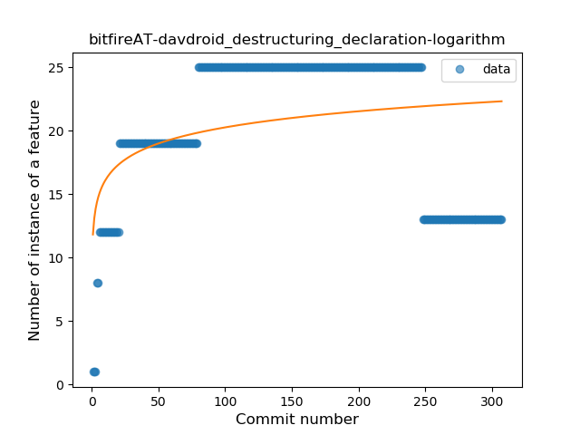
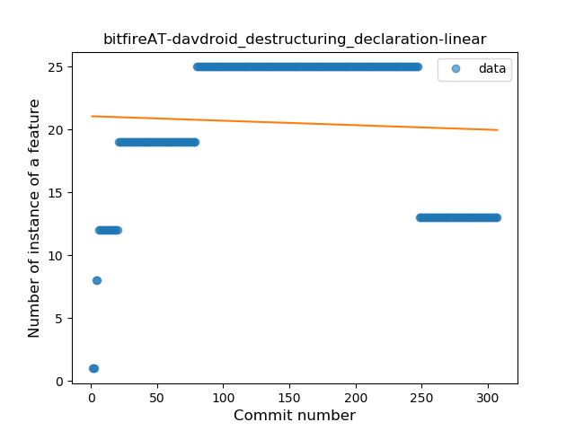
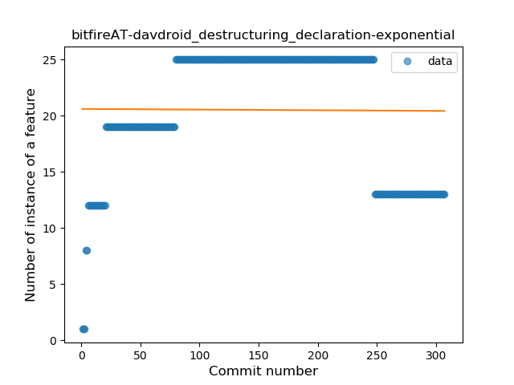
