## bitfireAT-icsdroid
----
#### Metrics provided by Detekt
* Number of lines of code 2741
* Number of Kotlin files: 27
* Cyclomatic complexity: 370
* Cyclomatic complexity by thousands of lines: 272 

----
**10** features analyzed

*	<a href="#type_inference">Type Inference</a> 
*	<a href="#lambda">Lambda</a> 
*	<a href="#safe_call">Safe Call</a> 
*	<a href="#when_expr">When expression</a> 
*	<a href="#companion_object">Companion Object</a> 
*	<a href="#unsafe_call">Unsafe Call</a> 
*	<a href="#string_template">String Template</a> 
*	<a href="#func_with_default_value">Function with Default Value</a> 
*	<a href="#singleton">Singleton</a> 
*	<a href="#smart_cast">Smart Cast</a> 

### <a name="type_inference">Type Inference</a>
----
#### Functions
* **Instability - Polinomial 4:** 
    * **R_Squared:** 0.75895179
* **Instability - Polinomial 3:** )
    * **R_Squared:** 0.6404168
* **Sudden Rise Plateau - Logarithm:** 
    * **R_Squared:** 0.60816478
* **Constant Rise - Linear:** 
    * **R_Squared:** 0.24226222

**Plots** :chart_with_upwards_trend:
-----

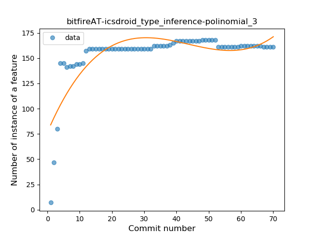
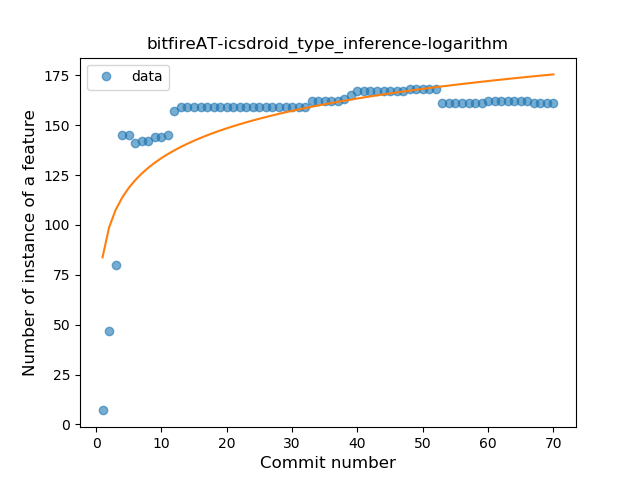
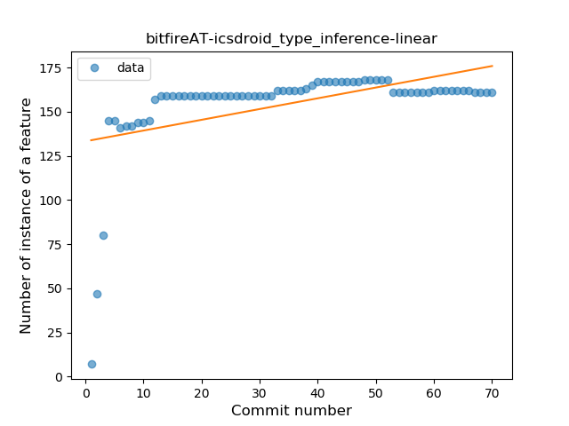
### <a name="lambda">Lambda</a>
----
#### Functions
* **Instability - Polinomial 3:** )
    * **R_Squared:** 0.62249353
* **Sudden Rise Plateau - Logarithm:** 
    * **R_Squared:** 0.43647482
* **Constant Rise - Linear:** 
    * **R_Squared:** 0.09684692

**Plots** :chart_with_upwards_trend:
-----

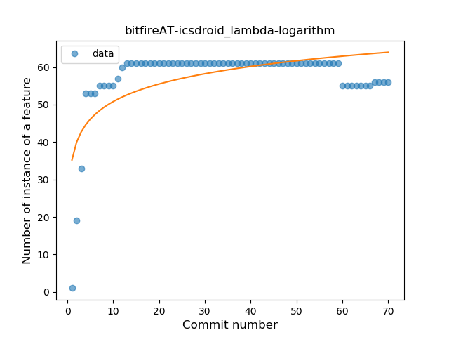
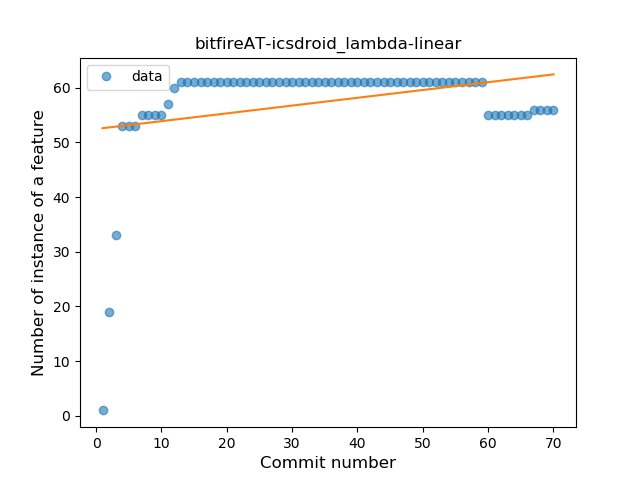
### <a name="safe_call">Safe Call</a>
----
#### Functions
* **Sudden Rise Plateau - Logarithm:** 
    * **R_Squared:** 0.80671792
* **Instability - Polinomial 3:** )
    * **R_Squared:** 0.76939217
* **Constant Rise - Linear:** 
    * **R_Squared:** 0.457913

**Plots** :chart_with_upwards_trend:
-----

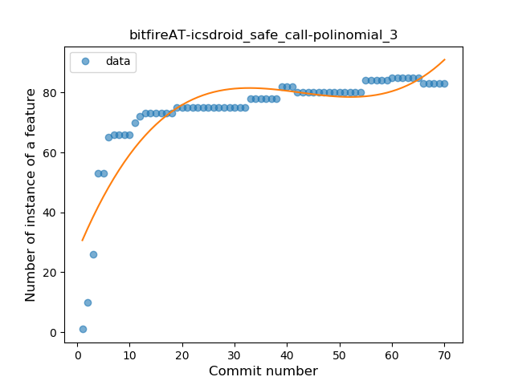
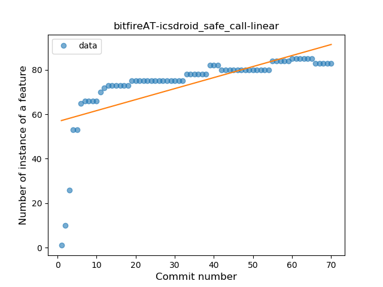
### <a name="when_expr">When expression</a>
----
#### Functions
* **Plateau Gradual Rise - Sigmoid:** 
    * **R_Squared:** 0.95573254
* **Sudden Rise Plateau - Logarithm:** 
    * **R_Squared:** 0.65973088
* **Constant Rise - Linear:** 
    * **R_Squared:** 0.27330858

**Plots** :chart_with_upwards_trend:
-----

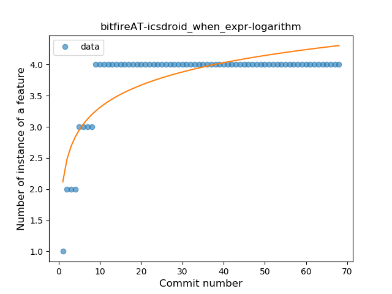
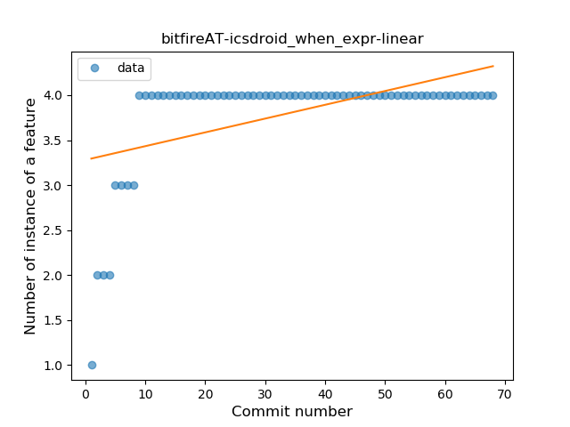
### <a name="companion_object">Companion Object</a>
----
#### Functions
* **Sudden Rise Plateau - Logarithm:** 
    * **R_Squared:** 0.75903722
* **Constant Rise - Linear:** 
    * **R_Squared:** 0.66158969

**Plots** :chart_with_upwards_trend:
-----

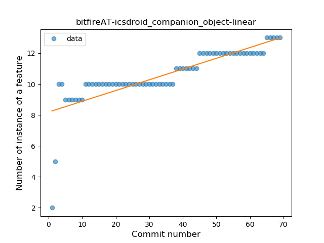
### <a name="unsafe_call">Unsafe Call</a>
----
#### Functions
* **Instability - Polinomial 3:** )
    * **R_Squared:** 0.72578544
* **Plateau Sudden Rise - Binary Sigmoid:** 
    * **R_Squared:** 0.63394382
* **Sudden Rise Plateau - Logarithm:** 
    * **R_Squared:** 0.42500465
* **Constant Rise - Linear:** 
    * **R_Squared:** 0.39469063

**Plots** :chart_with_upwards_trend:
-----

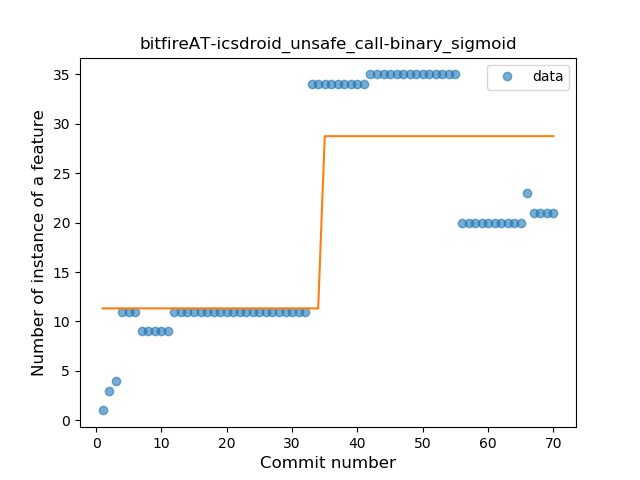
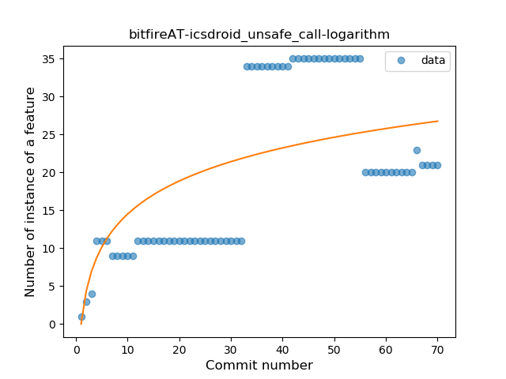
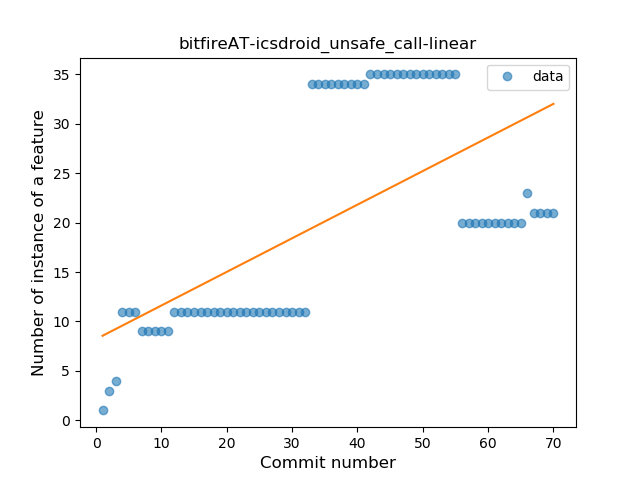
### <a name="string_template">String Template</a>
----
#### Functions
* **Instability - Polinomial 3:** )
    * **R_Squared:** 0.74265181
* **Sudden Rise Plateau - Logarithm:** 
    * **R_Squared:** 0.6628666
* **Plateau Sudden Rise - Binary Sigmoid:** 
    * **R_Squared:** 0.59053691
* **Constant Rise - Linear:** 
    * **R_Squared:** 0.29606372

**Plots** :chart_with_upwards_trend:
-----

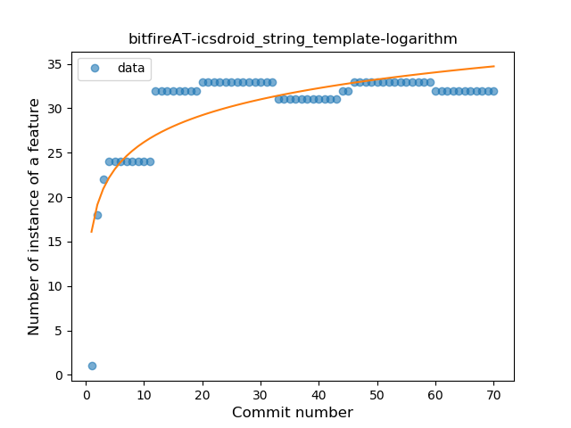

### <a name="func_with_default_value">Function with Default Value</a>
----
#### Functions
* **Plateau Sudden Rise - Binary Sigmoid:** 
    * **R_Squared:** 1.0
* **Sudden Rise Plateau - Logarithm:** 
    * **R_Squared:** 0.59007447
* **Constant Rise - Linear:** 
    * **R_Squared:** 0.27832293

**Plots** :chart_with_upwards_trend:
-----

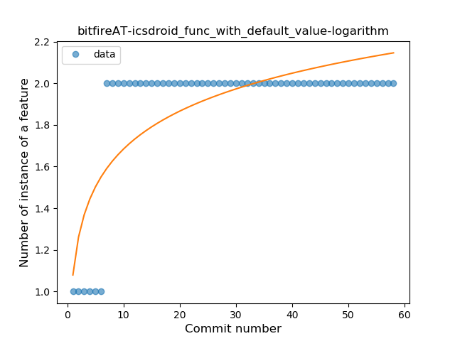
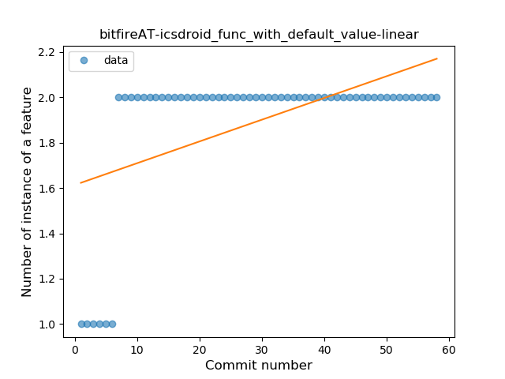
### <a name="singleton">Singleton</a>
----
#### Functions
* **Sudden Rise Plateau - Logarithm:** 
    * **R_Squared:** 0.80782223
* **Constant Rise - Linear:** 
    * **R_Squared:** 0.63902508

**Plots** :chart_with_upwards_trend:
-----

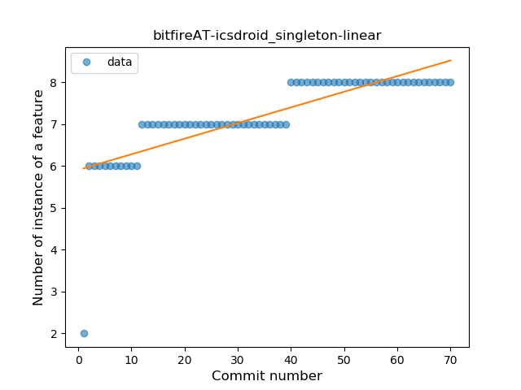
### <a name="smart_cast">Smart Cast</a>
----
#### Functions
* **Sudden Rise Plateau - Logarithm:** 
    * **R_Squared:** 0.80905788
* **Constant Rise - Linear:** 
    * **R_Squared:** 0.76297231

**Plots** :chart_with_upwards_trend:
-----

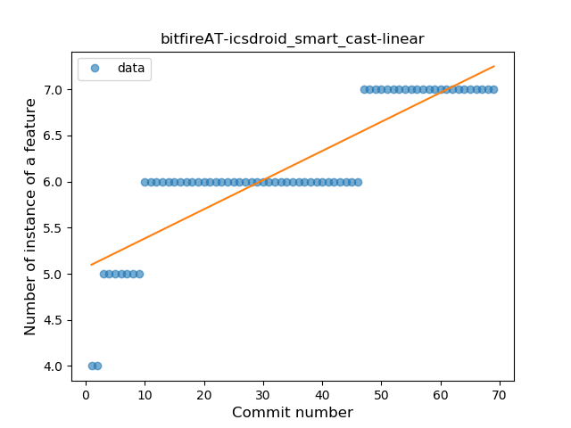
