## blastrock-kaqui
----
#### Metrics provided by Detekt
* Number of lines of code 2486
* Number of Kotlin files: 18
* Cyclomatic complexity: 414
* Cyclomatic complexity by thousands of lines: 247 

----
**14** features analyzed

*	<a href="#type_inference">Type Inference</a> 
*	<a href="#lambda">Lambda</a> 
*	<a href="#safe_call">Safe Call</a> 
*	<a href="#when_expr">When expression</a> 
*	<a href="#companion_object">Companion Object</a> 
*	<a href="#unsafe_call">Unsafe Call</a> 
*	<a href="#string_template">String Template</a> 
*	<a href="#func_with_default_value">Function with Default Value</a> 
*	<a href="#smart_cast">Smart Cast</a> 
*	<a href="#range_expr">Range Expression</a> 
*	<a href="#func_call_with_named_arg">Function call with Named Argument</a> 
*	<a href="#data_class">Data Class</a> 
*	<a href="#extension_function">Extension Function</a> 
*	<a href="#destructuring_declaration">Destructuring Declaration</a> 

### <a name="type_inference">Type Inference</a>
----
#### Functions
* **Constant Rise - Linear:** 
    * **R_Squared:** 0.91913471
* **Sudden Rise Plateau - Logarithm:** 
    * **R_Squared:** 0.78421919
* **Plateau Sudden Rise - Binary Sigmoid:** 
    * **R_Squared:** 0.69979428

**Plots** :chart_with_upwards_trend:
-----

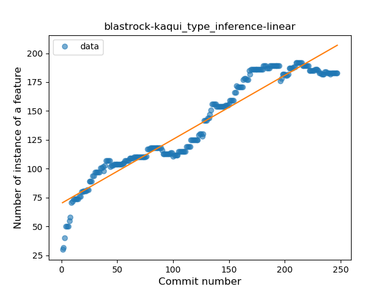
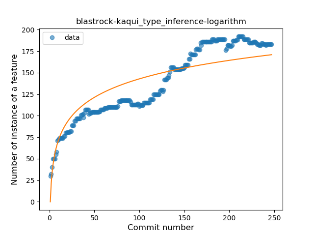
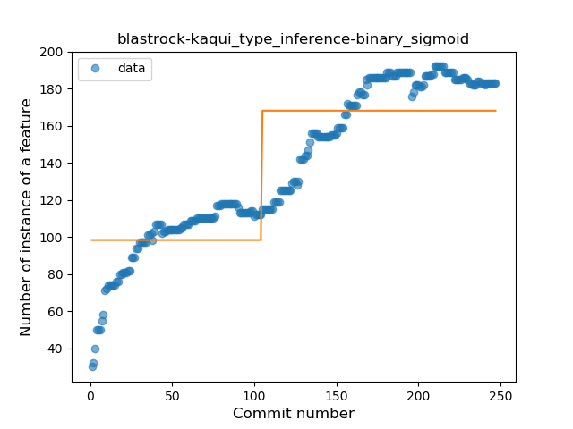
### <a name="lambda">Lambda</a>
----
#### Functions
* **Sudden Rise Plateau - Logarithm:** 
    * **R_Squared:** 0.8952544
* **Constant Rise - Linear:** 
    * **R_Squared:** 0.88008575

**Plots** :chart_with_upwards_trend:
-----

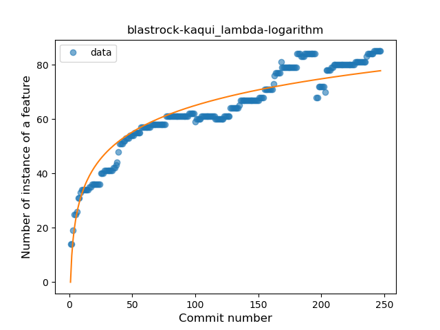
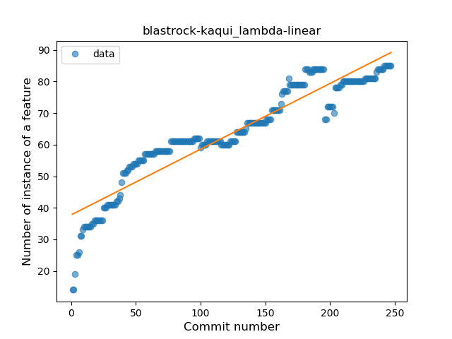
### <a name="safe_call">Safe Call</a>
----
#### Functions
* **Plateau Sudden Rise - Binary Sigmoid:** 
    * **R_Squared:** 0.97305556
* **Sudden Rise - Exponential:** 
    * **R_Squared:** 0.67273301
* **Constant Rise - Linear:** 
    * **R_Squared:** 0.53854444
* **Sudden Rise Plateau - Logarithm:** 
    * **R_Squared:** 0.18458138

**Plots** :chart_with_upwards_trend:
-----

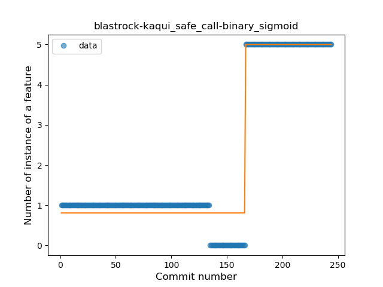
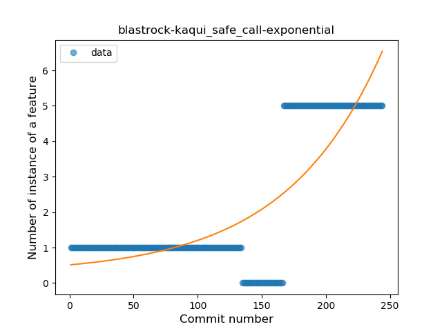
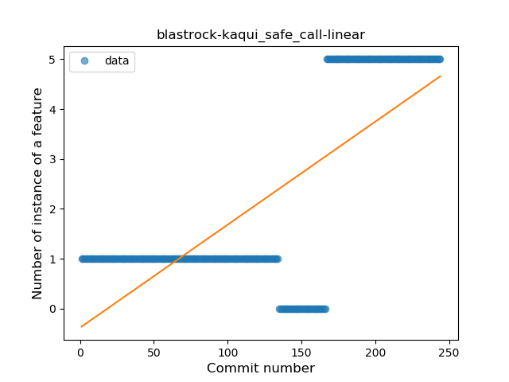
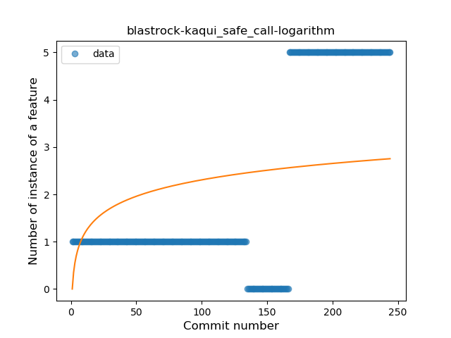
### <a name="when_expr">When expression</a>
----
#### Functions
* **Plateau Gradual Rise - Sigmoid:** 
    * **R_Squared:** 0.91383535
* **Constant Rise - Linear:** 
    * **R_Squared:** 0.90054643
* **Sudden Rise - Exponential:** 
    * **R_Squared:** 0.90109455
* **Sudden Rise Plateau - Logarithm:** 
    * **R_Squared:** 0.51474757

**Plots** :chart_with_upwards_trend:
-----

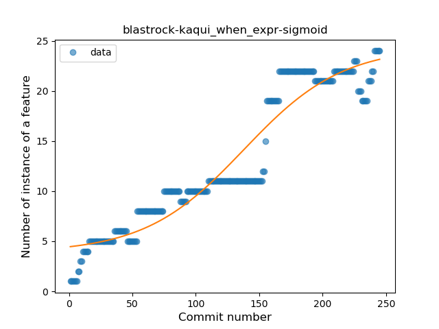
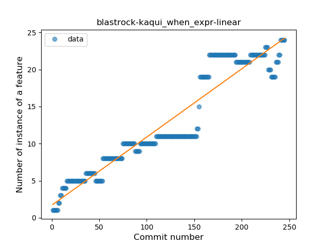
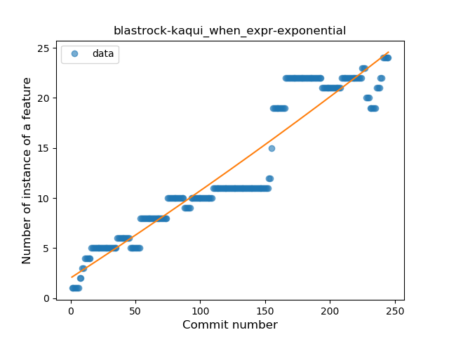
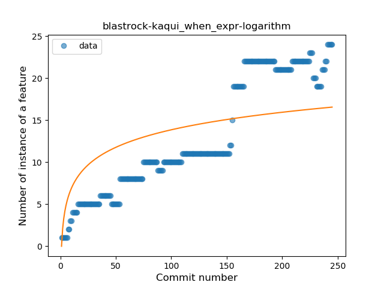
### <a name="companion_object">Companion Object</a>
----
#### Functions
* **Sudden Rise Plateau - Logarithm:** 
    * **R_Squared:** 0.62308383
* **Constant Rise - Linear:** 
    * **R_Squared:** 0.53227101

**Plots** :chart_with_upwards_trend:
-----

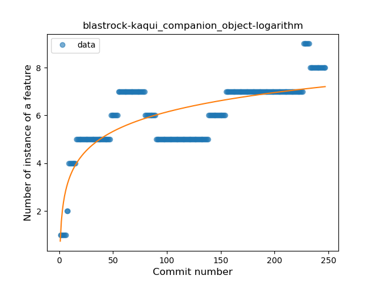
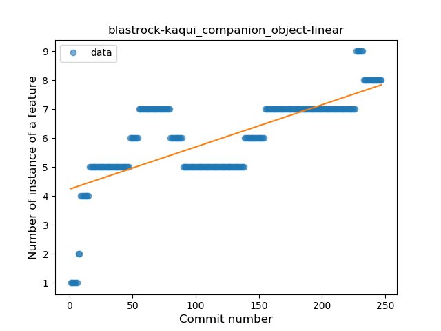
### <a name="unsafe_call">Unsafe Call</a>
----
#### Functions
* **Sudden Decline - Exponential:** 
    * **R_Squared:** 0.15130956
* **Constant Decline - Linear:** 
    * **R_Squared:** 0.09569533
* **Sudden Rise Plateau - Logarithm:** 
    * **R_Squared:** -0.0

**Plots** :chart_with_upwards_trend:
-----

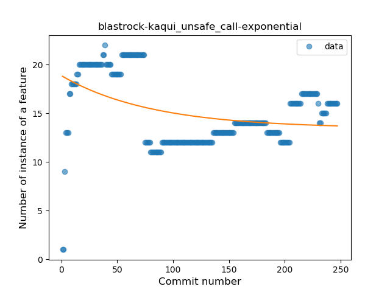
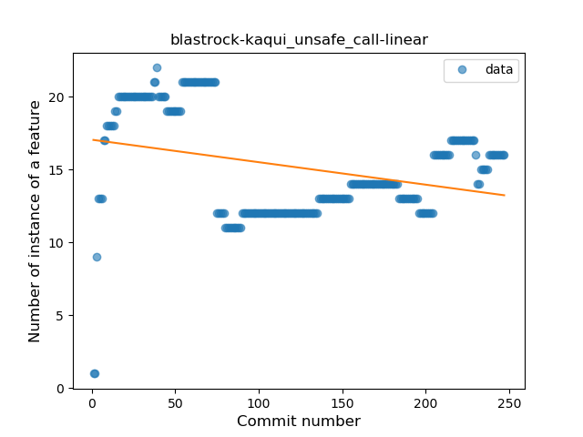
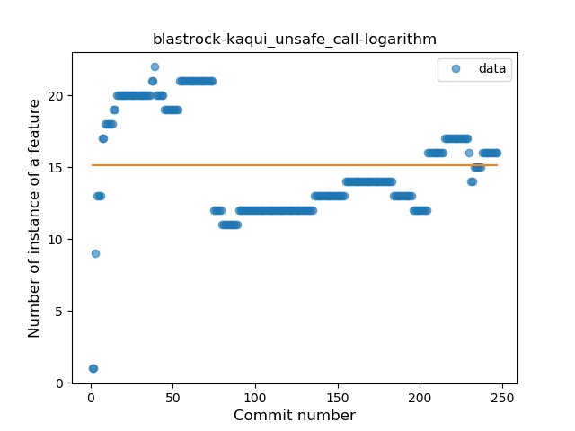
### <a name="string_template">String Template</a>
----
#### Functions
* **Sudden Rise - Exponential:** 
    * **R_Squared:** 0.96980238
* **Plateau Gradual Rise - Sigmoid:** 
    * **R_Squared:** 0.97854351
* **Constant Rise - Linear:** 
    * **R_Squared:** 0.94519204
* **Sudden Rise Plateau - Logarithm:** 
    * **R_Squared:** 0.53356516

**Plots** :chart_with_upwards_trend:
-----

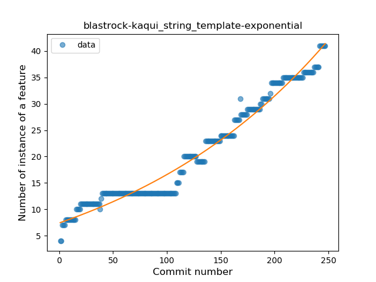
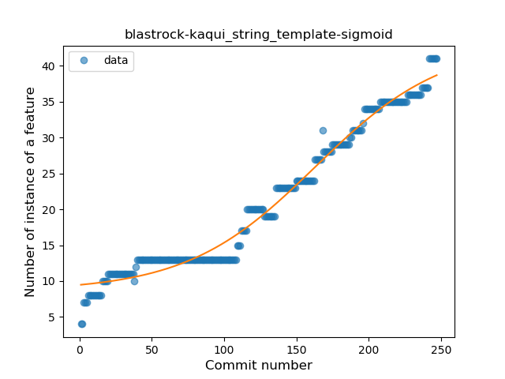
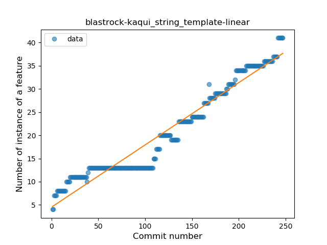
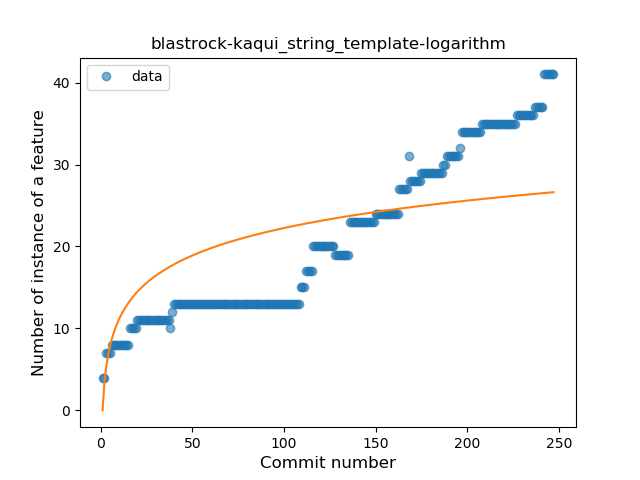
### <a name="func_with_default_value">Function with Default Value</a>
----
#### Functions
* **Sudden Rise - Exponential:** 
    * **R_Squared:** 0.61268646
* **Constant Rise - Linear:** 
    * **R_Squared:** 0.54898571
* **Sudden Rise Plateau - Logarithm:** 
    * **R_Squared:** 0.43218437
* **Plateau Gradual Rise - Sigmoid:** 
    * **R_Squared:** 0.32583463

**Plots** :chart_with_upwards_trend:
-----

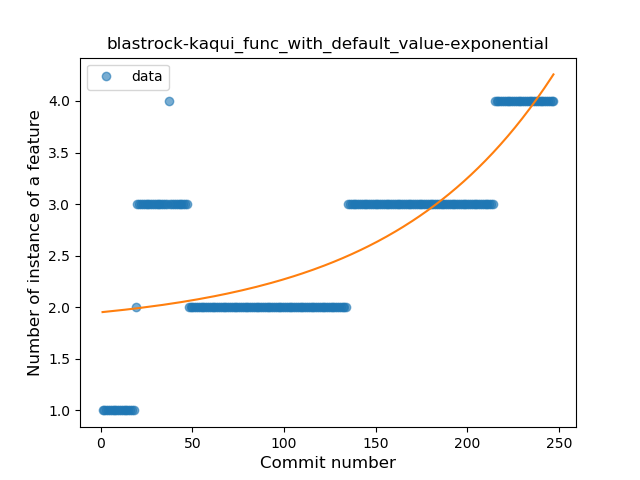
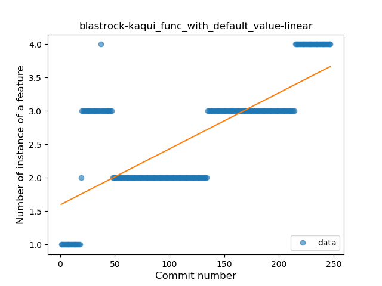
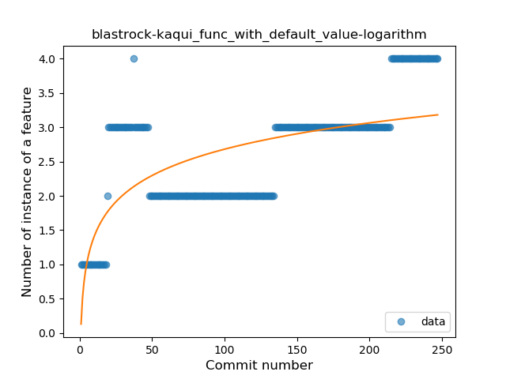
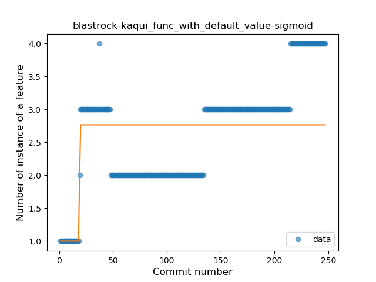
### <a name="smart_cast">Smart Cast</a>
----
#### Functions
* **Constant Rise - Linear:** 
    * **R_Squared:** 0.8616184
* **Sudden Rise - Exponential:** 
    * **R_Squared:** 0.87121893
* **Sudden Rise Plateau - Logarithm:** 
    * **R_Squared:** 0.42541851

**Plots** :chart_with_upwards_trend:
-----

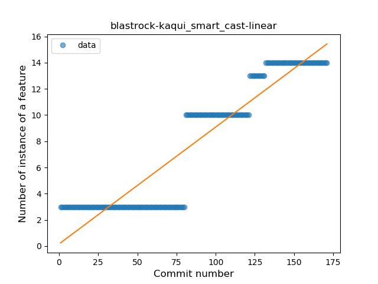
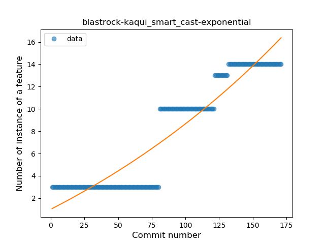
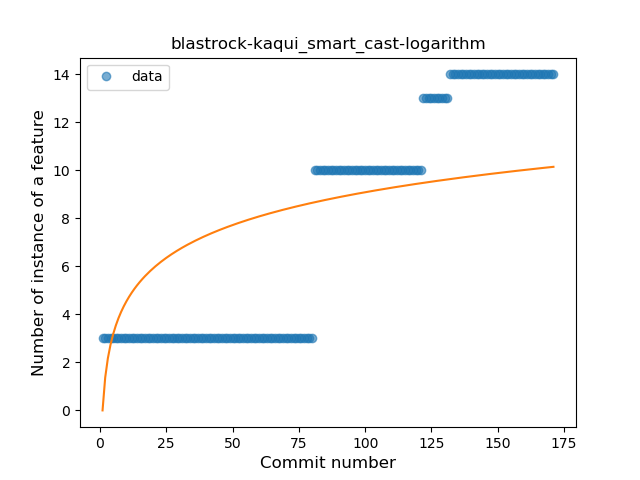
### <a name="range_expr">Range Expression</a>
----
#### Functions
* **Sudden Rise Plateau - Logarithm:** 
    * **R_Squared:** 0.78239538
* **Constant Rise - Linear:** 
    * **R_Squared:** 0.51933622

**Plots** :chart_with_upwards_trend:
-----

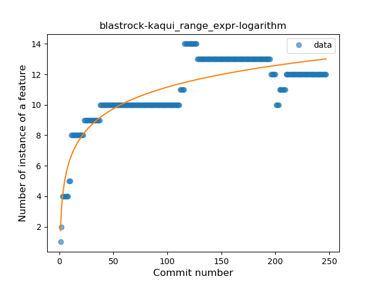
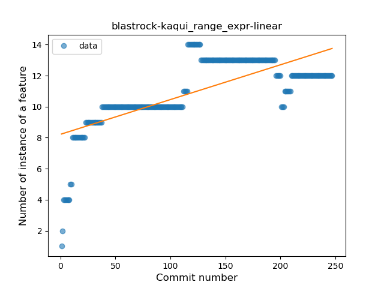
### <a name="func_call_with_named_arg">Function call with Named Argument</a>
----
#### Functions
* **Constant Decline - Linear:** 
    * **R_Squared:** 0.3405637
* **Plateau Sudden Rise - Binary Sigmoid:** 
    * **R_Squared:** 0.08119458
* **Sudden Rise Plateau - Logarithm:** 
    * **R_Squared:** -0.0

**Plots** :chart_with_upwards_trend:
-----

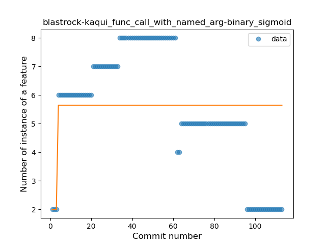
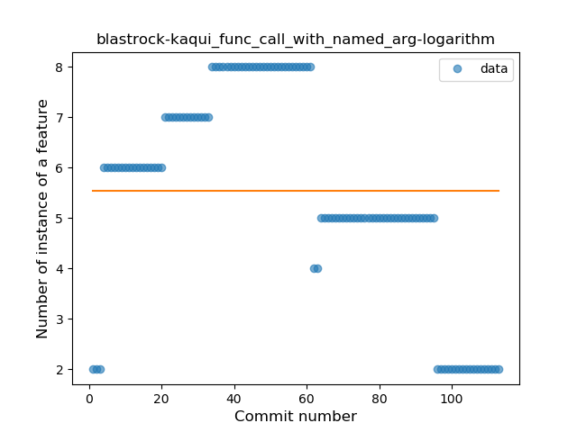
### <a name="data_class">Data Class</a>
----
#### Functions
* **Constant Rise - Linear:** 
    * **R_Squared:** 0.94430781
* **Sudden Rise - Exponential:** 
    * **R_Squared:** 0.94502338
* **Sudden Rise Plateau - Logarithm:** 
    * **R_Squared:** 0.45432592
* **Plateau Sudden Rise - Binary Sigmoid:** 
    * **R_Squared:** 0.04366367

**Plots** :chart_with_upwards_trend:
-----

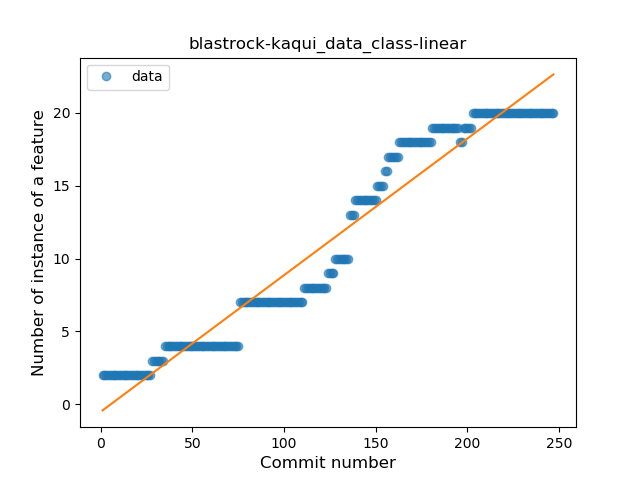
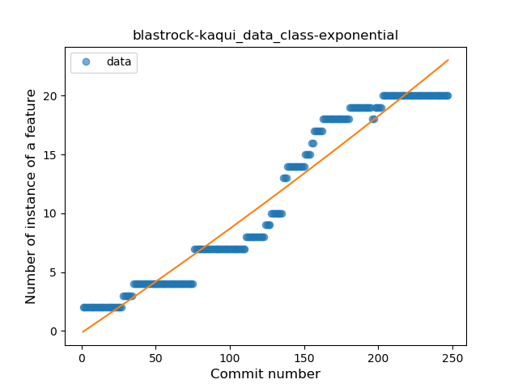
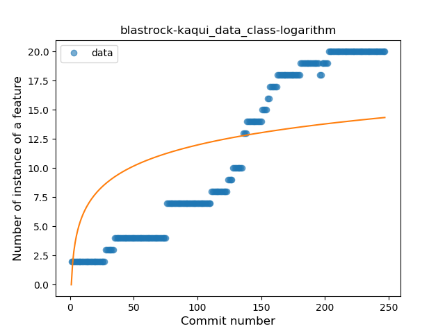
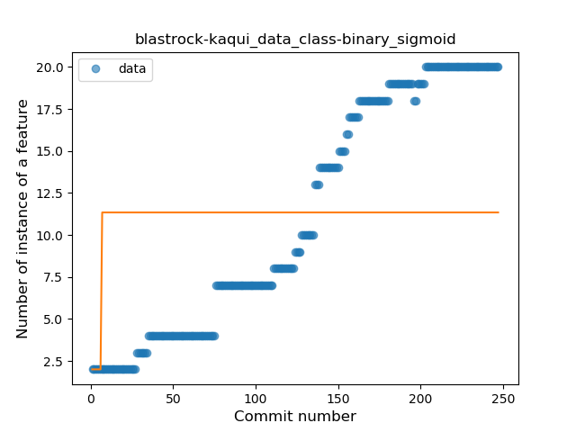
### <a name="extension_function">Extension Function</a>
----
#### Functions
* **Plateau Sudden Rise - Binary Sigmoid:** 
    * **R_Squared:** 0.86086637
* **Sudden Rise Plateau - Logarithm:** 
    * **R_Squared:** 0.4272865
* **Constant Rise - Linear:** 
    * **R_Squared:** 0.40943418

**Plots** :chart_with_upwards_trend:
-----

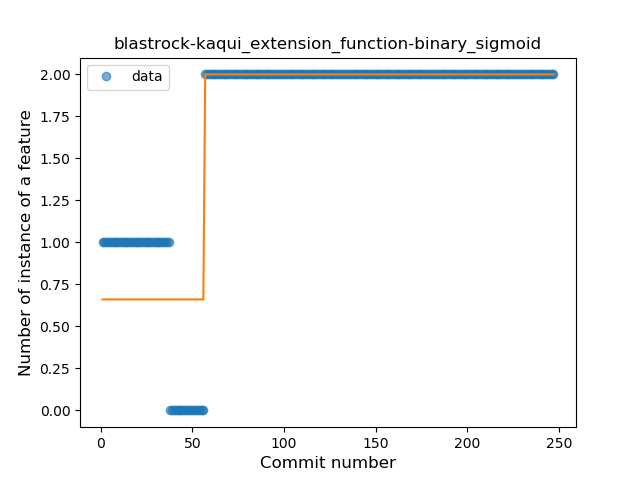
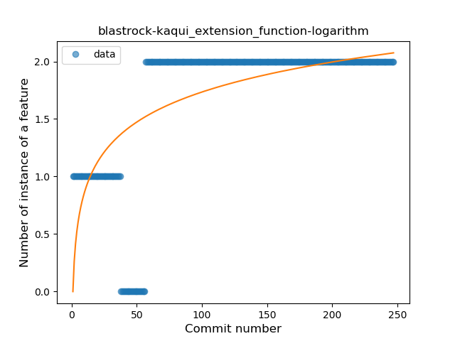
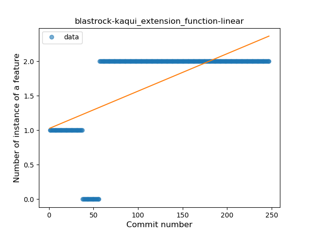
### <a name="destructuring_declaration">Destructuring Declaration</a>
----
#### Functions
* **Constant Decline - Linear:** 
    * **R_Squared:** 0.19999614
* **Plateau Sudden Rise - Binary Sigmoid:** 
    * **R_Squared:** 0.12405822
* **Sudden Rise Plateau - Logarithm:** 
    * **R_Squared:** -0.0

**Plots** :chart_with_upwards_trend:
-----

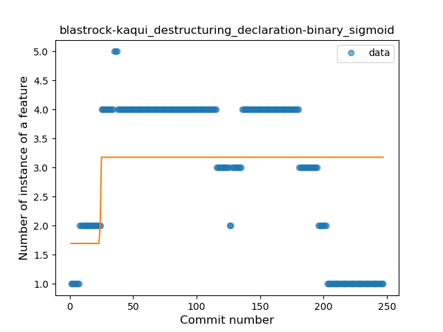
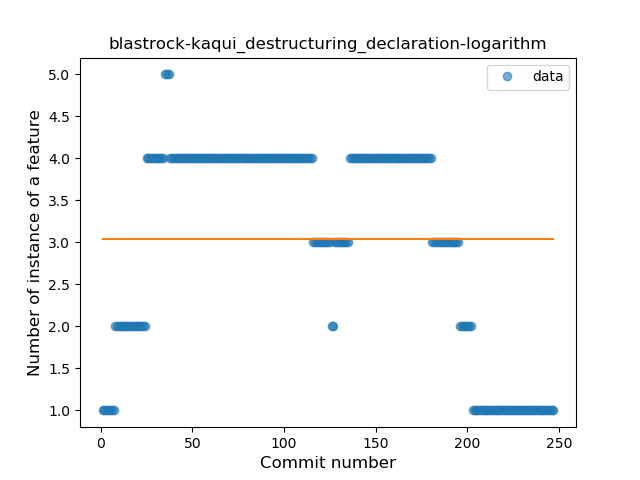
