## blokadaorg-blokada
----
#### Metrics provided by Detekt
* Number of lines of code 15877
* Number of Kotlin files: 127
* Cyclomatic complexity: 2397
* Cyclomatic complexity by thousands of lines: 248 

----
**18** features analyzed

*	<a href="#type_inference">Type Inference</a> 
*	<a href="#lambda">Lambda</a> 
*	<a href="#safe_call">Safe Call</a> 
*	<a href="#when_expr">When expression</a> 
*	<a href="#companion_object">Companion Object</a> 
*	<a href="#unsafe_call">Unsafe Call</a> 
*	<a href="#string_template">String Template</a> 
*	<a href="#func_with_default_value">Function with Default Value</a> 
*	<a href="#singleton">Singleton</a> 
*	<a href="#smart_cast">Smart Cast</a> 
*	<a href="#range_expr">Range Expression</a> 
*	<a href="#func_call_with_named_arg">Function call with Named Argument</a> 
*	<a href="#data_class">Data Class</a> 
*	<a href="#extension_function">Extension Function</a> 
*	<a href="#property_delegation">Property Delegation</a> 
*	<a href="#destructuring_declaration">Destructuring Declaration</a> 
*	<a href="#overloaded_op">Overloaded Operator</a> 
*	<a href="#super_delegation">Super Delegation</a> 

### <a name="type_inference">Type Inference</a>
----
#### Functions
* **Sudden Rise - Exponential:** 
    * **R_Squared:** 0.79836853
* **Constant Rise - Linear:** 
    * **R_Squared:** 0.63480587
* **Sudden Rise Plateau - Logarithm:** 
    * **R_Squared:** 0.2800761

**Plots** :chart_with_upwards_trend:
-----

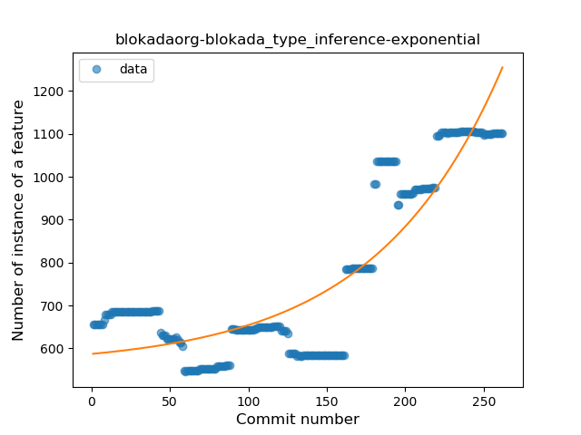
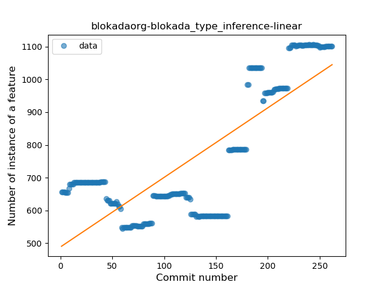
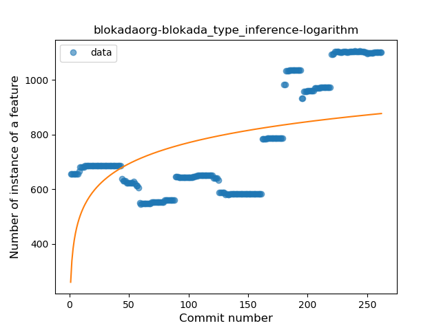
### <a name="lambda">Lambda</a>
----
#### Functions
* **Sudden Rise - Exponential:** 
    * **R_Squared:** 0.8263285
* **Constant Rise - Linear:** 
    * **R_Squared:** 0.59831781
* **Sudden Rise Plateau - Logarithm:** 
    * **R_Squared:** 0.25979834

**Plots** :chart_with_upwards_trend:
-----

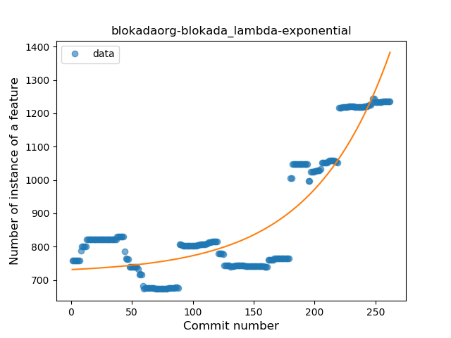
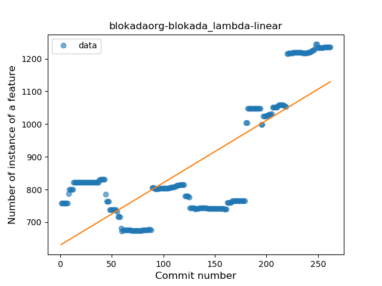
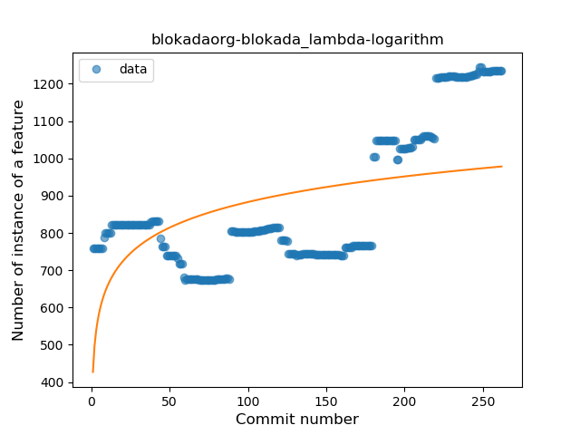
### <a name="safe_call">Safe Call</a>
----
#### Functions
* **Sudden Rise - Exponential:** 
    * **R_Squared:** 0.83549043
* **Constant Rise - Linear:** 
    * **R_Squared:** 0.69757797
* **Sudden Rise Plateau - Logarithm:** 
    * **R_Squared:** 0.34120424

**Plots** :chart_with_upwards_trend:
-----

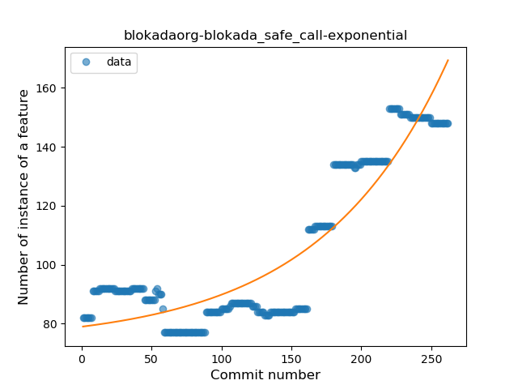
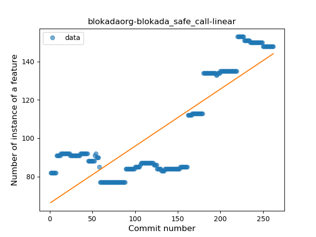
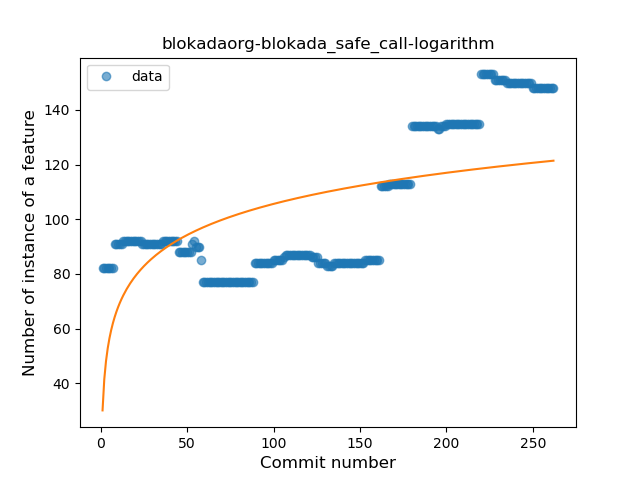
### <a name="when_expr">When expression</a>
----
#### Functions
* **Sudden Rise - Exponential:** 
    * **R_Squared:** 0.69963118
* **Constant Rise - Linear:** 
    * **R_Squared:** 0.46839674
* **Sudden Rise Plateau - Logarithm:** 
    * **R_Squared:** 0.16559454

**Plots** :chart_with_upwards_trend:
-----

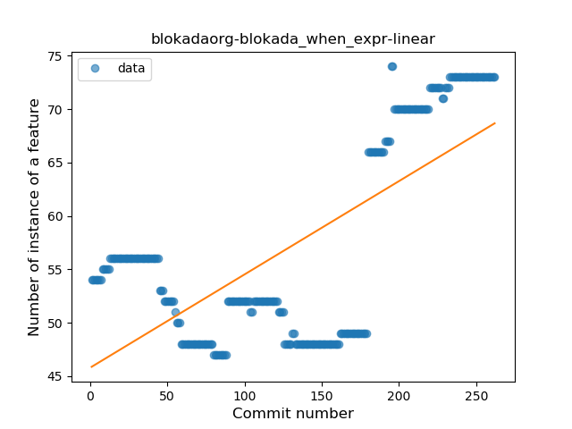
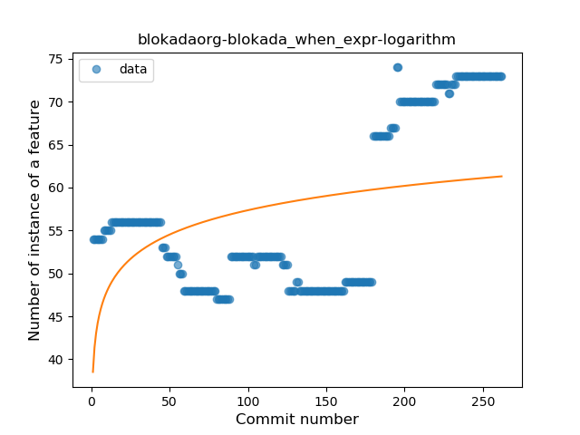
### <a name="companion_object">Companion Object</a>
----
#### Functions
* **Plateau Gradual Rise - Sigmoid:** 
    * **R_Squared:** 0.90964676
* **Sudden Rise - Exponential:** 
    * **R_Squared:** 0.80972858
* **Constant Rise - Linear:** 
    * **R_Squared:** 0.56475066
* **Sudden Rise Plateau - Logarithm:** 
    * **R_Squared:** 0.24721711

**Plots** :chart_with_upwards_trend:
-----

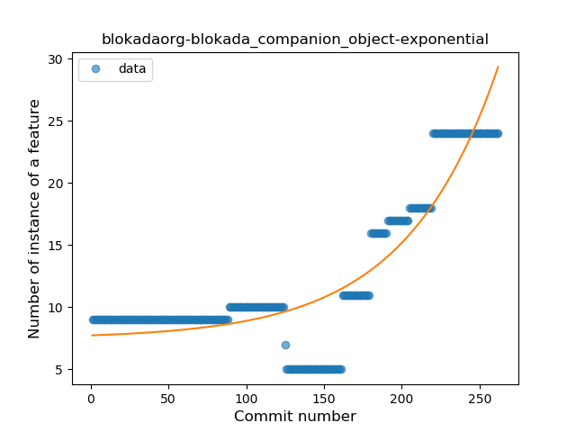
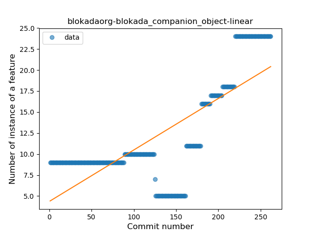
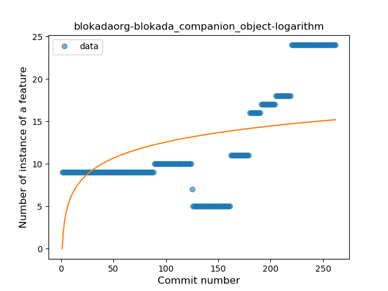
### <a name="unsafe_call">Unsafe Call</a>
----
#### Functions
* **Sudden Rise - Exponential:** 
    * **R_Squared:** 0.77398425
* **Constant Rise - Linear:** 
    * **R_Squared:** 0.66908182
* **Sudden Rise Plateau - Logarithm:** 
    * **R_Squared:** 0.33558693

**Plots** :chart_with_upwards_trend:
-----

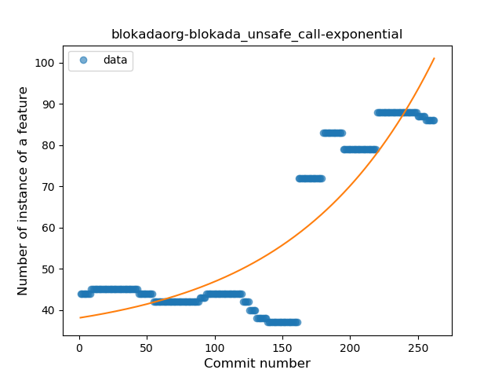
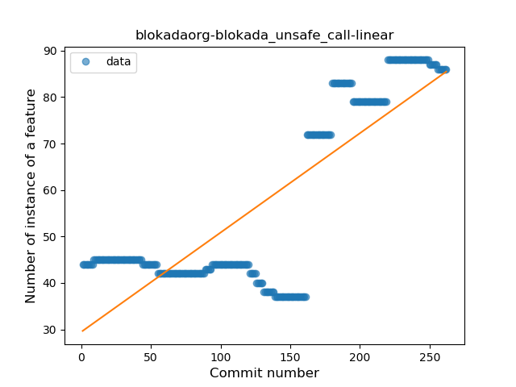
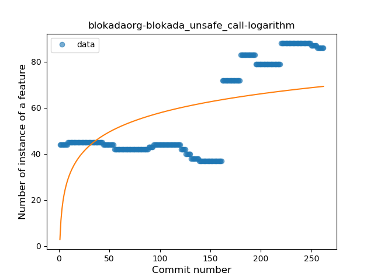
### <a name="string_template">String Template</a>
----
#### Functions
* **Plateau Gradual Rise - Sigmoid:** 
    * **R_Squared:** 0.97704935
* **Sudden Rise - Exponential:** 
    * **R_Squared:** 0.89439504
* **Constant Rise - Linear:** 
    * **R_Squared:** 0.84873387
* **Sudden Rise Plateau - Logarithm:** 
    * **R_Squared:** 0.39126535

**Plots** :chart_with_upwards_trend:
-----

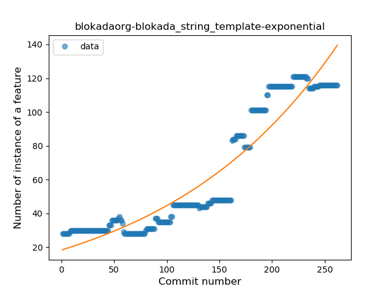
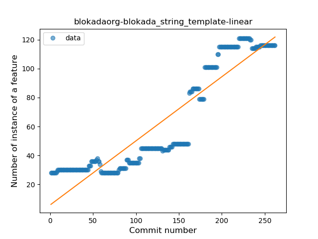
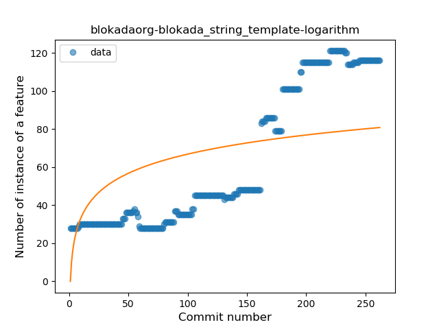
### <a name="func_with_default_value">Function with Default Value</a>
----
#### Functions
* **Sudden Rise - Exponential:** 
    * **R_Squared:** 0.92583471
* **Constant Rise - Linear:** 
    * **R_Squared:** 0.82424695
* **Sudden Rise Plateau - Logarithm:** 
    * **R_Squared:** 0.47442709

**Plots** :chart_with_upwards_trend:
-----

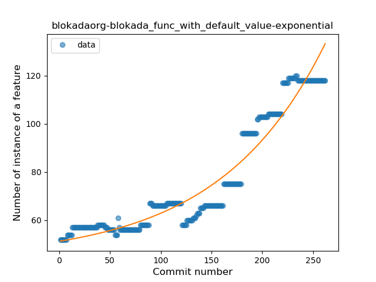
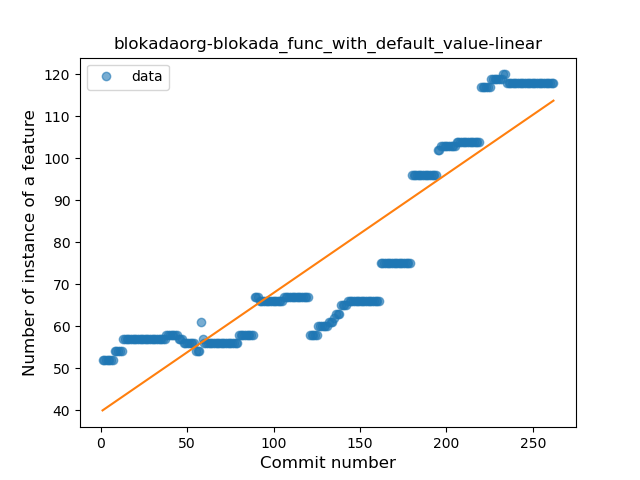
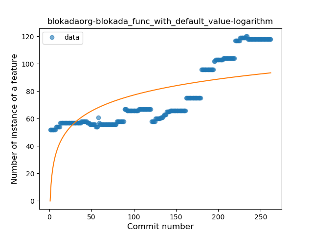
### <a name="singleton">Singleton</a>
----
#### Functions
* **Plateau Gradual Rise - Sigmoid:** 
    * **R_Squared:** 0.9669039
* **Sudden Rise - Exponential:** 
    * **R_Squared:** 0.82937288
* **Constant Rise - Linear:** 
    * **R_Squared:** 0.78158724
* **Sudden Rise Plateau - Logarithm:** 
    * **R_Squared:** 0.45856324

**Plots** :chart_with_upwards_trend:
-----

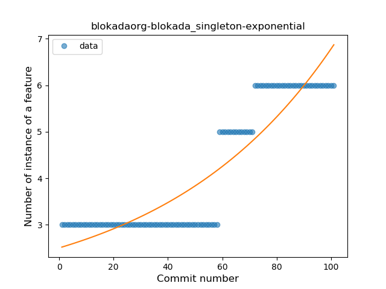
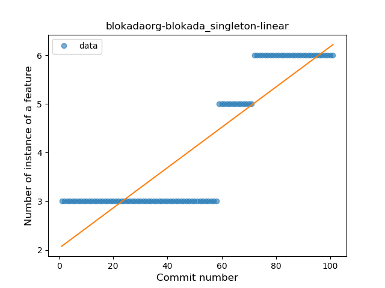
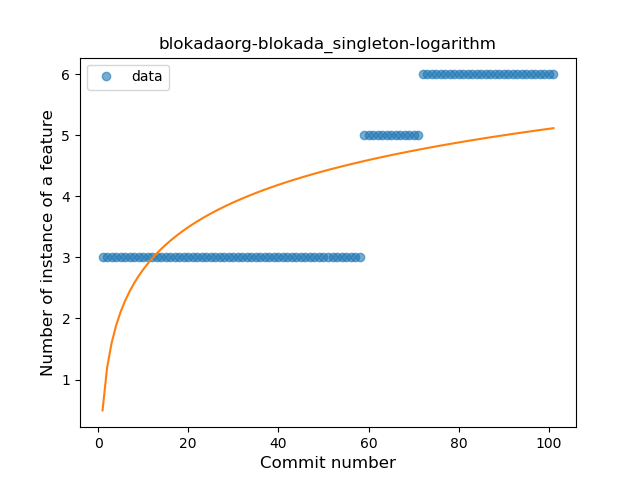
### <a name="smart_cast">Smart Cast</a>
----
#### Functions
* **Sudden Rise - Exponential:** 
    * **R_Squared:** 0.23032212
* **Constant Rise - Linear:** 
    * **R_Squared:** 0.21303304
* **Sudden Rise Plateau - Logarithm:** 
    * **R_Squared:** 0.11952347

**Plots** :chart_with_upwards_trend:
-----

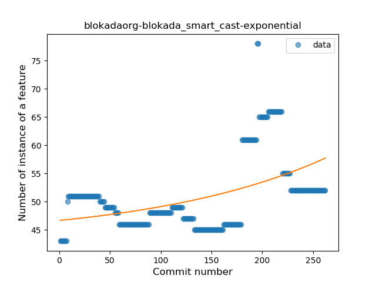
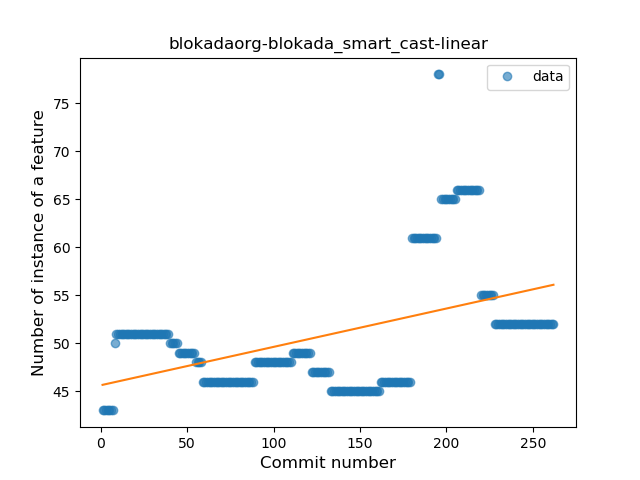
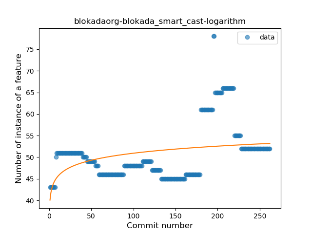
### <a name="range_expr">Range Expression</a>
----
#### Functions
* **Sudden Rise - Exponential:** 
    * **R_Squared:** 0.67684557
* **Constant Rise - Linear:** 
    * **R_Squared:** 0.42436809
* **Sudden Rise Plateau - Logarithm:** 
    * **R_Squared:** 0.11459627

**Plots** :chart_with_upwards_trend:
-----

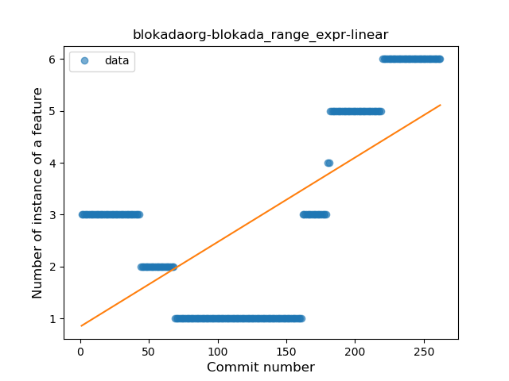
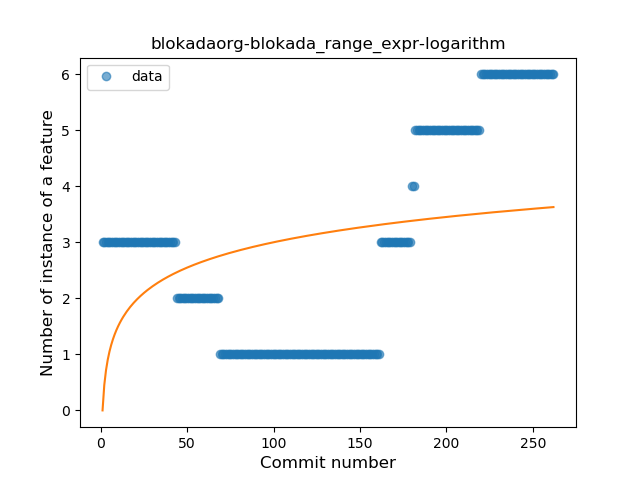
### <a name="func_call_with_named_arg">Function call with Named Argument</a>
----
#### Functions
* **Sudden Rise - Exponential:** 
    * **R_Squared:** 0.78651479
* **Constant Rise - Linear:** 
    * **R_Squared:** 0.54684328
* **Sudden Rise Plateau - Logarithm:** 
    * **R_Squared:** 0.21587862

**Plots** :chart_with_upwards_trend:
-----

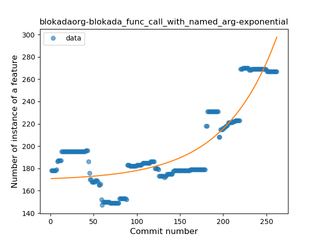
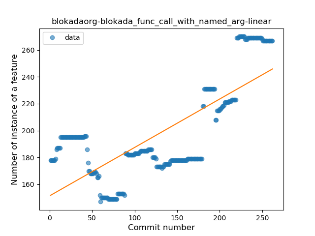
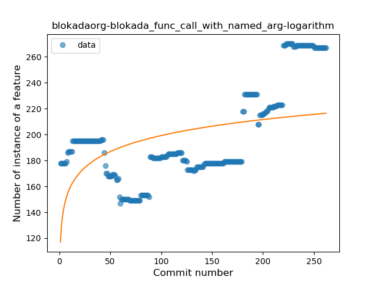
### <a name="data_class">Data Class</a>
----
#### Functions
* **Sudden Rise - Exponential:** 
    * **R_Squared:** 0.35608966
* **Plateau Sudden Decline - Binary Sigmoid:** 
    * **R_Squared:** 0.15269445
* **Constant Rise - Linear:** 
    * **R_Squared:** 0.06062546
* **Sudden Rise Plateau - Logarithm:** 
    * **R_Squared:** -0.0

**Plots** :chart_with_upwards_trend:
-----

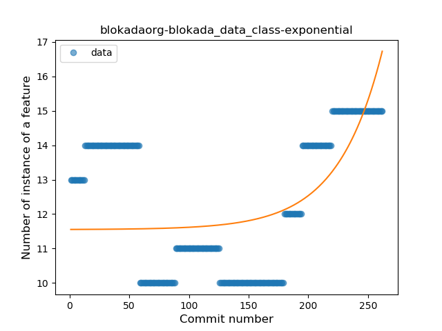
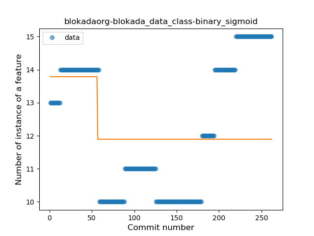
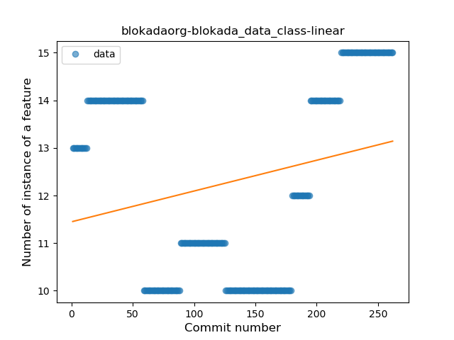
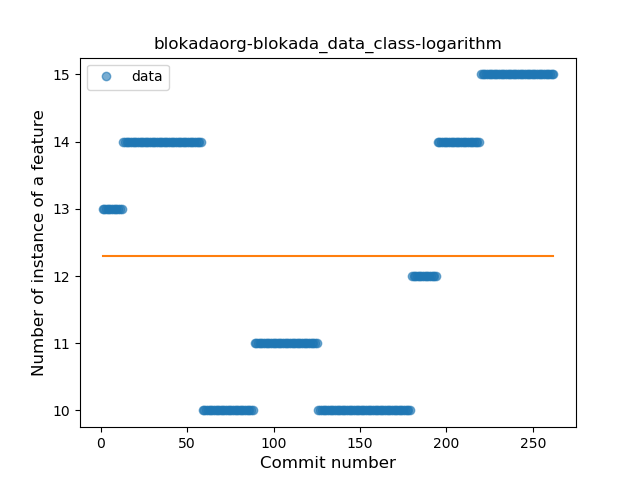
### <a name="extension_function">Extension Function</a>
----
#### Functions
* **Sudden Rise - Exponential:** 
    * **R_Squared:** 0.64234549
* **Constant Rise - Linear:** 
    * **R_Squared:** 0.3258921
* **Sudden Rise Plateau - Logarithm:** 
    * **R_Squared:** 0.06539

**Plots** :chart_with_upwards_trend:
-----

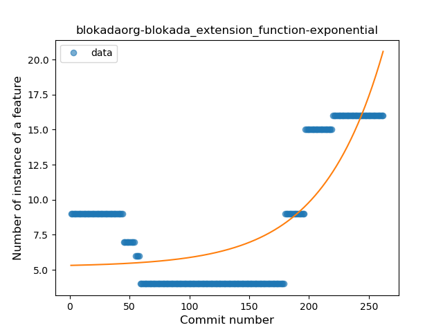
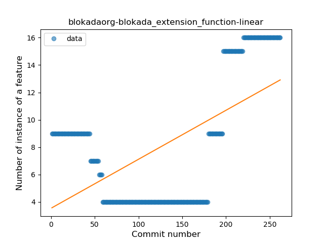
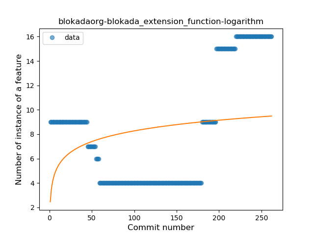
### <a name="property_delegation">Property Delegation</a>
----
#### Functions
* **Constant Rise - Linear:** 
    * **R_Squared:** 0.86402527
* **Sudden Rise - Exponential:** 
    * **R_Squared:** 0.87299342
* **Sudden Rise Plateau - Logarithm:** 
    * **R_Squared:** 0.59446273

**Plots** :chart_with_upwards_trend:
-----

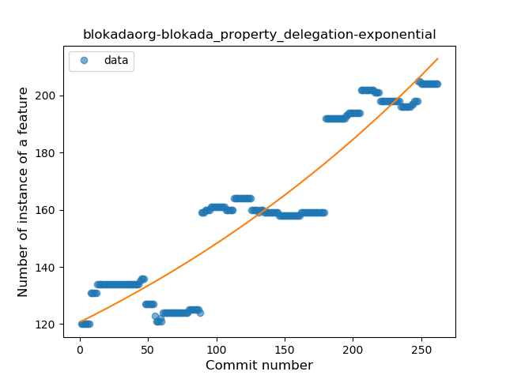
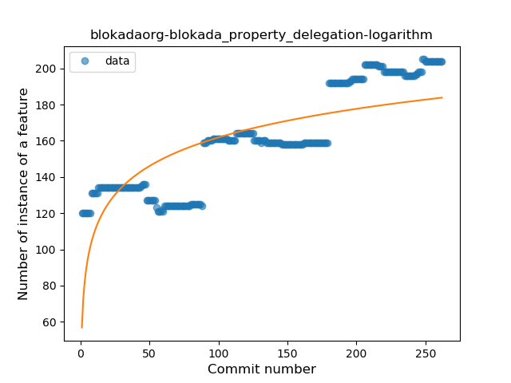
### <a name="destructuring_declaration">Destructuring Declaration</a>
----
#### Functions
* **Plateau Gradual Rise - Sigmoid:** 
    * **R_Squared:** 0.97290014
* **Sudden Rise - Exponential:** 
    * **R_Squared:** 0.89416019
* **Constant Rise - Linear:** 
    * **R_Squared:** 0.64344293
* **Sudden Rise Plateau - Logarithm:** 
    * **R_Squared:** 0.24836674

**Plots** :chart_with_upwards_trend:
-----

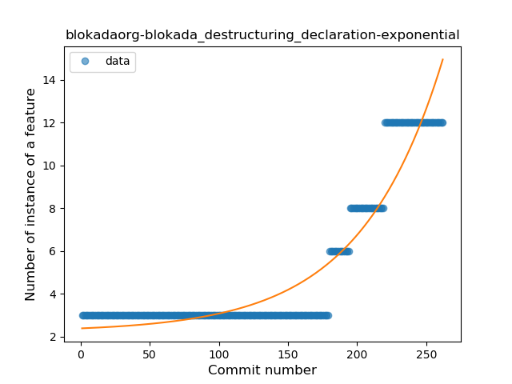
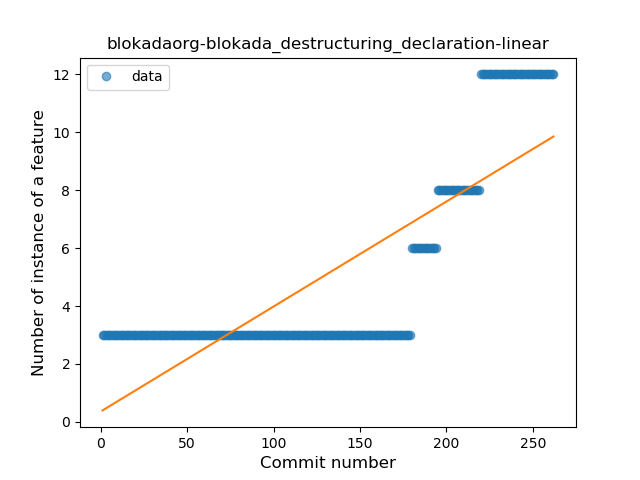
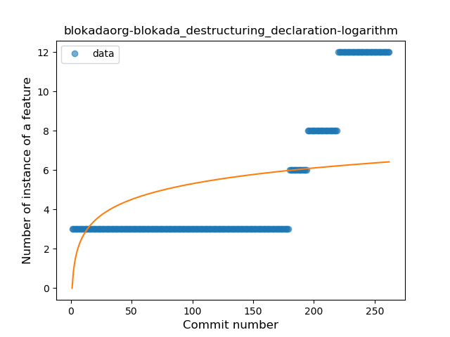
### <a name="overloaded_op">Overloaded Operator</a>
----
#### Functions
* **Sudden Rise - Exponential:** 
    * **R_Squared:** 0.08912237
* **Constant Rise - Linear:** 
    * **R_Squared:** 0.00028508
* **Sudden Rise Plateau - Logarithm:** 
    * **R_Squared:** -0.0

**Plots** :chart_with_upwards_trend:
-----

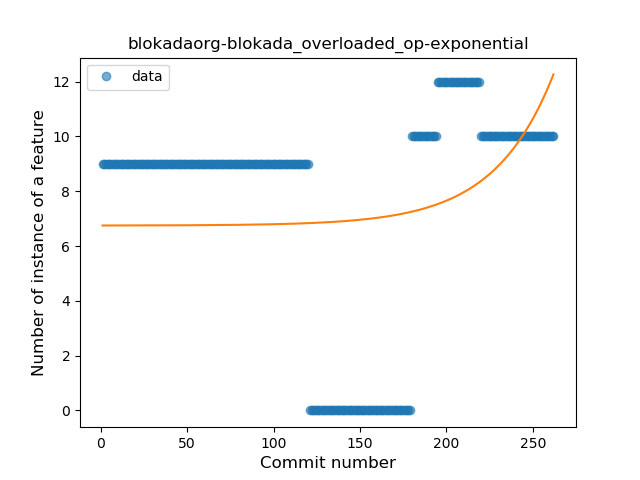

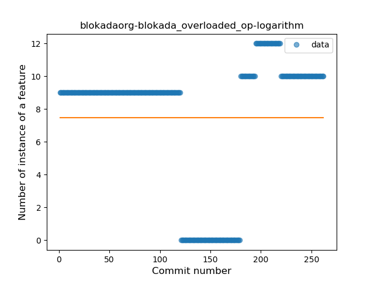
### <a name="super_delegation">Super Delegation</a>
----
#### Functions
* **Plateau Sudden Rise - Binary Sigmoid:** 
    * **R_Squared:** 1.0
* **Constant Rise - Linear:** 
    * **R_Squared:** 0.68128588
* **Sudden Rise Plateau - Logarithm:** 
    * **R_Squared:** 0.64987812

**Plots** :chart_with_upwards_trend:
-----

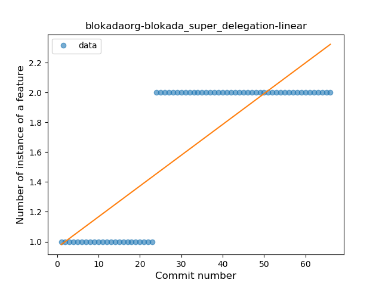
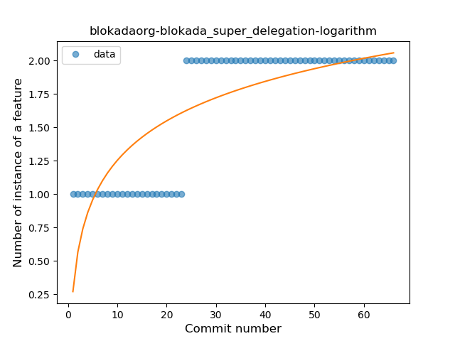
