## bottiger-SoundWaves
----
#### Metrics provided by Detekt
* Number of lines of code 489
* Number of Kotlin files: 7
* Cyclomatic complexity: 41
* Cyclomatic complexity by thousands of lines: 150 

----
**3** features analyzed

*	<a href="#type_inference">Type Inference</a> 
*	<a href="#lambda">Lambda</a> 
*	<a href="#range_expr">Range Expression</a> 

### <a name="type_inference">Type Inference</a>
----
#### Functions
* **Instability - Polinomial 3:** )
    * **R_Squared:** 0.87762662
* **Sudden Rise - Exponential:** 
    * **R_Squared:** 0.84288503
* **Constant Rise - Linear:** 
    * **R_Squared:** 0.60507337
* **Sudden Rise Plateau - Logarithm:** 
    * **R_Squared:** 0.37036394
* **Plateau Sudden Rise - Binary Sigmoid:** 
    * **R_Squared:** 0.09704725

**Plots** :chart_with_upwards_trend:
-----

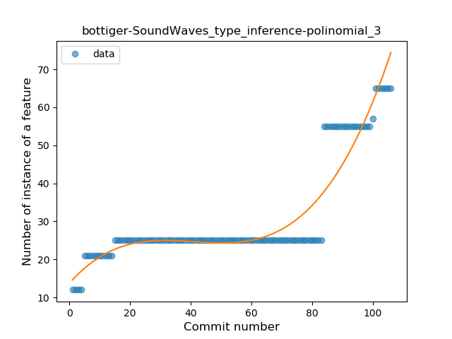
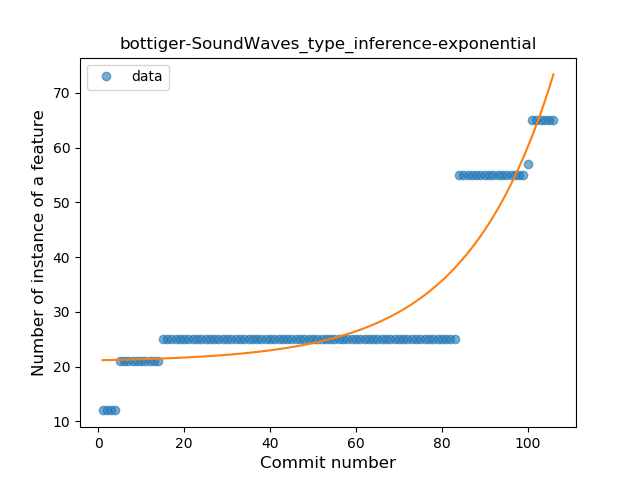
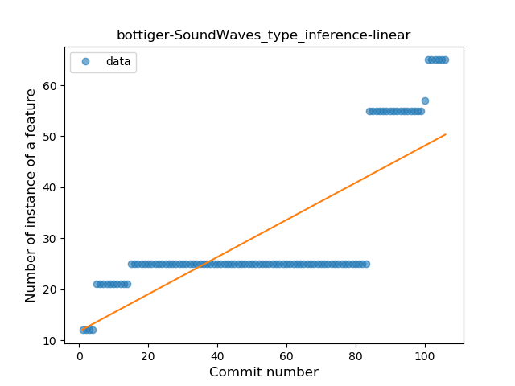
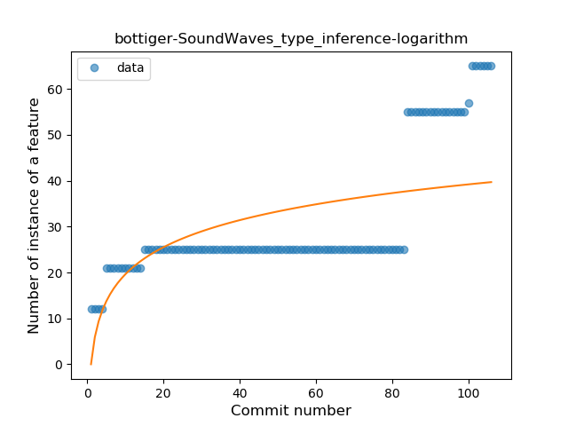
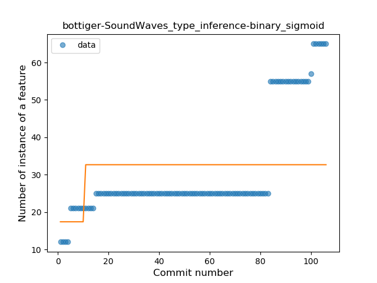
### <a name="lambda">Lambda</a>
----
#### Functions
* **Sudden Rise - Exponential:** 
    * **R_Squared:** 0.90476171
* **Constant Rise - Linear:** 
    * **R_Squared:** 0.4634152
* **Sudden Rise Plateau - Logarithm:** 
    * **R_Squared:** 0.20820131

**Plots** :chart_with_upwards_trend:
-----

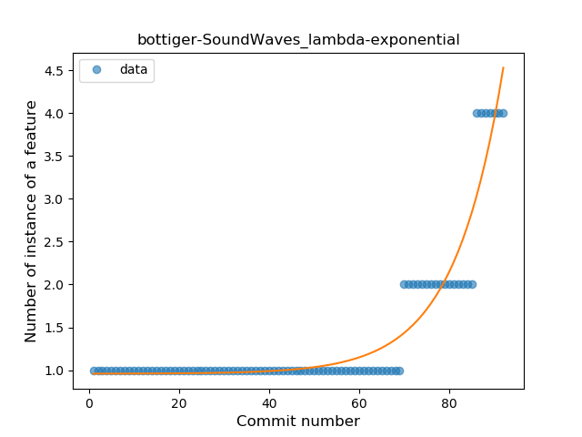
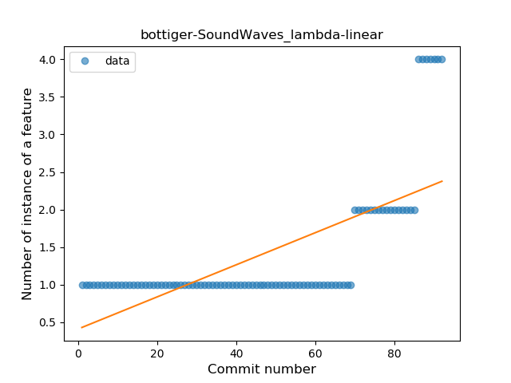
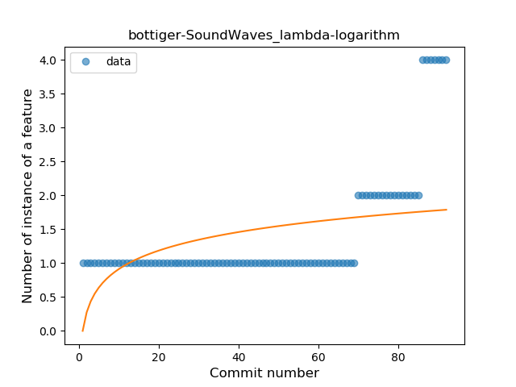
### <a name="range_expr">Range Expression</a>
----
#### Functions
* **Plateau Sudden Rise - Binary Sigmoid:** 
    * **R_Squared:** 1.0
* **Instability - Polinomial 4:** 
    * **R_Squared:** 0.85281561
* **Sudden Rise - Exponential:** 
    * **R_Squared:** 0.77214703
* **Constant Rise - Linear:** 
    * **R_Squared:** 0.57954545
* **Sudden Rise Plateau - Logarithm:** 
    * **R_Squared:** 0.32294041

**Plots** :chart_with_upwards_trend:
-----

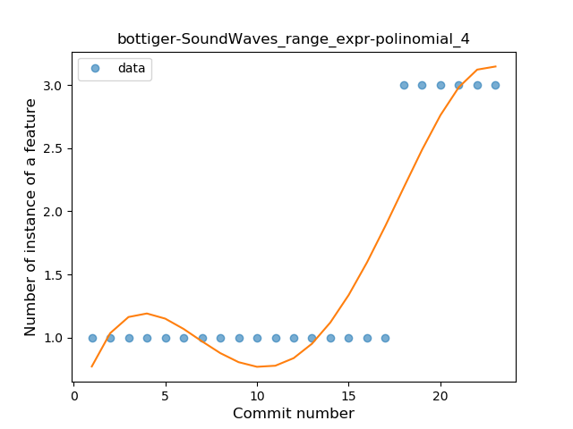
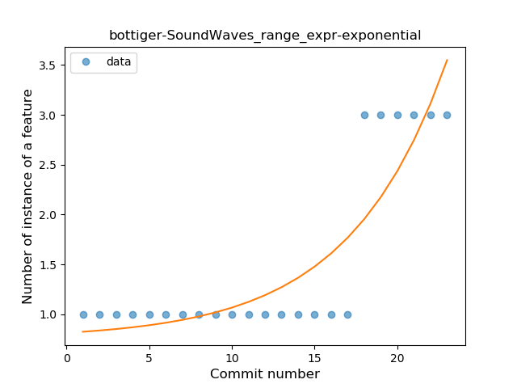
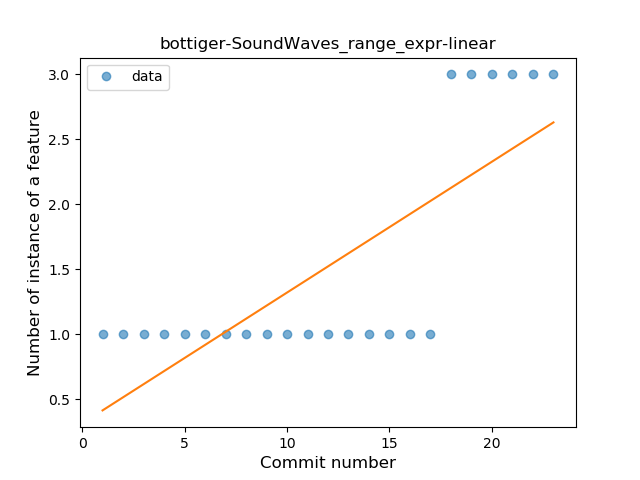
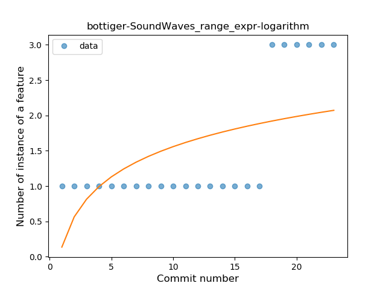
