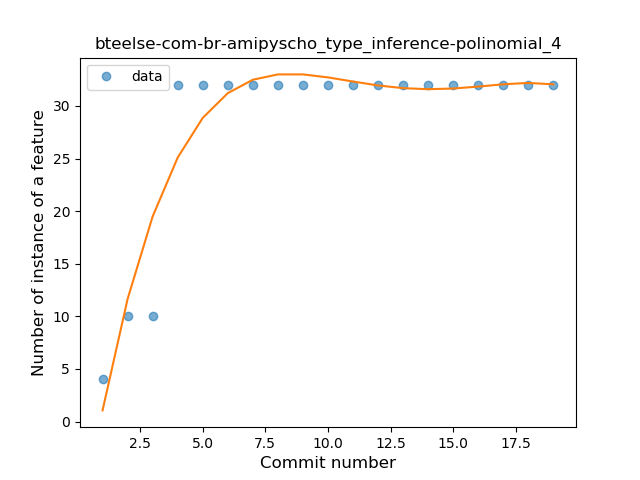

## bteelse-com-br-amipyscho
----
#### Metrics provided by Detekt
* Number of lines of code 421
* Number of Kotlin files: 13
* Cyclomatic complexity: 46
* Cyclomatic complexity by thousands of lines: 264 

----
**1** features analyzed

*	<a href="#type_inference">Type Inference</a> 

### <a name="type_inference">Type Inference</a>
----
#### Functions
* **Instability - Polinomial 4:** 
    * **R_Squared:** 0.88980035
* **Instability - Polinomial 3:** )
    * **R_Squared:** 0.87488923
* **Sudden Rise Plateau - Logarithm:** 
    * **R_Squared:** 0.69269177
* **Constant Rise - Linear:** 
    * **R_Squared:** 0.40175064

**Plots** :chart_with_upwards_trend:
-----

