## bubelov-coins-android
----
#### Metrics provided by Detekt
* Number of lines of code 9152
* Number of Kotlin files: 124
* Cyclomatic complexity: 597
* Cyclomatic complexity by thousands of lines: 201 

----
**17** features analyzed

*	<a href="#type_inference">Type Inference</a> 
*	<a href="#lambda">Lambda</a> 
*	<a href="#safe_call">Safe Call</a> 
*	<a href="#when_expr">When expression</a> 
*	<a href="#companion_object">Companion Object</a> 
*	<a href="#unsafe_call">Unsafe Call</a> 
*	<a href="#string_template">String Template</a> 
*	<a href="#func_with_default_value">Function with Default Value</a> 
*	<a href="#singleton">Singleton</a> 
*	<a href="#smart_cast">Smart Cast</a> 
*	<a href="#range_expr">Range Expression</a> 
*	<a href="#func_call_with_named_arg">Function call with Named Argument</a> 
*	<a href="#data_class">Data Class</a> 
*	<a href="#extension_function">Extension Function</a> 
*	<a href="#property_delegation">Property Delegation</a> 
*	<a href="#destructuring_declaration">Destructuring Declaration</a> 
*	<a href="#inline_func">Inline Function</a> 

### <a name="type_inference">Type Inference</a>
----
#### Functions
* **Sudden Rise Plateau - Logarithm:** 
    * **R_Squared:** 0.79424966
* **Constant Rise - Linear:** 
    * **R_Squared:** 0.53276085

**Plots** :chart_with_upwards_trend:
-----

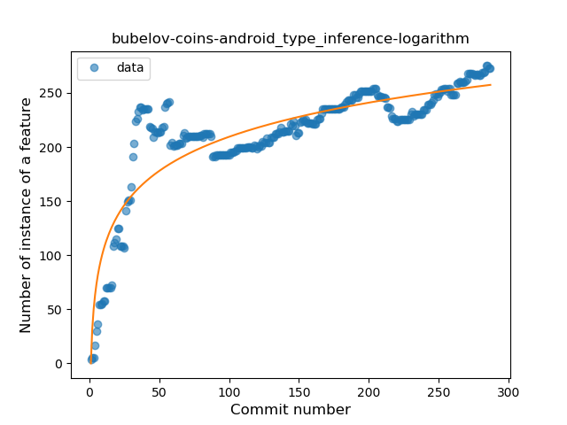
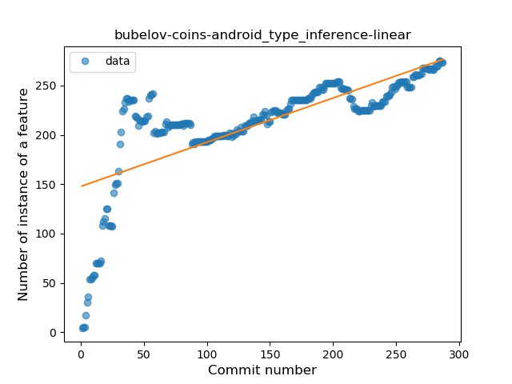
### <a name="lambda">Lambda</a>
----
#### Functions
* **Constant Rise - Linear:** 
    * **R_Squared:** 0.89094028
* **Sudden Rise Plateau - Logarithm:** 
    * **R_Squared:** 0.78923179
* **Plateau Sudden Rise - Binary Sigmoid:** 
    * **R_Squared:** 0.6836939

**Plots** :chart_with_upwards_trend:
-----

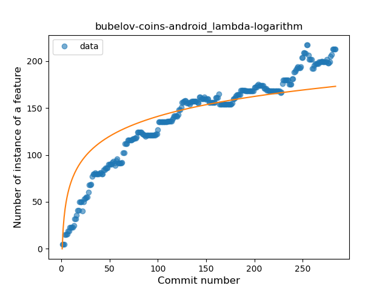
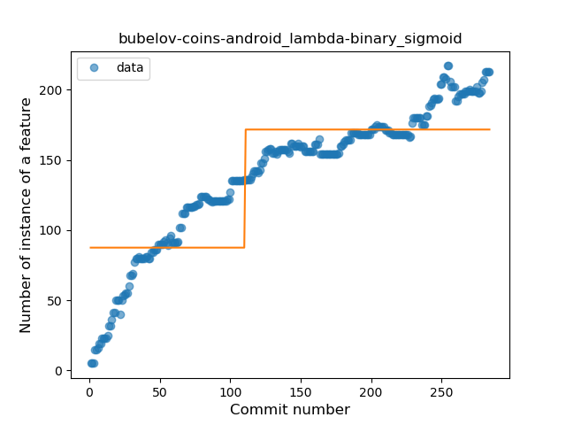
### <a name="safe_call">Safe Call</a>
----
#### Functions
* **Sudden Rise Plateau - Logarithm:** 
    * **R_Squared:** 0.56479622
* **Constant Rise - Linear:** 
    * **R_Squared:** 0.40057201

**Plots** :chart_with_upwards_trend:
-----

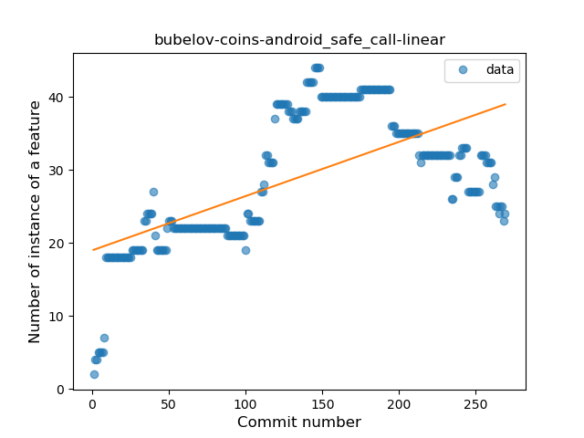
### <a name="when_expr">When expression</a>
----
#### Functions
* **Plateau Sudden Rise - Binary Sigmoid:** 
    * **R_Squared:** 0.64868393
* **Sudden Rise Plateau - Logarithm:** 
    * **R_Squared:** 0.62178874
* **Constant Rise - Linear:** 
    * **R_Squared:** 0.23911766

**Plots** :chart_with_upwards_trend:
-----

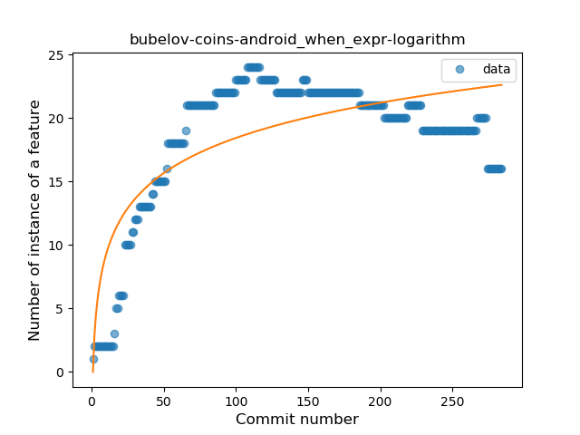
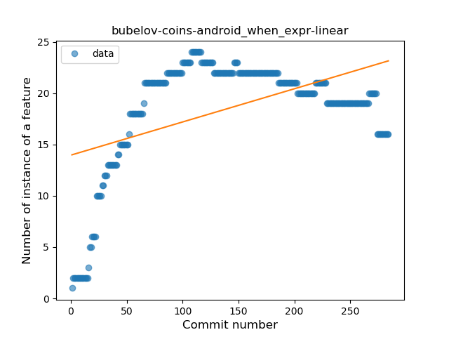
### <a name="companion_object">Companion Object</a>
----
#### Functions
* **Sudden Rise Plateau - Logarithm:** 
    * **R_Squared:** 0.45688475
* **Constant Rise - Linear:** 
    * **R_Squared:** 0.14725535

**Plots** :chart_with_upwards_trend:
-----

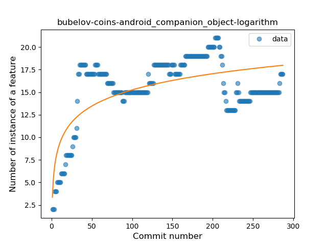
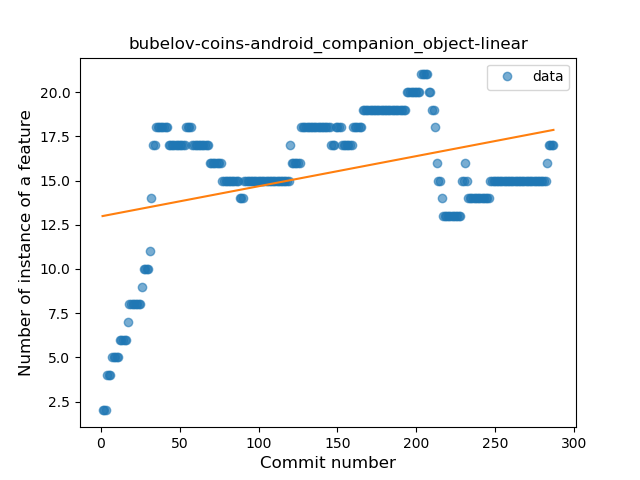
### <a name="unsafe_call">Unsafe Call</a>
----
#### Functions
* **Constant Decline - Linear:** 
    * **R_Squared:** 0.51707309
* **Plateau Sudden Decline - Binary Sigmoid:** 
    * **R_Squared:** 0.35437043
* **Sudden Decline - Exponential:** 
    * **R_Squared:** 0.0
* **Sudden Rise Plateau - Logarithm:** 
    * **R_Squared:** 0.0

**Plots** :chart_with_upwards_trend:
-----

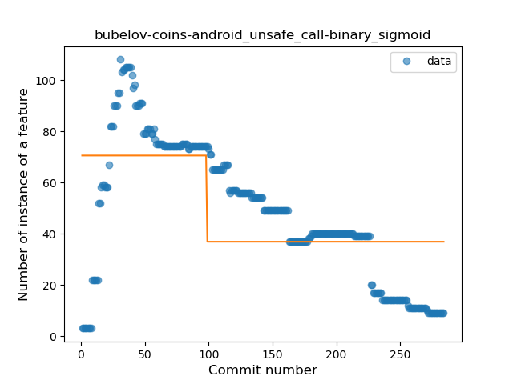
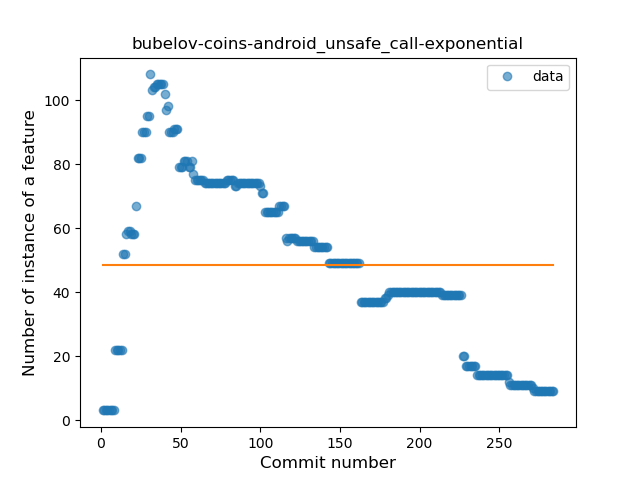
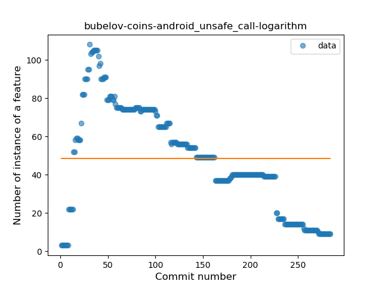
### <a name="string_template">String Template</a>
----
#### Functions
* **Plateau Gradual Rise - Sigmoid:** 
    * **R_Squared:** 0.62068661
* **Sudden Rise Plateau - Logarithm:** 
    * **R_Squared:** 0.27506413
* **Constant Rise - Linear:** 
    * **R_Squared:** 0.07000997

**Plots** :chart_with_upwards_trend:
-----

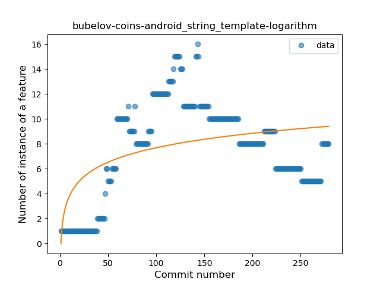
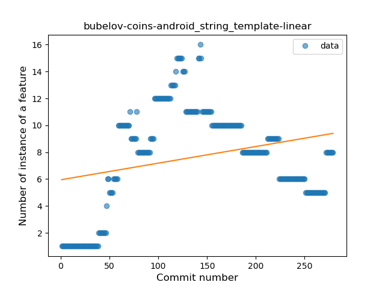
### <a name="func_with_default_value">Function with Default Value</a>
----
#### Functions
* **Constant Rise - Linear:** 
    * **R_Squared:** 0.35390102
* **Sudden Rise Plateau - Logarithm:** 
    * **R_Squared:** 0.29880177
* **Plateau Sudden Rise - Binary Sigmoid:** 
    * **R_Squared:** 0.0038321

**Plots** :chart_with_upwards_trend:
-----

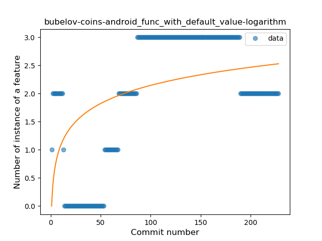
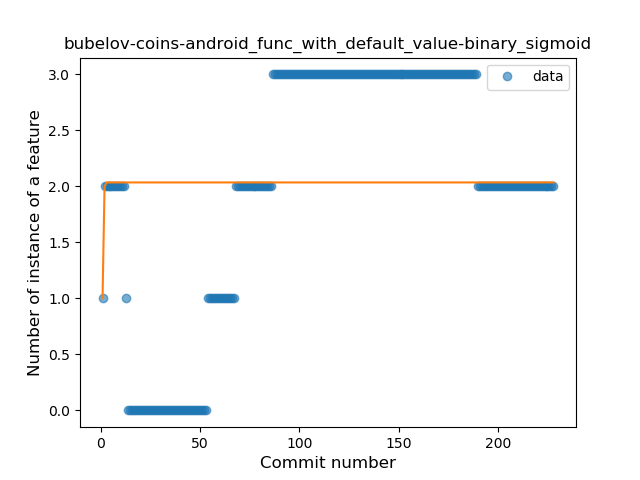
### <a name="singleton">Singleton</a>
----
#### Functions
* **Constant Decline - Linear:** 
    * **R_Squared:** 0.59189075
* **Sudden Rise Plateau - Logarithm:** 
    * **R_Squared:** -0.0

**Plots** :chart_with_upwards_trend:
-----

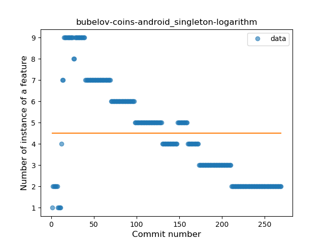
### <a name="smart_cast">Smart Cast</a>
----
#### Functions
* **Plateau Gradual Rise - Sigmoid:** 
    * **R_Squared:** 0.41893293
* **Sudden Rise Plateau - Logarithm:** 
    * **R_Squared:** 0.14913087
* **Constant Rise - Linear:** 
    * **R_Squared:** 0.00714901

**Plots** :chart_with_upwards_trend:
-----

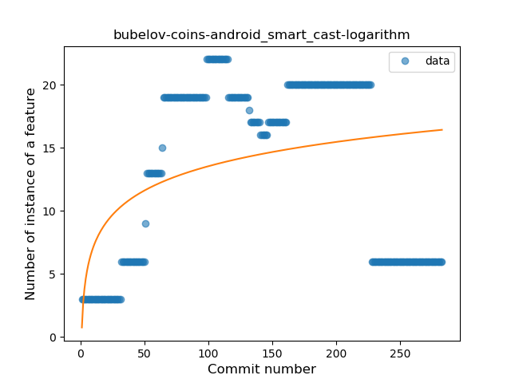
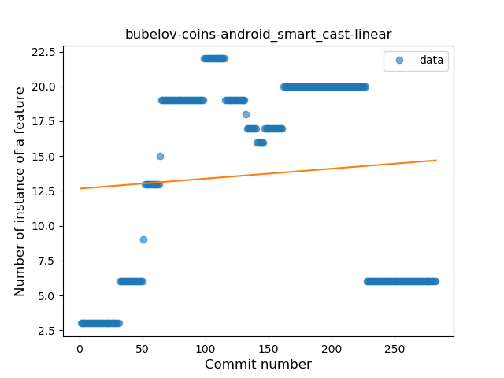
### <a name="range_expr">Range Expression</a>
----
#### Functions
* **Plateau Sudden Decline - Binary Sigmoid:** 
    * **R_Squared:** 0.62282398
* **Constant Decline - Linear:** 
    * **R_Squared:** 0.30301093
* **Sudden Rise Plateau - Logarithm:** 
    * **R_Squared:** -0.0

**Plots** :chart_with_upwards_trend:
-----

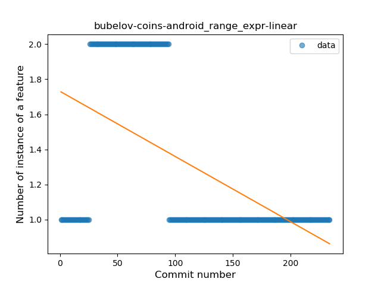
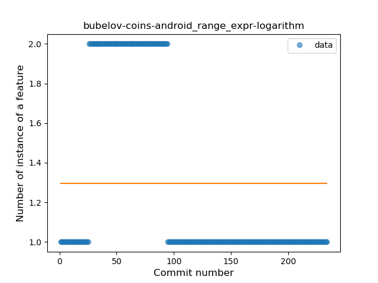
### <a name="func_call_with_named_arg">Function call with Named Argument</a>
----
#### Functions
* **Sudden Rise Plateau - Logarithm:** 
    * **R_Squared:** 0.73108441
* **Constant Rise - Linear:** 
    * **R_Squared:** 0.47543604
* **Plateau Gradual Rise - Sigmoid:** 
    * **R_Squared:** 0.43920756

**Plots** :chart_with_upwards_trend:
-----

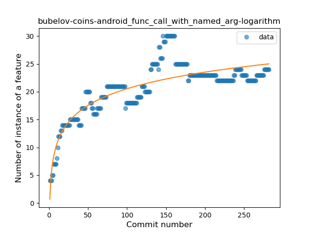

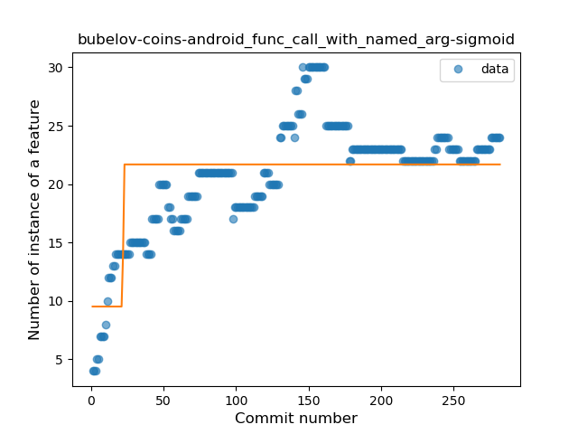
### <a name="data_class">Data Class</a>
----
#### Functions
* **Sudden Rise Plateau - Logarithm:** 
    * **R_Squared:** 0.86171341
* **Constant Rise - Linear:** 
    * **R_Squared:** 0.69043189
* **Plateau Sudden Rise - Binary Sigmoid:** 
    * **R_Squared:** 0.6270427

**Plots** :chart_with_upwards_trend:
-----

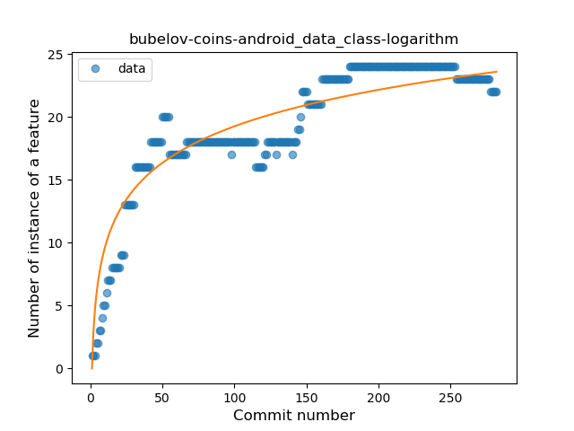
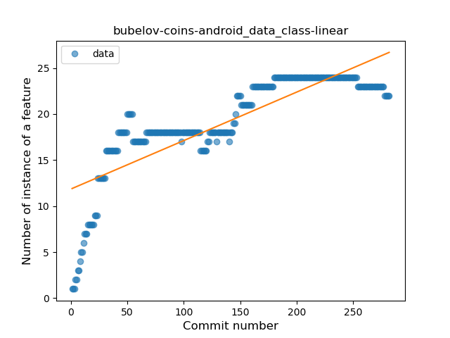
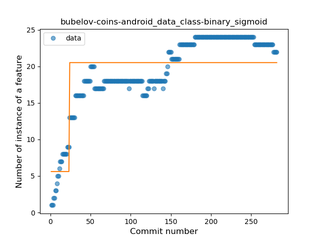
### <a name="extension_function">Extension Function</a>
----
#### Functions
* **Plateau Gradual Rise - Sigmoid:** 
    * **R_Squared:** 0.86096591
* **Constant Rise - Linear:** 
    * **R_Squared:** 0.79427763
* **Sudden Rise Plateau - Logarithm:** 
    * **R_Squared:** 0.65407794

**Plots** :chart_with_upwards_trend:
-----

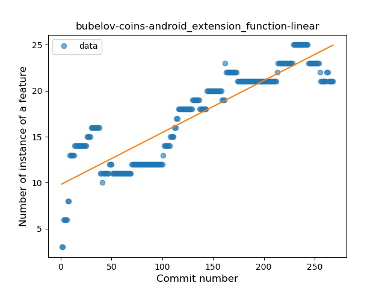
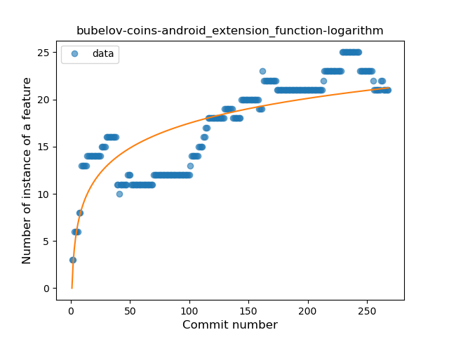
### <a name="property_delegation">Property Delegation</a>
----
#### Functions
* **Sudden Rise - Exponential:** 
    * **R_Squared:** 0.84324075
* **Constant Rise - Linear:** 
    * **R_Squared:** 0.76872268
* **Sudden Rise Plateau - Logarithm:** 
    * **R_Squared:** 0.22378149

**Plots** :chart_with_upwards_trend:
-----

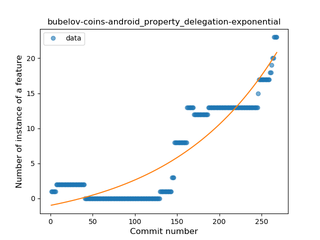
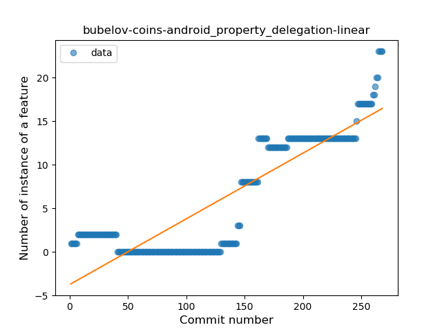
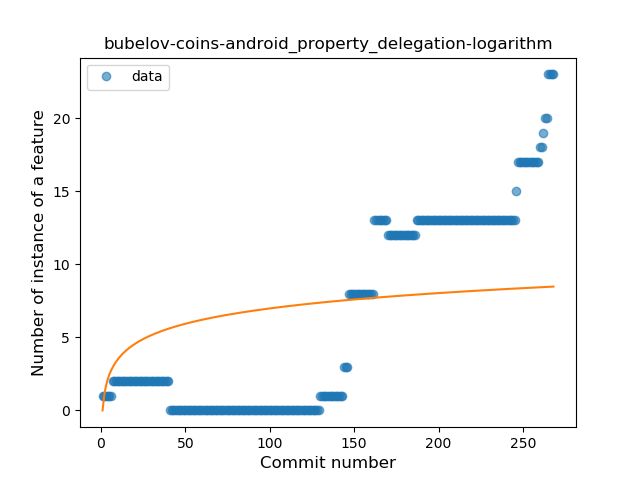
### <a name="destructuring_declaration">Destructuring Declaration</a>
----
#### Functions
* **Plateau Sudden Decline - Binary Sigmoid:** 
    * **R_Squared:** 0.75225525
* **Sudden Decline - Exponential:** 
    * **R_Squared:** 0.40560146
* **Constant Decline - Linear:** 
    * **R_Squared:** 0.08223096
* **Sudden Rise Plateau - Logarithm:** 
    * **R_Squared:** -0.0

**Plots** :chart_with_upwards_trend:
-----

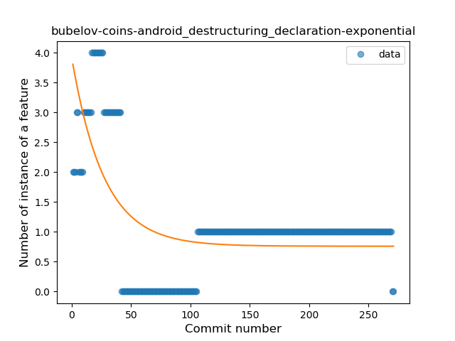
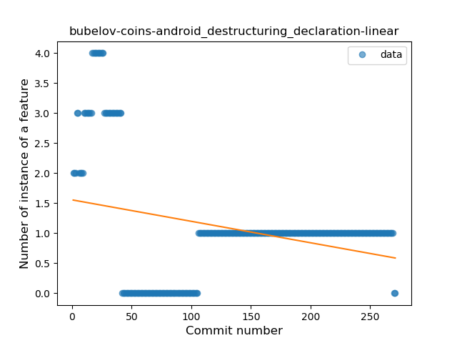

### <a name="inline_func">Inline Function</a>
----
#### Functions
* **Plateau Sudden Rise - Binary Sigmoid:** 
    * **R_Squared:** 0.93591328
* **Sudden Rise Plateau - Logarithm:** 
    * **R_Squared:** 0.55250134
* **Constant Rise - Linear:** 
    * **R_Squared:** 0.51251275

**Plots** :chart_with_upwards_trend:
-----

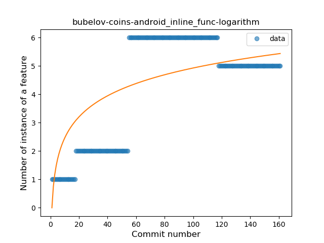
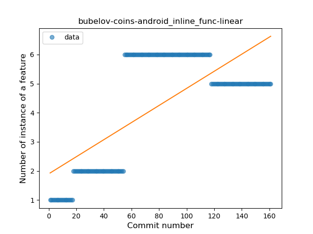
