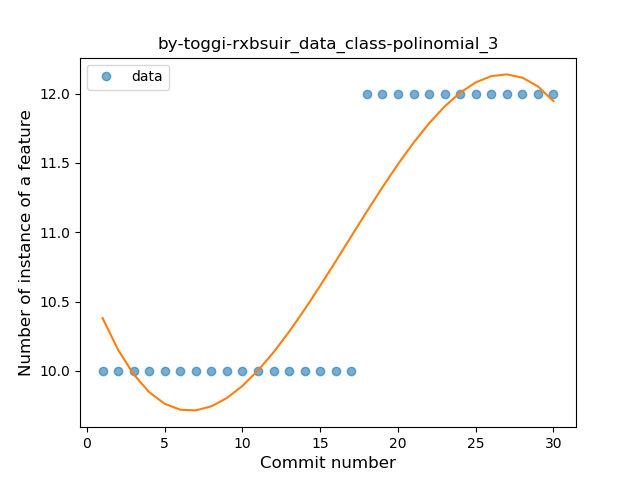
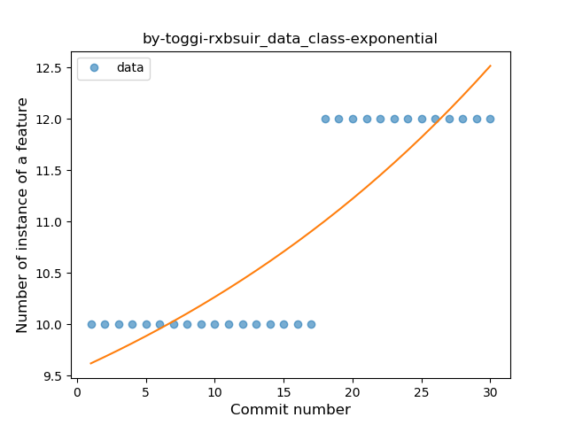
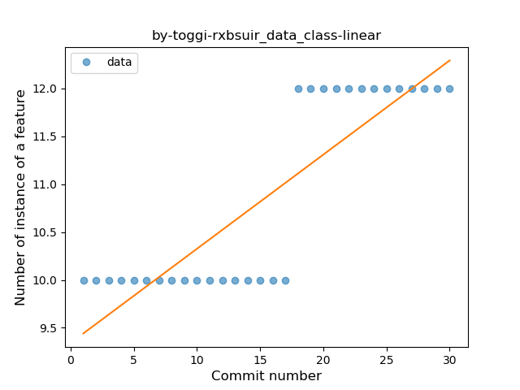
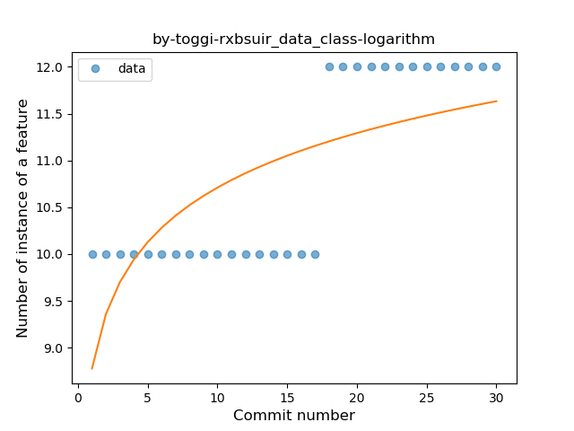

## by-toggi-rxbsuir
----
#### Metrics provided by Detekt
* Number of lines of code 264
* Number of Kotlin files: 5
* Cyclomatic complexity: 42
* Cyclomatic complexity by thousands of lines: 259 

----
**1** features analyzed

*	<a href="#data_class">Data Class</a> 

### <a name="data_class">Data Class</a>
----
#### Functions
* **Instability - Polinomial 3:** )
    * **R_Squared:** 0.84913773
* **Sudden Rise - Exponential:** 
    * **R_Squared:** 0.75238317
* **Constant Rise - Linear:** 
    * **R_Squared:** 0.7374861
* **Sudden Rise Plateau - Logarithm:** 
    * **R_Squared:** 0.50134587

**Plots** :chart_with_upwards_trend:
-----

