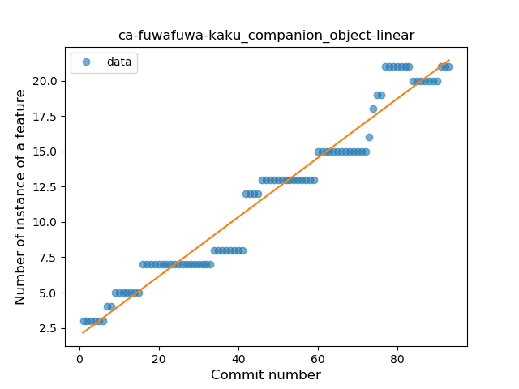
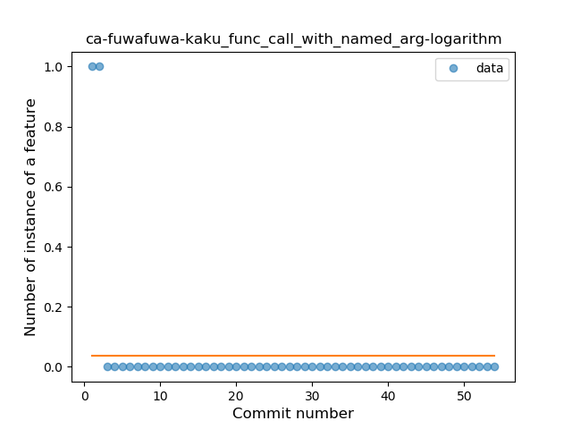
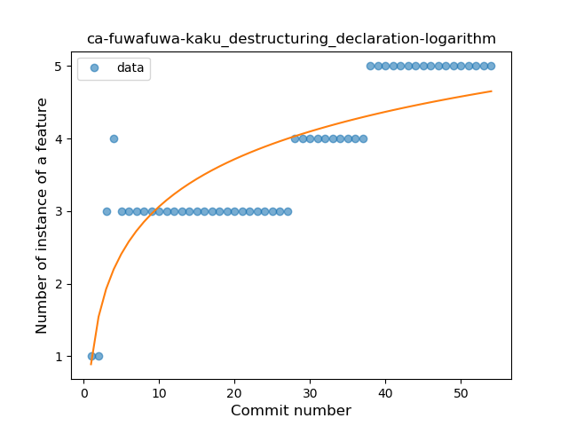

## ca-fuwafuwa-kaku
----
#### Metrics provided by Detekt
* Number of lines of code 6166
* Number of Kotlin files: 44
* Cyclomatic complexity: 915
* Cyclomatic complexity by thousands of lines: 246 

----
**14** features analyzed

*	<a href="#type_inference">Type Inference</a> 
*	<a href="#lambda">Lambda</a> 
*	<a href="#safe_call">Safe Call</a> 
*	<a href="#when_expr">When expression</a> 
*	<a href="#unsafe_call">Unsafe Call</a> 
*	<a href="#companion_object">Companion Object</a> 
*	<a href="#string_template">String Template</a> 
*	<a href="#func_with_default_value">Function with Default Value</a> 
*	<a href="#range_expr">Range Expression</a> 
*	<a href="#smart_cast">Smart Cast</a> 
*	<a href="#data_class">Data Class</a> 
*	<a href="#func_call_with_named_arg">Function call with Named Argument</a> 
*	<a href="#property_delegation">Property Delegation</a> 
*	<a href="#destructuring_declaration">Destructuring Declaration</a> 

### <a name="type_inference">Type Inference</a>
----
#### Functions
* **Constant Rise - Linear:** 
    * **R_Squared:** 0.9691956
* **Sudden Rise Plateau - Logarithm:** 
    * **R_Squared:** 0.55869569

**Plots** :chart_with_upwards_trend:
-----

### <a name="lambda">Lambda</a>
----
#### Functions
* **Sudden Rise - Exponential:** 
    * **R_Squared:** 0.94772474
* **Constant Rise - Linear:** 
    * **R_Squared:** 0.84575707
* **Plateau Gradual Rise - Sigmoid:** 
    * **R_Squared:** 0.67194674
* **Sudden Rise Plateau - Logarithm:** 
    * **R_Squared:** 0.33011452

**Plots** :chart_with_upwards_trend:
-----

### <a name="safe_call">Safe Call</a>
----
#### Functions
* **Sudden Rise - Exponential:** 
    * **R_Squared:** 0.89160053
* **Constant Rise - Linear:** 
    * **R_Squared:** 0.64705706
* **Sudden Rise Plateau - Logarithm:** 
    * **R_Squared:** 0.26546213

**Plots** :chart_with_upwards_trend:
-----

### <a name="when_expr">When expression</a>
----
#### Functions
* **Constant Rise - Linear:** 
    * **R_Squared:** 0.96868135
* **Sudden Rise - Exponential:** 
    * **R_Squared:** 0.9703233
* **Sudden Rise Plateau - Logarithm:** 
    * **R_Squared:** 0.55363634

**Plots** :chart_with_upwards_trend:
-----

### <a name="unsafe_call">Unsafe Call</a>
----
#### Functions
* **Sudden Rise - Exponential:** 
    * **R_Squared:** 0.92493333
* **Instability - Polinomial 3:** )
    * **R_Squared:** 0.919891
* **Constant Rise - Linear:** 
    * **R_Squared:** 0.56944177
* **Sudden Rise Plateau - Logarithm:** 
    * **R_Squared:** 0.1734447

**Plots** :chart_with_upwards_trend:
-----

### <a name="companion_object">Companion Object</a>
----
#### Functions
* **Constant Rise - Linear:** 
    * **R_Squared:** 0.95814044
* **Sudden Rise - Exponential:** 
    * **R_Squared:** 0.96188045
* **Sudden Rise Plateau - Logarithm:** 
    * **R_Squared:** 0.63258553

**Plots** :chart_with_upwards_trend:
-----

### <a name="string_template">String Template</a>
----
#### Functions
* **Constant Rise - Linear:** 
    * **R_Squared:** 0.86978104
* **Sudden Rise Plateau - Logarithm:** 
    * **R_Squared:** 0.85504311
* **Plateau Sudden Rise - Binary Sigmoid:** 
    * **R_Squared:** 0.48845835

**Plots** :chart_with_upwards_trend:
-----

### <a name="func_with_default_value">Function with Default Value</a>
----
#### Functions
* **Sudden Rise - Exponential:** 
    * **R_Squared:** 0.82976813
* **Constant Rise - Linear:** 
    * **R_Squared:** 0.35134464
* **Sudden Rise Plateau - Logarithm:** 
    * **R_Squared:** 0.06413521
* **Plateau Sudden Decline - Binary Sigmoid:** 
    * **R_Squared:** 0.0242255

**Plots** :chart_with_upwards_trend:
-----

### <a name="range_expr">Range Expression</a>
----
#### Functions
* **Sudden Rise - Exponential:** 
    * **R_Squared:** 0.79414634
* **Instability - Polinomial 3:** )
    * **R_Squared:** 0.71973744
* **Constant Rise - Linear:** 
    * **R_Squared:** 0.51362459
* **Sudden Rise Plateau - Logarithm:** 
    * **R_Squared:** 0.31169862

**Plots** :chart_with_upwards_trend:
-----

### <a name="smart_cast">Smart Cast</a>
----
#### Functions
* **Plateau Sudden Rise - Binary Sigmoid:** 
    * **R_Squared:** 0.93436799
* **Constant Rise - Linear:** 
    * **R_Squared:** 0.74891191
* **Sudden Rise - Exponential:** 
    * **R_Squared:** 0.75035401
* **Sudden Rise Plateau - Logarithm:** 
    * **R_Squared:** 0.60272458

**Plots** :chart_with_upwards_trend:
-----

### <a name="data_class">Data Class</a>
----
#### Functions
* **Constant Rise - Linear:** 
    * **R_Squared:** 0.89088218
* **Sudden Rise Plateau - Logarithm:** 
    * **R_Squared:** 0.65427407

**Plots** :chart_with_upwards_trend:
-----

### <a name="func_call_with_named_arg">Function call with Named Argument</a>
----
#### Functions
* **Sudden Decline - Exponential:** 
    * **R_Squared:** 0.83840302
* **Constant Decline - Linear:** 
    * **R_Squared:** 0.10703259
* **Sudden Rise Plateau - Logarithm:** 
    * **R_Squared:** -0.0

**Plots** :chart_with_upwards_trend:
-----

### <a name="property_delegation">Property Delegation</a>
----
#### Functions
* **Sudden Decline - Exponential:** 
    * **R_Squared:** 0.83699129
* **Instability - Polinomial 3:** )
    * **R_Squared:** 0.50574064
* **Constant Decline - Linear:** 
    * **R_Squared:** 0.13311688
* **Sudden Rise Plateau - Logarithm:** 
    * **R_Squared:** -0.0

**Plots** :chart_with_upwards_trend:
-----

### <a name="destructuring_declaration">Destructuring Declaration</a>
----
#### Functions
* **Plateau Gradual Rise - Sigmoid:** 
    * **R_Squared:** 0.81745753
* **Constant Rise - Linear:** 
    * **R_Squared:** 0.78708735
* **Sudden Rise - Exponential:** 
    * **R_Squared:** 0.78993725
* **Sudden Rise Plateau - Logarithm:** 
    * **R_Squared:** 0.67543223

**Plots** :chart_with_upwards_trend:
-----

