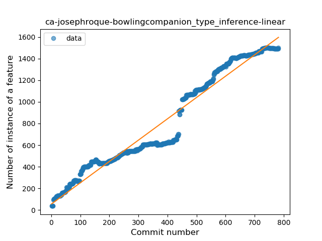
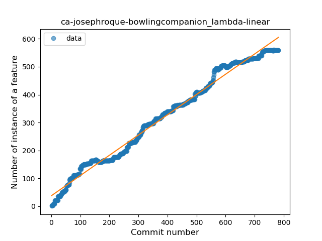
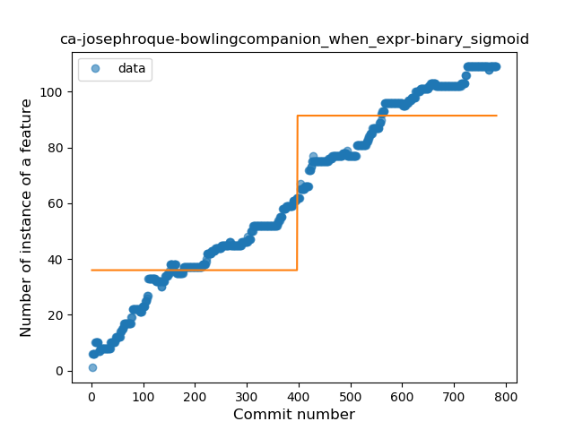
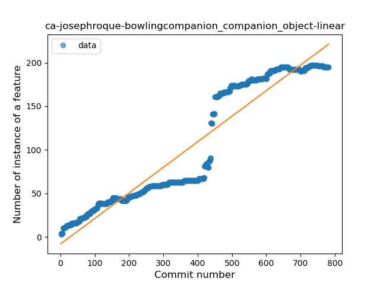
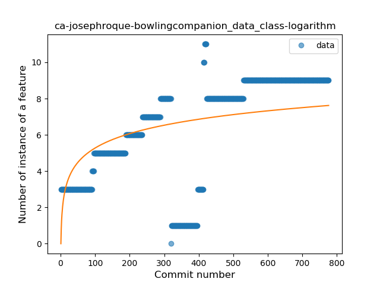
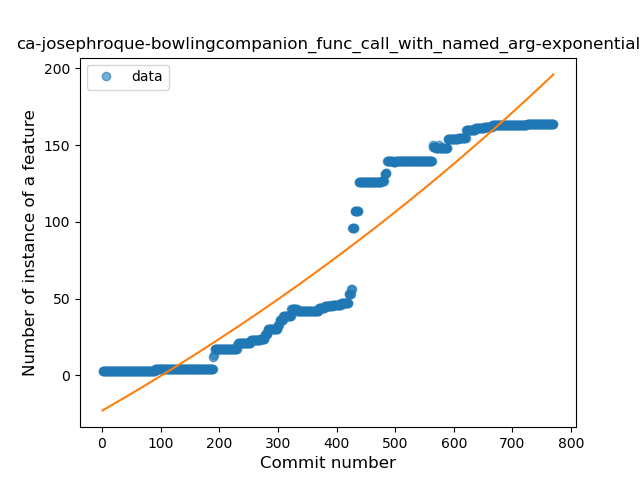
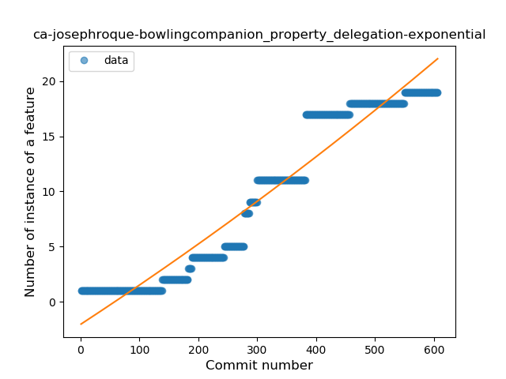

## ca-josephroque-bowlingcompanion
----
#### Metrics provided by Detekt
* Number of lines of code 21530
* Number of Kotlin files: 218
* Cyclomatic complexity: 2985
* Cyclomatic complexity by thousands of lines: 287 

----
**18** features analyzed

*	<a href="#type_inference">Type Inference</a> 
*	<a href="#lambda">Lambda</a> 
*	<a href="#safe_call">Safe Call</a> 
*	<a href="#when_expr">When expression</a> 
*	<a href="#unsafe_call">Unsafe Call</a> 
*	<a href="#companion_object">Companion Object</a> 
*	<a href="#string_template">String Template</a> 
*	<a href="#func_with_default_value">Function with Default Value</a> 
*	<a href="#singleton">Singleton</a> 
*	<a href="#range_expr">Range Expression</a> 
*	<a href="#smart_cast">Smart Cast</a> 
*	<a href="#data_class">Data Class</a> 
*	<a href="#func_call_with_named_arg">Function call with Named Argument</a> 
*	<a href="#extension_function">Extension Function</a> 
*	<a href="#property_delegation">Property Delegation</a> 
*	<a href="#destructuring_declaration">Destructuring Declaration</a> 
*	<a href="#coroutine">Coroutine</a> 
*	<a href="#sealed_class">Sealed Class</a> 

### <a name="type_inference">Type Inference</a>
----
#### Functions
* **Constant Rise - Linear:** 
    * **R_Squared:** 0.9560291
* **Sudden Rise - Exponential:** 
    * **R_Squared:** 0.96017243
* **Sudden Rise Plateau - Logarithm:** 
    * **R_Squared:** 0.43379861
* **Plateau Sudden Rise - Binary Sigmoid:** 
    * **R_Squared:** 0.27276918

**Plots** :chart_with_upwards_trend:
-----

### <a name="lambda">Lambda</a>
----
#### Functions
* **Constant Rise - Linear:** 
    * **R_Squared:** 0.98707155
* **Plateau Sudden Rise - Binary Sigmoid:** 
    * **R_Squared:** 0.74215541
* **Sudden Rise Plateau - Logarithm:** 
    * **R_Squared:** 0.49531735

**Plots** :chart_with_upwards_trend:
-----

### <a name="safe_call">Safe Call</a>
----
#### Functions
* **Constant Rise - Linear:** 
    * **R_Squared:** 0.94509089
* **Sudden Rise Plateau - Logarithm:** 
    * **R_Squared:** 0.63087949
* **Plateau Sudden Rise - Binary Sigmoid:** 
    * **R_Squared:** 0.62629493

**Plots** :chart_with_upwards_trend:
-----

### <a name="when_expr">When expression</a>
----
#### Functions
* **Constant Rise - Linear:** 
    * **R_Squared:** 0.98584455
* **Plateau Sudden Rise - Binary Sigmoid:** 
    * **R_Squared:** 0.78423494
* **Sudden Rise Plateau - Logarithm:** 
    * **R_Squared:** 0.50548285

**Plots** :chart_with_upwards_trend:
-----

### <a name="unsafe_call">Unsafe Call</a>
----
#### Functions
* **Sudden Rise - Exponential:** 
    * **R_Squared:** 0.89419803
* **Constant Rise - Linear:** 
    * **R_Squared:** 0.63245655
* **Sudden Rise Plateau - Logarithm:** 
    * **R_Squared:** 0.16201516
* **Plateau Gradual Rise - Sigmoid:** 
    * **R_Squared:** 0.05149904

**Plots** :chart_with_upwards_trend:
-----

### <a name="companion_object">Companion Object</a>
----
#### Functions
* **Constant Rise - Linear:** 
    * **R_Squared:** 0.90530645
* **Sudden Rise - Exponential:** 
    * **R_Squared:** 0.90723154
* **Sudden Rise Plateau - Logarithm:** 
    * **R_Squared:** 0.36082665
* **Plateau Sudden Rise - Binary Sigmoid:** 
    * **R_Squared:** 0.26405736

**Plots** :chart_with_upwards_trend:
-----

### <a name="string_template">String Template</a>
----
#### Functions
* **Constant Rise - Linear:** 
    * **R_Squared:** 0.96168077
* **Plateau Sudden Rise - Binary Sigmoid:** 
    * **R_Squared:** 0.50873081
* **Sudden Rise Plateau - Logarithm:** 
    * **R_Squared:** 0.4186746

**Plots** :chart_with_upwards_trend:
-----

### <a name="func_with_default_value">Function with Default Value</a>
----
#### Functions
* **Sudden Rise - Exponential:** 
    * **R_Squared:** 0.85766156
* **Constant Rise - Linear:** 
    * **R_Squared:** 0.82060517
* **Sudden Rise Plateau - Logarithm:** 
    * **R_Squared:** 0.2379031
* **Plateau Sudden Rise - Binary Sigmoid:** 
    * **R_Squared:** 0.07912699

**Plots** :chart_with_upwards_trend:
-----

### <a name="singleton">Singleton</a>
----
#### Functions
* **Sudden Rise - Exponential:** 
    * **R_Squared:** 0.970378
* **Constant Rise - Linear:** 
    * **R_Squared:** 0.88680541
* **Sudden Rise Plateau - Logarithm:** 
    * **R_Squared:** 0.37698731

**Plots** :chart_with_upwards_trend:
-----

### <a name="range_expr">Range Expression</a>
----
#### Functions
* **Constant Rise - Linear:** 
    * **R_Squared:** 0.90611836
* **Sudden Rise Plateau - Logarithm:** 
    * **R_Squared:** 0.37582788

**Plots** :chart_with_upwards_trend:
-----

### <a name="smart_cast">Smart Cast</a>
----
#### Functions
* **Constant Rise - Linear:** 
    * **R_Squared:** 0.91120186
* **Sudden Rise - Exponential:** 
    * **R_Squared:** 0.91697836
* **Sudden Rise Plateau - Logarithm:** 
    * **R_Squared:** 0.30498406

**Plots** :chart_with_upwards_trend:
-----

### <a name="data_class">Data Class</a>
----
#### Functions
* **Constant Rise - Linear:** 
    * **R_Squared:** 0.48376725
* **Sudden Rise - Exponential:** 
    * **R_Squared:** 0.48579055
* **Sudden Rise Plateau - Logarithm:** 
    * **R_Squared:** 0.3274915

**Plots** :chart_with_upwards_trend:
-----

### <a name="func_call_with_named_arg">Function call with Named Argument</a>
----
#### Functions
* **Plateau Sudden Rise - Binary Sigmoid:** 
    * **R_Squared:** 0.93585119
* **Constant Rise - Linear:** 
    * **R_Squared:** 0.9082277
* **Sudden Rise - Exponential:** 
    * **R_Squared:** 0.91328732
* **Sudden Rise Plateau - Logarithm:** 
    * **R_Squared:** 0.28036574

**Plots** :chart_with_upwards_trend:
-----

### <a name="extension_function">Extension Function</a>
----
#### Functions
* **Constant Rise - Linear:** 
    * **R_Squared:** 0.85531746
* **Sudden Rise Plateau - Logarithm:** 
    * **R_Squared:** 0.62477608

**Plots** :chart_with_upwards_trend:
-----

### <a name="property_delegation">Property Delegation</a>
----
#### Functions
* **Constant Rise - Linear:** 
    * **R_Squared:** 0.93081858
* **Sudden Rise - Exponential:** 
    * **R_Squared:** 0.93209632
* **Sudden Rise Plateau - Logarithm:** 
    * **R_Squared:** 0.32989638
* **Plateau Sudden Rise - Binary Sigmoid:** 
    * **R_Squared:** 0.05760749

**Plots** :chart_with_upwards_trend:
-----

### <a name="destructuring_declaration">Destructuring Declaration</a>
----
#### Functions
* **Constant Rise - Linear:** 
    * **R_Squared:** 0.9035073
* **Sudden Rise Plateau - Logarithm:** 
    * **R_Squared:** 0.40985817

**Plots** :chart_with_upwards_trend:
-----

### <a name="coroutine">Coroutine</a>
----
#### Functions
* **Sudden Rise - Exponential:** 
    * **R_Squared:** 0.97845583
* **Constant Rise - Linear:** 
    * **R_Squared:** 0.96188642
* **Sudden Rise Plateau - Logarithm:** 
    * **R_Squared:** 0.42205503
* **Plateau Sudden Rise - Binary Sigmoid:** 
    * **R_Squared:** 0.0610825

**Plots** :chart_with_upwards_trend:
-----

### <a name="sealed_class">Sealed Class</a>
----
#### Functions
* **Plateau Sudden Rise - Binary Sigmoid:** 
    * **R_Squared:** 0.66022753
* **Sudden Rise Plateau - Logarithm:** 
    * **R_Squared:** 0.12422585
* **Constant Rise - Linear:** 
    * **R_Squared:** 0.02084147

**Plots** :chart_with_upwards_trend:
-----

