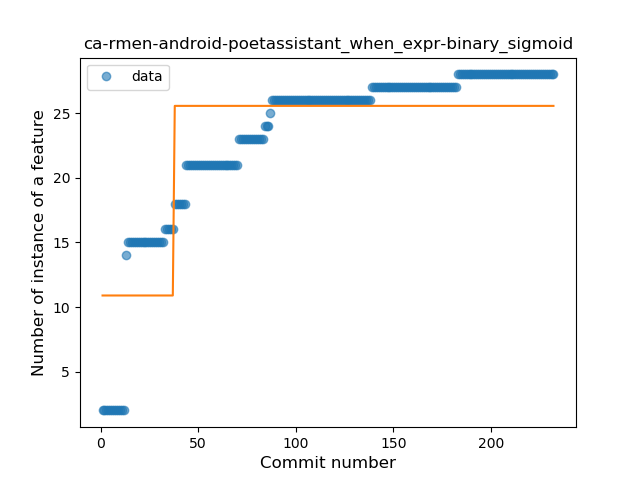
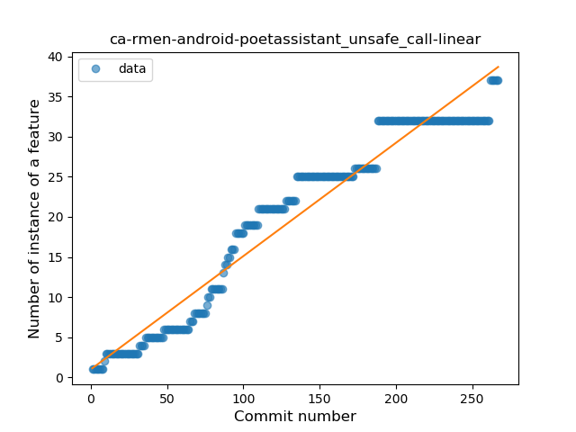
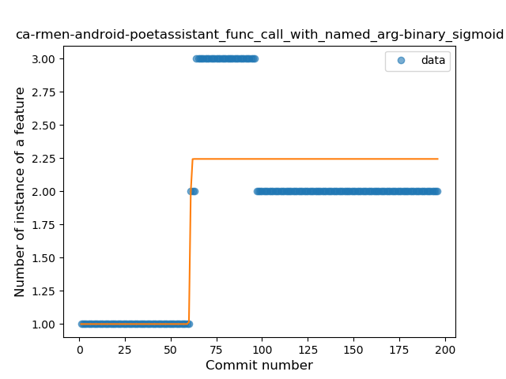

## ca-rmen-android-poetassistant
----
#### Metrics provided by Detekt
* Number of lines of code 10401
* Number of Kotlin files: 127
* Cyclomatic complexity: 1241
* Cyclomatic complexity by thousands of lines: 293 

----
**13** features analyzed

*	<a href="#type_inference">Type Inference</a> 
*	<a href="#lambda">Lambda</a> 
*	<a href="#safe_call">Safe Call</a> 
*	<a href="#when_expr">When expression</a> 
*	<a href="#unsafe_call">Unsafe Call</a> 
*	<a href="#companion_object">Companion Object</a> 
*	<a href="#string_template">String Template</a> 
*	<a href="#func_with_default_value">Function with Default Value</a> 
*	<a href="#singleton">Singleton</a> 
*	<a href="#range_expr">Range Expression</a> 
*	<a href="#smart_cast">Smart Cast</a> 
*	<a href="#data_class">Data Class</a> 
*	<a href="#func_call_with_named_arg">Function call with Named Argument</a> 

### <a name="type_inference">Type Inference</a>
----
#### Functions
* **Constant Rise - Linear:** 
    * **R_Squared:** 0.78358883
* **Sudden Rise Plateau - Logarithm:** 
    * **R_Squared:** 0.52788473
* **Plateau Sudden Rise - Binary Sigmoid:** 
    * **R_Squared:** 0.2624326

**Plots** :chart_with_upwards_trend:
-----

### <a name="lambda">Lambda</a>
----
#### Functions
* **Constant Rise - Linear:** 
    * **R_Squared:** 0.83048232
* **Plateau Sudden Rise - Binary Sigmoid:** 
    * **R_Squared:** 0.77236443
* **Sudden Rise Plateau - Logarithm:** 
    * **R_Squared:** 0.53031508

**Plots** :chart_with_upwards_trend:
-----

### <a name="safe_call">Safe Call</a>
----
#### Functions
* **Plateau Gradual Rise - Sigmoid:** 
    * **R_Squared:** 0.97642717
* **Constant Rise - Linear:** 
    * **R_Squared:** 0.92242175
* **Sudden Rise Plateau - Logarithm:** 
    * **R_Squared:** 0.47284773

**Plots** :chart_with_upwards_trend:
-----

### <a name="when_expr">When expression</a>
----
#### Functions
* **Sudden Rise Plateau - Logarithm:** 
    * **R_Squared:** 0.89757571
* **Plateau Sudden Rise - Binary Sigmoid:** 
    * **R_Squared:** 0.70469322
* **Constant Rise - Linear:** 
    * **R_Squared:** 0.66390531

**Plots** :chart_with_upwards_trend:
-----

### <a name="unsafe_call">Unsafe Call</a>
----
#### Functions
* **Constant Rise - Linear:** 
    * **R_Squared:** 0.94506261
* **Sudden Rise Plateau - Logarithm:** 
    * **R_Squared:** 0.53340023
* **Plateau Gradual Rise - Sigmoid:** 
    * **R_Squared:** 0.26582742

**Plots** :chart_with_upwards_trend:
-----

### <a name="companion_object">Companion Object</a>
----
#### Functions
* **Constant Rise - Linear:** 
    * **R_Squared:** 0.81971477
* **Sudden Rise Plateau - Logarithm:** 
    * **R_Squared:** 0.44906557

**Plots** :chart_with_upwards_trend:
-----

### <a name="string_template">String Template</a>
----
#### Functions
* **Plateau Sudden Rise - Binary Sigmoid:** 
    * **R_Squared:** 0.9079279
* **Constant Rise - Linear:** 
    * **R_Squared:** 0.79903283
* **Sudden Rise Plateau - Logarithm:** 
    * **R_Squared:** 0.55186448

**Plots** :chart_with_upwards_trend:
-----

### <a name="func_with_default_value">Function with Default Value</a>
----
#### Functions
* **Plateau Gradual Rise - Sigmoid:** 
    * **R_Squared:** 0.97425513
* **Constant Rise - Linear:** 
    * **R_Squared:** 0.82152789
* **Sudden Rise Plateau - Logarithm:** 
    * **R_Squared:** 0.51363067

**Plots** :chart_with_upwards_trend:
-----

### <a name="singleton">Singleton</a>
----
#### Functions
* **Plateau Gradual Rise - Sigmoid:** 
    * **R_Squared:** 0.85386174
* **Sudden Rise Plateau - Logarithm:** 
    * **R_Squared:** 0.74167726
* **Constant Rise - Linear:** 
    * **R_Squared:** 0.583733

**Plots** :chart_with_upwards_trend:
-----

### <a name="range_expr">Range Expression</a>
----
#### Functions
* **Plateau Gradual Rise - Sigmoid:** 
    * **R_Squared:** 0.98282404
* **Constant Rise - Linear:** 
    * **R_Squared:** 0.76239193
* **Sudden Rise Plateau - Logarithm:** 
    * **R_Squared:** 0.63806548

**Plots** :chart_with_upwards_trend:
-----

### <a name="smart_cast">Smart Cast</a>
----
#### Functions
* **Constant Rise - Linear:** 
    * **R_Squared:** 0.89103858
* **Sudden Rise Plateau - Logarithm:** 
    * **R_Squared:** 0.62885097

**Plots** :chart_with_upwards_trend:
-----

### <a name="data_class">Data Class</a>
----
#### Functions
* **Plateau Gradual Rise - Sigmoid:** 
    * **R_Squared:** 0.93679322
* **Constant Rise - Linear:** 
    * **R_Squared:** 0.91350339
* **Sudden Rise Plateau - Logarithm:** 
    * **R_Squared:** 0.78827461

**Plots** :chart_with_upwards_trend:
-----

### <a name="func_call_with_named_arg">Function call with Named Argument</a>
----
#### Functions
* **Plateau Sudden Rise - Binary Sigmoid:** 
    * **R_Squared:** 0.72073326
* **Sudden Rise Plateau - Logarithm:** 
    * **R_Squared:** 0.32492798
* **Constant Rise - Linear:** 
    * **R_Squared:** 0.21488246

**Plots** :chart_with_upwards_trend:
-----

