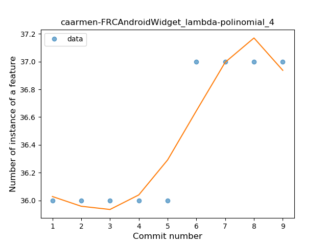
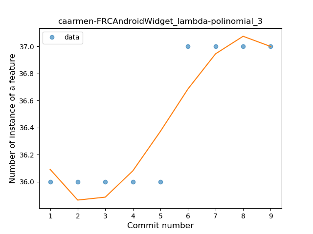
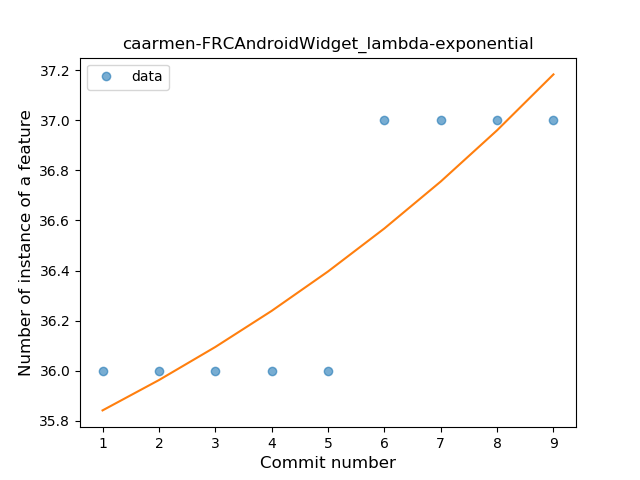
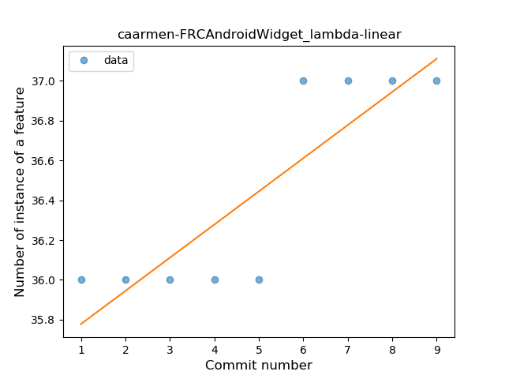
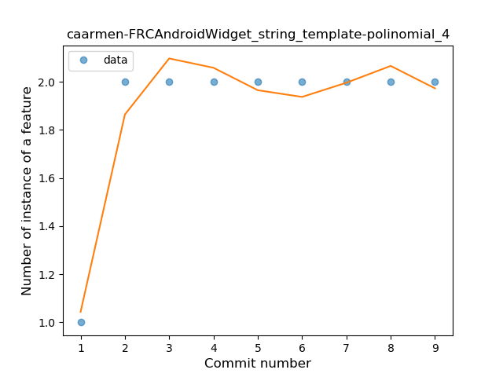
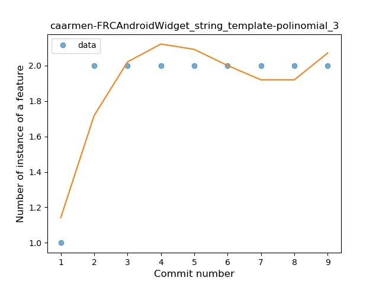
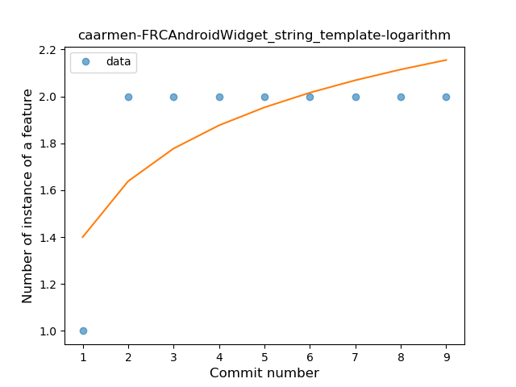
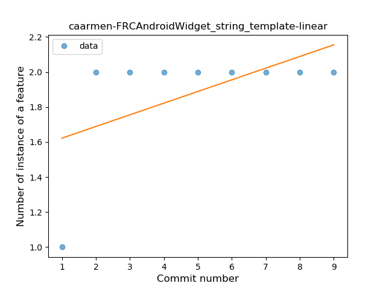

## caarmen-FRCAndroidWidget
----
#### Metrics provided by Detekt
* Number of lines of code 3390
* Number of Kotlin files: 43
* Cyclomatic complexity: 282
* Cyclomatic complexity by thousands of lines: 212 

----
**2** features analyzed

*	<a href="#lambda">Lambda</a> 
*	<a href="#string_template">String Template</a> 

### <a name="lambda">Lambda</a>
----
#### Functions
* **Instability - Polinomial 4:** 
    * **R_Squared:** 0.88671329
* **Instability - Polinomial 3:** )
    * **R_Squared:** 0.86850649
* **Sudden Rise - Exponential:** 
    * **R_Squared:** 0.76096717
* **Constant Rise - Linear:** 
    * **R_Squared:** 0.75
* **Sudden Rise Plateau - Logarithm:** 
    * **R_Squared:** 0.5875674

**Plots** :chart_with_upwards_trend:
-----

### <a name="string_template">String Template</a>
----
#### Functions
* **Instability - Polinomial 4:** 
    * **R_Squared:** 0.95104895
* **Instability - Polinomial 3:** )
    * **R_Squared:** 0.84090909
* **Sudden Rise Plateau - Logarithm:** 
    * **R_Squared:** 0.5499804
* **Constant Rise - Linear:** 
    * **R_Squared:** 0.3

**Plots** :chart_with_upwards_trend:
-----

