## caarmen-poet-assistant
----
#### Metrics provided by Detekt
* Number of lines of code 10242
* Number of Kotlin files: 126
* Cyclomatic complexity: 1229
* Cyclomatic complexity by thousands of lines: 298 

----
**13** features analyzed

*	<a href="#type_inference">Type Inference</a> 
*	<a href="#lambda">Lambda</a> 
*	<a href="#safe_call">Safe Call</a> 
*	<a href="#when_expr">When expression</a> 
*	<a href="#companion_object">Companion Object</a> 
*	<a href="#unsafe_call">Unsafe Call</a> 
*	<a href="#string_template">String Template</a> 
*	<a href="#func_with_default_value">Function with Default Value</a> 
*	<a href="#singleton">Singleton</a> 
*	<a href="#smart_cast">Smart Cast</a> 
*	<a href="#range_expr">Range Expression</a> 
*	<a href="#func_call_with_named_arg">Function call with Named Argument</a> 
*	<a href="#data_class">Data Class</a> 

### <a name="type_inference">Type Inference</a>
----
#### Functions
* **Instability - Polinomial 3:** )
    * **R_Squared:** 0.97163998
* **Constant Rise - Linear:** 
    * **R_Squared:** 0.88456626
* **Sudden Rise Plateau - Logarithm:** 
    * **R_Squared:** 0.46638682

**Plots** :chart_with_upwards_trend:
-----

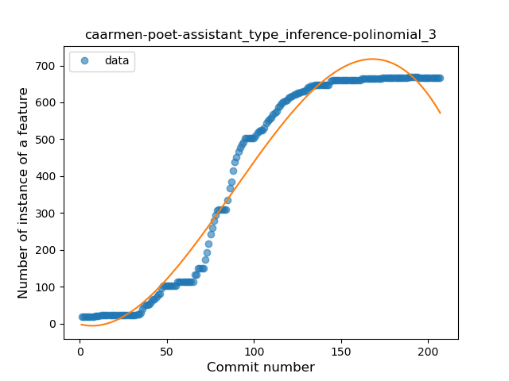
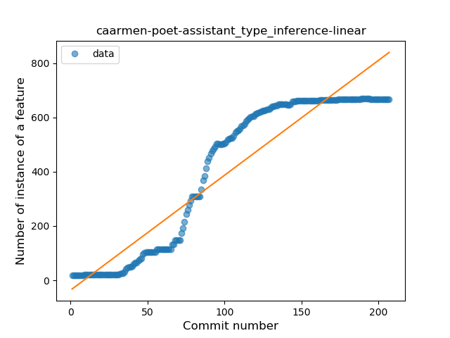
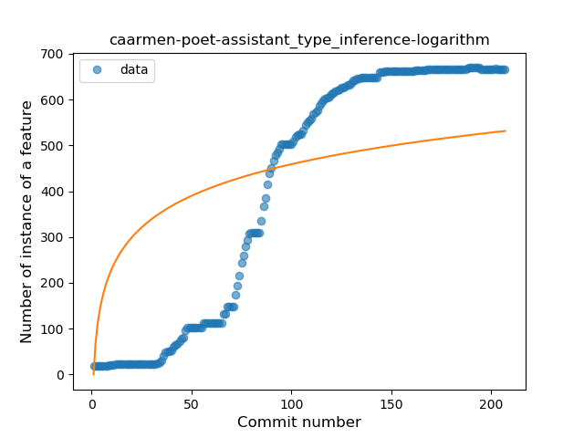
### <a name="lambda">Lambda</a>
----
#### Functions
* **Instability - Polinomial 3:** )
    * **R_Squared:** 0.9714
* **Constant Rise - Linear:** 
    * **R_Squared:** 0.90647176
* **Plateau Sudden Rise - Binary Sigmoid:** 
    * **R_Squared:** 0.78838282
* **Sudden Rise Plateau - Logarithm:** 
    * **R_Squared:** 0.46864924

**Plots** :chart_with_upwards_trend:
-----

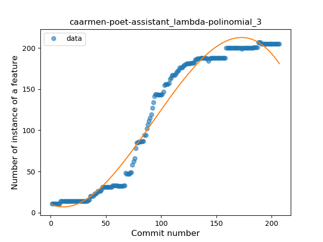
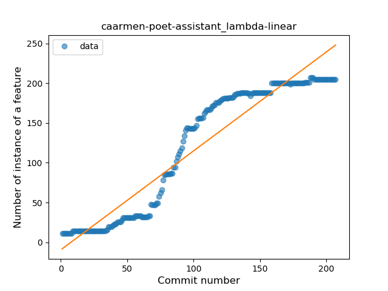
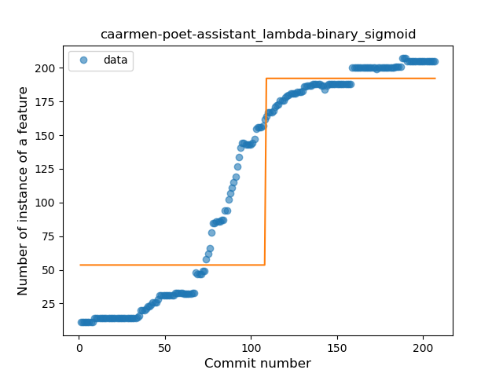
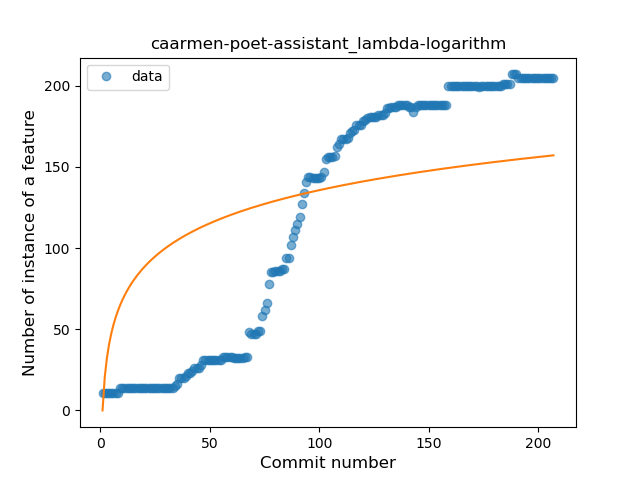
### <a name="safe_call">Safe Call</a>
----
#### Functions
* **Plateau Gradual Rise - Sigmoid:** 
    * **R_Squared:** 0.96601514
* **Constant Rise - Linear:** 
    * **R_Squared:** 0.94748171
* **Sudden Rise Plateau - Logarithm:** 
    * **R_Squared:** 0.41375943

**Plots** :chart_with_upwards_trend:
-----

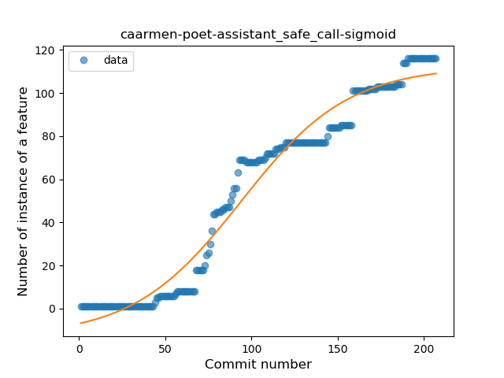
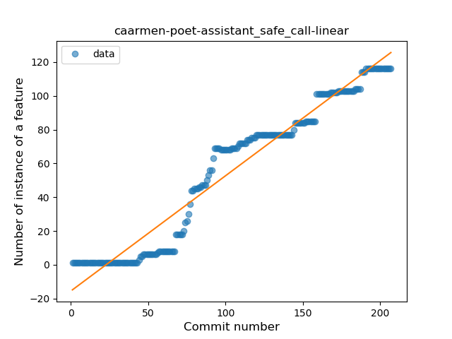
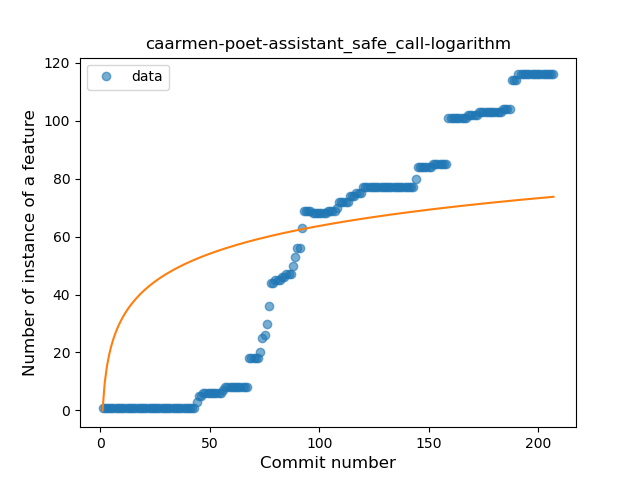
### <a name="when_expr">When expression</a>
----
#### Functions
* **Sudden Rise Plateau - Logarithm:** 
    * **R_Squared:** 0.87579814
* **Constant Rise - Linear:** 
    * **R_Squared:** 0.71913863
* **Plateau Sudden Rise - Binary Sigmoid:** 
    * **R_Squared:** 0.64946596

**Plots** :chart_with_upwards_trend:
-----

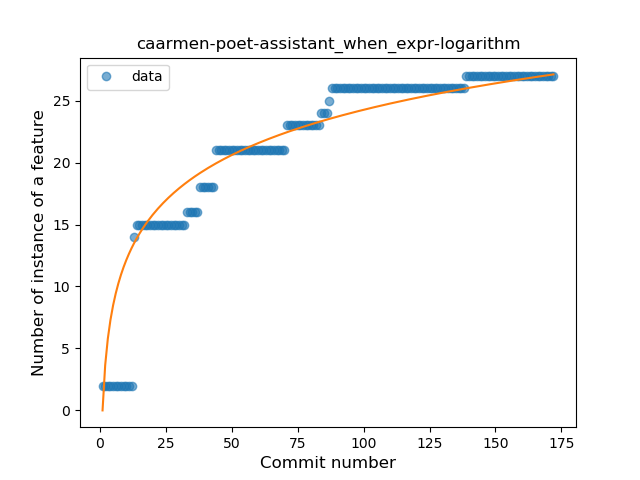
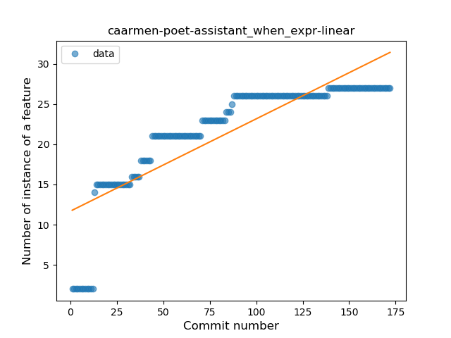
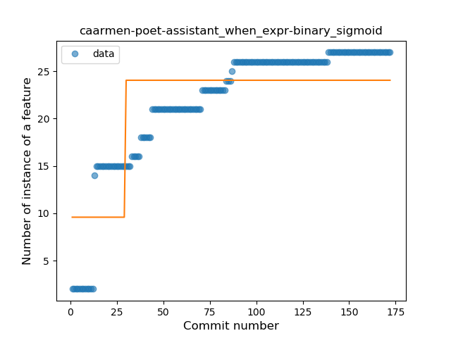
### <a name="companion_object">Companion Object</a>
----
#### Functions
* **Plateau Gradual Rise - Sigmoid:** 
    * **R_Squared:** 0.99641441
* **Constant Rise - Linear:** 
    * **R_Squared:** 0.9068351
* **Sudden Rise Plateau - Logarithm:** 
    * **R_Squared:** 0.38215547

**Plots** :chart_with_upwards_trend:
-----

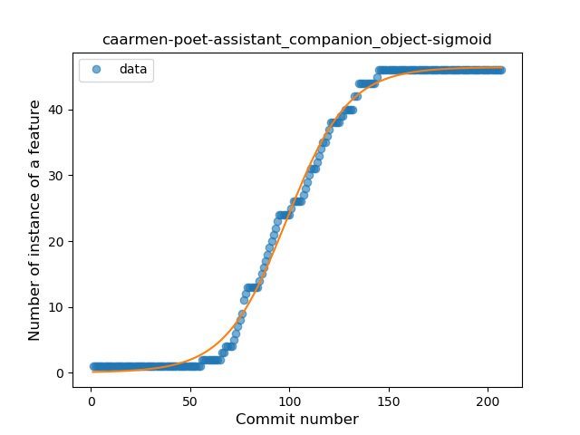
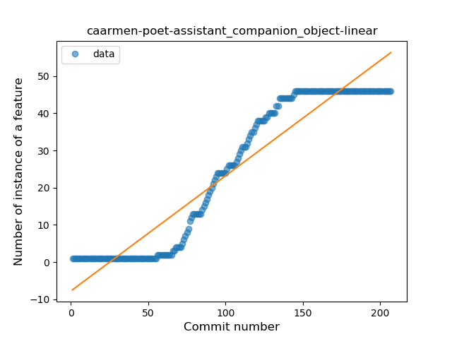
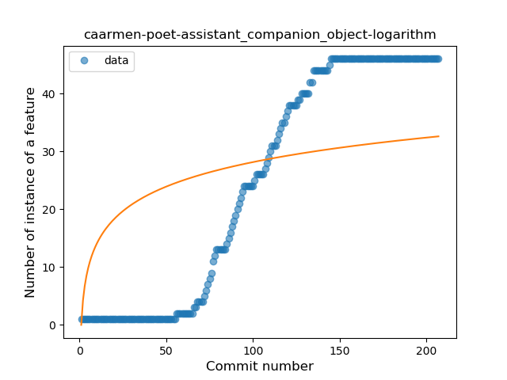
### <a name="unsafe_call">Unsafe Call</a>
----
#### Functions
* **Constant Rise - Linear:** 
    * **R_Squared:** 0.96081727
* **Sudden Rise Plateau - Logarithm:** 
    * **R_Squared:** 0.49213064

**Plots** :chart_with_upwards_trend:
-----

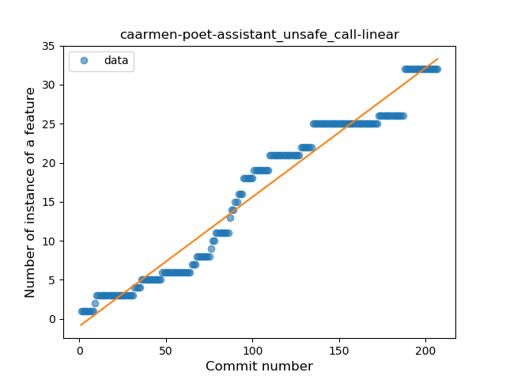
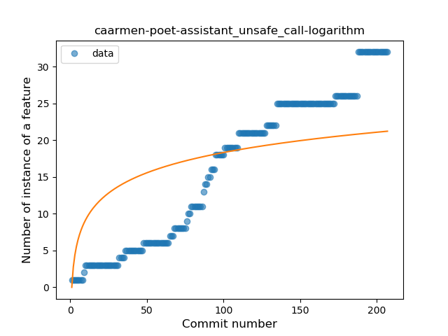
### <a name="string_template">String Template</a>
----
#### Functions
* **Plateau Gradual Rise - Sigmoid:** 
    * **R_Squared:** 0.98146197
* **Constant Rise - Linear:** 
    * **R_Squared:** 0.87897475
* **Sudden Rise Plateau - Logarithm:** 
    * **R_Squared:** 0.49342182

**Plots** :chart_with_upwards_trend:
-----

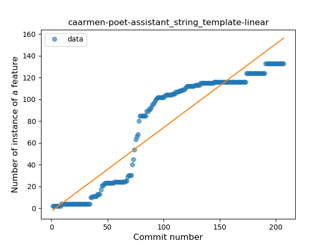
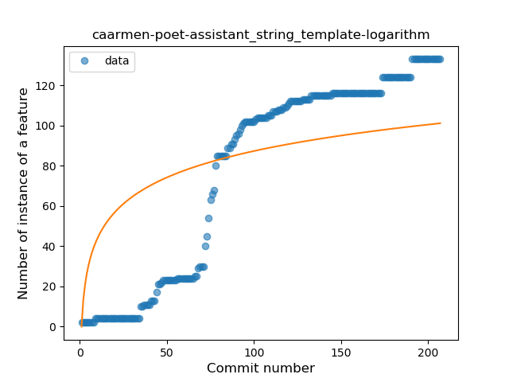
### <a name="func_with_default_value">Function with Default Value</a>
----
#### Functions
* **Plateau Gradual Rise - Sigmoid:** 
    * **R_Squared:** 0.95801824
* **Sudden Rise - Exponential:** 
    * **R_Squared:** 0.86217109
* **Constant Rise - Linear:** 
    * **R_Squared:** 0.7792626
* **Sudden Rise Plateau - Logarithm:** 
    * **R_Squared:** 0.39296478

**Plots** :chart_with_upwards_trend:
-----

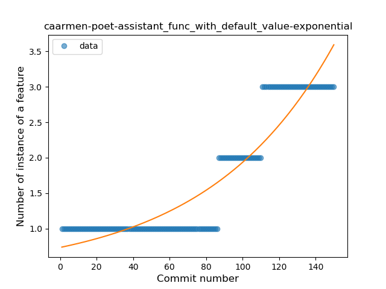
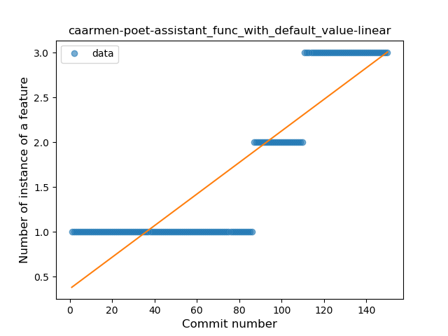
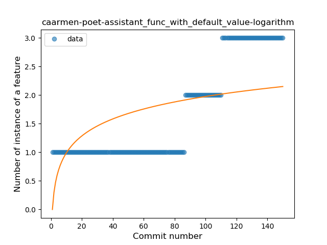
### <a name="singleton">Singleton</a>
----
#### Functions
* **Plateau Sudden Rise - Binary Sigmoid:** 
    * **R_Squared:** 0.72183059
* **Sudden Rise Plateau - Logarithm:** 
    * **R_Squared:** 0.69734603
* **Constant Rise - Linear:** 
    * **R_Squared:** 0.56438085

**Plots** :chart_with_upwards_trend:
-----

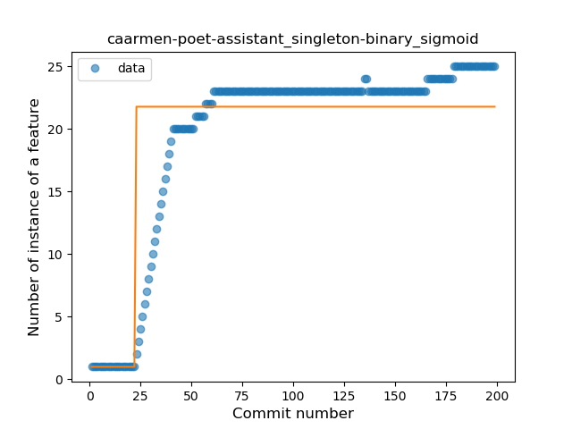
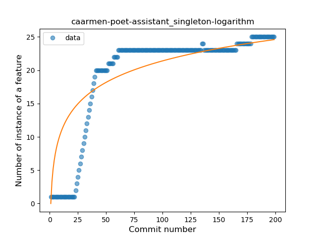
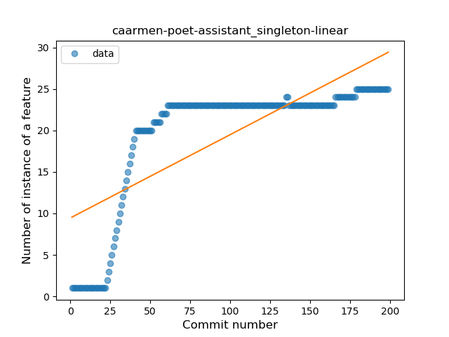
### <a name="smart_cast">Smart Cast</a>
----
#### Functions
* **Plateau Gradual Rise - Sigmoid:** 
    * **R_Squared:** 0.95745122
* **Constant Rise - Linear:** 
    * **R_Squared:** 0.83199679
* **Sudden Rise Plateau - Logarithm:** 
    * **R_Squared:** 0.6268573

**Plots** :chart_with_upwards_trend:
-----

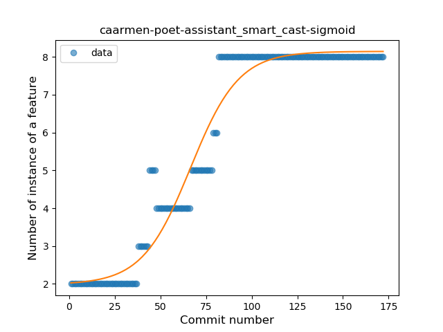
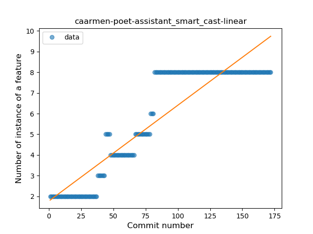
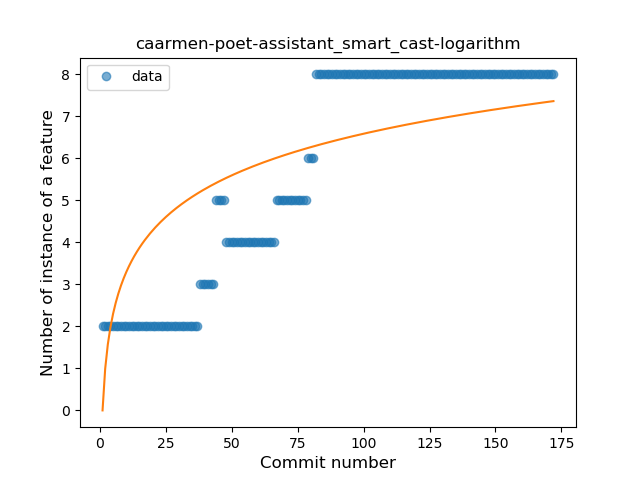
### <a name="range_expr">Range Expression</a>
----
#### Functions
* **Plateau Gradual Rise - Sigmoid:** 
    * **R_Squared:** 0.98126878
* **Constant Rise - Linear:** 
    * **R_Squared:** 0.84905335
* **Sudden Rise Plateau - Logarithm:** 
    * **R_Squared:** 0.58684195

**Plots** :chart_with_upwards_trend:
-----

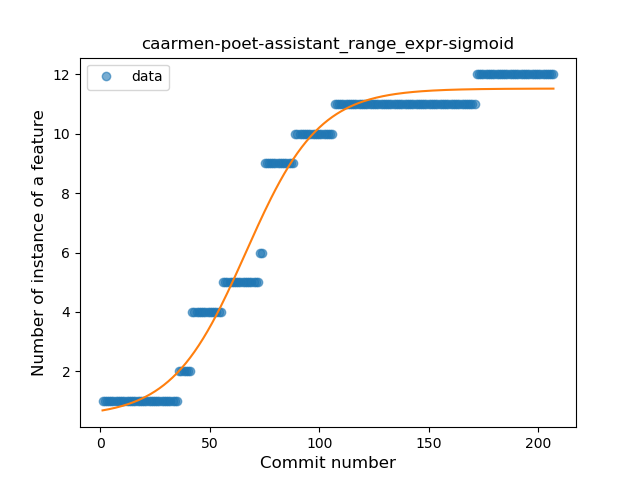
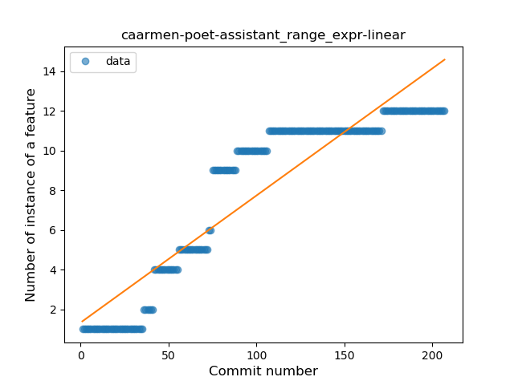
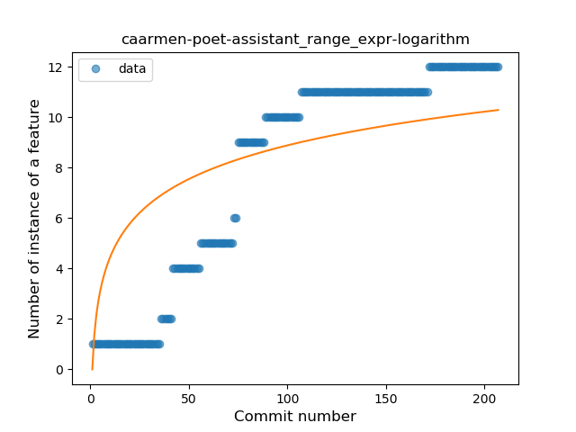
### <a name="func_call_with_named_arg">Function call with Named Argument</a>
----
#### Functions
* **Plateau Gradual Rise - Sigmoid:** 
    * **R_Squared:** 0.78967717
* **Constant Rise - Linear:** 
    * **R_Squared:** 0.38502336
* **Sudden Rise Plateau - Logarithm:** 
    * **R_Squared:** 0.36259733

**Plots** :chart_with_upwards_trend:
-----

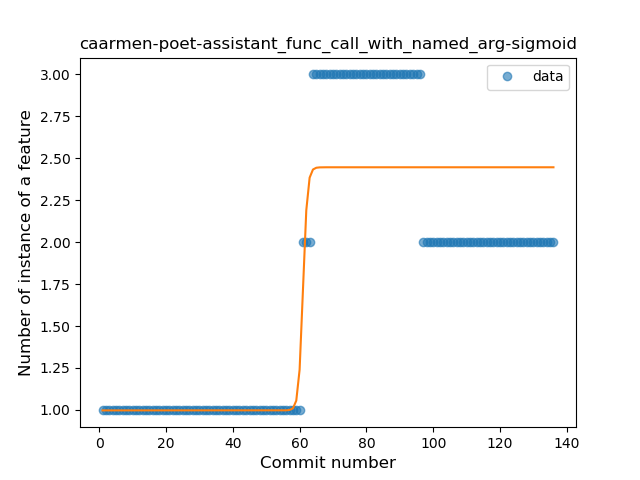
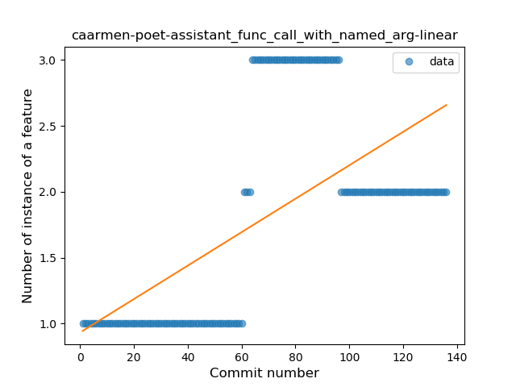
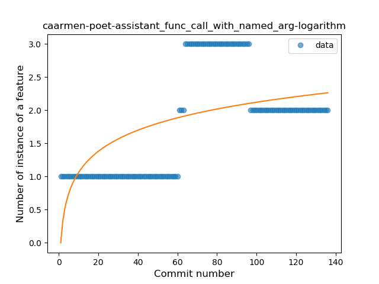
### <a name="data_class">Data Class</a>
----
#### Functions
* **Plateau Gradual Rise - Sigmoid:** 
    * **R_Squared:** 0.93396412
* **Constant Rise - Linear:** 
    * **R_Squared:** 0.88546379
* **Sudden Rise Plateau - Logarithm:** 
    * **R_Squared:** 0.74440075

**Plots** :chart_with_upwards_trend:
-----

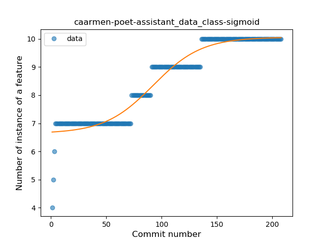
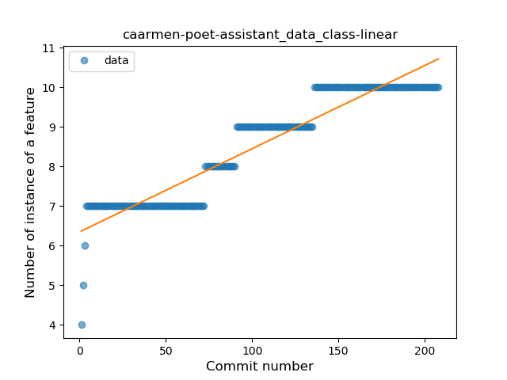
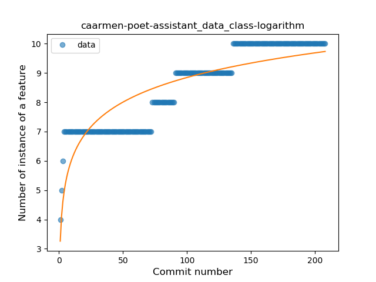
