## camsteffen-polite
----
#### Metrics provided by Detekt
* Number of lines of code 3174
* Number of Kotlin files: 29
* Cyclomatic complexity: 463
* Cyclomatic complexity by thousands of lines: 230 

----
**5** features analyzed

*	<a href="#type_inference">Type Inference</a> 
*	<a href="#lambda">Lambda</a> 
*	<a href="#companion_object">Companion Object</a> 
*	<a href="#unsafe_call">Unsafe Call</a> 
*	<a href="#string_template">String Template</a> 

### <a name="type_inference">Type Inference</a>
----
#### Functions
* **Instability - Polinomial 3:** )
    * **R_Squared:** 0.85522259
* **Constant Decline - Linear:** 
    * **R_Squared:** 0.60576034
* **Sudden Rise Plateau - Logarithm:** 
    * **R_Squared:** -0.0

**Plots** :chart_with_upwards_trend:
-----

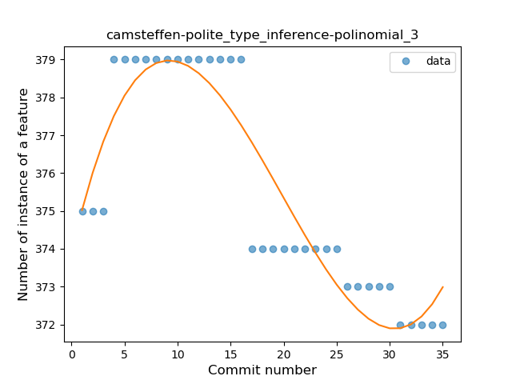
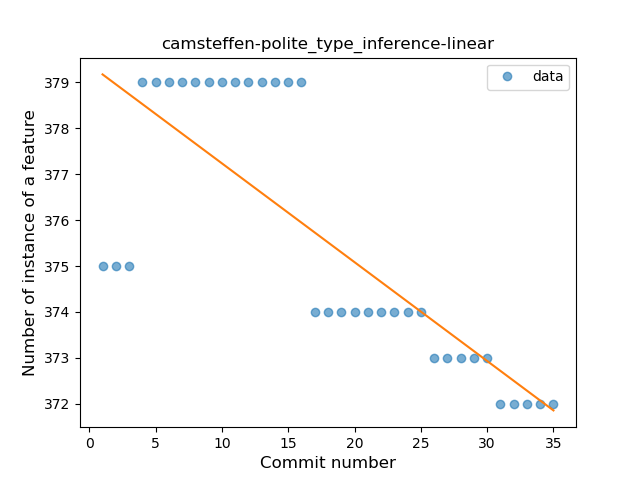
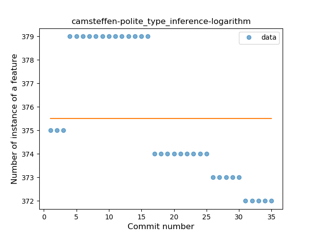
### <a name="lambda">Lambda</a>
----
#### Functions
* **Instability - Polinomial 3:** )
    * **R_Squared:** 0.81935977
* **Sudden Rise - Exponential:** 
    * **R_Squared:** 0.78702956
* **Constant Rise - Linear:** 
    * **R_Squared:** 0.42647059
* **Sudden Rise Plateau - Logarithm:** 
    * **R_Squared:** 0.20529326

**Plots** :chart_with_upwards_trend:
-----

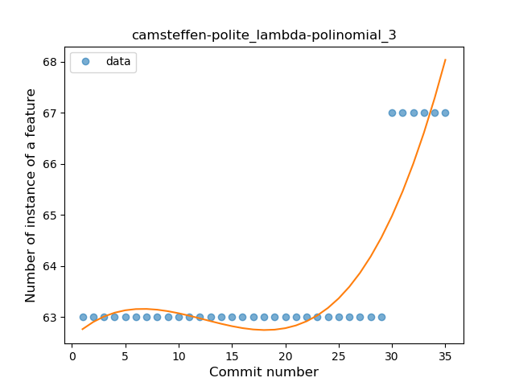
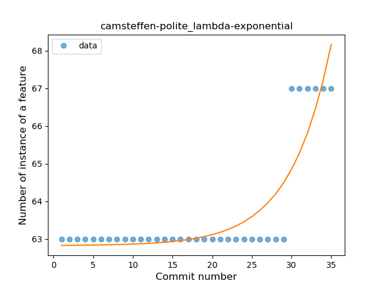
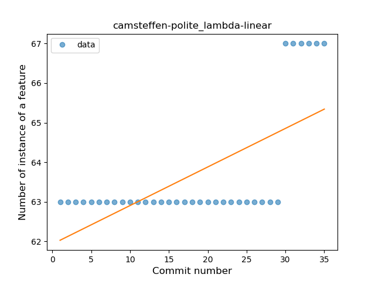
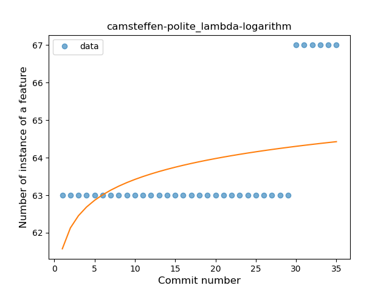
### <a name="companion_object">Companion Object</a>
----
#### Functions
* **Instability - Polinomial 4:** 
    * **R_Squared:** 0.90431643
* **Sudden Decline - Exponential:** 
    * **R_Squared:** 0.78444081
* **Constant Decline - Linear:** 
    * **R_Squared:** 0.68910157
* **Sudden Rise Plateau - Logarithm:** 
    * **R_Squared:** -0.0

**Plots** :chart_with_upwards_trend:
-----

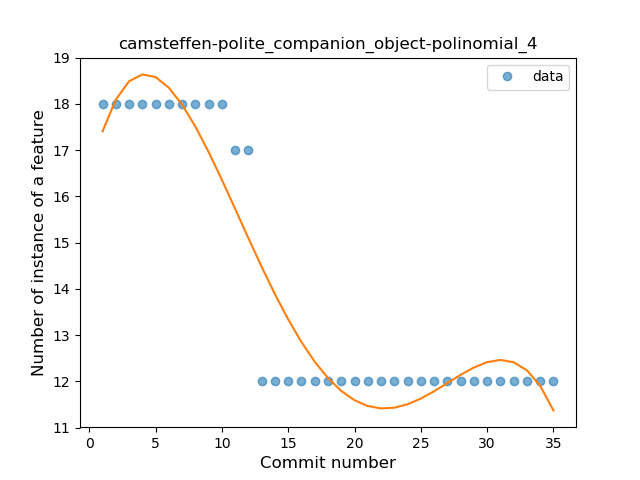
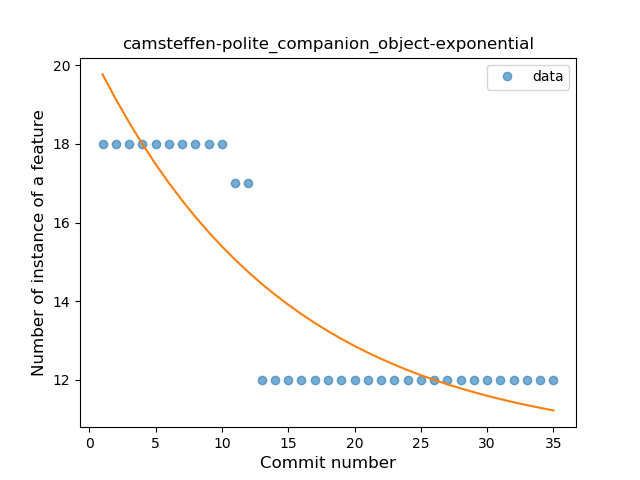
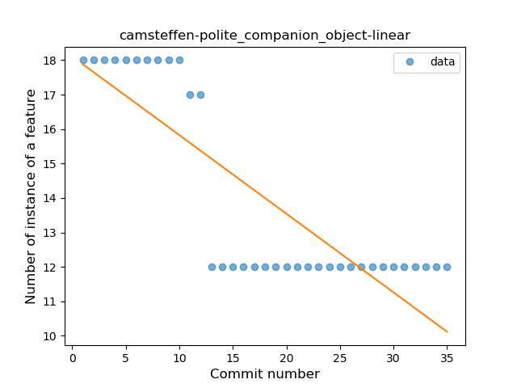
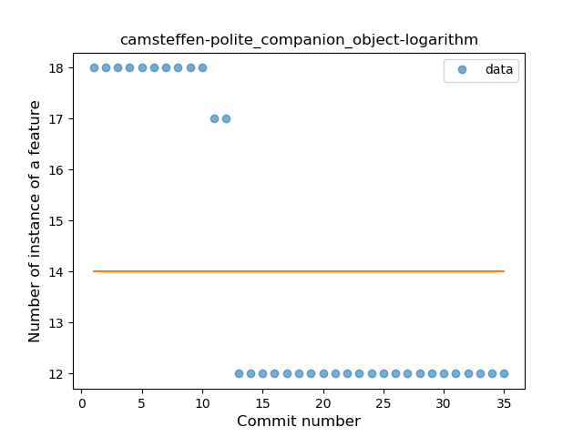
### <a name="unsafe_call">Unsafe Call</a>
----
#### Functions
* **Instability - Polinomial 4:** 
    * **R_Squared:** 0.84643275
* **Sudden Decline - Exponential:** 
    * **R_Squared:** 0.74381437
* **Constant Decline - Linear:** 
    * **R_Squared:** 0.5230589
* **Sudden Rise Plateau - Logarithm:** 
    * **R_Squared:** 0.0

**Plots** :chart_with_upwards_trend:
-----

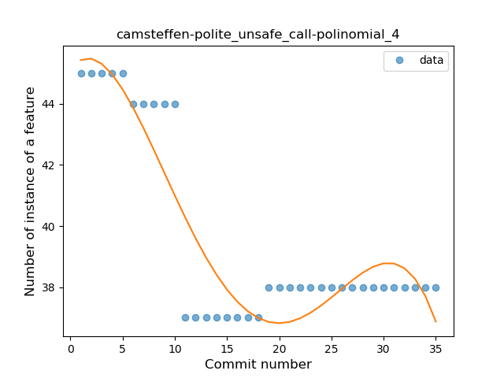
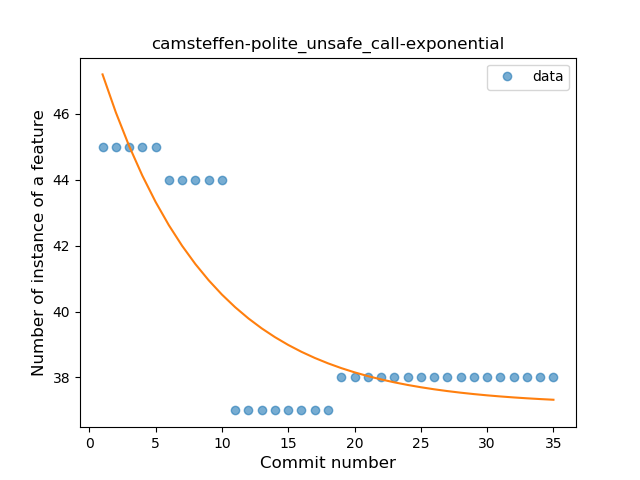
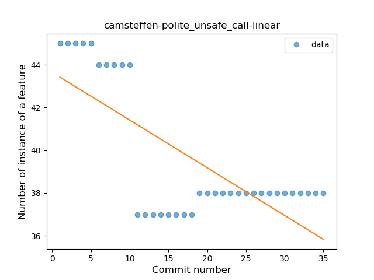
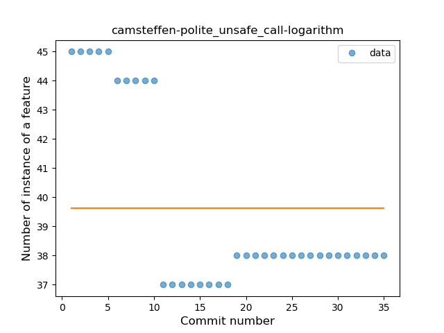
### <a name="string_template">String Template</a>
----
#### Functions
* **Instability - Polinomial 4:** 
    * **R_Squared:** 0.86733515
* **Sudden Rise Plateau - Logarithm:** 
    * **R_Squared:** 0.7359121
* **Constant Rise - Linear:** 
    * **R_Squared:** 0.5816609

**Plots** :chart_with_upwards_trend:
-----

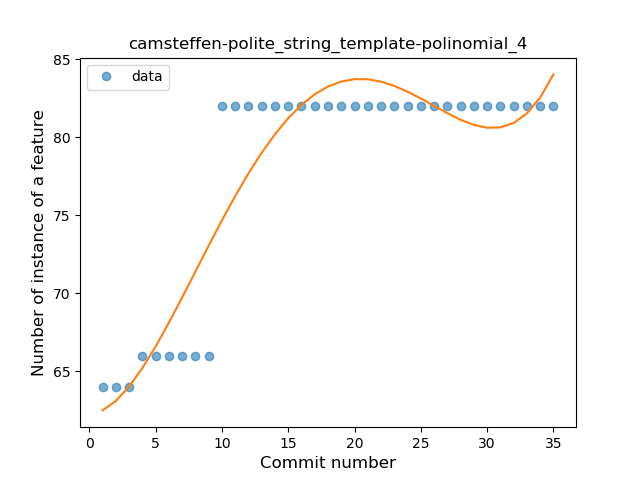
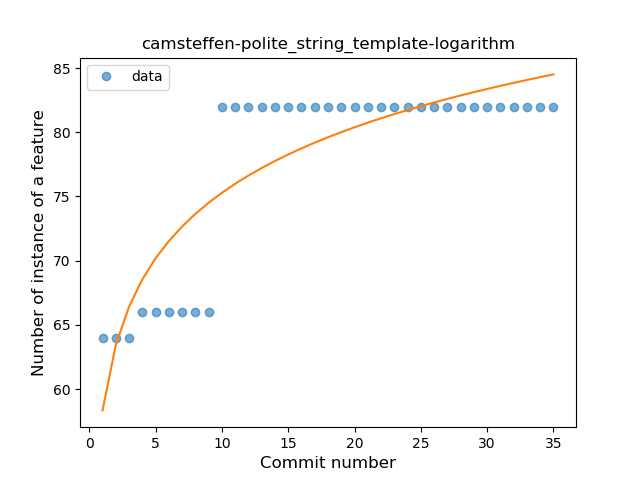
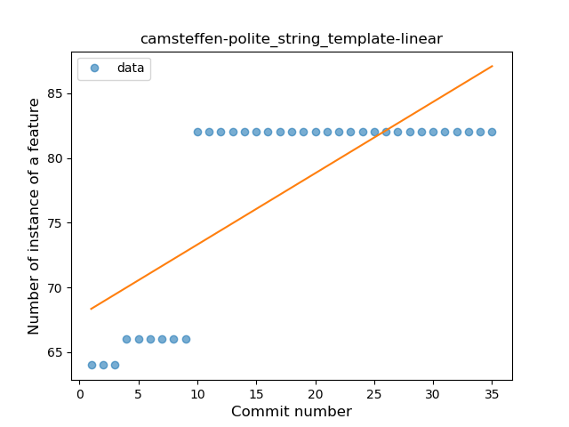
