## carlphilipp-chicago-commutes
----
#### Metrics provided by Detekt
* Number of lines of code 13932
* Number of Kotlin files: 133
* Cyclomatic complexity: 1364
* Cyclomatic complexity by thousands of lines: 210 

----
**16** features analyzed

*	<a href="#type_inference">Type Inference</a> 
*	<a href="#lambda">Lambda</a> 
*	<a href="#safe_call">Safe Call</a> 
*	<a href="#when_expr">When expression</a> 
*	<a href="#companion_object">Companion Object</a> 
*	<a href="#unsafe_call">Unsafe Call</a> 
*	<a href="#string_template">String Template</a> 
*	<a href="#func_with_default_value">Function with Default Value</a> 
*	<a href="#singleton">Singleton</a> 
*	<a href="#smart_cast">Smart Cast</a> 
*	<a href="#range_expr">Range Expression</a> 
*	<a href="#func_call_with_named_arg">Function call with Named Argument</a> 
*	<a href="#data_class">Data Class</a> 
*	<a href="#extension_function">Extension Function</a> 
*	<a href="#property_delegation">Property Delegation</a> 
*	<a href="#destructuring_declaration">Destructuring Declaration</a> 

### <a name="type_inference">Type Inference</a>
----
#### Functions
* **Instability - Polinomial 3:** )
    * **R_Squared:** 0.93168517
* **Sudden Rise Plateau - Logarithm:** 
    * **R_Squared:** 0.69387582
* **Constant Rise - Linear:** 
    * **R_Squared:** 0.6535179
* **Plateau Gradual Rise - Sigmoid:** 
    * **R_Squared:** 0.63915729

**Plots** :chart_with_upwards_trend:
-----

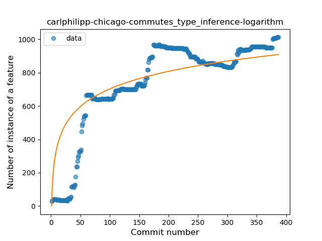
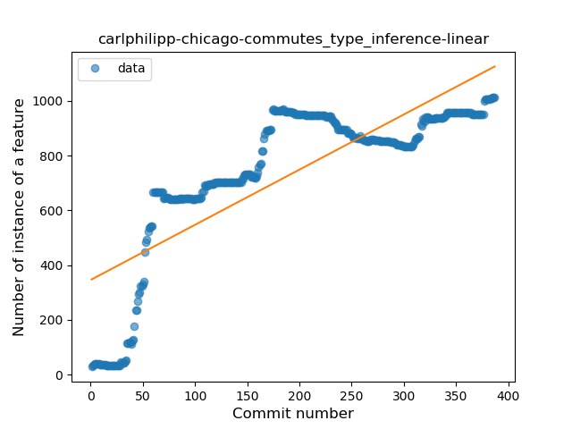
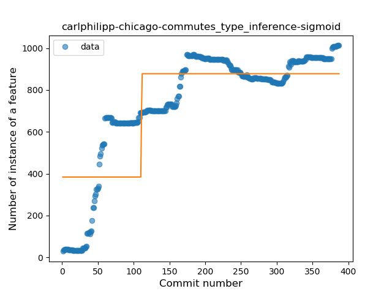
### <a name="lambda">Lambda</a>
----
#### Functions
* **Constant Rise - Linear:** 
    * **R_Squared:** 0.92848455
* **Sudden Rise Plateau - Logarithm:** 
    * **R_Squared:** 0.57868853
* **Plateau Sudden Rise - Binary Sigmoid:** 
    * **R_Squared:** 0.03264249

**Plots** :chart_with_upwards_trend:
-----

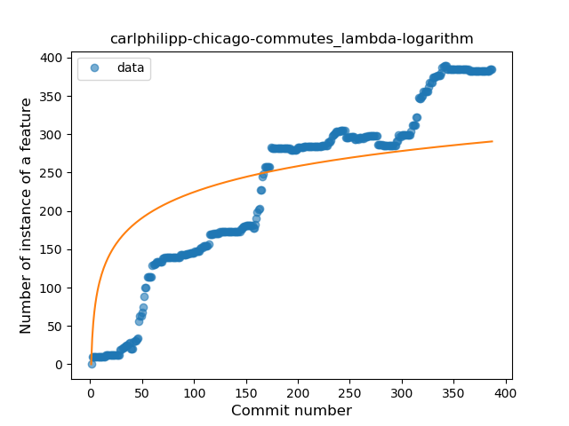
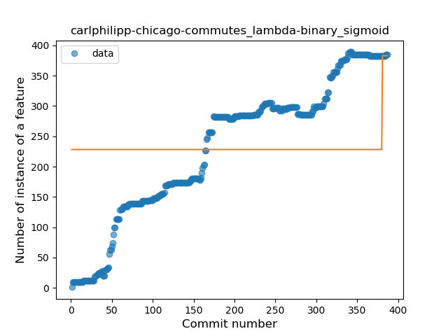
### <a name="safe_call">Safe Call</a>
----
#### Functions
* **Sudden Rise - Exponential:** 
    * **R_Squared:** 0.78552652
* **Constant Rise - Linear:** 
    * **R_Squared:** 0.68267659
* **Sudden Rise Plateau - Logarithm:** 
    * **R_Squared:** 0.18472487

**Plots** :chart_with_upwards_trend:
-----

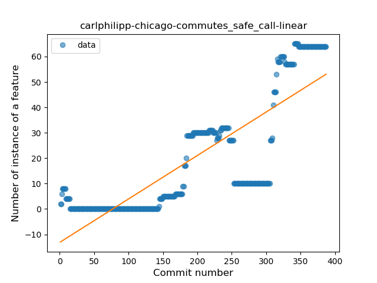
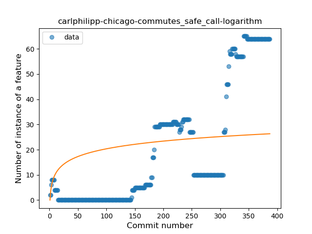
### <a name="when_expr">When expression</a>
----
#### Functions
* **Sudden Rise Plateau - Logarithm:** 
    * **R_Squared:** 0.34312703
* **Constant Rise - Linear:** 
    * **R_Squared:** 0.14001265

**Plots** :chart_with_upwards_trend:
-----

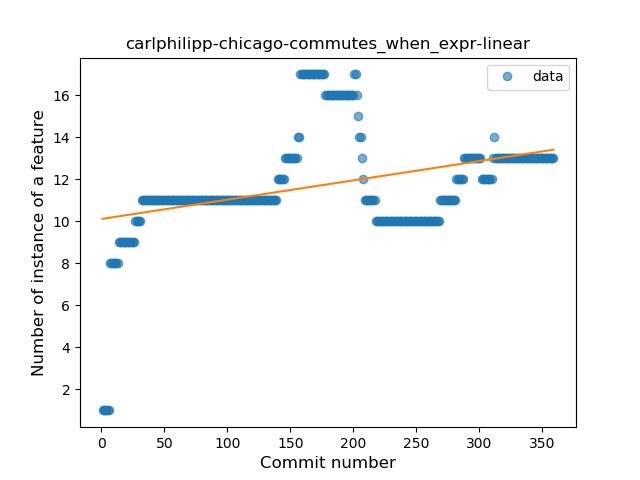
### <a name="companion_object">Companion Object</a>
----
#### Functions
* **Constant Rise - Linear:** 
    * **R_Squared:** 0.79029859
* **Sudden Rise Plateau - Logarithm:** 
    * **R_Squared:** 0.77264265

**Plots** :chart_with_upwards_trend:
-----

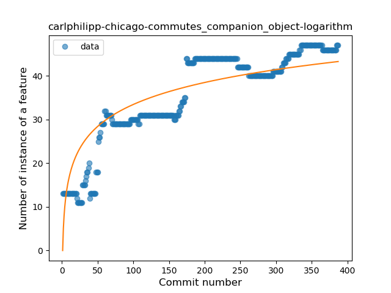
### <a name="unsafe_call">Unsafe Call</a>
----
#### Functions
* **Sudden Rise Plateau - Logarithm:** 
    * **R_Squared:** 0.06089851
* **Constant Rise - Linear:** 
    * **R_Squared:** 0.03242698

**Plots** :chart_with_upwards_trend:
-----

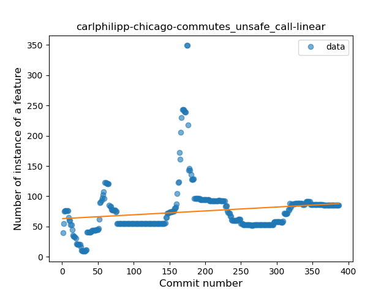
### <a name="string_template">String Template</a>
----
#### Functions
* **Sudden Rise - Exponential:** 
    * **R_Squared:** 0.87976227
* **Constant Rise - Linear:** 
    * **R_Squared:** 0.84989627
* **Sudden Rise Plateau - Logarithm:** 
    * **R_Squared:** 0.40173899
* **Plateau Sudden Rise - Binary Sigmoid:** 
    * **R_Squared:** 0.34123613

**Plots** :chart_with_upwards_trend:
-----

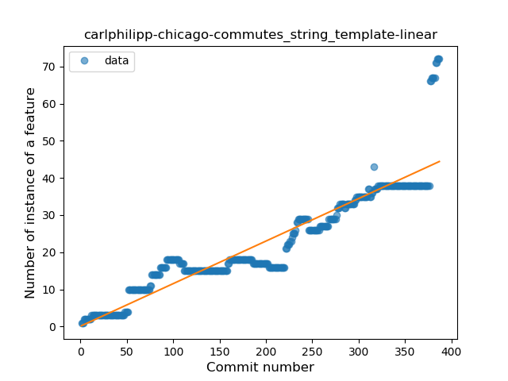
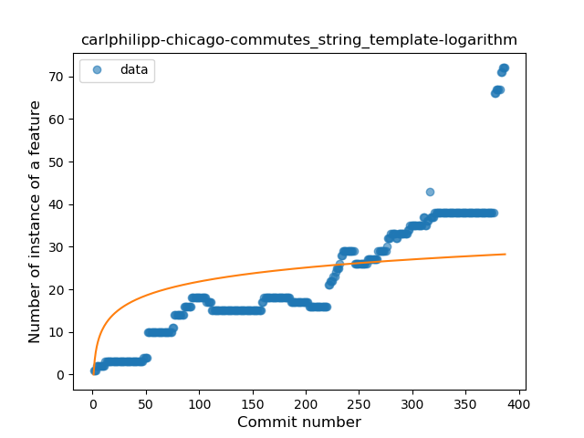
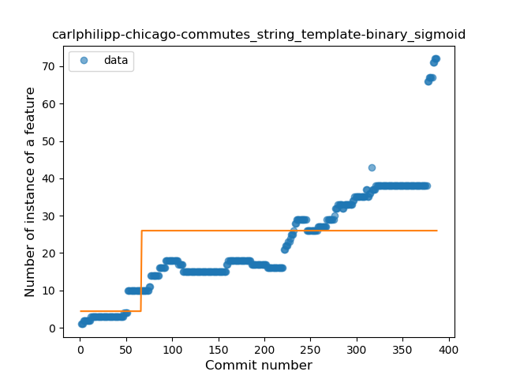
### <a name="func_with_default_value">Function with Default Value</a>
----
#### Functions
* **Constant Rise - Linear:** 
    * **R_Squared:** 0.70219198
* **Sudden Rise - Exponential:** 
    * **R_Squared:** 0.70230887
* **Sudden Rise Plateau - Logarithm:** 
    * **R_Squared:** 0.28485041

**Plots** :chart_with_upwards_trend:
-----

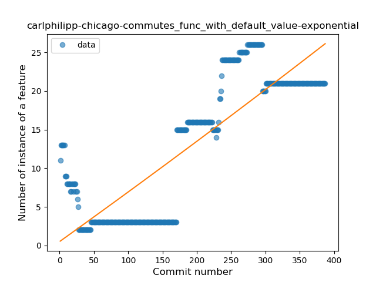
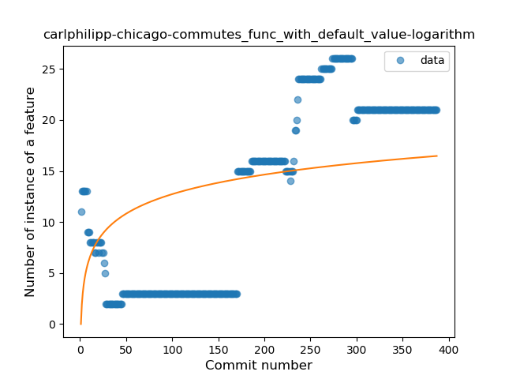
### <a name="singleton">Singleton</a>
----
#### Functions
* **Sudden Rise Plateau - Logarithm:** 
    * **R_Squared:** 0.81450147
* **Constant Rise - Linear:** 
    * **R_Squared:** 0.62654088

**Plots** :chart_with_upwards_trend:
-----

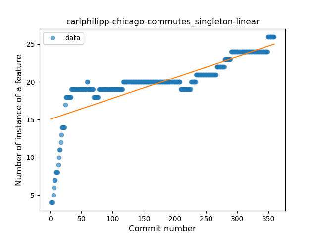
### <a name="smart_cast">Smart Cast</a>
----
#### Functions
* **Sudden Rise - Exponential:** 
    * **R_Squared:** 0.59655866
* **Sudden Rise Plateau - Logarithm:** 
    * **R_Squared:** 0.57543065
* **Constant Rise - Linear:** 
    * **R_Squared:** 0.56452586

**Plots** :chart_with_upwards_trend:
-----

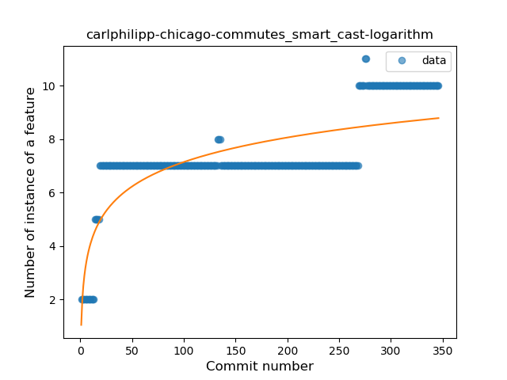
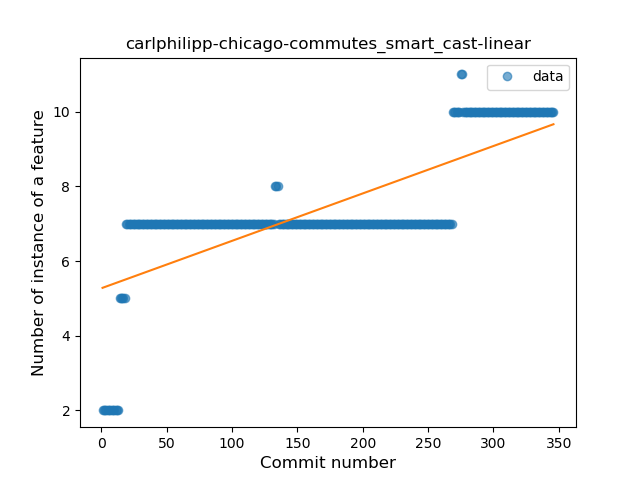
### <a name="range_expr">Range Expression</a>
----
#### Functions
* **Sudden Rise Plateau - Logarithm:** 
    * **R_Squared:** 0.71575437
* **Constant Rise - Linear:** 
    * **R_Squared:** 0.46578789

**Plots** :chart_with_upwards_trend:
-----

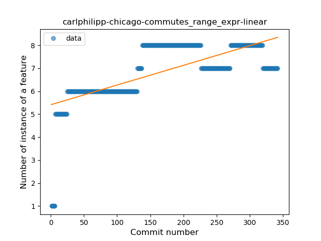
### <a name="func_call_with_named_arg">Function call with Named Argument</a>
----
#### Functions
* **Constant Rise - Linear:** 
    * **R_Squared:** 0.92443009
* **Sudden Rise Plateau - Logarithm:** 
    * **R_Squared:** 0.69382126
* **Plateau Sudden Rise - Binary Sigmoid:** 
    * **R_Squared:** 0.29836033

**Plots** :chart_with_upwards_trend:
-----

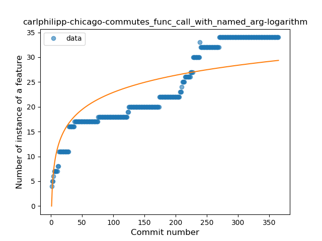
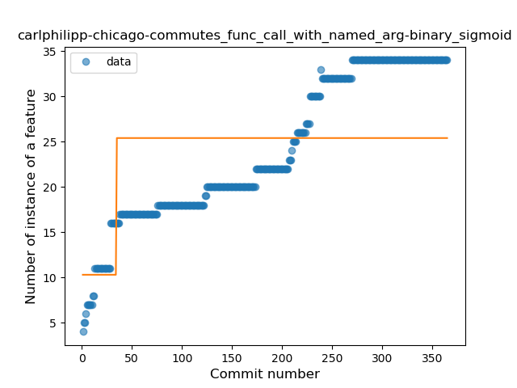
### <a name="data_class">Data Class</a>
----
#### Functions
* **Constant Rise - Linear:** 
    * **R_Squared:** 0.8331883
* **Sudden Rise - Exponential:** 
    * **R_Squared:** 0.84305816
* **Sudden Rise Plateau - Logarithm:** 
    * **R_Squared:** 0.40574211
* **Plateau Gradual Rise - Sigmoid:** 
    * **R_Squared:** 0.12890478

**Plots** :chart_with_upwards_trend:
-----

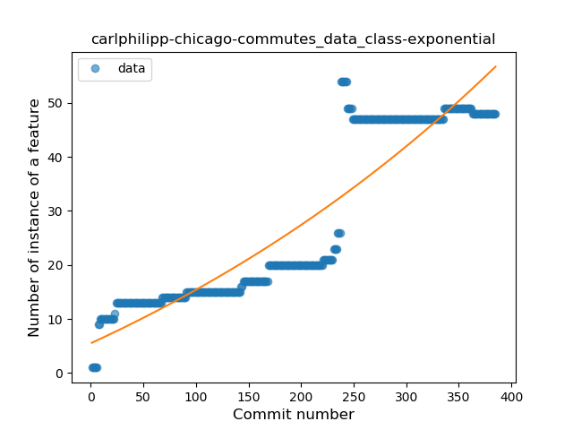
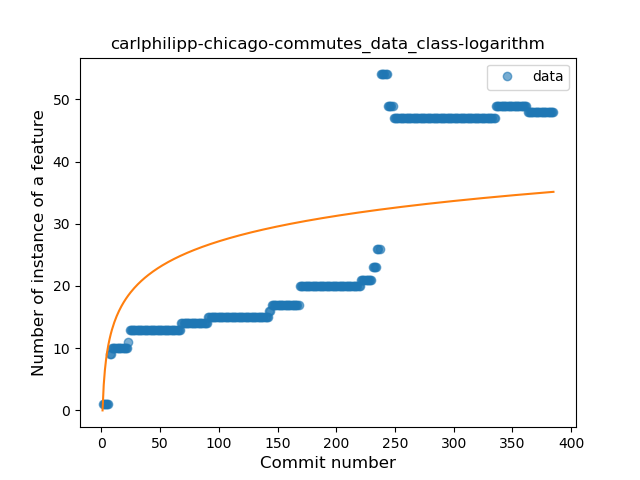
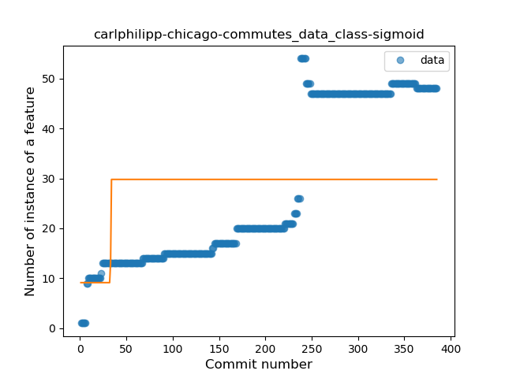
### <a name="extension_function">Extension Function</a>
----
#### Functions
* **Sudden Decline - Exponential:** 
    * **R_Squared:** 0.84057493
* **Constant Decline - Linear:** 
    * **R_Squared:** 0.06519323
* **Sudden Rise Plateau - Logarithm:** 
    * **R_Squared:** -0.0

**Plots** :chart_with_upwards_trend:
-----

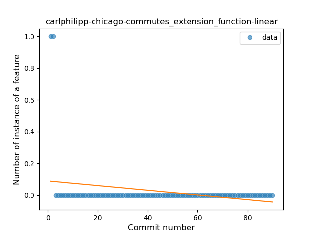
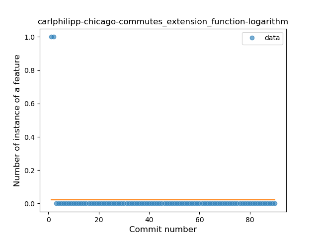
### <a name="property_delegation">Property Delegation</a>
----
#### Functions
* **Sudden Rise - Exponential:** 
    * **R_Squared:** 0.8622986
* **Constant Rise - Linear:** 
    * **R_Squared:** 0.74675165
* **Sudden Rise Plateau - Logarithm:** 
    * **R_Squared:** 0.27168495

**Plots** :chart_with_upwards_trend:
-----

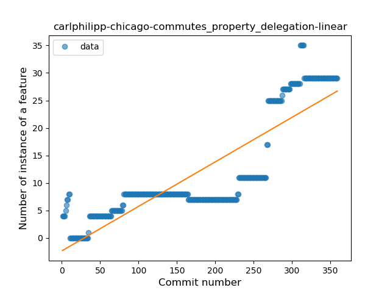
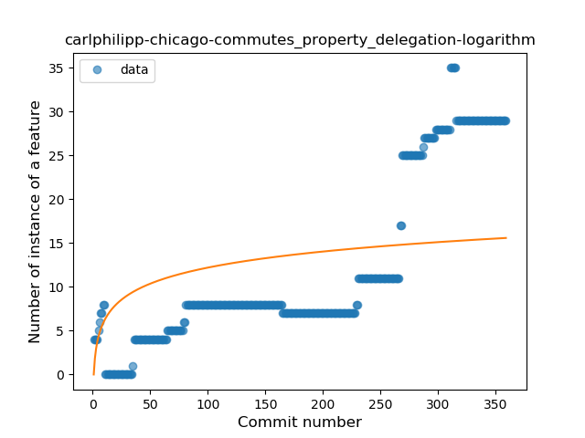
### <a name="destructuring_declaration">Destructuring Declaration</a>
----
#### Functions
* **Plateau Gradual Rise - Sigmoid:** 
    * **R_Squared:** 0.64467429
* **Sudden Rise Plateau - Logarithm:** 
    * **R_Squared:** 0.46311227
* **Constant Rise - Linear:** 
    * **R_Squared:** 0.11972245

**Plots** :chart_with_upwards_trend:
-----

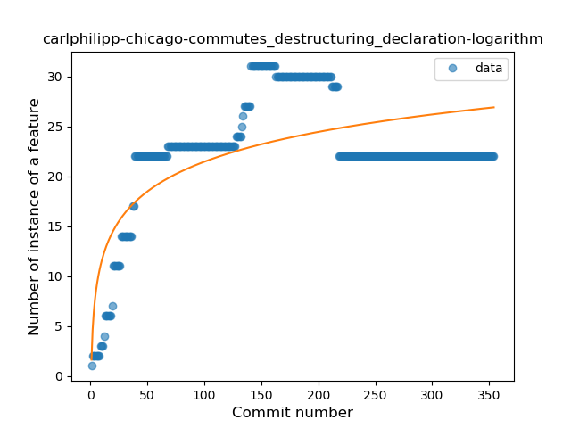
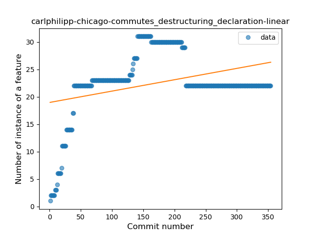
