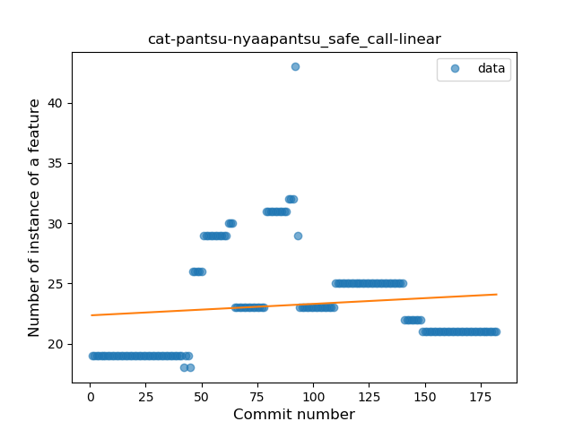
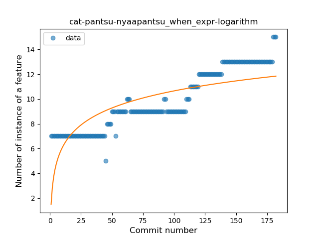
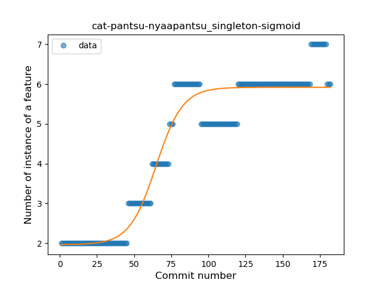
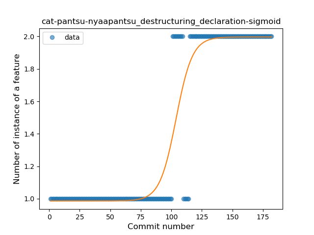

## cat-pantsu-nyaapantsu
----
#### Metrics provided by Detekt
* Number of lines of code 2822
* Number of Kotlin files: 31
* Cyclomatic complexity: 416
* Cyclomatic complexity by thousands of lines: 283 

----
**14** features analyzed

*	<a href="#type_inference">Type Inference</a> 
*	<a href="#lambda">Lambda</a> 
*	<a href="#safe_call">Safe Call</a> 
*	<a href="#when_expr">When expression</a> 
*	<a href="#unsafe_call">Unsafe Call</a> 
*	<a href="#companion_object">Companion Object</a> 
*	<a href="#string_template">String Template</a> 
*	<a href="#singleton">Singleton</a> 
*	<a href="#range_expr">Range Expression</a> 
*	<a href="#smart_cast">Smart Cast</a> 
*	<a href="#data_class">Data Class</a> 
*	<a href="#func_call_with_named_arg">Function call with Named Argument</a> 
*	<a href="#property_delegation">Property Delegation</a> 
*	<a href="#destructuring_declaration">Destructuring Declaration</a> 

### <a name="type_inference">Type Inference</a>
----
#### Functions
* **Constant Rise - Linear:** 
    * **R_Squared:** 0.96657223
* **Sudden Rise - Exponential:** 
    * **R_Squared:** 0.96713204
* **Sudden Rise Plateau - Logarithm:** 
    * **R_Squared:** 0.69474915

**Plots** :chart_with_upwards_trend:
-----

### <a name="lambda">Lambda</a>
----
#### Functions
* **Constant Rise - Linear:** 
    * **R_Squared:** 0.85316293
* **Sudden Rise Plateau - Logarithm:** 
    * **R_Squared:** 0.71993508

**Plots** :chart_with_upwards_trend:
-----

### <a name="safe_call">Safe Call</a>
----
#### Functions
* **Sudden Rise Plateau - Logarithm:** 
    * **R_Squared:** 0.10832765
* **Constant Rise - Linear:** 
    * **R_Squared:** 0.01573368

**Plots** :chart_with_upwards_trend:
-----

### <a name="when_expr">When expression</a>
----
#### Functions
* **Constant Rise - Linear:** 
    * **R_Squared:** 0.91004913
* **Sudden Rise - Exponential:** 
    * **R_Squared:** 0.91897328
* **Plateau Gradual Rise - Sigmoid:** 
    * **R_Squared:** 0.92602961
* **Sudden Rise Plateau - Logarithm:** 
    * **R_Squared:** 0.6322877

**Plots** :chart_with_upwards_trend:
-----

### <a name="unsafe_call">Unsafe Call</a>
----
#### Functions
* **Sudden Rise Plateau - Logarithm:** 
    * **R_Squared:** 0.62252053
* **Constant Rise - Linear:** 
    * **R_Squared:** 0.56776837

**Plots** :chart_with_upwards_trend:
-----

### <a name="companion_object">Companion Object</a>
----
#### Functions
* **Constant Rise - Linear:** 
    * **R_Squared:** 0.95976786
* **Sudden Rise Plateau - Logarithm:** 
    * **R_Squared:** 0.70542944
* **Plateau Sudden Rise - Binary Sigmoid:** 
    * **R_Squared:** 0.37331262

**Plots** :chart_with_upwards_trend:
-----

### <a name="string_template">String Template</a>
----
#### Functions
* **Plateau Gradual Rise - Sigmoid:** 
    * **R_Squared:** 0.95858849
* **Sudden Rise - Exponential:** 
    * **R_Squared:** 0.91324747
* **Constant Rise - Linear:** 
    * **R_Squared:** 0.89065296
* **Sudden Rise Plateau - Logarithm:** 
    * **R_Squared:** 0.38120783

**Plots** :chart_with_upwards_trend:
-----

### <a name="singleton">Singleton</a>
----
#### Functions
* **Plateau Gradual Rise - Sigmoid:** 
    * **R_Squared:** 0.92380805
* **Constant Rise - Linear:** 
    * **R_Squared:** 0.84194947
* **Sudden Rise Plateau - Logarithm:** 
    * **R_Squared:** 0.64948862

**Plots** :chart_with_upwards_trend:
-----

### <a name="range_expr">Range Expression</a>
----
#### Functions
* **Plateau Gradual Rise - Sigmoid:** 
    * **R_Squared:** 0.91686678
* **Constant Rise - Linear:** 
    * **R_Squared:** 0.69316731
* **Sudden Rise Plateau - Logarithm:** 
    * **R_Squared:** 0.52473904

**Plots** :chart_with_upwards_trend:
-----

### <a name="smart_cast">Smart Cast</a>
----
#### Functions
* **Sudden Rise - Exponential:** 
    * **R_Squared:** 0.57559626
* **Constant Rise - Linear:** 
    * **R_Squared:** 0.37165566
* **Sudden Rise Plateau - Logarithm:** 
    * **R_Squared:** 0.14304998

**Plots** :chart_with_upwards_trend:
-----

### <a name="data_class">Data Class</a>
----
#### Functions
* **Plateau Sudden Decline - Binary Sigmoid:** 
    * **R_Squared:** 0.88675927
* **Constant Decline - Linear:** 
    * **R_Squared:** 0.26856123
* **Sudden Rise Plateau - Logarithm:** 
    * **R_Squared:** -0.0

**Plots** :chart_with_upwards_trend:
-----

### <a name="func_call_with_named_arg">Function call with Named Argument</a>
----
#### Functions
* **Plateau Gradual Rise - Sigmoid:** 
    * **R_Squared:** 0.70196878
* **Sudden Rise Plateau - Logarithm:** 
    * **R_Squared:** 0.36007744
* **Constant Rise - Linear:** 
    * **R_Squared:** 0.16599177

**Plots** :chart_with_upwards_trend:
-----

### <a name="property_delegation">Property Delegation</a>
----
#### Functions
* **Plateau Gradual Rise - Sigmoid:** 
    * **R_Squared:** 0.94509273
* **Constant Rise - Linear:** 
    * **R_Squared:** 0.80966964
* **Sudden Rise Plateau - Logarithm:** 
    * **R_Squared:** 0.71595754

**Plots** :chart_with_upwards_trend:
-----

### <a name="destructuring_declaration">Destructuring Declaration</a>
----
#### Functions
* **Plateau Gradual Rise - Sigmoid:** 
    * **R_Squared:** 0.8722777
* **Sudden Rise - Exponential:** 
    * **R_Squared:** 0.73462726
* **Constant Rise - Linear:** 
    * **R_Squared:** 0.7160585
* **Sudden Rise Plateau - Logarithm:** 
    * **R_Squared:** 0.43256367

**Plots** :chart_with_upwards_trend:
-----

