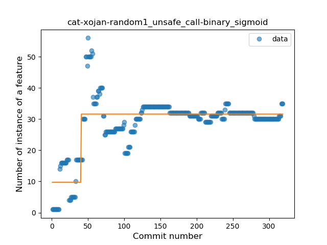
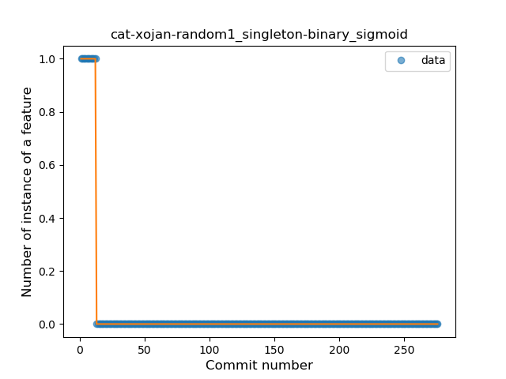
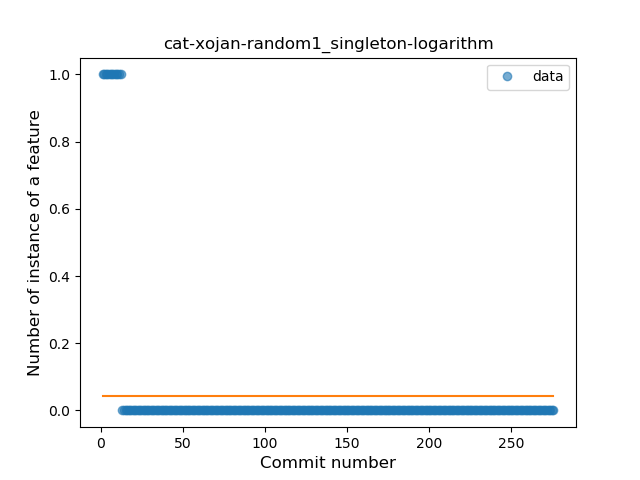
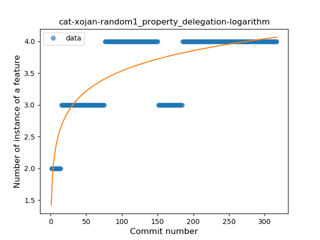

## cat-xojan-random1
----
#### Metrics provided by Detekt
* Number of lines of code 5941
* Number of Kotlin files: 83
* Cyclomatic complexity: 766
* Cyclomatic complexity by thousands of lines: 229 

----
**12** features analyzed

*	<a href="#type_inference">Type Inference</a> 
*	<a href="#lambda">Lambda</a> 
*	<a href="#safe_call">Safe Call</a> 
*	<a href="#when_expr">When expression</a> 
*	<a href="#unsafe_call">Unsafe Call</a> 
*	<a href="#companion_object">Companion Object</a> 
*	<a href="#string_template">String Template</a> 
*	<a href="#func_with_default_value">Function with Default Value</a> 
*	<a href="#singleton">Singleton</a> 
*	<a href="#smart_cast">Smart Cast</a> 
*	<a href="#data_class">Data Class</a> 
*	<a href="#property_delegation">Property Delegation</a> 

### <a name="type_inference">Type Inference</a>
----
#### Functions
* **Sudden Rise Plateau - Logarithm:** 
    * **R_Squared:** 0.75413331
* **Constant Rise - Linear:** 
    * **R_Squared:** 0.69277366

**Plots** :chart_with_upwards_trend:
-----

### <a name="lambda">Lambda</a>
----
#### Functions
* **Constant Rise - Linear:** 
    * **R_Squared:** 0.7712
* **Plateau Sudden Rise - Binary Sigmoid:** 
    * **R_Squared:** 0.75624364
* **Sudden Rise Plateau - Logarithm:** 
    * **R_Squared:** 0.67753667

**Plots** :chart_with_upwards_trend:
-----

### <a name="safe_call">Safe Call</a>
----
#### Functions
* **Constant Rise - Linear:** 
    * **R_Squared:** 0.90597269
* **Plateau Sudden Rise - Binary Sigmoid:** 
    * **R_Squared:** 0.7245403
* **Sudden Rise Plateau - Logarithm:** 
    * **R_Squared:** 0.58919138

**Plots** :chart_with_upwards_trend:
-----

### <a name="when_expr">When expression</a>
----
#### Functions
* **Plateau Gradual Rise - Sigmoid:** 
    * **R_Squared:** 0.98603437
* **Constant Rise - Linear:** 
    * **R_Squared:** 0.85740919
* **Sudden Rise Plateau - Logarithm:** 
    * **R_Squared:** 0.73534069

**Plots** :chart_with_upwards_trend:
-----

### <a name="unsafe_call">Unsafe Call</a>
----
#### Functions
* **Plateau Sudden Rise - Binary Sigmoid:** 
    * **R_Squared:** 0.64682445
* **Sudden Rise Plateau - Logarithm:** 
    * **R_Squared:** 0.40639389
* **Constant Rise - Linear:** 
    * **R_Squared:** 0.1748851

**Plots** :chart_with_upwards_trend:
-----

### <a name="companion_object">Companion Object</a>
----
#### Functions
* **Constant Rise - Linear:** 
    * **R_Squared:** 0.75729645
* **Sudden Rise Plateau - Logarithm:** 
    * **R_Squared:** 0.75852559

**Plots** :chart_with_upwards_trend:
-----

### <a name="string_template">String Template</a>
----
#### Functions
* **Plateau Gradual Rise - Sigmoid:** 
    * **R_Squared:** 0.96799025
* **Sudden Rise - Exponential:** 
    * **R_Squared:** 0.90874304
* **Constant Rise - Linear:** 
    * **R_Squared:** 0.63457337
* **Sudden Rise Plateau - Logarithm:** 
    * **R_Squared:** 0.17421979

**Plots** :chart_with_upwards_trend:
-----

### <a name="func_with_default_value">Function with Default Value</a>
----
#### Functions
* **Plateau Gradual Rise - Sigmoid:** 
    * **R_Squared:** 0.91325005
* **Sudden Rise - Exponential:** 
    * **R_Squared:** 0.76779238
* **Constant Rise - Linear:** 
    * **R_Squared:** 0.68376201
* **Sudden Rise Plateau - Logarithm:** 
    * **R_Squared:** 0.34265756

**Plots** :chart_with_upwards_trend:
-----

### <a name="singleton">Singleton</a>
----
#### Functions
* **Plateau Sudden Decline - Binary Sigmoid:** 
    * **R_Squared:** 1.0
* **Sudden Decline - Exponential:** 
    * **R_Squared:** 0.80786149
* **Constant Decline - Linear:** 
    * **R_Squared:** 0.12476534
* **Sudden Rise Plateau - Logarithm:** 
    * **R_Squared:** -0.0

**Plots** :chart_with_upwards_trend:
-----

### <a name="smart_cast">Smart Cast</a>
----
#### Functions
* **Plateau Gradual Rise - Sigmoid:** 
    * **R_Squared:** 0.84188784
* **Constant Rise - Linear:** 
    * **R_Squared:** 0.60540899
* **Sudden Rise Plateau - Logarithm:** 
    * **R_Squared:** 0.59848495

**Plots** :chart_with_upwards_trend:
-----

### <a name="data_class">Data Class</a>
----
#### Functions
* **Plateau Gradual Rise - Sigmoid:** 
    * **R_Squared:** 0.87504393
* **Constant Rise - Linear:** 
    * **R_Squared:** 0.74422093
* **Sudden Rise Plateau - Logarithm:** 
    * **R_Squared:** 0.42962367

**Plots** :chart_with_upwards_trend:
-----

### <a name="property_delegation">Property Delegation</a>
----
#### Functions
* **Sudden Rise Plateau - Logarithm:** 
    * **R_Squared:** 0.6034956
* **Constant Rise - Linear:** 
    * **R_Squared:** 0.43393584

**Plots** :chart_with_upwards_trend:
-----

