## ccomeaux-boardgamegeek4android
----
#### Metrics provided by Detekt
* Number of lines of code 14598
* Number of Kotlin files: 246
* Cyclomatic complexity: 2487
* Cyclomatic complexity by thousands of lines: 296 

----
**18** features analyzed

*	<a href="#type_inference">Type Inference</a> 
*	<a href="#lambda">Lambda</a> 
*	<a href="#safe_call">Safe Call</a> 
*	<a href="#when_expr">When expression</a> 
*	<a href="#companion_object">Companion Object</a> 
*	<a href="#unsafe_call">Unsafe Call</a> 
*	<a href="#string_template">String Template</a> 
*	<a href="#func_with_default_value">Function with Default Value</a> 
*	<a href="#singleton">Singleton</a> 
*	<a href="#smart_cast">Smart Cast</a> 
*	<a href="#range_expr">Range Expression</a> 
*	<a href="#func_call_with_named_arg">Function call with Named Argument</a> 
*	<a href="#data_class">Data Class</a> 
*	<a href="#extension_function">Extension Function</a> 
*	<a href="#property_delegation">Property Delegation</a> 
*	<a href="#destructuring_declaration">Destructuring Declaration</a> 
*	<a href="#inline_func">Inline Function</a> 
*	<a href="#overloaded_op">Overloaded Operator</a> 

### <a name="type_inference">Type Inference</a>
----
#### Functions
* **Constant Rise - Linear:** 
    * **R_Squared:** 0.97853626
* **Plateau Sudden Rise - Binary Sigmoid:** 
    * **R_Squared:** 0.52680847
* **Sudden Rise Plateau - Logarithm:** 
    * **R_Squared:** 0.38379979

**Plots** :chart_with_upwards_trend:
-----

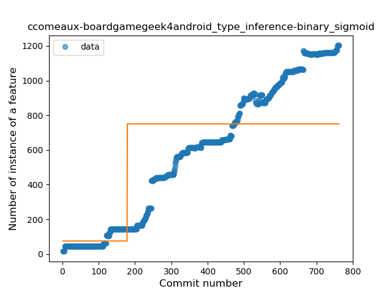
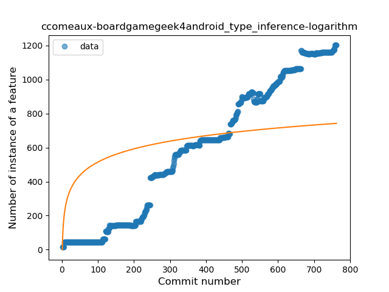
### <a name="lambda">Lambda</a>
----
#### Functions
* **Sudden Rise - Exponential:** 
    * **R_Squared:** 0.94304455
* **Constant Rise - Linear:** 
    * **R_Squared:** 0.87451106
* **Plateau Sudden Rise - Binary Sigmoid:** 
    * **R_Squared:** 0.25185329
* **Sudden Rise Plateau - Logarithm:** 
    * **R_Squared:** 0.2398511

**Plots** :chart_with_upwards_trend:
-----

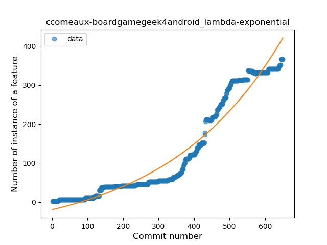
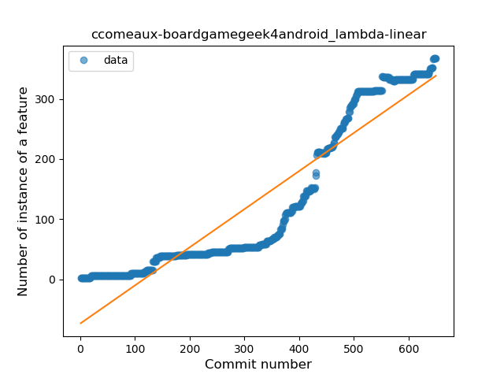
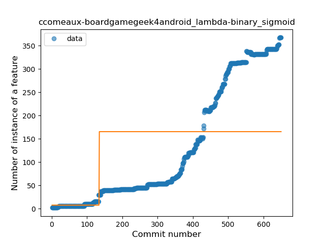
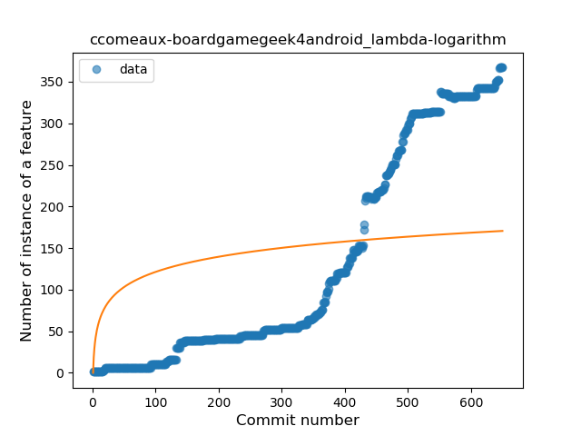
### <a name="safe_call">Safe Call</a>
----
#### Functions
* **Sudden Rise - Exponential:** 
    * **R_Squared:** 0.9364141
* **Constant Rise - Linear:** 
    * **R_Squared:** 0.8687506
* **Plateau Gradual Rise - Sigmoid:** 
    * **R_Squared:** 0.25386455
* **Sudden Rise Plateau - Logarithm:** 
    * **R_Squared:** 0.22830172

**Plots** :chart_with_upwards_trend:
-----

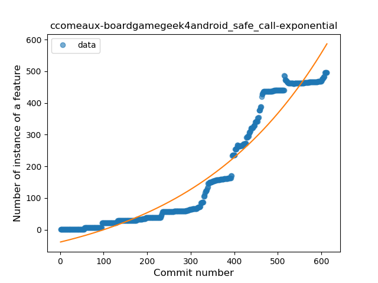
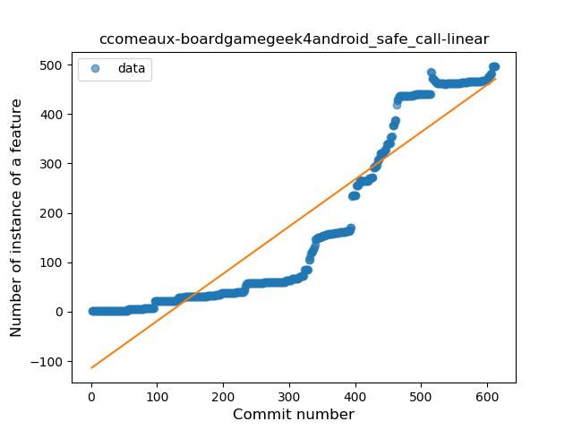
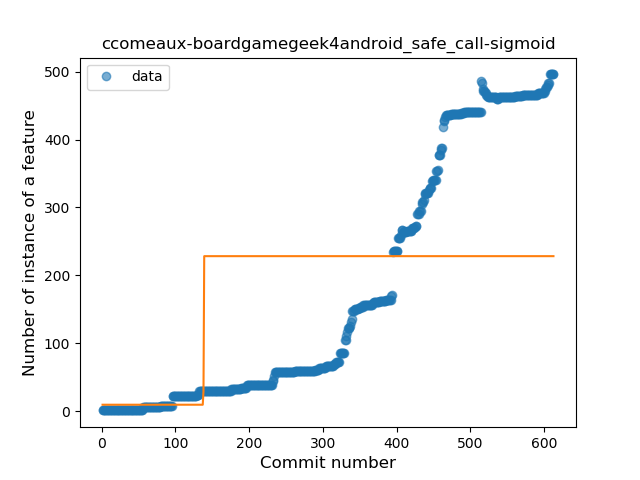
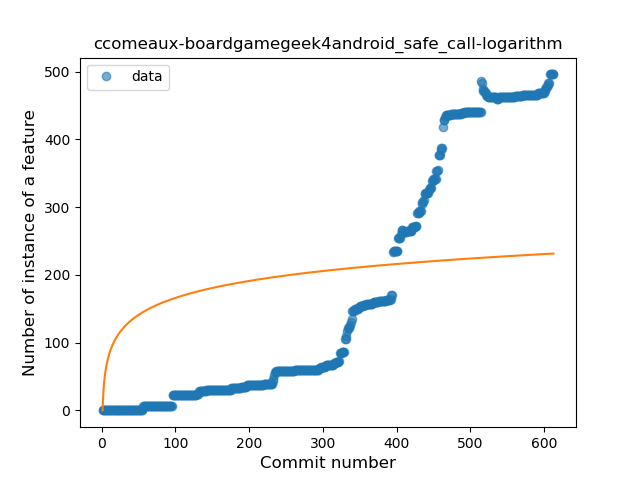
### <a name="when_expr">When expression</a>
----
#### Functions
* **Sudden Rise - Exponential:** 
    * **R_Squared:** 0.96547085
* **Constant Rise - Linear:** 
    * **R_Squared:** 0.90814523
* **Sudden Rise Plateau - Logarithm:** 
    * **R_Squared:** 0.34031446
* **Plateau Sudden Rise - Binary Sigmoid:** 
    * **R_Squared:** 0.07955382

**Plots** :chart_with_upwards_trend:
-----

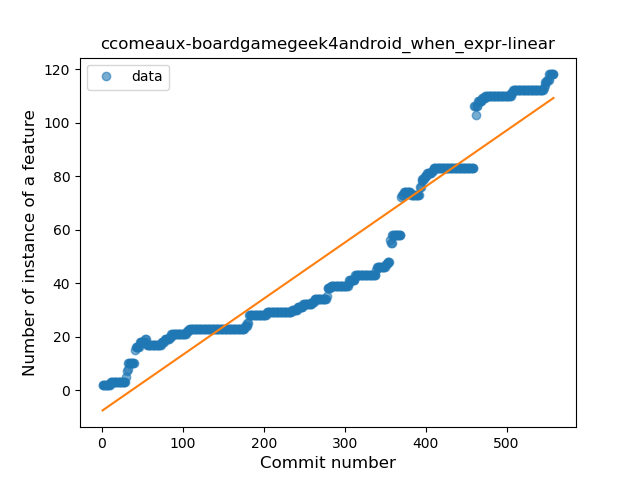

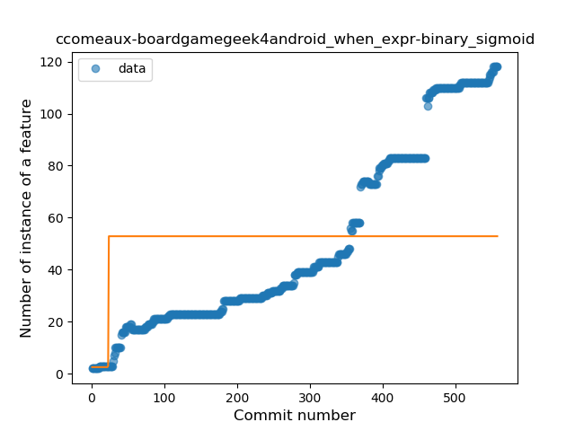
### <a name="companion_object">Companion Object</a>
----
#### Functions
* **Constant Rise - Linear:** 
    * **R_Squared:** 0.94379835
* **Sudden Rise - Exponential:** 
    * **R_Squared:** 0.94523915
* **Sudden Rise Plateau - Logarithm:** 
    * **R_Squared:** 0.37786134
* **Plateau Sudden Rise - Binary Sigmoid:** 
    * **R_Squared:** 0.11103579

**Plots** :chart_with_upwards_trend:
-----

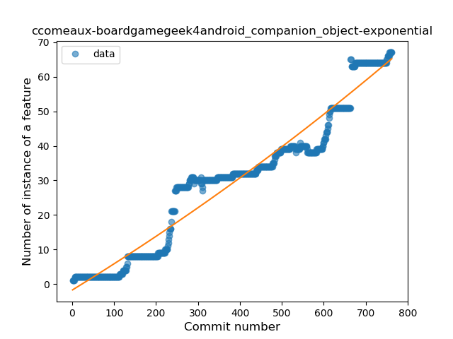

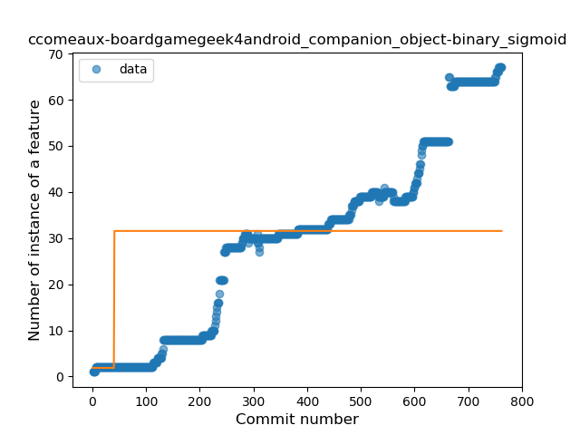
### <a name="unsafe_call">Unsafe Call</a>
----
#### Functions
* **Sudden Rise - Exponential:** 
    * **R_Squared:** 0.33178536
* **Constant Rise - Linear:** 
    * **R_Squared:** 0.19813172
* **Plateau Sudden Rise - Binary Sigmoid:** 
    * **R_Squared:** 0.10860479
* **Sudden Rise Plateau - Logarithm:** 
    * **R_Squared:** 0.08133973

**Plots** :chart_with_upwards_trend:
-----

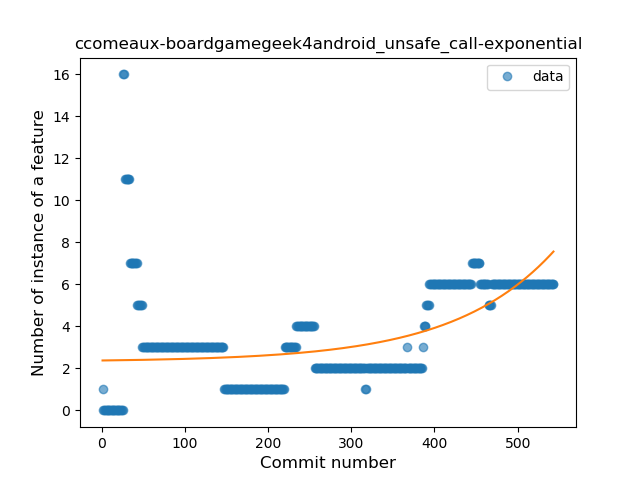
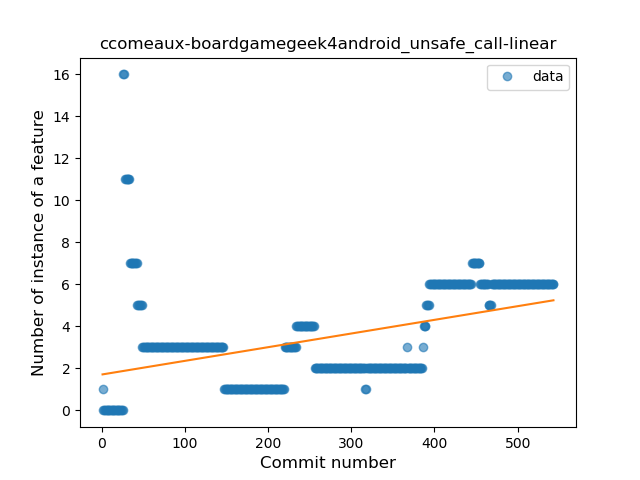
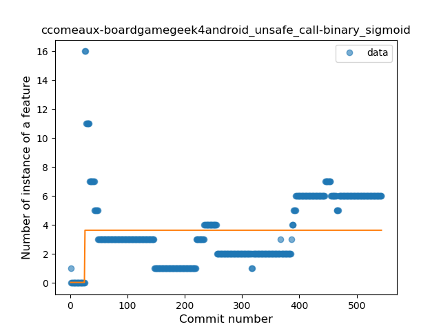
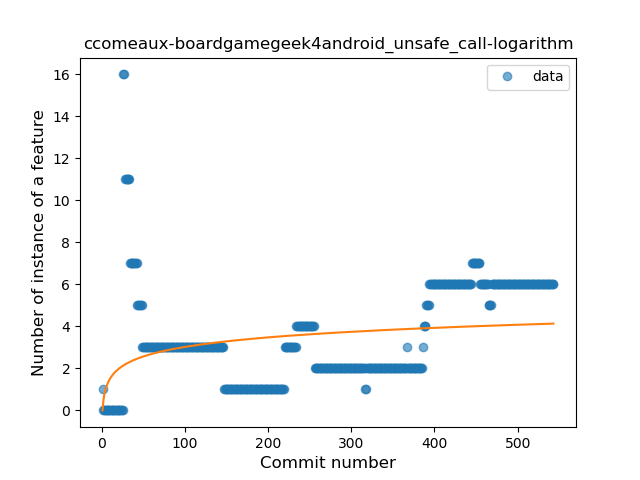
### <a name="string_template">String Template</a>
----
#### Functions
* **Constant Rise - Linear:** 
    * **R_Squared:** 0.95504515
* **Sudden Rise Plateau - Logarithm:** 
    * **R_Squared:** 0.48990618
* **Plateau Sudden Rise - Binary Sigmoid:** 
    * **R_Squared:** 0.29543701

**Plots** :chart_with_upwards_trend:
-----

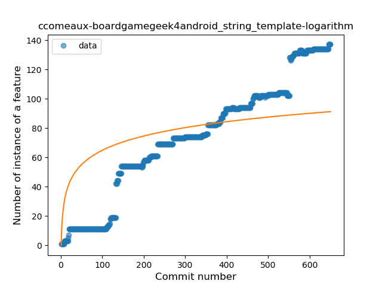
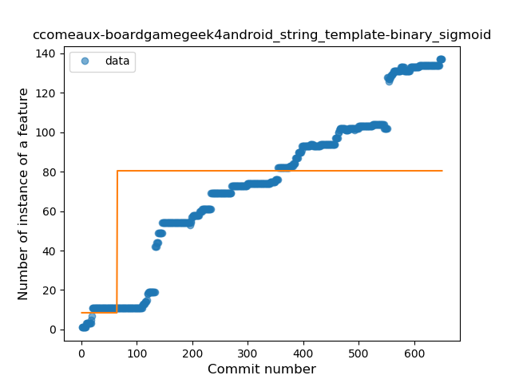
### <a name="func_with_default_value">Function with Default Value</a>
----
#### Functions
* **Constant Rise - Linear:** 
    * **R_Squared:** 0.9465765
* **Sudden Rise Plateau - Logarithm:** 
    * **R_Squared:** 0.57361426

**Plots** :chart_with_upwards_trend:
-----

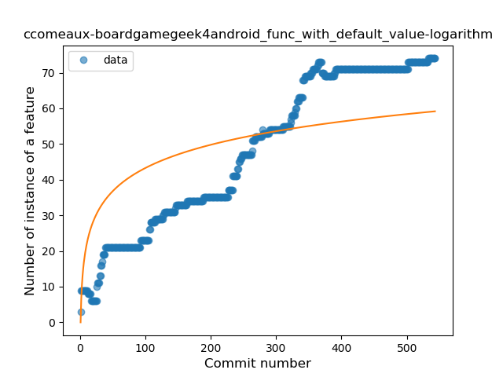
### <a name="singleton">Singleton</a>
----
#### Functions
* **Plateau Gradual Rise - Sigmoid:** 
    * **R_Squared:** 0.90671925
* **Constant Rise - Linear:** 
    * **R_Squared:** 0.76360766
* **Sudden Rise Plateau - Logarithm:** 
    * **R_Squared:** 0.69042374

**Plots** :chart_with_upwards_trend:
-----

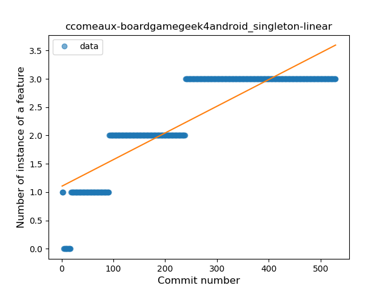
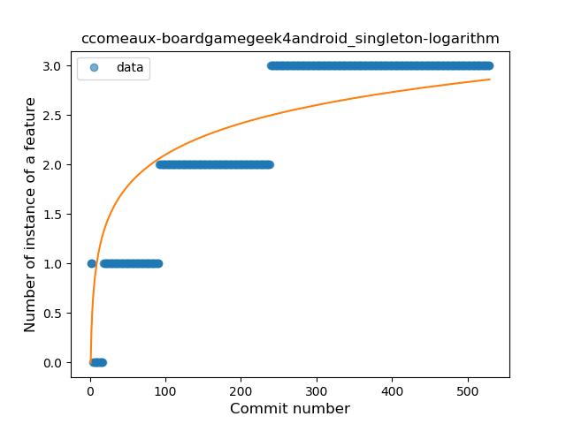
### <a name="smart_cast">Smart Cast</a>
----
#### Functions
* **Sudden Rise - Exponential:** 
    * **R_Squared:** 0.88333543
* **Constant Rise - Linear:** 
    * **R_Squared:** 0.85538289
* **Sudden Rise Plateau - Logarithm:** 
    * **R_Squared:** 0.57468584

**Plots** :chart_with_upwards_trend:
-----

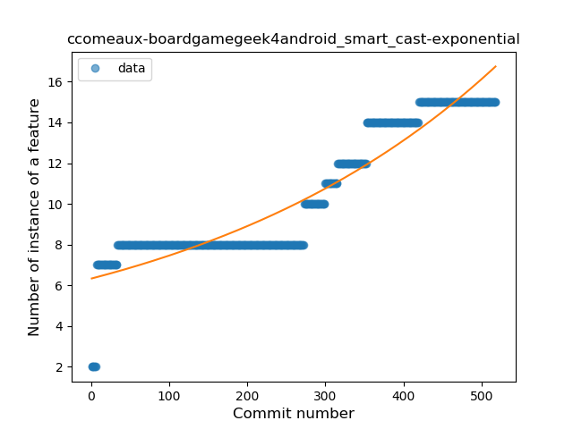
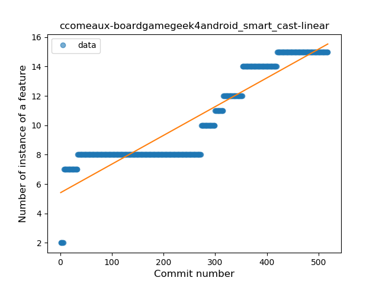
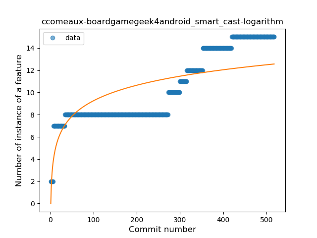
### <a name="range_expr">Range Expression</a>
----
#### Functions
* **Constant Rise - Linear:** 
    * **R_Squared:** 0.72033777
* **Sudden Rise Plateau - Logarithm:** 
    * **R_Squared:** 0.50643364

**Plots** :chart_with_upwards_trend:
-----

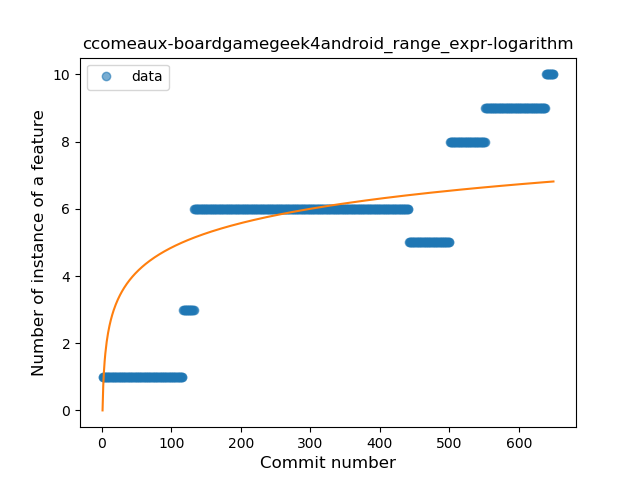
### <a name="func_call_with_named_arg">Function call with Named Argument</a>
----
#### Functions
* **Sudden Rise - Exponential:** 
    * **R_Squared:** 0.92639365
* **Constant Rise - Linear:** 
    * **R_Squared:** 0.90618358
* **Sudden Rise Plateau - Logarithm:** 
    * **R_Squared:** 0.38771452
* **Plateau Sudden Rise - Binary Sigmoid:** 
    * **R_Squared:** 0.01643964

**Plots** :chart_with_upwards_trend:
-----

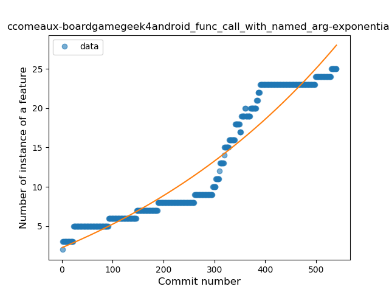

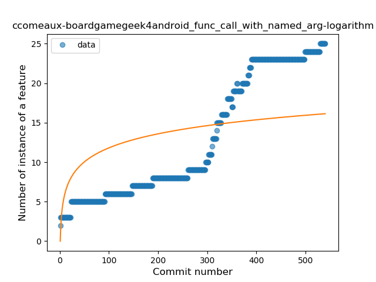
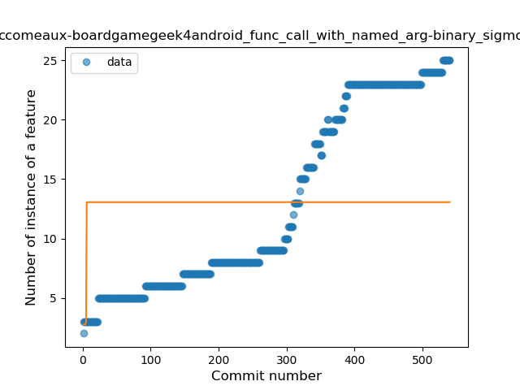
### <a name="data_class">Data Class</a>
----
#### Functions
* **Constant Rise - Linear:** 
    * **R_Squared:** 0.9297222
* **Sudden Rise Plateau - Logarithm:** 
    * **R_Squared:** 0.4649345

**Plots** :chart_with_upwards_trend:
-----

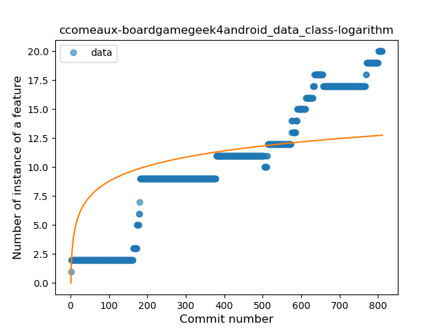
### <a name="extension_function">Extension Function</a>
----
#### Functions
* **Sudden Rise - Exponential:** 
    * **R_Squared:** 0.91389119
* **Constant Rise - Linear:** 
    * **R_Squared:** 0.90139073
* **Plateau Gradual Rise - Sigmoid:** 
    * **R_Squared:** 0.49762554
* **Sudden Rise Plateau - Logarithm:** 
    * **R_Squared:** 0.33890714

**Plots** :chart_with_upwards_trend:
-----

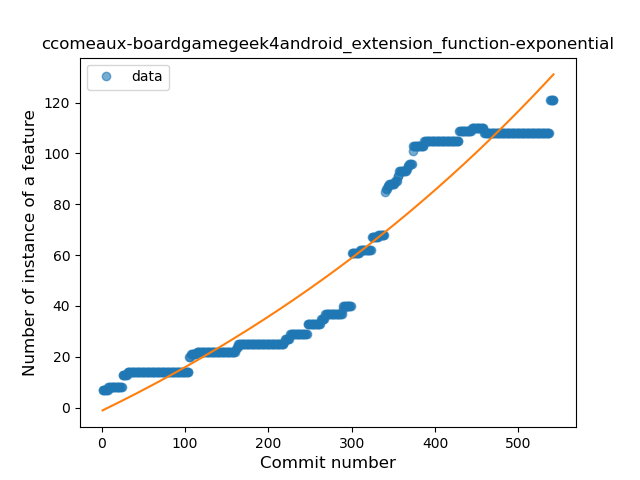
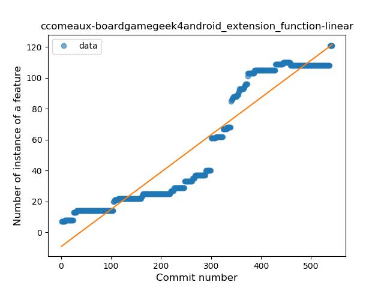
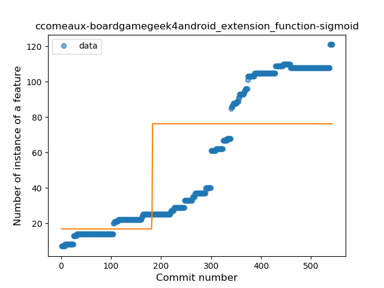
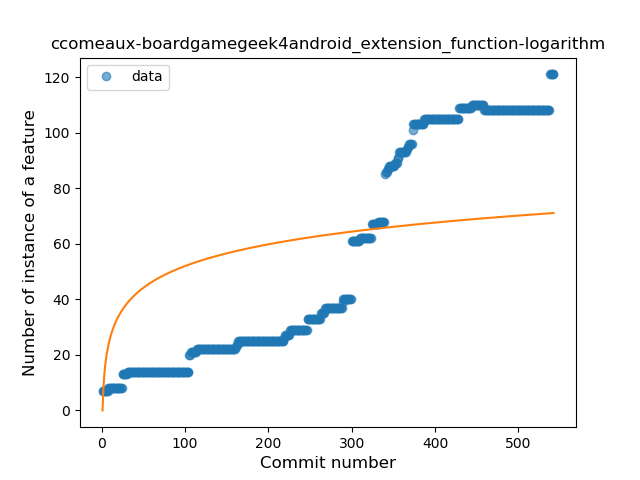
### <a name="property_delegation">Property Delegation</a>
----
#### Functions
* **Constant Rise - Linear:** 
    * **R_Squared:** 0.95524142
* **Sudden Rise Plateau - Logarithm:** 
    * **R_Squared:** 0.45562279
* **Plateau Sudden Rise - Binary Sigmoid:** 
    * **R_Squared:** 0.16883294

**Plots** :chart_with_upwards_trend:
-----

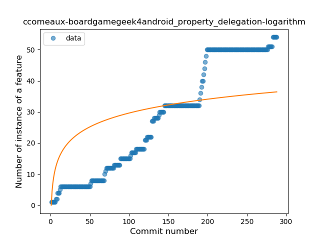
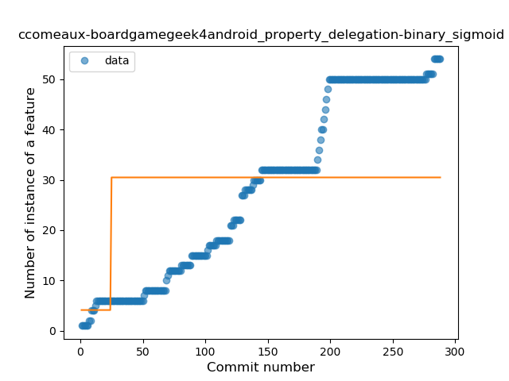
### <a name="destructuring_declaration">Destructuring Declaration</a>
----
#### Functions
* **Constant Rise - Linear:** 
    * **R_Squared:** 0.76463334
* **Sudden Rise Plateau - Logarithm:** 
    * **R_Squared:** 0.5110832

**Plots** :chart_with_upwards_trend:
-----

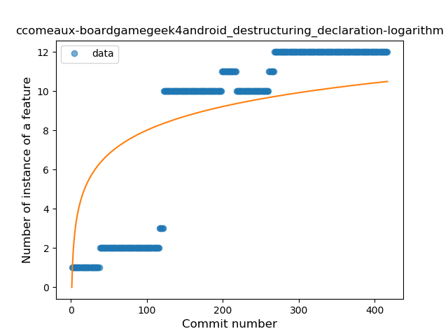
### <a name="inline_func">Inline Function</a>
----
#### Functions
* **Constant Rise - Linear:** 
    * **R_Squared:** 0.80917952
* **Sudden Rise - Exponential:** 
    * **R_Squared:** 0.81574271
* **Sudden Rise Plateau - Logarithm:** 
    * **R_Squared:** 0.26347246
* **Plateau Sudden Rise - Binary Sigmoid:** 
    * **R_Squared:** 0.01726247

**Plots** :chart_with_upwards_trend:
-----

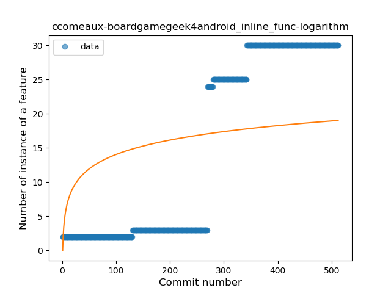
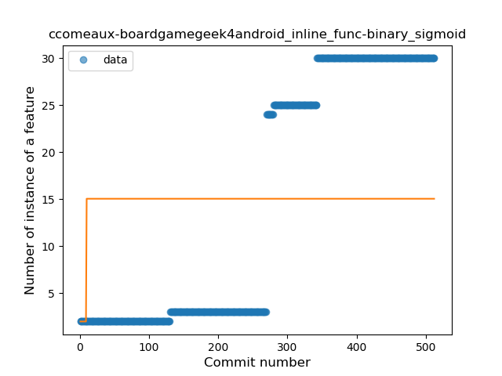
### <a name="overloaded_op">Overloaded Operator</a>
----
#### Functions
* **Plateau Gradual Rise - Sigmoid:** 
    * **R_Squared:** 1.0
* **Sudden Rise - Exponential:** 
    * **R_Squared:** 0.78263394
* **Constant Rise - Linear:** 
    * **R_Squared:** 0.46396419
* **Sudden Rise Plateau - Logarithm:** 
    * **R_Squared:** 0.18392588

**Plots** :chart_with_upwards_trend:
-----

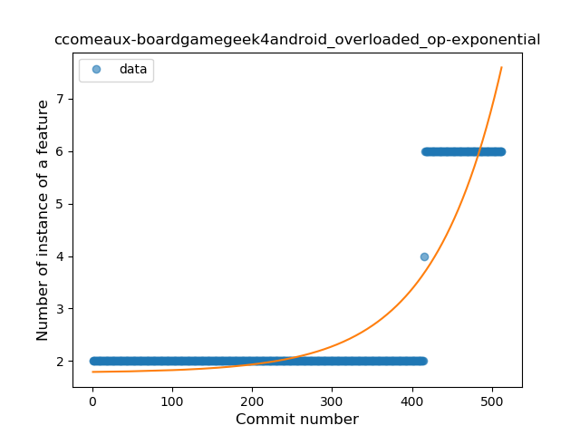

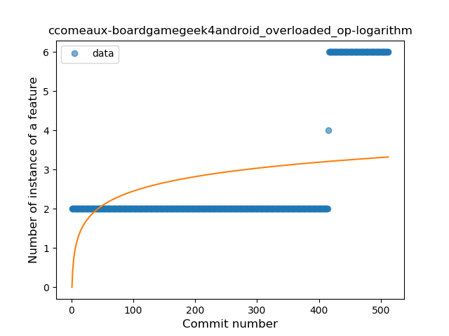
