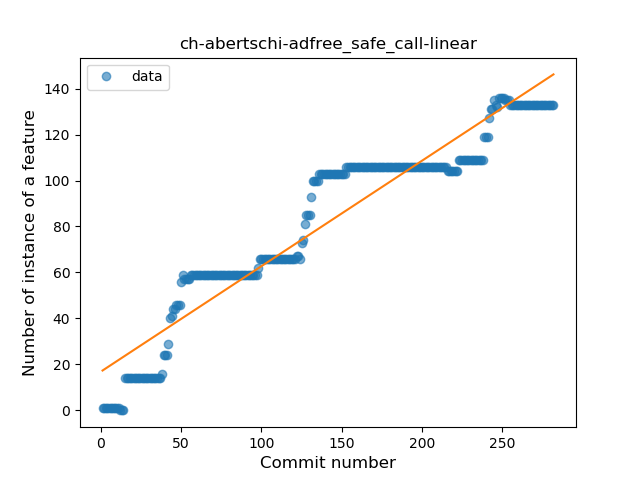
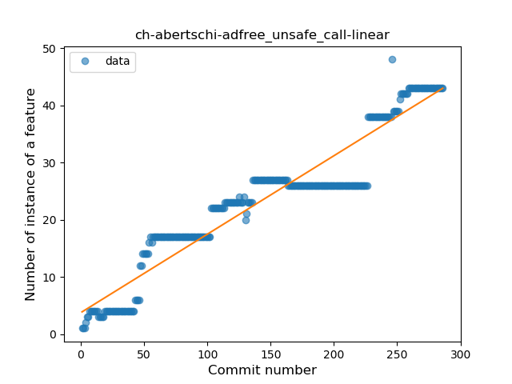

## ch-abertschi-adfree
----
#### Metrics provided by Detekt
* Number of lines of code 3419
* Number of Kotlin files: 55
* Cyclomatic complexity: 385
* Cyclomatic complexity by thousands of lines: 264 

----
**13** features analyzed

*	<a href="#type_inference">Type Inference</a> 
*	<a href="#lambda">Lambda</a> 
*	<a href="#safe_call">Safe Call</a> 
*	<a href="#when_expr">When expression</a> 
*	<a href="#unsafe_call">Unsafe Call</a> 
*	<a href="#companion_object">Companion Object</a> 
*	<a href="#string_template">String Template</a> 
*	<a href="#func_with_default_value">Function with Default Value</a> 
*	<a href="#singleton">Singleton</a> 
*	<a href="#data_class">Data Class</a> 
*	<a href="#func_call_with_named_arg">Function call with Named Argument</a> 
*	<a href="#property_delegation">Property Delegation</a> 
*	<a href="#destructuring_declaration">Destructuring Declaration</a> 

### <a name="type_inference">Type Inference</a>
----
#### Functions
* **Constant Rise - Linear:** 
    * **R_Squared:** 0.94176664
* **Sudden Rise Plateau - Logarithm:** 
    * **R_Squared:** 0.5866092
* **Plateau Sudden Rise - Binary Sigmoid:** 
    * **R_Squared:** 0.50070846

**Plots** :chart_with_upwards_trend:
-----

### <a name="lambda">Lambda</a>
----
#### Functions
* **Constant Rise - Linear:** 
    * **R_Squared:** 0.8749716
* **Plateau Sudden Rise - Binary Sigmoid:** 
    * **R_Squared:** 0.61032164
* **Sudden Rise Plateau - Logarithm:** 
    * **R_Squared:** 0.56366389

**Plots** :chart_with_upwards_trend:
-----

### <a name="safe_call">Safe Call</a>
----
#### Functions
* **Constant Rise - Linear:** 
    * **R_Squared:** 0.91047261
* **Sudden Rise Plateau - Logarithm:** 
    * **R_Squared:** 0.62291013
* **Plateau Gradual Rise - Sigmoid:** 
    * **R_Squared:** 0.62667636

**Plots** :chart_with_upwards_trend:
-----

### <a name="when_expr">When expression</a>
----
#### Functions
* **Plateau Sudden Rise - Binary Sigmoid:** 
    * **R_Squared:** 0.9915175
* **Constant Rise - Linear:** 
    * **R_Squared:** 0.71961038
* **Sudden Rise Plateau - Logarithm:** 
    * **R_Squared:** 0.51485997

**Plots** :chart_with_upwards_trend:
-----

### <a name="unsafe_call">Unsafe Call</a>
----
#### Functions
* **Constant Rise - Linear:** 
    * **R_Squared:** 0.90944011
* **Sudden Rise Plateau - Logarithm:** 
    * **R_Squared:** 0.55537708
* **Plateau Sudden Rise - Binary Sigmoid:** 
    * **R_Squared:** 0.48114862

**Plots** :chart_with_upwards_trend:
-----

### <a name="companion_object">Companion Object</a>
----
#### Functions
* **Plateau Sudden Rise - Binary Sigmoid:** 
    * **R_Squared:** 0.38613012
* **Sudden Rise Plateau - Logarithm:** 
    * **R_Squared:** 0.10315375
* **Constant Rise - Linear:** 
    * **R_Squared:** 0.00055779
* **Sudden Rise - Exponential:** 
    * **R_Squared:** 0.00054227

**Plots** :chart_with_upwards_trend:
-----

### <a name="string_template">String Template</a>
----
#### Functions
* **Plateau Gradual Rise - Sigmoid:** 
    * **R_Squared:** 0.919938
* **Sudden Rise - Exponential:** 
    * **R_Squared:** 0.85018033
* **Constant Rise - Linear:** 
    * **R_Squared:** 0.68959555
* **Sudden Rise Plateau - Logarithm:** 
    * **R_Squared:** 0.36117364

**Plots** :chart_with_upwards_trend:
-----

### <a name="func_with_default_value">Function with Default Value</a>
----
#### Functions
* **Plateau Gradual Rise - Sigmoid:** 
    * **R_Squared:** 0.90699279
* **Constant Rise - Linear:** 
    * **R_Squared:** 0.78600053
* **Sudden Rise Plateau - Logarithm:** 
    * **R_Squared:** 0.60985297

**Plots** :chart_with_upwards_trend:
-----

### <a name="singleton">Singleton</a>
----
#### Functions
* **Constant Decline - Linear:** 
    * **R_Squared:** 0.14022489
* **Plateau Gradual Rise - Sigmoid:** 
    * **R_Squared:** 0.05697989
* **Sudden Rise Plateau - Logarithm:** 
    * **R_Squared:** 0.0

**Plots** :chart_with_upwards_trend:
-----

### <a name="data_class">Data Class</a>
----
#### Functions
* **Plateau Sudden Rise - Binary Sigmoid:** 
    * **R_Squared:** 0.33145811
* **Sudden Rise Plateau - Logarithm:** 
    * **R_Squared:** 0.02622792
* **Constant Decline - Linear:** 
    * **R_Squared:** 0.00779478

**Plots** :chart_with_upwards_trend:
-----

### <a name="func_call_with_named_arg">Function call with Named Argument</a>
----
#### Functions
* **Plateau Sudden Rise - Binary Sigmoid:** 
    * **R_Squared:** 0.96551476
* **Constant Rise - Linear:** 
    * **R_Squared:** 0.65883197
* **Sudden Rise Plateau - Logarithm:** 
    * **R_Squared:** 0.52656701

**Plots** :chart_with_upwards_trend:
-----

### <a name="property_delegation">Property Delegation</a>
----
#### Functions
* **Constant Decline - Linear:** 
    * **R_Squared:** 0.14022489
* **Plateau Gradual Rise - Sigmoid:** 
    * **R_Squared:** 0.05697989
* **Sudden Rise Plateau - Logarithm:** 
    * **R_Squared:** 0.0

**Plots** :chart_with_upwards_trend:
-----

### <a name="destructuring_declaration">Destructuring Declaration</a>
----
#### Functions
* **Plateau Sudden Rise - Binary Sigmoid:** 
    * **R_Squared:** 1.0
* **Sudden Rise - Exponential:** 
    * **R_Squared:** 0.78529827
* **Constant Rise - Linear:** 
    * **R_Squared:** 0.40828834
* **Sudden Rise Plateau - Logarithm:** 
    * **R_Squared:** 0.17169452

**Plots** :chart_with_upwards_trend:
-----

