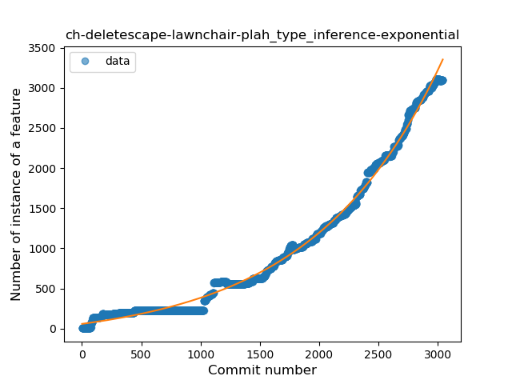
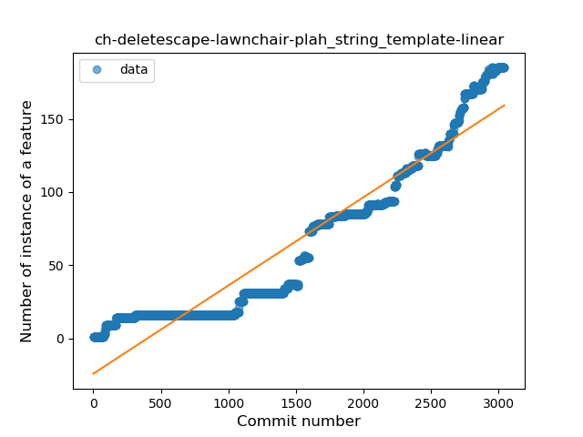
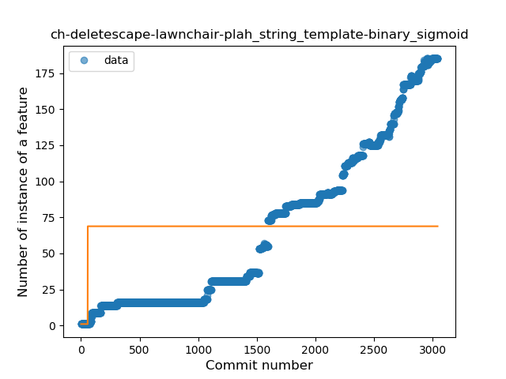
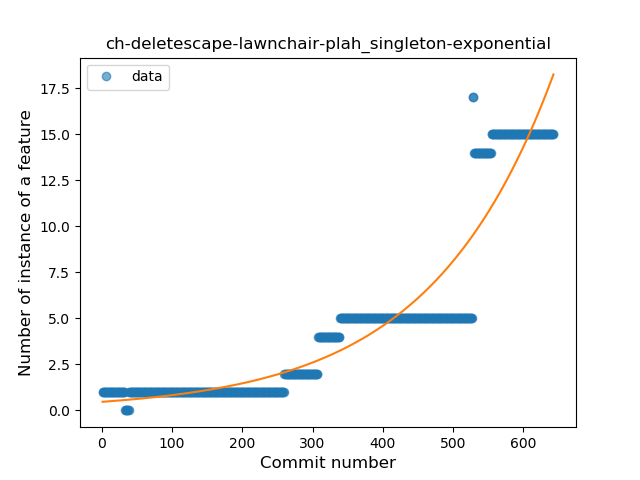
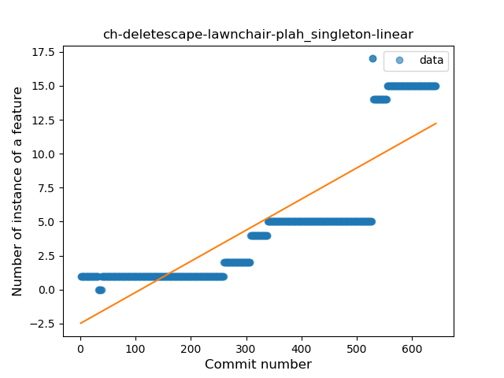
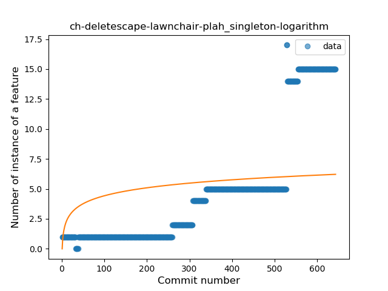
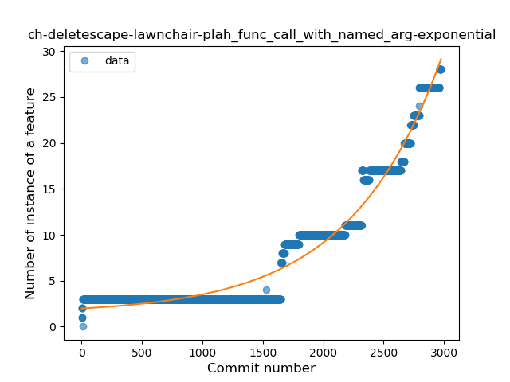
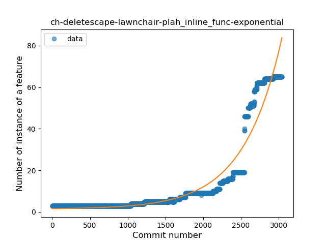
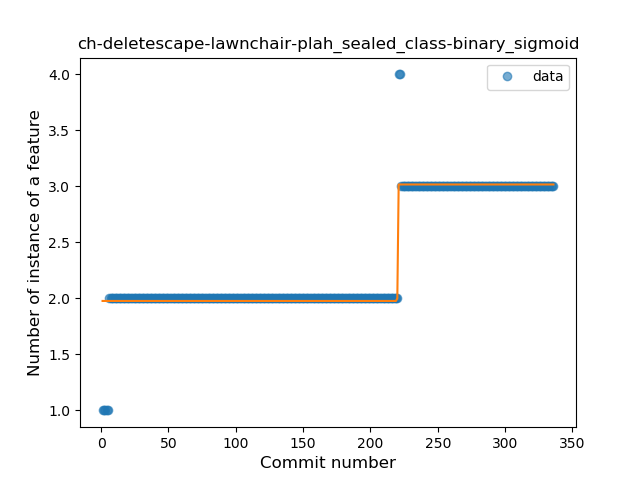

## ch-deletescape-lawnchair-plah
----
#### Metrics provided by Detekt
* Number of lines of code 38054
* Number of Kotlin files: 351
* Cyclomatic complexity: 5400
* Cyclomatic complexity by thousands of lines: 310 

----
**22** features analyzed

*	<a href="#type_inference">Type Inference</a> 
*	<a href="#lambda">Lambda</a> 
*	<a href="#safe_call">Safe Call</a> 
*	<a href="#when_expr">When expression</a> 
*	<a href="#unsafe_call">Unsafe Call</a> 
*	<a href="#companion_object">Companion Object</a> 
*	<a href="#string_template">String Template</a> 
*	<a href="#func_with_default_value">Function with Default Value</a> 
*	<a href="#singleton">Singleton</a> 
*	<a href="#range_expr">Range Expression</a> 
*	<a href="#smart_cast">Smart Cast</a> 
*	<a href="#data_class">Data Class</a> 
*	<a href="#func_call_with_named_arg">Function call with Named Argument</a> 
*	<a href="#extension_function">Extension Function</a> 
*	<a href="#property_delegation">Property Delegation</a> 
*	<a href="#destructuring_declaration">Destructuring Declaration</a> 
*	<a href="#inline_func">Inline Function</a> 
*	<a href="#overloaded_op">Overloaded Operator</a> 
*	<a href="#sealed_class">Sealed Class</a> 
*	<a href="#type_alias">Type Alias</a> 
*	<a href="#super_delegation">Super Delegation</a> 
*	<a href="#infix_func">Infix Function</a> 

### <a name="type_inference">Type Inference</a>
----
#### Functions
* **Sudden Rise - Exponential:** 
    * **R_Squared:** 0.99474562
* **Constant Rise - Linear:** 
    * **R_Squared:** 0.88257745
* **Sudden Rise Plateau - Logarithm:** 
    * **R_Squared:** 0.20864078
* **Plateau Sudden Rise - Binary Sigmoid:** 
    * **R_Squared:** 0.03889485

**Plots** :chart_with_upwards_trend:
-----

### <a name="lambda">Lambda</a>
----
#### Functions
* **Sudden Rise - Exponential:** 
    * **R_Squared:** 0.99137449
* **Constant Rise - Linear:** 
    * **R_Squared:** 0.84353709
* **Sudden Rise Plateau - Logarithm:** 
    * **R_Squared:** 0.19838293
* **Plateau Sudden Rise - Binary Sigmoid:** 
    * **R_Squared:** 0.08440468

**Plots** :chart_with_upwards_trend:
-----

### <a name="safe_call">Safe Call</a>
----
#### Functions
* **Sudden Rise - Exponential:** 
    * **R_Squared:** 0.98975327
* **Constant Rise - Linear:** 
    * **R_Squared:** 0.86113527
* **Sudden Rise Plateau - Logarithm:** 
    * **R_Squared:** 0.19991444
* **Plateau Sudden Rise - Binary Sigmoid:** 
    * **R_Squared:** 0.05889579

**Plots** :chart_with_upwards_trend:
-----

### <a name="when_expr">When expression</a>
----
#### Functions
* **Sudden Rise - Exponential:** 
    * **R_Squared:** 0.98715455
* **Constant Rise - Linear:** 
    * **R_Squared:** 0.79750609
* **Sudden Rise Plateau - Logarithm:** 
    * **R_Squared:** 0.17170401

**Plots** :chart_with_upwards_trend:
-----

### <a name="unsafe_call">Unsafe Call</a>
----
#### Functions
* **Sudden Rise - Exponential:** 
    * **R_Squared:** 0.95649634
* **Constant Rise - Linear:** 
    * **R_Squared:** 0.9235384
* **Sudden Rise Plateau - Logarithm:** 
    * **R_Squared:** 0.22488942
* **Plateau Sudden Rise - Binary Sigmoid:** 
    * **R_Squared:** 0.04170339

**Plots** :chart_with_upwards_trend:
-----

### <a name="companion_object">Companion Object</a>
----
#### Functions
* **Sudden Rise - Exponential:** 
    * **R_Squared:** 0.9919612
* **Constant Rise - Linear:** 
    * **R_Squared:** 0.79404129
* **Sudden Rise Plateau - Logarithm:** 
    * **R_Squared:** 0.16010987

**Plots** :chart_with_upwards_trend:
-----

### <a name="string_template">String Template</a>
----
#### Functions
* **Sudden Rise - Exponential:** 
    * **R_Squared:** 0.97954871
* **Constant Rise - Linear:** 
    * **R_Squared:** 0.91196763
* **Sudden Rise Plateau - Logarithm:** 
    * **R_Squared:** 0.2296368
* **Plateau Sudden Rise - Binary Sigmoid:** 
    * **R_Squared:** 0.0274693

**Plots** :chart_with_upwards_trend:
-----

### <a name="func_with_default_value">Function with Default Value</a>
----
#### Functions
* **Sudden Rise - Exponential:** 
    * **R_Squared:** 0.98092083
* **Constant Rise - Linear:** 
    * **R_Squared:** 0.87714706
* **Sudden Rise Plateau - Logarithm:** 
    * **R_Squared:** 0.21031207

**Plots** :chart_with_upwards_trend:
-----

### <a name="singleton">Singleton</a>
----
#### Functions
* **Sudden Rise - Exponential:** 
    * **R_Squared:** 0.89244905
* **Plateau Gradual Rise - Sigmoid:** 
    * **R_Squared:** 0.89773948
* **Constant Rise - Linear:** 
    * **R_Squared:** 0.73174633
* **Sudden Rise Plateau - Logarithm:** 
    * **R_Squared:** 0.19273581

**Plots** :chart_with_upwards_trend:
-----

### <a name="range_expr">Range Expression</a>
----
#### Functions
* **Sudden Rise - Exponential:** 
    * **R_Squared:** 0.98748336
* **Constant Rise - Linear:** 
    * **R_Squared:** 0.75751287
* **Sudden Rise Plateau - Logarithm:** 
    * **R_Squared:** 0.14298357

**Plots** :chart_with_upwards_trend:
-----

### <a name="smart_cast">Smart Cast</a>
----
#### Functions
* **Sudden Rise - Exponential:** 
    * **R_Squared:** 0.98408052
* **Constant Rise - Linear:** 
    * **R_Squared:** 0.95771918
* **Sudden Rise Plateau - Logarithm:** 
    * **R_Squared:** 0.34293562

**Plots** :chart_with_upwards_trend:
-----

### <a name="data_class">Data Class</a>
----
#### Functions
* **Sudden Rise - Exponential:** 
    * **R_Squared:** 0.89113666
* **Constant Rise - Linear:** 
    * **R_Squared:** 0.73010225
* **Sudden Rise Plateau - Logarithm:** 
    * **R_Squared:** 0.16929739

**Plots** :chart_with_upwards_trend:
-----

### <a name="func_call_with_named_arg">Function call with Named Argument</a>
----
#### Functions
* **Sudden Rise - Exponential:** 
    * **R_Squared:** 0.96193269
* **Constant Rise - Linear:** 
    * **R_Squared:** 0.76217869
* **Sudden Rise Plateau - Logarithm:** 
    * **R_Squared:** 0.17880223

**Plots** :chart_with_upwards_trend:
-----

### <a name="extension_function">Extension Function</a>
----
#### Functions
* **Sudden Rise - Exponential:** 
    * **R_Squared:** 0.96841939
* **Constant Rise - Linear:** 
    * **R_Squared:** 0.87340847
* **Sudden Rise Plateau - Logarithm:** 
    * **R_Squared:** 0.25462124
* **Plateau Sudden Rise - Binary Sigmoid:** 
    * **R_Squared:** 0.01187505

**Plots** :chart_with_upwards_trend:
-----

### <a name="property_delegation">Property Delegation</a>
----
#### Functions
* **Sudden Rise - Exponential:** 
    * **R_Squared:** 0.98664912
* **Constant Rise - Linear:** 
    * **R_Squared:** 0.92711891
* **Sudden Rise Plateau - Logarithm:** 
    * **R_Squared:** 0.29574389
* **Plateau Sudden Rise - Binary Sigmoid:** 
    * **R_Squared:** 0.07301984

**Plots** :chart_with_upwards_trend:
-----

### <a name="destructuring_declaration">Destructuring Declaration</a>
----
#### Functions
* **Plateau Sudden Decline - Binary Sigmoid:** 
    * **R_Squared:** 0.83798963
* **Constant Decline - Linear:** 
    * **R_Squared:** 0.47451589
* **Sudden Decline - Exponential:** 
    * **R_Squared:** 0.47541933
* **Sudden Rise Plateau - Logarithm:** 
    * **R_Squared:** -0.0

**Plots** :chart_with_upwards_trend:
-----

### <a name="inline_func">Inline Function</a>
----
#### Functions
* **Sudden Rise - Exponential:** 
    * **R_Squared:** 0.92610897
* **Constant Rise - Linear:** 
    * **R_Squared:** 0.58829488
* **Sudden Rise Plateau - Logarithm:** 
    * **R_Squared:** 0.10055225

**Plots** :chart_with_upwards_trend:
-----

### <a name="overloaded_op">Overloaded Operator</a>
----
#### Functions
* **Sudden Rise - Exponential:** 
    * **R_Squared:** 0.92073242
* **Constant Rise - Linear:** 
    * **R_Squared:** 0.79425233
* **Sudden Rise Plateau - Logarithm:** 
    * **R_Squared:** 0.37904534

**Plots** :chart_with_upwards_trend:
-----

### <a name="sealed_class">Sealed Class</a>
----
#### Functions
* **Plateau Sudden Rise - Binary Sigmoid:** 
    * **R_Squared:** 0.92301583
* **Sudden Rise - Exponential:** 
    * **R_Squared:** 0.71075947
* **Constant Rise - Linear:** 
    * **R_Squared:** 0.66653155
* **Sudden Rise Plateau - Logarithm:** 
    * **R_Squared:** 0.45335073

**Plots** :chart_with_upwards_trend:
-----

### <a name="type_alias">Type Alias</a>
----
#### Functions
* **Plateau Sudden Rise - Binary Sigmoid:** 
    * **R_Squared:** 1.0
* **Sudden Rise Plateau - Logarithm:** 
    * **R_Squared:** 0.61132306
* **Constant Rise - Linear:** 
    * **R_Squared:** 0.30104158

**Plots** :chart_with_upwards_trend:
-----

### <a name="super_delegation">Super Delegation</a>
----
#### Functions
* **Constant Rise - Linear:** 
    * **R_Squared:** 0.92965477
* **Sudden Rise Plateau - Logarithm:** 
    * **R_Squared:** 0.72078015

**Plots** :chart_with_upwards_trend:
-----

### <a name="infix_func">Infix Function</a>
----
#### Functions
* **Plateau Gradual Rise - Sigmoid:** 
    * **R_Squared:** 0.97902793
* **Sudden Rise Plateau - Logarithm:** 
    * **R_Squared:** 0.69834872
* **Constant Rise - Linear:** 
    * **R_Squared:** 0.67517134

**Plots** :chart_with_upwards_trend:
-----

