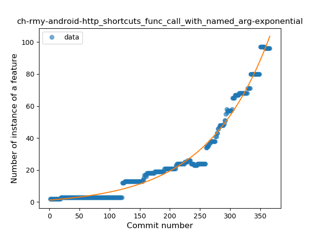
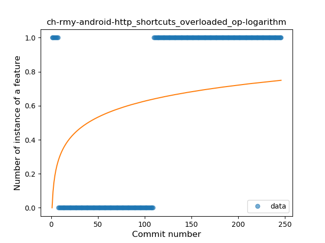

## ch-rmy-android-http_shortcuts
----
#### Metrics provided by Detekt
* Number of lines of code 16068
* Number of Kotlin files: 237
* Cyclomatic complexity: 1872
* Cyclomatic complexity by thousands of lines: 203 

----
**19** features analyzed

*	<a href="#type_inference">Type Inference</a> 
*	<a href="#lambda">Lambda</a> 
*	<a href="#safe_call">Safe Call</a> 
*	<a href="#when_expr">When expression</a> 
*	<a href="#unsafe_call">Unsafe Call</a> 
*	<a href="#companion_object">Companion Object</a> 
*	<a href="#string_template">String Template</a> 
*	<a href="#func_with_default_value">Function with Default Value</a> 
*	<a href="#singleton">Singleton</a> 
*	<a href="#range_expr">Range Expression</a> 
*	<a href="#smart_cast">Smart Cast</a> 
*	<a href="#data_class">Data Class</a> 
*	<a href="#func_call_with_named_arg">Function call with Named Argument</a> 
*	<a href="#extension_function">Extension Function</a> 
*	<a href="#property_delegation">Property Delegation</a> 
*	<a href="#destructuring_declaration">Destructuring Declaration</a> 
*	<a href="#inline_func">Inline Function</a> 
*	<a href="#overloaded_op">Overloaded Operator</a> 
*	<a href="#type_alias">Type Alias</a> 

### <a name="type_inference">Type Inference</a>
----
#### Functions
* **Constant Rise - Linear:** 
    * **R_Squared:** 0.89928367
* **Sudden Rise Plateau - Logarithm:** 
    * **R_Squared:** 0.85683212
* **Plateau Sudden Rise - Binary Sigmoid:** 
    * **R_Squared:** 0.43132188

**Plots** :chart_with_upwards_trend:
-----

### <a name="lambda">Lambda</a>
----
#### Functions
* **Constant Rise - Linear:** 
    * **R_Squared:** 0.97843943
* **Sudden Rise - Exponential:** 
    * **R_Squared:** 0.9838872
* **Plateau Sudden Rise - Binary Sigmoid:** 
    * **R_Squared:** 0.71707425
* **Sudden Rise Plateau - Logarithm:** 
    * **R_Squared:** 0.50058405

**Plots** :chart_with_upwards_trend:
-----

### <a name="safe_call">Safe Call</a>
----
#### Functions
* **Sudden Rise - Exponential:** 
    * **R_Squared:** 0.9859693
* **Constant Rise - Linear:** 
    * **R_Squared:** 0.95659847
* **Plateau Sudden Rise - Binary Sigmoid:** 
    * **R_Squared:** 0.53973278
* **Sudden Rise Plateau - Logarithm:** 
    * **R_Squared:** 0.41339702

**Plots** :chart_with_upwards_trend:
-----

### <a name="when_expr">When expression</a>
----
#### Functions
* **Constant Rise - Linear:** 
    * **R_Squared:** 0.95554809
* **Sudden Rise Plateau - Logarithm:** 
    * **R_Squared:** 0.69091215
* **Plateau Gradual Rise - Sigmoid:** 
    * **R_Squared:** 0.25672101

**Plots** :chart_with_upwards_trend:
-----

### <a name="unsafe_call">Unsafe Call</a>
----
#### Functions
* **Constant Decline - Linear:** 
    * **R_Squared:** 0.2350546
* **Sudden Decline - Exponential:** 
    * **R_Squared:** 0.0
* **Sudden Rise Plateau - Logarithm:** 
    * **R_Squared:** -0.0

**Plots** :chart_with_upwards_trend:
-----

### <a name="companion_object">Companion Object</a>
----
#### Functions
* **Constant Rise - Linear:** 
    * **R_Squared:** 0.9320973
* **Plateau Gradual Rise - Sigmoid:** 
    * **R_Squared:** 0.93266773
* **Sudden Rise Plateau - Logarithm:** 
    * **R_Squared:** 0.6825875

**Plots** :chart_with_upwards_trend:
-----

### <a name="string_template">String Template</a>
----
#### Functions
* **Sudden Rise - Exponential:** 
    * **R_Squared:** 0.9769135
* **Constant Rise - Linear:** 
    * **R_Squared:** 0.91219633
* **Sudden Rise Plateau - Logarithm:** 
    * **R_Squared:** 0.39491717

**Plots** :chart_with_upwards_trend:
-----

### <a name="func_with_default_value">Function with Default Value</a>
----
#### Functions
* **Sudden Rise - Exponential:** 
    * **R_Squared:** 0.96149781
* **Constant Rise - Linear:** 
    * **R_Squared:** 0.93034083
* **Sudden Rise Plateau - Logarithm:** 
    * **R_Squared:** 0.37929432
* **Plateau Sudden Rise - Binary Sigmoid:** 
    * **R_Squared:** 0.15738983

**Plots** :chart_with_upwards_trend:
-----

### <a name="singleton">Singleton</a>
----
#### Functions
* **Sudden Rise - Exponential:** 
    * **R_Squared:** 0.86313595
* **Constant Rise - Linear:** 
    * **R_Squared:** 0.75385196
* **Sudden Rise Plateau - Logarithm:** 
    * **R_Squared:** 0.58911506
* **Plateau Sudden Rise - Binary Sigmoid:** 
    * **R_Squared:** 0.20102034

**Plots** :chart_with_upwards_trend:
-----

### <a name="range_expr">Range Expression</a>
----
#### Functions
* **Constant Decline - Linear:** 
    * **R_Squared:** 0.16056831
* **Sudden Rise Plateau - Logarithm:** 
    * **R_Squared:** -0.0

**Plots** :chart_with_upwards_trend:
-----

### <a name="smart_cast">Smart Cast</a>
----
#### Functions
* **Plateau Gradual Rise - Sigmoid:** 
    * **R_Squared:** 0.96746691
* **Sudden Rise - Exponential:** 
    * **R_Squared:** 0.7798529
* **Constant Rise - Linear:** 
    * **R_Squared:** 0.49141918
* **Sudden Rise Plateau - Logarithm:** 
    * **R_Squared:** 0.22180816

**Plots** :chart_with_upwards_trend:
-----

### <a name="data_class">Data Class</a>
----
#### Functions
* **Plateau Gradual Rise - Sigmoid:** 
    * **R_Squared:** 0.98222489
* **Constant Rise - Linear:** 
    * **R_Squared:** 0.81426568
* **Sudden Rise - Exponential:** 
    * **R_Squared:** 0.82140615
* **Sudden Rise Plateau - Logarithm:** 
    * **R_Squared:** 0.36843996

**Plots** :chart_with_upwards_trend:
-----

### <a name="func_call_with_named_arg">Function call with Named Argument</a>
----
#### Functions
* **Sudden Rise - Exponential:** 
    * **R_Squared:** 0.9822307
* **Constant Rise - Linear:** 
    * **R_Squared:** 0.82512354
* **Sudden Rise Plateau - Logarithm:** 
    * **R_Squared:** 0.2356073
* **Plateau Gradual Rise - Sigmoid:** 
    * **R_Squared:** 0.08116569

**Plots** :chart_with_upwards_trend:
-----

### <a name="extension_function">Extension Function</a>
----
#### Functions
* **Sudden Rise Plateau - Logarithm:** 
    * **R_Squared:** 0.49724524
* **Constant Rise - Linear:** 
    * **R_Squared:** 0.37207612

**Plots** :chart_with_upwards_trend:
-----

### <a name="property_delegation">Property Delegation</a>
----
#### Functions
* **Constant Rise - Linear:** 
    * **R_Squared:** 0.95498744
* **Plateau Sudden Rise - Binary Sigmoid:** 
    * **R_Squared:** 0.7318302
* **Sudden Rise Plateau - Logarithm:** 
    * **R_Squared:** 0.58204523

**Plots** :chart_with_upwards_trend:
-----

### <a name="destructuring_declaration">Destructuring Declaration</a>
----
#### Functions
* **Constant Rise - Linear:** 
    * **R_Squared:** 0.92901216
* **Sudden Rise - Exponential:** 
    * **R_Squared:** 0.92912462
* **Sudden Rise Plateau - Logarithm:** 
    * **R_Squared:** 0.46727244

**Plots** :chart_with_upwards_trend:
-----

### <a name="inline_func">Inline Function</a>
----
#### Functions
* **Plateau Sudden Rise - Binary Sigmoid:** 
    * **R_Squared:** 0.99300121
* **Constant Rise - Linear:** 
    * **R_Squared:** 0.75147357
* **Sudden Rise - Exponential:** 
    * **R_Squared:** 0.75500266
* **Sudden Rise Plateau - Logarithm:** 
    * **R_Squared:** 0.50232318

**Plots** :chart_with_upwards_trend:
-----

### <a name="overloaded_op">Overloaded Operator</a>
----
#### Functions
* **Constant Rise - Linear:** 
    * **R_Squared:** 0.59344791
* **Sudden Rise Plateau - Logarithm:** 
    * **R_Squared:** 0.21784459

**Plots** :chart_with_upwards_trend:
-----

### <a name="type_alias">Type Alias</a>
----
#### Functions
* **Sudden Decline - Exponential:** 
    * **R_Squared:** 0.84280163
* **Constant Decline - Linear:** 
    * **R_Squared:** 0.01999932
* **Sudden Rise Plateau - Logarithm:** 
    * **R_Squared:** -0.0

**Plots** :chart_with_upwards_trend:
-----

