## ch-rmy-android-statusbar_tacho
----
#### Metrics provided by Detekt
* Number of lines of code 1264
* Number of Kotlin files: 27
* Cyclomatic complexity: 142
* Cyclomatic complexity by thousands of lines: 219 

----
**6** features analyzed

*	<a href="#type_inference">Type Inference</a> 
*	<a href="#lambda">Lambda</a> 
*	<a href="#unsafe_call">Unsafe Call</a> 
*	<a href="#singleton">Singleton</a> 
*	<a href="#range_expr">Range Expression</a> 
*	<a href="#smart_cast">Smart Cast</a> 

### <a name="type_inference">Type Inference</a>
----
#### Functions
* **Instability - Polinomial 3:** )
    * **R_Squared:** 0.93398046
* **Sudden Rise Plateau - Logarithm:** 
    * **R_Squared:** 0.86533045
* **Constant Rise - Linear:** 
    * **R_Squared:** 0.61603943

**Plots** :chart_with_upwards_trend:
-----

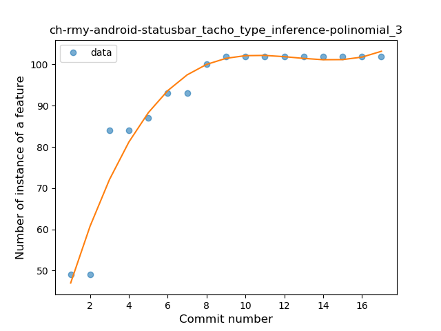
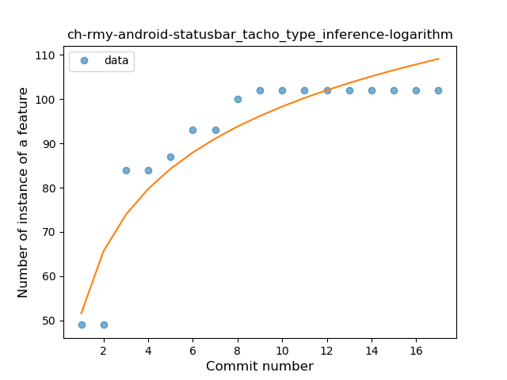
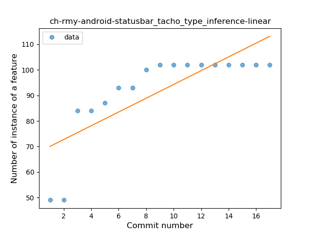
### <a name="lambda">Lambda</a>
----
#### Functions
* **Instability - Polinomial 4:** 
    * **R_Squared:** 0.84210526
* **Sudden Rise Plateau - Logarithm:** 
    * **R_Squared:** 0.71445451
* **Constant Rise - Linear:** 
    * **R_Squared:** 0.54166667

**Plots** :chart_with_upwards_trend:
-----

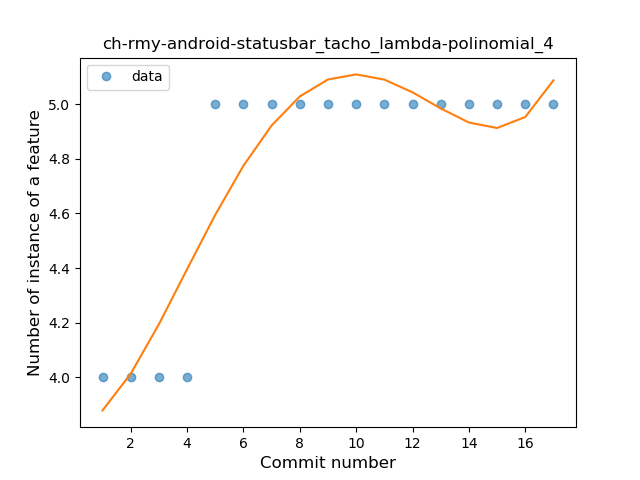
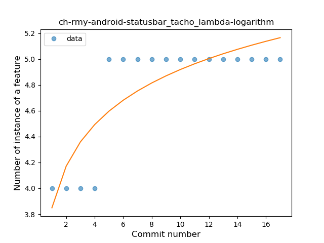
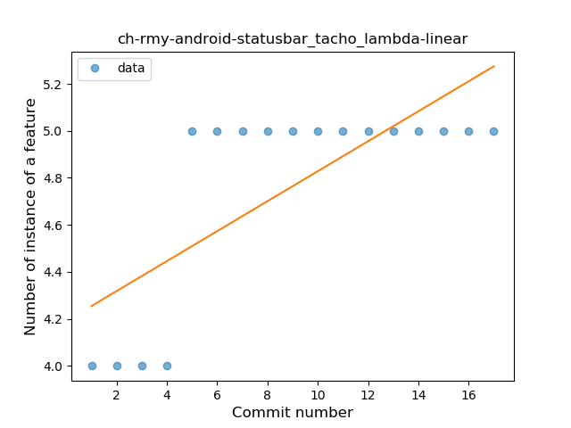
### <a name="unsafe_call">Unsafe Call</a>
----
#### Functions
* **Instability - Polinomial 4:** 
    * **R_Squared:** 0.94968301
* **Sudden Rise Plateau - Logarithm:** 
    * **R_Squared:** 0.90052621
* **Constant Rise - Linear:** 
    * **R_Squared:** 0.69412382

**Plots** :chart_with_upwards_trend:
-----

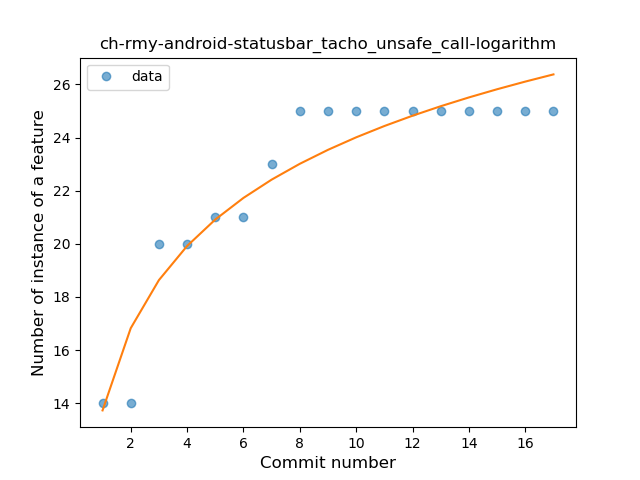
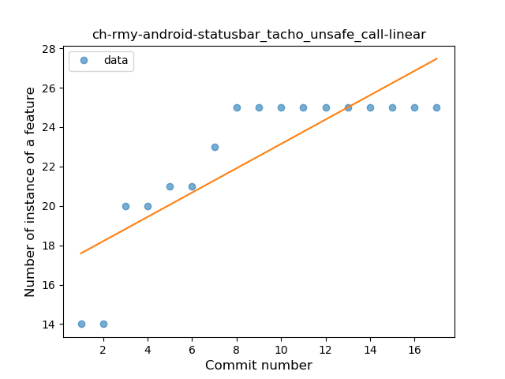
### <a name="singleton">Singleton</a>
----
#### Functions
* **Sudden Rise Plateau - Logarithm:** 
    * **R_Squared:** 0.86019302
* **Constant Rise - Linear:** 
    * **R_Squared:** 0.78532609

**Plots** :chart_with_upwards_trend:
-----

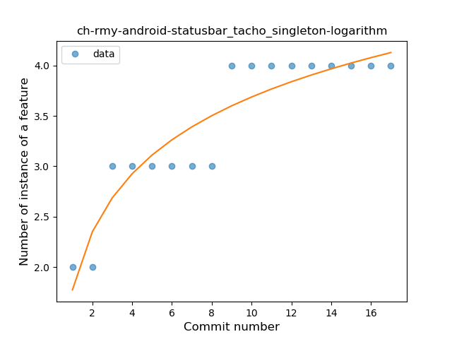
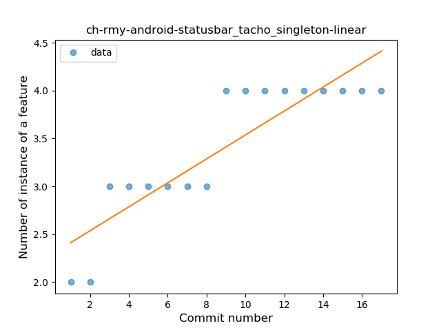
### <a name="range_expr">Range Expression</a>
----
#### Functions
* **Plateau Sudden Rise - Binary Sigmoid:** 
    * **R_Squared:** 1.0
* **Instability - Polinomial 3:** )
    * **R_Squared:** 0.82653254
* **Instability - Polinomial 4:** 
    * **R_Squared:** 0.83221629
* **Sudden Rise Plateau - Logarithm:** 
    * **R_Squared:** 0.69842382
* **Constant Rise - Linear:** 
    * **R_Squared:** 0.48214286

**Plots** :chart_with_upwards_trend:
-----

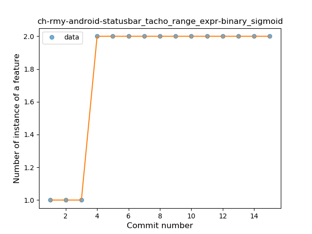
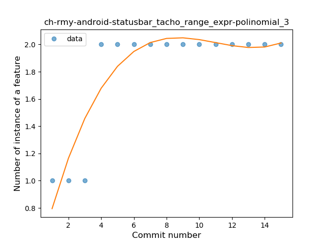
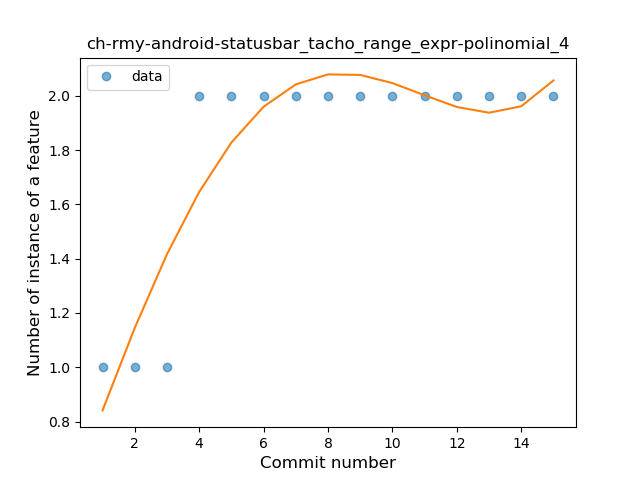
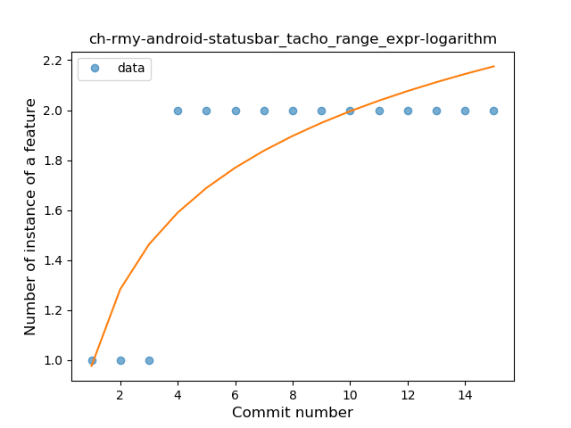
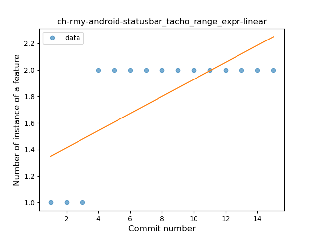
### <a name="smart_cast">Smart Cast</a>
----
#### Functions
* **Plateau Sudden Decline - Binary Sigmoid:** 
    * **R_Squared:** 1.0
* **Instability - Polinomial 4:** 
    * **R_Squared:** 0.85175439
* **Sudden Decline - Exponential:** 
    * **R_Squared:** 0.8258947
* **Instability - Polinomial 3:** )
    * **R_Squared:** 0.8004386
* **Constant Decline - Linear:** 
    * **R_Squared:** 0.3125
* **Sudden Rise Plateau - Logarithm:** 
    * **R_Squared:** -0.0

**Plots** :chart_with_upwards_trend:
-----

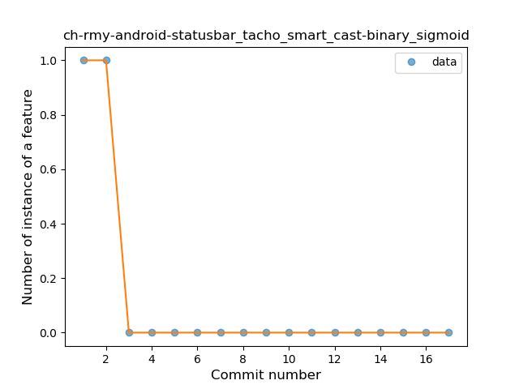
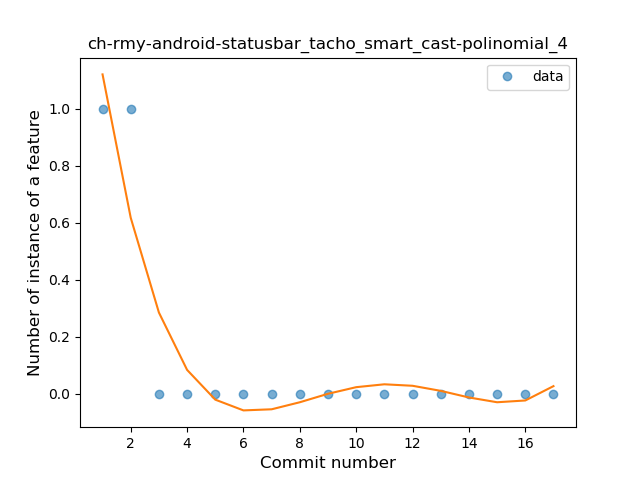
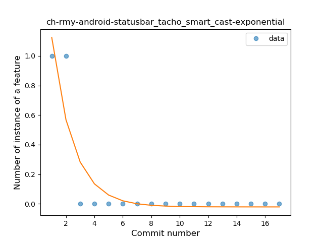
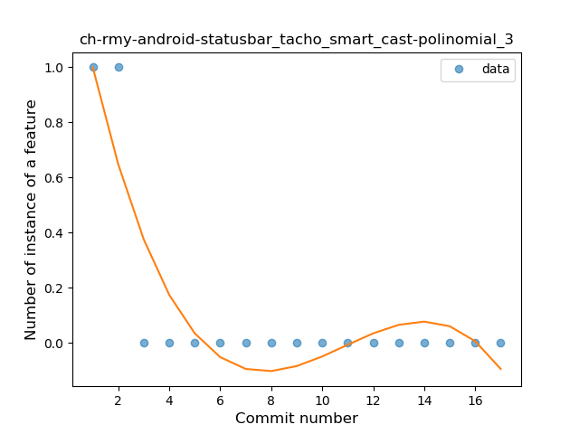
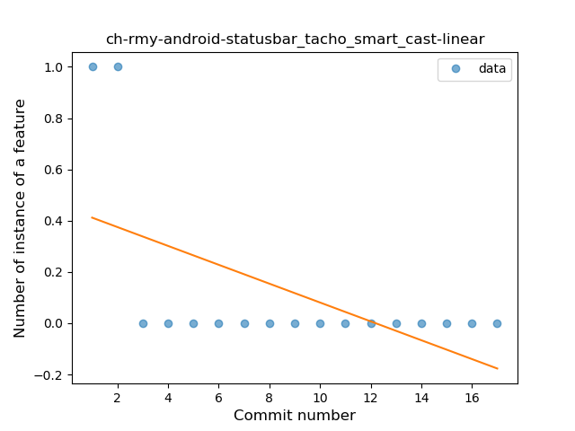
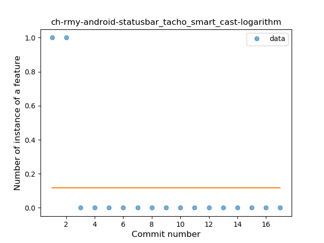
