## charlesmadere-smash-ranks-android
----
#### Metrics provided by Detekt
* Number of lines of code 21087
* Number of Kotlin files: 262
* Cyclomatic complexity: 2373
* Cyclomatic complexity by thousands of lines: 184 

----
**17** features analyzed

*	<a href="#type_inference">Type Inference</a> 
*	<a href="#lambda">Lambda</a> 
*	<a href="#safe_call">Safe Call</a> 
*	<a href="#when_expr">When expression</a> 
*	<a href="#companion_object">Companion Object</a> 
*	<a href="#unsafe_call">Unsafe Call</a> 
*	<a href="#string_template">String Template</a> 
*	<a href="#func_with_default_value">Function with Default Value</a> 
*	<a href="#singleton">Singleton</a> 
*	<a href="#smart_cast">Smart Cast</a> 
*	<a href="#range_expr">Range Expression</a> 
*	<a href="#func_call_with_named_arg">Function call with Named Argument</a> 
*	<a href="#data_class">Data Class</a> 
*	<a href="#extension_function">Extension Function</a> 
*	<a href="#property_delegation">Property Delegation</a> 
*	<a href="#destructuring_declaration">Destructuring Declaration</a> 
*	<a href="#overloaded_op">Overloaded Operator</a> 

### <a name="type_inference">Type Inference</a>
----
#### Functions
* **Plateau Sudden Rise - Binary Sigmoid:** 
    * **R_Squared:** 0.91038706
* **Constant Rise - Linear:** 
    * **R_Squared:** 0.68690117
* **Sudden Rise Plateau - Logarithm:** 
    * **R_Squared:** 0.66391513

**Plots** :chart_with_upwards_trend:
-----

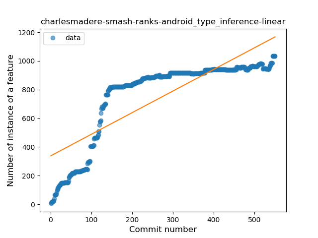
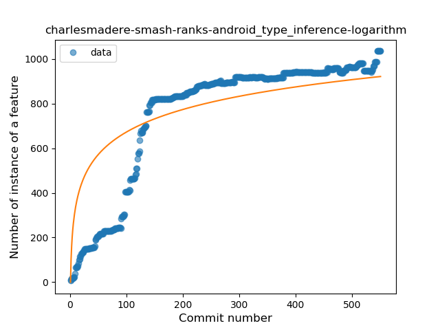
### <a name="lambda">Lambda</a>
----
#### Functions
* **Constant Rise - Linear:** 
    * **R_Squared:** 0.85001654
* **Plateau Sudden Rise - Binary Sigmoid:** 
    * **R_Squared:** 0.76698952
* **Sudden Rise Plateau - Logarithm:** 
    * **R_Squared:** 0.71637009

**Plots** :chart_with_upwards_trend:
-----

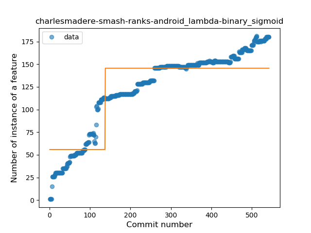
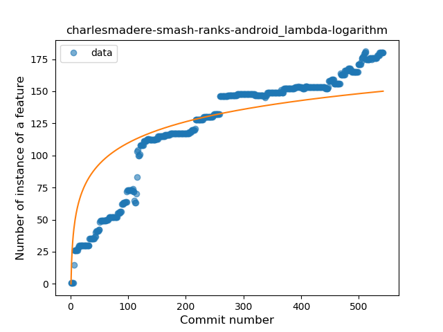
### <a name="safe_call">Safe Call</a>
----
#### Functions
* **Constant Rise - Linear:** 
    * **R_Squared:** 0.67427544
* **Sudden Rise Plateau - Logarithm:** 
    * **R_Squared:** 0.58010639
* **Plateau Sudden Rise - Binary Sigmoid:** 
    * **R_Squared:** 0.40286142

**Plots** :chart_with_upwards_trend:
-----

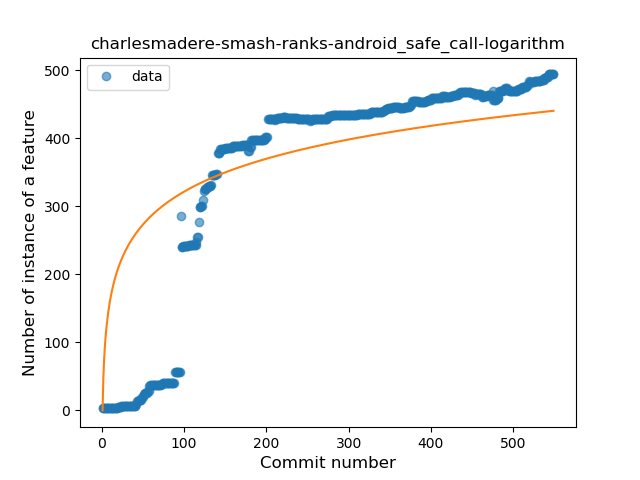
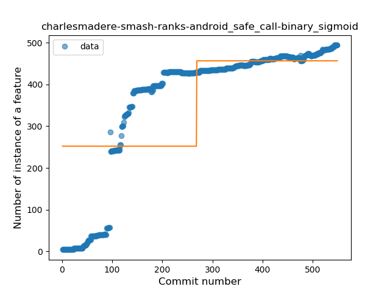
### <a name="when_expr">When expression</a>
----
#### Functions
* **Constant Rise - Linear:** 
    * **R_Squared:** 0.80385167
* **Sudden Rise Plateau - Logarithm:** 
    * **R_Squared:** 0.81016291
* **Plateau Gradual Rise - Sigmoid:** 
    * **R_Squared:** 0.81375327

**Plots** :chart_with_upwards_trend:
-----

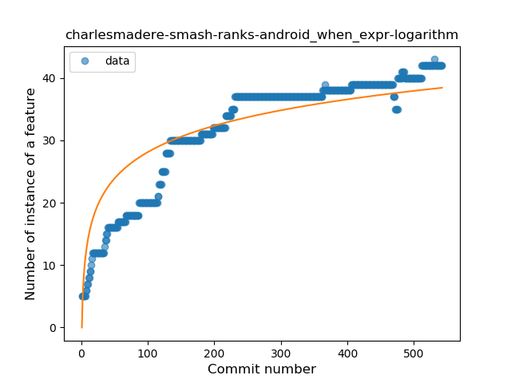
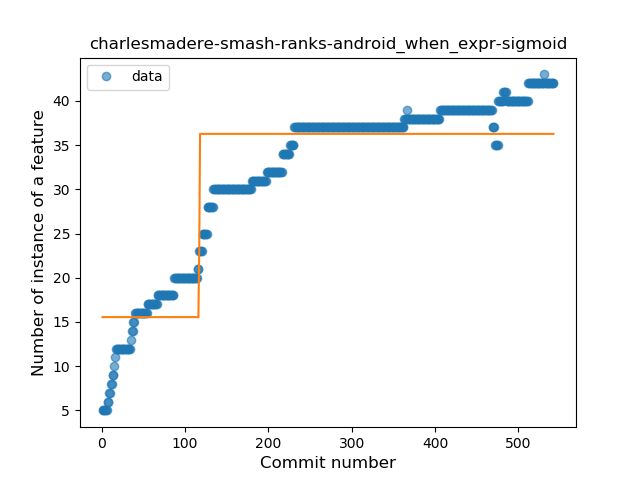
### <a name="companion_object">Companion Object</a>
----
#### Functions
* **Constant Rise - Linear:** 
    * **R_Squared:** 0.70331851
* **Sudden Rise Plateau - Logarithm:** 
    * **R_Squared:** 0.67326866
* **Plateau Sudden Rise - Binary Sigmoid:** 
    * **R_Squared:** 0.58843425

**Plots** :chart_with_upwards_trend:
-----

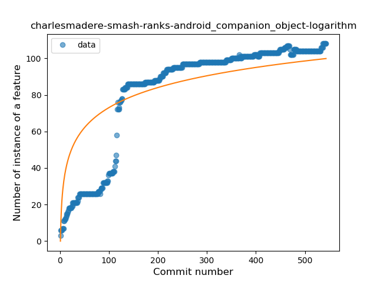
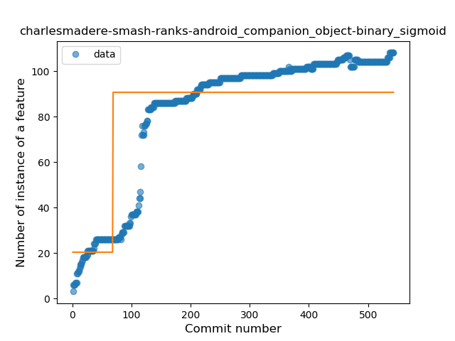
### <a name="unsafe_call">Unsafe Call</a>
----
#### Functions
* **Sudden Decline - Exponential:** 
    * **R_Squared:** 0.56990942
* **Constant Decline - Linear:** 
    * **R_Squared:** 0.39937269
* **Sudden Rise Plateau - Logarithm:** 
    * **R_Squared:** -0.0

**Plots** :chart_with_upwards_trend:
-----

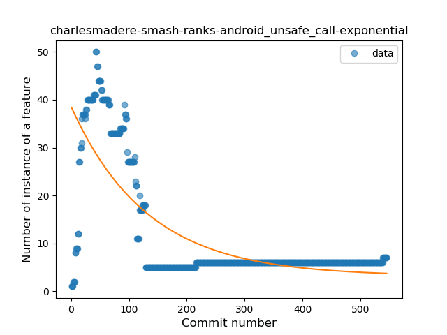
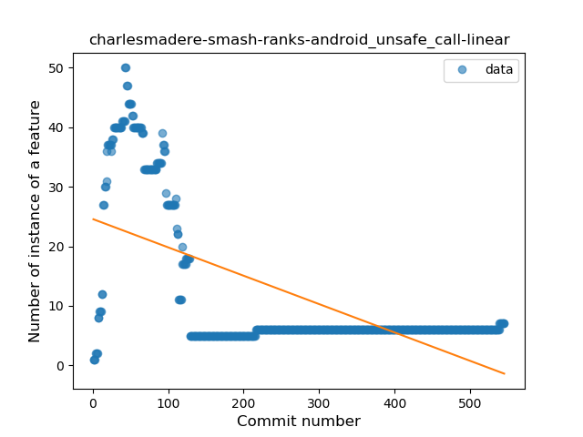
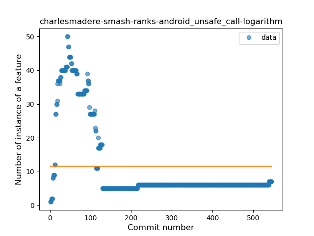
### <a name="string_template">String Template</a>
----
#### Functions
* **Constant Rise - Linear:** 
    * **R_Squared:** 0.86996774
* **Sudden Rise Plateau - Logarithm:** 
    * **R_Squared:** 0.5382501

**Plots** :chart_with_upwards_trend:
-----

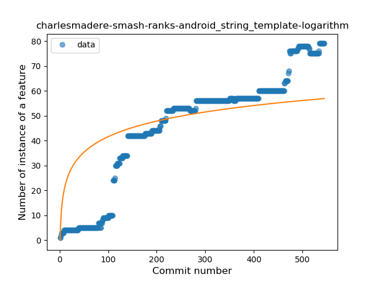
### <a name="func_with_default_value">Function with Default Value</a>
----
#### Functions
* **Sudden Rise - Exponential:** 
    * **R_Squared:** 0.94060179
* **Constant Rise - Linear:** 
    * **R_Squared:** 0.90206907
* **Sudden Rise Plateau - Logarithm:** 
    * **R_Squared:** 0.34890661
* **Plateau Gradual Rise - Sigmoid:** 
    * **R_Squared:** 0.11126966

**Plots** :chart_with_upwards_trend:
-----

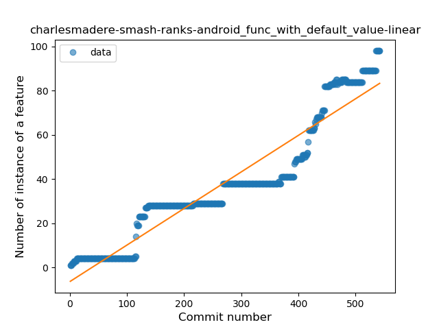
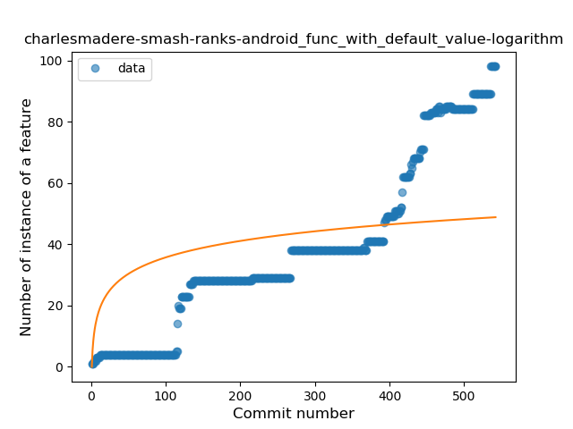
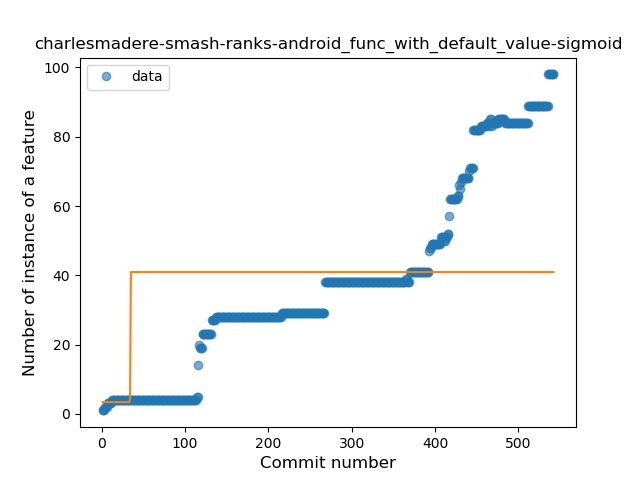
### <a name="singleton">Singleton</a>
----
#### Functions
* **Plateau Gradual Rise - Sigmoid:** 
    * **R_Squared:** 0.92742178
* **Sudden Rise Plateau - Logarithm:** 
    * **R_Squared:** 0.64353843
* **Constant Rise - Linear:** 
    * **R_Squared:** 0.54040675

**Plots** :chart_with_upwards_trend:
-----

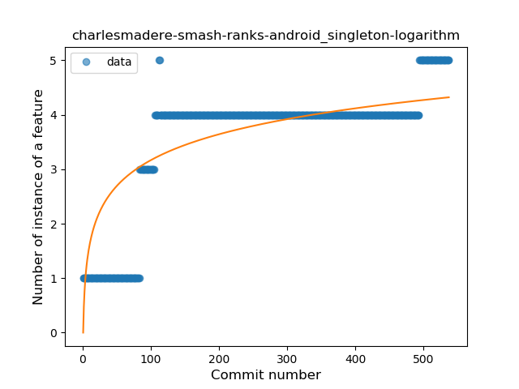
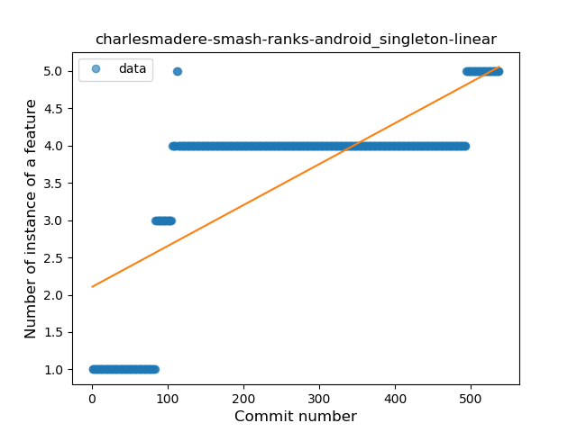
### <a name="smart_cast">Smart Cast</a>
----
#### Functions
* **Sudden Rise Plateau - Logarithm:** 
    * **R_Squared:** 0.59472974
* **Plateau Sudden Rise - Binary Sigmoid:** 
    * **R_Squared:** 0.5986675
* **Constant Rise - Linear:** 
    * **R_Squared:** 0.55754107

**Plots** :chart_with_upwards_trend:
-----

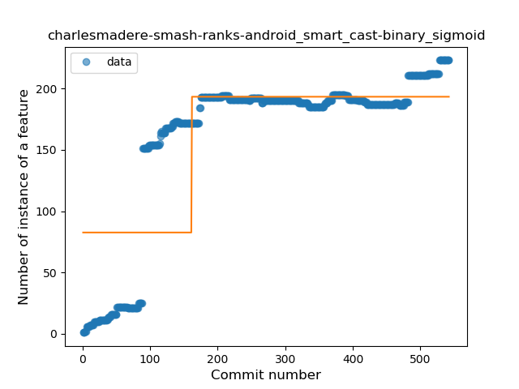
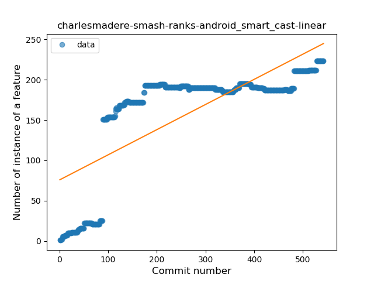
### <a name="range_expr">Range Expression</a>
----
#### Functions
* **Plateau Gradual Rise - Sigmoid:** 
    * **R_Squared:** 0.93204268
* **Sudden Rise Plateau - Logarithm:** 
    * **R_Squared:** 0.67743887
* **Constant Rise - Linear:** 
    * **R_Squared:** 0.44384236

**Plots** :chart_with_upwards_trend:
-----

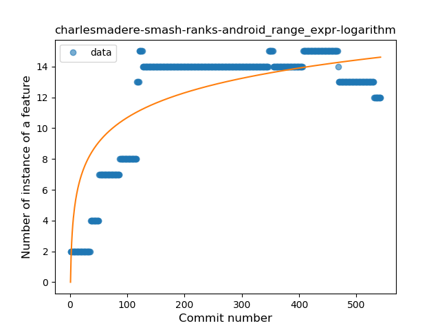
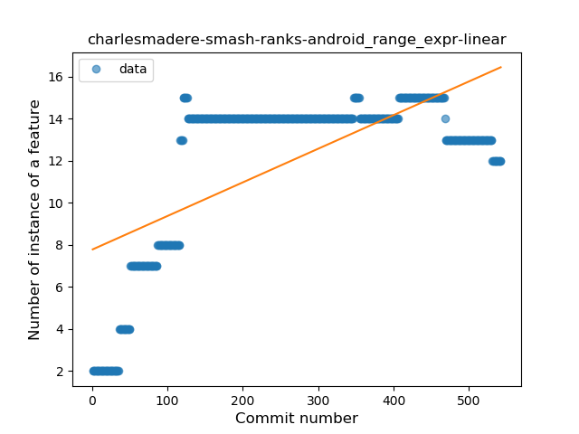
### <a name="func_call_with_named_arg">Function call with Named Argument</a>
----
#### Functions
* **Constant Rise - Linear:** 
    * **R_Squared:** 0.79192227
* **Sudden Rise Plateau - Logarithm:** 
    * **R_Squared:** 0.71658441

**Plots** :chart_with_upwards_trend:
-----

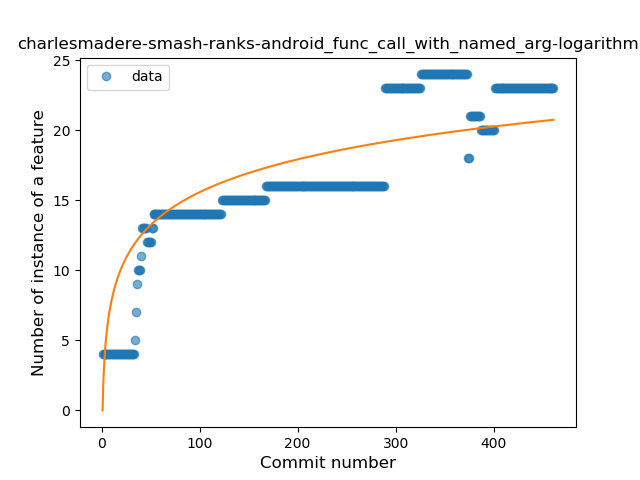
### <a name="data_class">Data Class</a>
----
#### Functions
* **Constant Rise - Linear:** 
    * **R_Squared:** 0.85642436
* **Sudden Rise Plateau - Logarithm:** 
    * **R_Squared:** 0.64206029

**Plots** :chart_with_upwards_trend:
-----

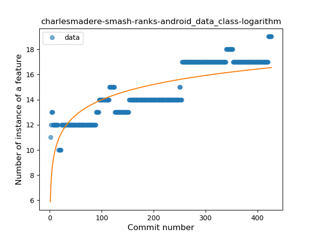
### <a name="extension_function">Extension Function</a>
----
#### Functions
* **Sudden Rise Plateau - Logarithm:** 
    * **R_Squared:** 0.82904896
* **Constant Rise - Linear:** 
    * **R_Squared:** 0.79920059

**Plots** :chart_with_upwards_trend:
-----

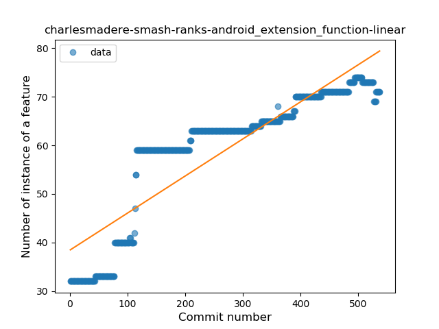
### <a name="property_delegation">Property Delegation</a>
----
#### Functions
* **Sudden Rise Plateau - Logarithm:** 
    * **R_Squared:** 0.88835875
* **Constant Rise - Linear:** 
    * **R_Squared:** 0.79986026
* **Plateau Sudden Rise - Binary Sigmoid:** 
    * **R_Squared:** 0.41506517

**Plots** :chart_with_upwards_trend:
-----

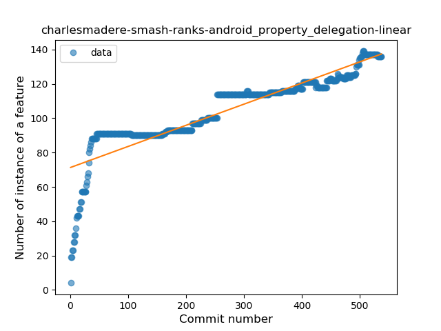
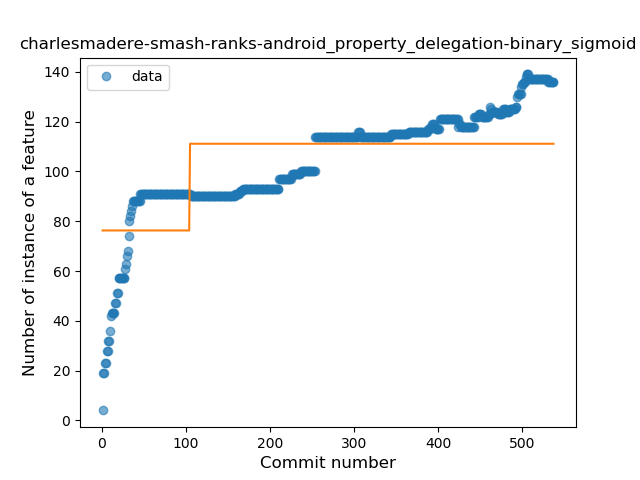
### <a name="destructuring_declaration">Destructuring Declaration</a>
----
#### Functions
* **Plateau Gradual Rise - Sigmoid:** 
    * **R_Squared:** 0.86596425
* **Sudden Rise Plateau - Logarithm:** 
    * **R_Squared:** 0.79699314
* **Constant Rise - Linear:** 
    * **R_Squared:** 0.57497729

**Plots** :chart_with_upwards_trend:
-----

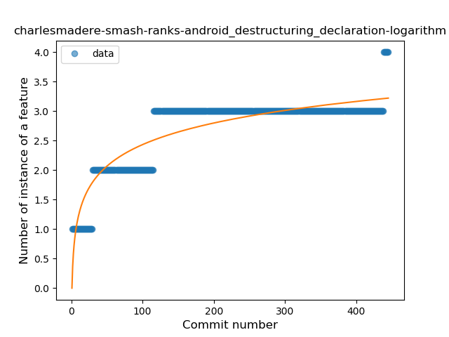
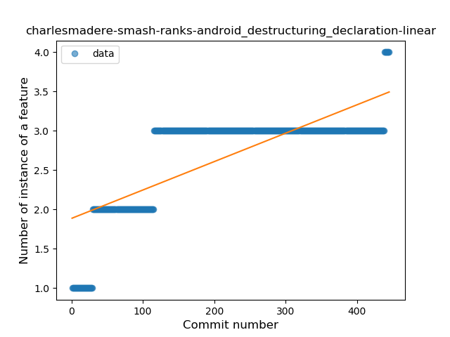
### <a name="overloaded_op">Overloaded Operator</a>
----
#### Functions
* **Plateau Sudden Rise - Binary Sigmoid:** 
    * **R_Squared:** 0.31068624
* **Sudden Decline - Exponential:** 
    * **R_Squared:** 0.04502351
* **Constant Decline - Linear:** 
    * **R_Squared:** 0.02573916
* **Sudden Rise Plateau - Logarithm:** 
    * **R_Squared:** -0.0

**Plots** :chart_with_upwards_trend:
-----

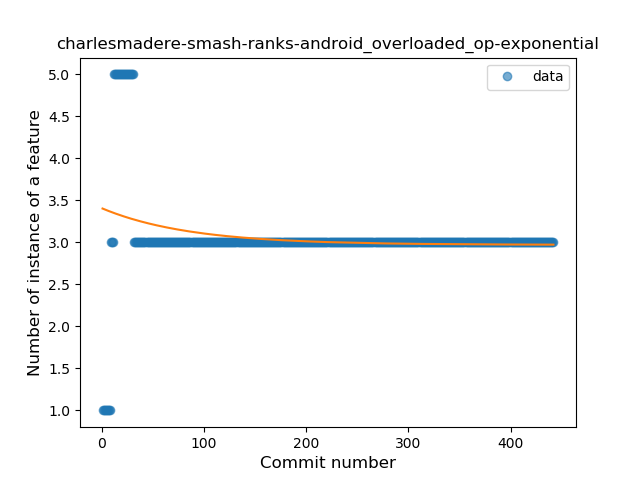
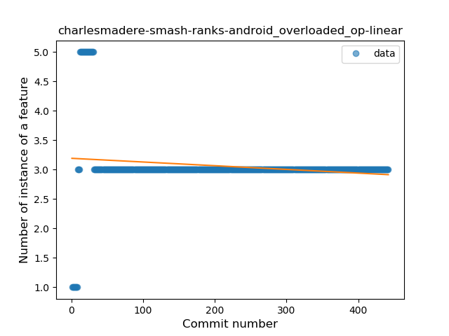
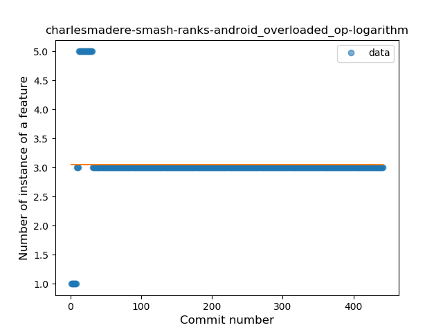
