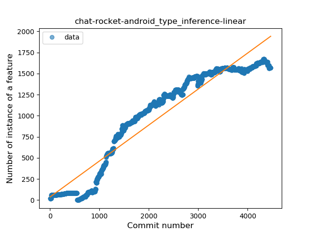
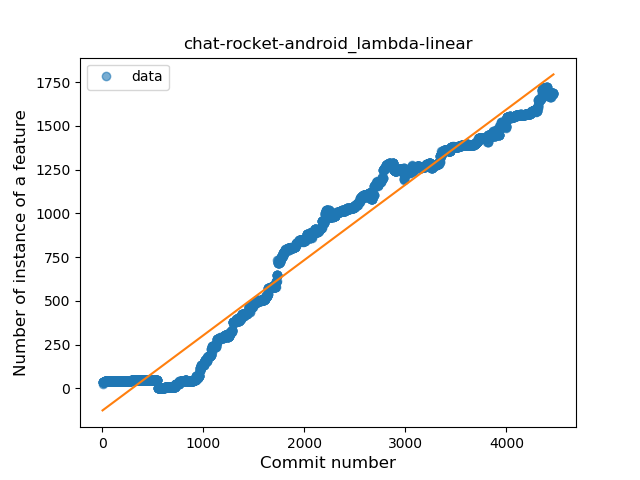
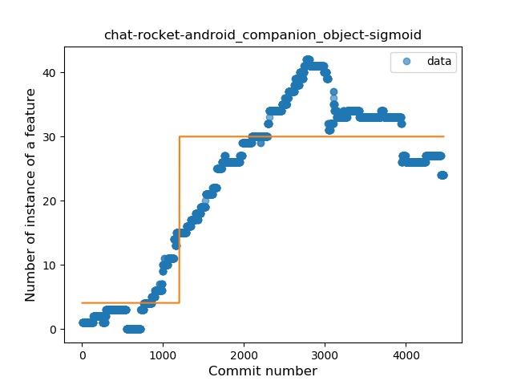
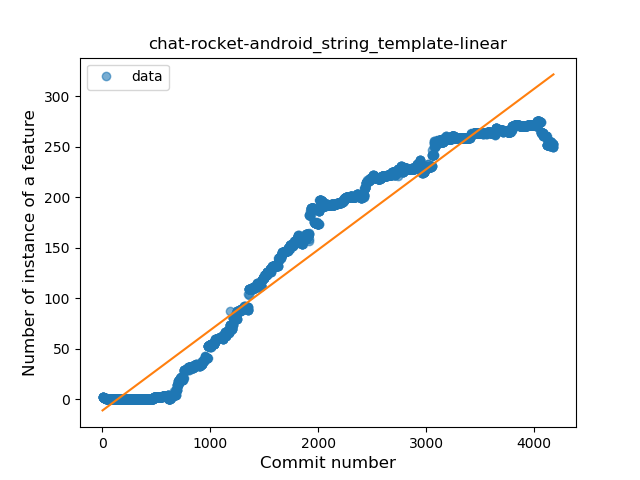
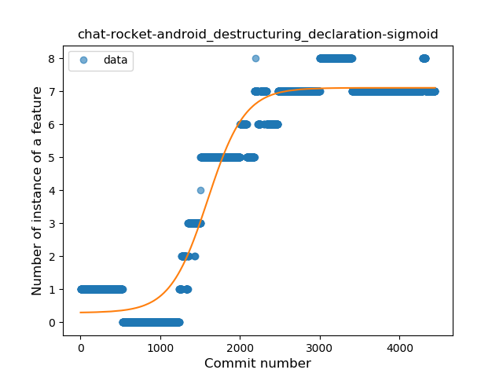
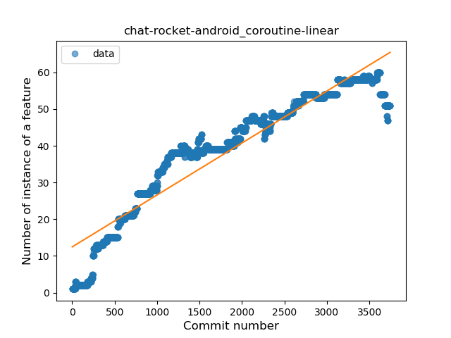
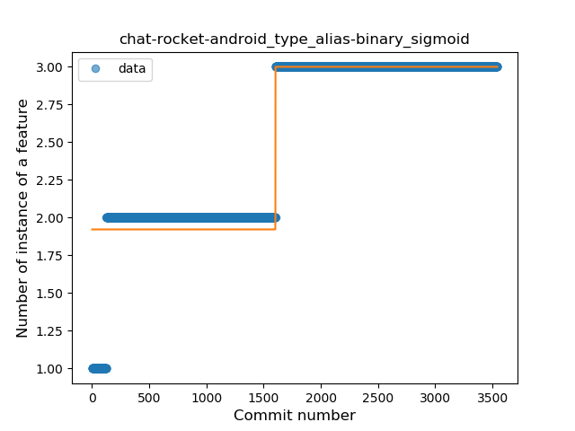

## chat-rocket-android
----
#### Metrics provided by Detekt
* Number of lines of code 33601
* Number of Kotlin files: 461
* Cyclomatic complexity: 5030
* Cyclomatic complexity by thousands of lines: 277 

----
**20** features analyzed

*	<a href="#type_inference">Type Inference</a> 
*	<a href="#lambda">Lambda</a> 
*	<a href="#safe_call">Safe Call</a> 
*	<a href="#when_expr">When expression</a> 
*	<a href="#unsafe_call">Unsafe Call</a> 
*	<a href="#companion_object">Companion Object</a> 
*	<a href="#string_template">String Template</a> 
*	<a href="#func_with_default_value">Function with Default Value</a> 
*	<a href="#singleton">Singleton</a> 
*	<a href="#range_expr">Range Expression</a> 
*	<a href="#smart_cast">Smart Cast</a> 
*	<a href="#data_class">Data Class</a> 
*	<a href="#func_call_with_named_arg">Function call with Named Argument</a> 
*	<a href="#extension_function">Extension Function</a> 
*	<a href="#property_delegation">Property Delegation</a> 
*	<a href="#destructuring_declaration">Destructuring Declaration</a> 
*	<a href="#inline_func">Inline Function</a> 
*	<a href="#coroutine">Coroutine</a> 
*	<a href="#sealed_class">Sealed Class</a> 
*	<a href="#type_alias">Type Alias</a> 

### <a name="type_inference">Type Inference</a>
----
#### Functions
* **Constant Rise - Linear:** 
    * **R_Squared:** 0.91012486
* **Sudden Rise Plateau - Logarithm:** 
    * **R_Squared:** 0.35988636

**Plots** :chart_with_upwards_trend:
-----

### <a name="lambda">Lambda</a>
----
#### Functions
* **Constant Rise - Linear:** 
    * **R_Squared:** 0.96542366
* **Sudden Rise Plateau - Logarithm:** 
    * **R_Squared:** 0.30385549
* **Plateau Sudden Rise - Binary Sigmoid:** 
    * **R_Squared:** 0.04336497

**Plots** :chart_with_upwards_trend:
-----

### <a name="safe_call">Safe Call</a>
----
#### Functions
* **Constant Rise - Linear:** 
    * **R_Squared:** 0.98396774
* **Sudden Rise - Exponential:** 
    * **R_Squared:** 0.98409349
* **Sudden Rise Plateau - Logarithm:** 
    * **R_Squared:** 0.29391172
* **Plateau Sudden Rise - Binary Sigmoid:** 
    * **R_Squared:** 0.12553067

**Plots** :chart_with_upwards_trend:
-----

### <a name="when_expr">When expression</a>
----
#### Functions
* **Constant Rise - Linear:** 
    * **R_Squared:** 0.85543256
* **Sudden Rise - Exponential:** 
    * **R_Squared:** 0.85156711
* **Sudden Rise Plateau - Logarithm:** 
    * **R_Squared:** 0.3750129
* **Plateau Sudden Rise - Binary Sigmoid:** 
    * **R_Squared:** 0.03419924

**Plots** :chart_with_upwards_trend:
-----

### <a name="unsafe_call">Unsafe Call</a>
----
#### Functions
* **Constant Rise - Linear:** 
    * **R_Squared:** 0.7183711
* **Sudden Rise - Exponential:** 
    * **R_Squared:** 0.71453555
* **Sudden Rise Plateau - Logarithm:** 
    * **R_Squared:** 0.34125442
* **Plateau Sudden Rise - Binary Sigmoid:** 
    * **R_Squared:** 0.03766038

**Plots** :chart_with_upwards_trend:
-----

### <a name="companion_object">Companion Object</a>
----
#### Functions
* **Plateau Gradual Rise - Sigmoid:** 
    * **R_Squared:** 0.78442588
* **Constant Rise - Linear:** 
    * **R_Squared:** 0.64367583
* **Sudden Rise - Exponential:** 
    * **R_Squared:** 0.63984357
* **Sudden Rise Plateau - Logarithm:** 
    * **R_Squared:** 0.34157006

**Plots** :chart_with_upwards_trend:
-----

### <a name="string_template">String Template</a>
----
#### Functions
* **Constant Rise - Linear:** 
    * **R_Squared:** 0.94189898
* **Sudden Rise Plateau - Logarithm:** 
    * **R_Squared:** 0.33455951
* **Plateau Sudden Rise - Binary Sigmoid:** 
    * **R_Squared:** 0.08455011

**Plots** :chart_with_upwards_trend:
-----

### <a name="func_with_default_value">Function with Default Value</a>
----
#### Functions
* **Constant Rise - Linear:** 
    * **R_Squared:** 0.88626116
* **Sudden Rise - Exponential:** 
    * **R_Squared:** 0.88356495
* **Sudden Rise Plateau - Logarithm:** 
    * **R_Squared:** 0.32331429

**Plots** :chart_with_upwards_trend:
-----

### <a name="singleton">Singleton</a>
----
#### Functions
* **Sudden Rise - Exponential:** 
    * **R_Squared:** 0.83213608
* **Constant Rise - Linear:** 
    * **R_Squared:** 0.8184168
* **Sudden Rise Plateau - Logarithm:** 
    * **R_Squared:** 0.23519867
* **Plateau Sudden Rise - Binary Sigmoid:** 
    * **R_Squared:** 0.01507761

**Plots** :chart_with_upwards_trend:
-----

### <a name="range_expr">Range Expression</a>
----
#### Functions
* **Constant Rise - Linear:** 
    * **R_Squared:** 0.81485043
* **Sudden Rise Plateau - Logarithm:** 
    * **R_Squared:** 0.34049234

**Plots** :chart_with_upwards_trend:
-----

### <a name="smart_cast">Smart Cast</a>
----
#### Functions
* **Constant Rise - Linear:** 
    * **R_Squared:** 0.75795709
* **Sudden Rise - Exponential:** 
    * **R_Squared:** 0.75385569
* **Sudden Rise Plateau - Logarithm:** 
    * **R_Squared:** 0.49228822
* **Plateau Sudden Rise - Binary Sigmoid:** 
    * **R_Squared:** 0.19067446

**Plots** :chart_with_upwards_trend:
-----

### <a name="data_class">Data Class</a>
----
#### Functions
* **Plateau Gradual Rise - Sigmoid:** 
    * **R_Squared:** 0.98811005
* **Constant Rise - Linear:** 
    * **R_Squared:** 0.94541047
* **Sudden Rise Plateau - Logarithm:** 
    * **R_Squared:** 0.38476583

**Plots** :chart_with_upwards_trend:
-----

### <a name="func_call_with_named_arg">Function call with Named Argument</a>
----
#### Functions
* **Constant Rise - Linear:** 
    * **R_Squared:** 0.94037531
* **Sudden Rise - Exponential:** 
    * **R_Squared:** 0.93835212
* **Sudden Rise Plateau - Logarithm:** 
    * **R_Squared:** 0.32731653
* **Plateau Sudden Rise - Binary Sigmoid:** 
    * **R_Squared:** 0.08056775

**Plots** :chart_with_upwards_trend:
-----

### <a name="extension_function">Extension Function</a>
----
#### Functions
* **Constant Rise - Linear:** 
    * **R_Squared:** 0.92666235
* **Sudden Rise - Exponential:** 
    * **R_Squared:** 0.92390564
* **Plateau Sudden Rise - Binary Sigmoid:** 
    * **R_Squared:** 0.79994836
* **Sudden Rise Plateau - Logarithm:** 
    * **R_Squared:** 0.33837228

**Plots** :chart_with_upwards_trend:
-----

### <a name="property_delegation">Property Delegation</a>
----
#### Functions
* **Sudden Rise - Exponential:** 
    * **R_Squared:** 0.88282086
* **Constant Rise - Linear:** 
    * **R_Squared:** 0.84400957
* **Sudden Rise Plateau - Logarithm:** 
    * **R_Squared:** 0.31237994
* **Plateau Sudden Rise - Binary Sigmoid:** 
    * **R_Squared:** 0.000963

**Plots** :chart_with_upwards_trend:
-----

### <a name="destructuring_declaration">Destructuring Declaration</a>
----
#### Functions
* **Plateau Gradual Rise - Sigmoid:** 
    * **R_Squared:** 0.95021141
* **Constant Rise - Linear:** 
    * **R_Squared:** 0.7839896
* **Sudden Rise Plateau - Logarithm:** 
    * **R_Squared:** 0.29664672

**Plots** :chart_with_upwards_trend:
-----

### <a name="inline_func">Inline Function</a>
----
#### Functions
* **Plateau Gradual Rise - Sigmoid:** 
    * **R_Squared:** 0.86380158
* **Constant Rise - Linear:** 
    * **R_Squared:** 0.78982197
* **Sudden Rise Plateau - Logarithm:** 
    * **R_Squared:** 0.43994674

**Plots** :chart_with_upwards_trend:
-----

### <a name="coroutine">Coroutine</a>
----
#### Functions
* **Constant Rise - Linear:** 
    * **R_Squared:** 0.89577253
* **Sudden Rise Plateau - Logarithm:** 
    * **R_Squared:** 0.52334254
* **Plateau Sudden Rise - Binary Sigmoid:** 
    * **R_Squared:** 0.03860315

**Plots** :chart_with_upwards_trend:
-----

### <a name="sealed_class">Sealed Class</a>
----
#### Functions
* **Plateau Gradual Rise - Sigmoid:** 
    * **R_Squared:** 0.98081089
* **Constant Rise - Linear:** 
    * **R_Squared:** 0.863409
* **Sudden Rise Plateau - Logarithm:** 
    * **R_Squared:** 0.2376933

**Plots** :chart_with_upwards_trend:
-----

### <a name="type_alias">Type Alias</a>
----
#### Functions
* **Plateau Sudden Rise - Binary Sigmoid:** 
    * **R_Squared:** 0.8984592
* **Constant Rise - Linear:** 
    * **R_Squared:** 0.74344877
* **Sudden Rise Plateau - Logarithm:** 
    * **R_Squared:** 0.66144386

**Plots** :chart_with_upwards_trend:
-----

